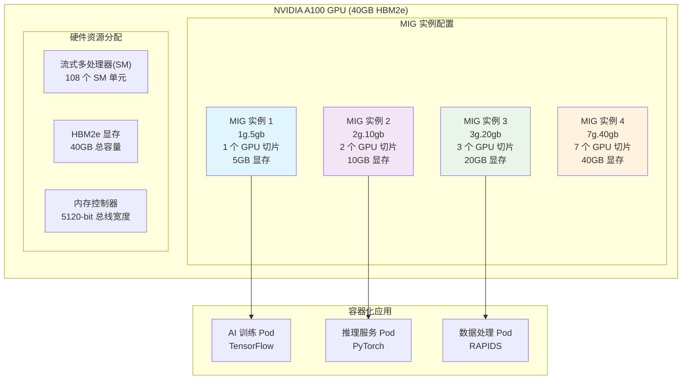
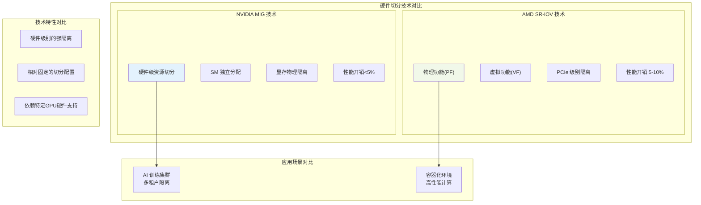
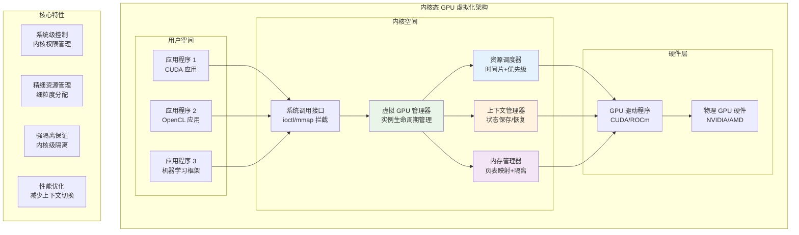
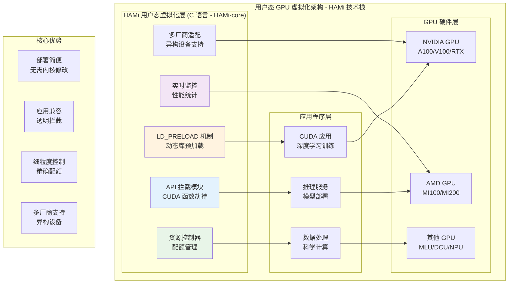
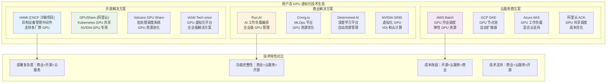

# GPU 虚拟化与资源管理技术深度解析 - 第二部分：虚拟化技术篇

本篇将详细解析 GPU 虚拟化技术，包括硬件级 GPU 虚拟化技术、内核态 GPU 虚拟化技术以及用户态 GPU 虚拟化技术。我们将深入探讨这些技术的原理、实现机制以及在实际场景中的应用。

## 目录

- [GPU 虚拟化与资源管理技术深度解析 - 第二部分：虚拟化技术篇](#gpu-虚拟化与资源管理技术深度解析---第二部分虚拟化技术篇)
  - [目录](#目录)
  - [4. 传统虚拟化技术](#4-传统虚拟化技术)
    - [4.1 GPU 透传（GPU Passthrough）技术](#41-gpu-透传gpu-passthrough技术)
      - [4.1.1 技术原理](#411-技术原理)
      - [4.1.2 实现机制](#412-实现机制)
    - [4.2 虚拟 GPU（vGPU）技术](#42-虚拟-gpuvgpu技术)
      - [4.2.1 技术架构](#421-技术架构)
      - [4.2.2 NVIDIA vGPU 实现](#422-nvidia-vgpu-实现)
      - [4.2.3 AMD MxGPU 实现](#423-amd-mxgpu-实现)
    - [4.3 传统虚拟化技术对比分析](#43-传统虚拟化技术对比分析)
      - [4.3.1 技术特点对比](#431-技术特点对比)
      - [4.3.2 性能评估](#432-性能评估)
    - [4.4 传统虚拟化技术应用场景](#44-传统虚拟化技术应用场景)
      - [4.4.1 企业虚拟化环境](#441-企业虚拟化环境)
      - [4.4.2 云计算平台](#442-云计算平台)
  - [5. 硬件切分技术](#5-硬件切分技术)
    - [5.1 GPU 硬件架构切分基础](#51-gpu-硬件架构切分基础)
      - [5.1.1 流式多处理器（ SM ）硬件切分机制](#511-流式多处理器-sm-硬件切分机制)
      - [5.1.2 内存控制器硬件切分架构](#512-内存控制器硬件切分架构)
    - [5.2 硬件切分技术深度解析](#52-硬件切分技术深度解析)
      - [5.2.1 NVIDIA MIG （ Multi-Instance GPU ）技术深度解析](#521-nvidia-mig--multi-instance-gpu-技术深度解析)
        - [5.2.1.1 MIG 的工作原理和架构](#5211-mig-的工作原理和架构)
        - [5.2.1.2 GPU 实例的创建和管理](#5212-gpu-实例的创建和管理)
        - [5.2.1.3 硬件级隔离的优势和限制](#5213-硬件级隔离的优势和限制)
        - [5.2.1.4 支持的 GPU 型号和配置选项](#5214-支持的-gpu-型号和配置选项)
      - [5.2.2 AMD SR-IOV 硬件切分技术](#522-amd-sr-iov-硬件切分技术)
    - [5.3 硬件切分技术对比与选择](#53-硬件切分技术对比与选择)
      - [5.3.1 技术特性对比](#531-技术特性对比)
      - [5.3.2 应用场景选择指南](#532-应用场景选择指南)
    - [5.4 本章小结](#54-本章小结)
  - [6. 内核态 GPU 虚拟化技术](#6-内核态-gpu-虚拟化技术)
    - [6.1 内核态 GPU 虚拟化技术架构总览](#61-内核态-gpu-虚拟化技术架构总览)
    - [6.2 内核态虚拟化架构设计](#62-内核态虚拟化架构设计)
      - [6.2.1 虚拟 GPU 管理器（ vGPU Manager ）](#621-虚拟-gpu-管理器-vgpu-manager-)
      - [6.2.2 资源调度器（ Resource Scheduler ）](#622-资源调度器-resource-scheduler-)
      - [6.2.3 上下文管理器（ Context Manager ）](#623-上下文管理器-context-manager-)
      - [6.2.4 内存管理器（ Memory Manager ）](#624-内存管理器-memory-manager-)
    - [6.3 高级调度策略与算法](#63-高级调度策略与算法)
      - [6.3.1 多级反馈队列调度](#631-多级反馈队列调度)
      - [6.3.2 负载感知调度算法](#632-负载感知调度算法)
      - [6.3.3 公平性保证机制](#633-公平性保证机制)
    - [6.4 内核态虚拟化性能优化](#64-内核态虚拟化性能优化)
      - [6.4.1 上下文切换优化](#641-上下文切换优化)
      - [6.4.2 内存管理优化](#642-内存管理优化)
      - [6.4.3 I/O 调度优化](#643-io-调度优化)
      - [6.4.4 多 GPU 协同优化](#644-多-gpu-协同优化)
      - [6.4.5 性能监控与调优](#645-性能监控与调优)
    - [6.5 内核态虚拟化适用场景](#65-内核态虚拟化适用场景)
  - [7. 用户态 GPU 虚拟化技术](#7-用户态-gpu-虚拟化技术)
    - [7.1 CUDA API 拦截技术原理](#71-cuda-api-拦截技术原理)
      - [7.1.1 动态库拦截机制](#711-动态库拦截机制)
      - [7.1.2 用户态虚拟化技术对比分析](#712-用户态虚拟化技术对比分析)
    - [7.2 HAMi 实现原理深度解析](#72-hami-实现原理深度解析)
      - [7.2.1 HAMi 项目架构与技术栈](#721-hami-项目架构与技术栈)
      - [7.2.2 HAMi-core 资源控制机制](#722-hami-core-资源控制机制)
    - [7.3 HAMi-core 性能优化机制](#73-hami-core-性能优化机制)
      - [7.3.1 动态库加载与符号解析优化](#731-动态库加载与符号解析优化)
      - [7.3.2 内存跟踪与统计优化](#732-内存跟踪与统计优化)
      - [7.3.3 日志与调试优化](#733-日志与调试优化)
      - [7.3.4 HAMi-core 内存虚拟化算法详解](#734-hami-core-内存虚拟化算法详解)
      - [7.3.5 时间片调度详细实现机制](#735-时间片调度详细实现机制)
      - [6.3.6 HAMi 性能调优最佳实践](#636-hami-性能调优最佳实践)
    - [7.4 用户态虚拟化适用场景](#74-用户态虚拟化适用场景)
    - [7.5 安全性与可靠性机制](#75-安全性与可靠性机制)
      - [7.5.1 多租户环境下的数据隔离机制](#751-多租户环境下的数据隔离机制)
      - [7.5.2 侧信道攻击防护机制](#752-侧信道攻击防护机制)
      - [7.5.3 API 拦截失败时的降级策略](#753-api-拦截失败时的降级策略)
      - [7.5.4 资源配额超限时的处理流程](#754-资源配额超限时的处理流程)
  - [8. GPU 虚拟化技术对比与选择](#8-gpu-虚拟化技术对比与选择)
    - [8.1 GPU 虚拟化技术对比分析](#81-gpu-虚拟化技术对比分析)
      - [8.1.1 技术特性对比](#811-技术特性对比)
      - [8.1.2 性能影响分析](#812-性能影响分析)
    - [8.2 GPU 虚拟化的核心挑战](#82-gpu-虚拟化的核心挑战)
      - [8.2.1 资源隔离与共享的平衡](#821-资源隔离与共享的平衡)
      - [8.2.2 性能损耗控制](#822-性能损耗控制)
      - [8.2.3 多租户环境下的安全性](#823-多租户环境下的安全性)
      - [8.2.4 异构 GPU 环境的兼容性](#824-异构-gpu-环境的兼容性)
    - [8.3 技术选择指南](#83-技术选择指南)
      - [8.3.1 场景适用性分析](#831-场景适用性分析)
      - [8.3.2 决策矩阵](#832-决策矩阵)
    - [8.4 本章要点总结](#84-本章要点总结)
    - [8.5 与 GPU 切分技术的关系](#85-与-gpu-切分技术的关系)
  - [第二部分总结](#第二部分总结)

---

## 4. 传统虚拟化技术

**本章概览：**
本章将深入分析传统 GPU 虚拟化技术，重点探讨基于 Hypervisor 的 GPU 透传（GPU Passthrough）和虚拟 GPU（vGPU）技术。这些技术通过软件虚拟化层实现 GPU 资源的分配和管理，为虚拟机环境提供 GPU 计算能力。

**学习目标：**

- 深入理解基于 Hypervisor 的 GPU 虚拟化原理
- 掌握 GPU 透传（GPU Passthrough）技术的实现机制
- 掌握虚拟 GPU（vGPU）技术的架构设计和工作原理
- 了解传统虚拟化技术的性能特点和适用场景
- 理解虚拟化环境下的 GPU 资源管理和调度机制

### 4.1 GPU 透传（GPU Passthrough）技术

#### 4.1.1 技术原理

**定义：**
GPU 透传技术通过 Hypervisor 将物理 GPU 设备直接分配给虚拟机，虚拟机可以直接访问 GPU 硬件，获得接近原生的性能表现。

**核心特点：**

- **直接硬件访问**：虚拟机直接控制物理 GPU 设备
- **接近原生性能**：几乎无虚拟化性能损失
- **完整功能支持**：支持 GPU 的所有硬件特性
- **强隔离性**：物理级别的资源隔离

#### 4.1.2 实现机制

**VFIO（Virtual Function I/O）框架：**

```c
// VFIO GPU 设备绑定示例
#include <linux/vfio.h>
#include <linux/pci.h>

struct vfio_gpu_device {
    struct pci_dev *pdev;          // PCI 设备指针
    struct vfio_device vdev;       // VFIO 设备结构
    void __iomem *bar_regions[6];  // BAR 区域映射
    struct mutex ops_lock;         // 操作锁
    bool device_opened;            // 设备打开状态
};

// GPU 设备透传初始化
int vfio_gpu_passthrough_init(struct vfio_gpu_device *gpu_dev) {
    int ret;
    
    // 1. 解绑原有驱动
    ret = pci_stop_and_remove_bus_device(gpu_dev->pdev);
    if (ret) {
        pr_err("Failed to unbind GPU driver\n");
        return ret;
    }
    
    // 2. 绑定到 VFIO 驱动
    ret = vfio_pci_core_register_device(&gpu_dev->vdev);
    if (ret) {
        pr_err("Failed to register VFIO device\n");
        return ret;
    }
    
    // 3. 配置 IOMMU 映射
    ret = vfio_iommu_map_gpu_memory(gpu_dev);
    if (ret) {
        pr_err("Failed to configure IOMMU mapping\n");
        vfio_pci_core_unregister_device(&gpu_dev->vdev);
        return ret;
    }
    
    pr_info("GPU passthrough initialized successfully\n");
    return 0;
}
```

### 4.2 虚拟 GPU（vGPU）技术

#### 4.2.1 技术架构

**定义：**
vGPU 技术通过在 Hypervisor 层创建虚拟 GPU 实例，将单个物理 GPU 的计算资源分配给多个虚拟机，实现 GPU 资源的共享和虚拟化。

**架构组件：**

- **GPU 虚拟化管理器**：负责 vGPU 实例的创建和管理
- **资源调度器**：实现 GPU 计算资源的时间片调度
- **内存管理器**：管理 GPU 显存的分配和隔离
- **上下文管理器**：处理多个 vGPU 实例的上下文切换

#### 4.2.2 NVIDIA vGPU 实现

**NVIDIA GRID/vGPU 架构：**

```c
// NVIDIA vGPU 实例管理结构
typedef struct {
    uint32_t vgpu_id;              // vGPU 实例 ID
    uint32_t profile_id;           // vGPU 配置文件 ID
    uint64_t fb_size;              // 分配的显存大小
    uint32_t max_resolution;       // 最大分辨率
    uint32_t max_displays;         // 最大显示器数量
    uint32_t encode_sessions;      // 编码会话数量
    uint32_t compute_capability;   // 计算能力等级
    
    // 资源限制
    struct {
        uint32_t sm_percentage;    // SM 使用百分比
        uint32_t memory_bandwidth; // 内存带宽限制
        uint32_t encode_fps;       // 编码帧率限制
    } resource_limits;
    
    // 运行时状态
    struct {
        bool active;               // 激活状态
        uint64_t last_scheduled;   // 最后调度时间
        uint32_t context_switches; // 上下文切换次数
        uint64_t gpu_time_used;    // GPU 使用时间
    } runtime_state;
} nvidia_vgpu_instance_t;

// vGPU 调度管理
int vgpu_schedule_context_switch(nvidia_vgpu_instance_t *from_vgpu, 
                                nvidia_vgpu_instance_t *to_vgpu) {
    int ret;
    
    // 1. 保存当前 vGPU 上下文
    ret = save_vgpu_context(from_vgpu);
    if (ret) {
        pr_err("Failed to save vGPU context for ID %u\n", from_vgpu->vgpu_id);
        return ret;
    }
    
    // 2. 更新调度统计
    from_vgpu->runtime_state.context_switches++;
    from_vgpu->runtime_state.last_scheduled = get_current_time();
    
    // 3. 恢复目标 vGPU 上下文
    ret = restore_vgpu_context(to_vgpu);
    if (ret) {
        pr_err("Failed to restore vGPU context for ID %u\n", to_vgpu->vgpu_id);
        return ret;
    }
    
    // 4. 激活目标 vGPU
    to_vgpu->runtime_state.active = true;
    from_vgpu->runtime_state.active = false;
    
    return 0;
}
```

#### 4.2.3 AMD MxGPU 实现

**AMD SR-IOV 虚拟化：**

```c
// AMD MxGPU 虚拟功能管理
typedef struct {
    uint16_t vf_id;                // 虚拟功能 ID
    uint16_t pf_id;                // 物理功能 ID
    uint32_t allocated_cus;        // 分配的计算单元数
    uint64_t vram_size;            // 虚拟显存大小
    uint32_t doorbell_offset;      // Doorbell 偏移量
    
    // SR-IOV 配置
    struct {
        bool sriov_enabled;        // SR-IOV 启用状态
        uint16_t total_vfs;        // 总虚拟功能数
        uint16_t active_vfs;       // 活跃虚拟功能数
        uint32_t vf_stride;        // VF 步长
    } sriov_config;
    
    // 资源分配
    struct {
        uint32_t cu_mask;          // CU 掩码
        uint64_t vram_base;        // 显存基地址
        uint32_t mmio_size;        // MMIO 区域大小
    } resource_allocation;
} amd_mxgpu_vf_t;

// MxGPU 虚拟功能初始化
int mxgpu_initialize_virtual_function(amd_mxgpu_vf_t *vf, 
                                     uint16_t vf_id, 
                                     uint32_t cu_count,
                                     uint64_t vram_size) {
    int ret;
    
    // 1. 配置虚拟功能参数
    vf->vf_id = vf_id;
    vf->allocated_cus = cu_count;
    vf->vram_size = vram_size;
    
    // 2. 分配计算单元
    ret = allocate_compute_units(vf, cu_count);
    if (ret) {
        pr_err("Failed to allocate CUs for VF %u\n", vf_id);
        return ret;
    }
    
    // 3. 配置显存分区
    ret = configure_vram_partition(vf, vram_size);
    if (ret) {
        pr_err("Failed to configure VRAM for VF %u\n", vf_id);
        goto cleanup_cus;
    }
    
    // 4. 设置 Doorbell 机制
    ret = setup_doorbell_mechanism(vf);
    if (ret) {
        pr_err("Failed to setup doorbell for VF %u\n", vf_id);
        goto cleanup_vram;
    }
    
    pr_info("MxGPU VF %u initialized with %u CUs and %llu MB VRAM\n", 
            vf_id, cu_count, vram_size / (1024 * 1024));
    return 0;
    
cleanup_vram:
    release_vram_partition(vf);
cleanup_cus:
    release_compute_units(vf);
    return ret;
}
```

### 4.3 传统虚拟化技术对比分析

#### 4.3.1 技术特点对比

| 对比维度 | GPU Passthrough | vGPU |
|---------|----------------|------|
| **资源分配** | 独占整个物理 GPU | 共享物理 GPU 资源 |
| **性能表现** | 接近原生性能（95-99%） | 有一定性能损失（80-95%） |
| **资源利用率** | 较低，一对一分配 | 较高，支持多租户 |
| **隔离性** | 物理级强隔离 | 软件级隔离 |
| **灵活性** | 较低，静态分配 | 较高，动态调整 |
| **管理复杂度** | 相对简单 | 较复杂，需要调度管理 |
| **适用场景** | 高性能计算、专用工作负载 | 多用户环境、云计算平台 |

#### 4.3.2 性能评估

**基准测试结果：**

根据 NVIDIA 和 VMware 的联合测试报告，在 MLPerf Inference v3.0 基准测试中：

- **GPU Passthrough**：性能可达裸机的 97-99%
- **vGPU（NVIDIA A100）**：性能可达裸机的 94-105%（不同工作负载有差异）
- **vGPU（NVIDIA H100）**：性能可达裸机的 96-102%

### 4.4 传统虚拟化技术应用场景

#### 4.4.1 企业虚拟化环境

**VMware vSphere 集成：**

- 支持 GPU Passthrough 和 vGPU 两种模式
- 提供统一的虚拟化管理界面
- 支持虚拟机迁移和高可用性

**Citrix XenServer 支持：**

- 专业的 GPU 虚拟化解决方案
- 优化的图形工作负载性能
- 企业级安全和管理功能

#### 4.4.2 云计算平台

**公有云 GPU 实例：**

- AWS EC2 P 系列实例（GPU Passthrough）
- Google Cloud GPU 虚拟机（vGPU 支持）
- Azure NC 系列虚拟机（混合模式）

**私有云部署：**

- OpenStack Nova GPU 支持
- 企业级 GPU 资源池化
- 多租户安全隔离

## 5. 硬件切分技术

**本章概览：**
本章将深入分析硬件切分技术，重点探讨 NVIDIA MIG（Multi-Instance GPU）、AMD SR-IOV 等原生硬件级别的资源分割方案。这些技术基于 GPU 硬件原生支持的资源分割，直接在硬件层面进行资源切分，提供硬件级别的强隔离和接近原生的性能表现。

**学习目标：**

- 深入理解 GPU 硬件架构的原生虚拟化支持机制
- 掌握 NVIDIA MIG 技术的硬件切分原理和实现
- 掌握 AMD SR-IOV 等硬件级资源分割方案
- 了解硬件原生切分的技术原理和性能特点
- 理解异构 GPU 环境的硬件差异和统一管理挑战
- 对比分析硬件切分技术与传统虚拟化技术的差异

### 5.1 GPU 硬件架构切分基础

#### 5.1.1 流式多处理器（ SM ）硬件切分机制

**SM 架构与硬件切分支持：**

现代 GPU 的 SM （ Streaming Multiprocessor ）是 GPU 计算的核心单元，其硬件切分机制直接影响 GPU 资源分配的粒度和效率。

**NVIDIA Ampere 架构 SM 硬件切分特性：**

- **硬件级分区支持**：每个 SM 包含 64 个 CUDA 核心，支持硬件级的资源分区
- **独立调度器**：每个 SM 配备 4 个 warp 调度器，支持独立的任务调度
- **专用寄存器文件**： 65536 个 32 位寄存器，支持上下文隔离
- **共享内存分区**： 128KB 共享内存支持动态分区和隔离



```c
// SM 虚拟化管理结构
typedef struct {
    uint32_t sm_id;                    // SM 标识符
    uint32_t allocated_cores;          // 已分配的 CUDA 核心数
    uint32_t total_cores;              // 总 CUDA 核心数
    uint32_t allocated_registers;      // 已分配寄存器数量
    uint32_t shared_memory_partition;  // 共享内存分区大小
    uint32_t warp_scheduler_mask;      // warp 调度器分配掩码
    struct vgpu_context *contexts[MAX_VGPU_PER_SM]; // 虚拟 GPU 上下文
} sm_virtualization_t;

// SM 资源分配函数
int allocate_sm_resources(sm_virtualization_t *sm, 
                         uint32_t vgpu_id, 
                         uint32_t core_count, 
                         uint32_t register_count) {
    // 检查资源可用性
    if (sm->allocated_cores + core_count > sm->total_cores) {
        return -ENOMEM; // 内存不足
    }
    
    // 分配 CUDA 核心
    sm->allocated_cores += core_count;
    
    // 分配寄存器资源
    sm->allocated_registers += register_count;
    
    // 更新调度器掩码
    sm->warp_scheduler_mask |= (1 << vgpu_id);
    
    return 0; // 分配成功
}
```

**AMD RDNA 架构计算单元虚拟化：**

- **计算单元（ CU ）分区**：每个 CU 包含 64 个流处理器，支持工作组级别的隔离
- **波前调度器**：独立的波前调度机制，支持多租户并发
- **标量寄存器文件**： 2048 个标量寄存器，支持上下文保存和恢复
- **本地数据共享（ LDS ）**： 64KB LDS 支持动态分区

#### 5.1.2 内存控制器硬件切分架构

**内存控制器硬件切分的核心挑战：**

内存控制器是 GPU 性能的关键瓶颈，其硬件切分实现直接影响多租户环境下的性能隔离效果。

**NVIDIA HBM 内存控制器硬件切分：**

```c
// 内存控制器硬件切分结构
typedef struct {
    uint32_t mc_id;                    // 内存控制器 ID
    uint64_t total_bandwidth;          // 总内存带宽（ GB/s ）
    uint64_t allocated_bandwidth;      // 已分配带宽
    uint32_t channel_count;            // 内存通道数量
    uint32_t partition_mask;           // 分区掩码
    struct {
        uint32_t instance_id;          // 硬件实例标识符
        uint64_t bandwidth_quota;      // 带宽配额
        uint32_t priority;             // 优先级
        uint64_t access_pattern;       // 访问模式统计
    } partitions[MAX_MEMORY_PARTITIONS];
} memory_controller_slice_t;

// 内存带宽分配函数
int allocate_memory_bandwidth(memory_controller_slice_t *mc,
                             uint32_t instance_id,
                             uint64_t bandwidth_request) {
    // 检查带宽可用性
    if (mc->allocated_bandwidth + bandwidth_request > mc->total_bandwidth) {
        return -ENOSPC; // 空间不足
    }
    
    // 查找空闲分区
    for (int i = 0; i < MAX_MEMORY_PARTITIONS; i++) {
        if (mc->partitions[i].instance_id == 0) {
            mc->partitions[i].instance_id = instance_id;
            mc->partitions[i].bandwidth_quota = bandwidth_request;
            mc->allocated_bandwidth += bandwidth_request;
            mc->partition_mask |= (1 << i);
            return i; // 返回分区索引
        }
    }
    
    return -ENOMEM; // 内存不足
}
```

### 5.2 硬件切分技术深度解析

**硬件切分技术架构总览：**

硬件切分技术基于 GPU 硬件原生支持的资源分割，直接在硬件层面进行资源切分，提供硬件级别的强隔离和接近原生的性能表现。下图展示了两种主要的硬件切分技术架构：



如图所示，硬件切分技术主要包括：

1. **NVIDIA MIG 技术**：通过硬件级资源切分，将单个 GPU 划分为多个独立的 MIG 实例，每个实例拥有专用的 SM 和内存切片，实现完全的硬件级隔离。支持 1g.5gb 、 2g.10gb 、 3g.20gb 、 7g.40gb 等多种配置选项，适用于 AI 训练和推理场景。

2. **AMD SR-IOV 技术**：基于 PCIe SR-IOV 标准，通过物理功能(PF)和虚拟功能(VF)实现 GPU 硬件切分。每个 VF 作为独立的 PCIe 设备，提供硬件级隔离，特别适用于容器化环境和高性能计算场景。

这两种技术都基于 GPU 硬件原生支持，在隔离级别、性能开销、部署复杂度和硬件要求方面各有特点。 MIG 技术的性能开销最低（<5%），提供更彻底的资源分离； SR-IOV 技术基于标准 PCIe 协议，具有更好的通用性。

#### 5.2.1 NVIDIA MIG （ Multi-Instance GPU ）技术深度解析

##### 5.2.1.1 MIG 的工作原理和架构

MIG 技术基于 NVIDIA Ampere 架构的硬件设计特性，通过以下核心机制实现 GPU 的物理级切分：

1. **计算单元分割**：将 GPU 的流式多处理器（ SM ）按预定义配置进行分组，为每个 MIG 实例分配专用的 SM 集群
2. **显存分割**：为每个 MIG 实例分配独立的显存地址空间，通过硬件级内存保护机制确保访问隔离
3. **内存控制器分割**：每个 MIG 实例配备独立的内存控制器，从硬件层面保障内存带宽的完全隔离
4. **硬件调度器分割**：为每个实例提供独立的硬件调度器，消除实例间的调度竞争和干扰


**MIG 技术核心特性：**

- **硬件级隔离**：每个 MIG 实例拥有独立的硬件资源，实现真正的物理隔离
- **预定义配置**：支持 1g.5gb 、 2g.10gb 、 3g.20gb 、 7g.40gb 等标准配置
- **完全独立**：每个实例具有独立的错误域和故障隔离能力

> **扩展阅读**： MIG 在容器化环境中的具体应用和 HAMi 集成实现，详见 [8.1 HAMi 结合硬件级 GPU 切分技术](第三部分：资源管理与优化篇#81-hami 结合硬件级 gpu 切分技术)

##### 5.2.1.2 GPU 实例的创建和管理

MIG 实例管理涉及 GPU 实例(GI)和计算实例(CI)的两级创建过程：

**基础配置流程：**

```bash
# 启用 MIG 模式（需要重启 GPU ）
nvidia-smi -i 0 -mig 1

# 创建 GPU 实例
nvidia-smi mig -i 0 -cgi 19,19,19 -C

# 创建计算实例
nvidia-smi mig -i 0 -cci

# 验证配置
nvidia-smi -L
```

> **实践参考**：完整的 MIG 管理脚本实现见 [mig_management.sh](code/partitioning/mig_management.sh)  
**集成应用**： HAMi 环境下的 MIG 自动化管理见 [8.1.2 HAMi MIG Device Plugin 实现](第三部分：资源管理与优化篇.md#812-hami-mig-device-plugin 实现)

**MIG 资源分配策略：**

```c
/**
 * @brief MIG 实例配置结构体
 * @details 定义 MIG 实例的硬件资源配置参数
 */
typedef struct {
    uint32_t gi_id;                    /**< GPU 实例 ID */
    uint32_t ci_id;                    /**< 计算实例 ID */
    uint32_t sm_count;                 /**< 流式多处理器数量 */
    uint64_t memory_size;              /**< 分配的显存大小(字节) */
    uint32_t memory_slice_count;       /**< 内存切片数量 */
    uint32_t compute_slice_count;      /**< 计算切片数量 */
} mig_instance_config_t;

/**
 * @brief 创建 MIG 实例
 * @param gpu_id 目标 GPU 设备 ID
 * @param config MIG 实例配置参数
 * @return 成功返回 0 ，失败返回负数错误码
 * @note 详细实现参见 @ref 8.1.2 "HAMi MIG Device Plugin 实现"
 */
int create_mig_instance(uint32_t gpu_id, 
                       mig_instance_config_t *config) {
    /* 检查资源可用性 */
    if (!check_mig_resources_available(gpu_id, config)) {
        return -ENOSPC;
    }
    
    /* 创建 GPU 实例 */
    int gi_id = create_gpu_instance(gpu_id, config->sm_count, 
                                   config->memory_slice_count);
    if (gi_id < 0) {
        return gi_id;
    }
    
    /* 创建计算实例 */
    int ci_id = create_compute_instance(gi_id, 
                                       config->compute_slice_count);
    if (ci_id < 0) {
        destroy_gpu_instance(gi_id);
        return ci_id;
    }
    
    config->gi_id = gi_id;
    config->ci_id = ci_id;
    
    return 0;
}
```

**关键实现要点：**

- **资源验证**：创建前检查可用的 SM 和内存资源
- **两级创建**：先创建 GPU 实例(GI)，再创建计算实例(CI)
- **状态管理**：维护实例配置和可用性状态
- **错误处理**：创建失败时自动清理已分配资源

**部署要求：**

- **硬件支持**：仅限 A100 、 A30 、 A40 、 H100 等支持 MIG 的 GPU
- **驱动版本**： NVIDIA 驱动 ≥ 450.80.02 ， CUDA ≥ 11.0
- **权限要求**：需要 root 权限，启用 MIG 需重启 GPU

> **详细实现**：完整的管理脚本和函数实现见 [mig_management.sh](code/partitioning/mig_management.sh)

##### 5.2.1.3 硬件级隔离的优势和限制

**优势：**

- **完全隔离**：硬件级别的资源隔离，确保实例间完全独立
- **性能保障**：每个实例拥有专用的硬件资源，性能可预测
- **安全性高**：硬件级别的隔离提供最高级别的安全保障
- **故障隔离**：一个实例的故障不会影响其他实例

**限制：**

- **硬件依赖**：仅支持特定的 GPU 型号（ A100 、 A30 、 A40 等）
- **配置固定**：实例配置相对固定，动态调整能力有限
- **资源粒度**：切分粒度受硬件设计限制，无法实现任意大小的分割
- **成本较高**：需要支持 MIG 的高端 GPU ，成本相对较高

##### 5.2.1.4 支持的 GPU 型号和配置选项

**支持的 GPU 型号：**

- NVIDIA A100 （ 40GB/80GB ）
- NVIDIA A30
- NVIDIA A40
- NVIDIA H100

**配置选项：**

- **1g.5gb**： 1/7 GPU + 5GB 显存
- **2g.10gb**： 2/7 GPU + 10GB 显存
- **3g.20gb**： 3/7 GPU + 20GB 显存
- **4g.20gb**： 4/7 GPU + 20GB 显存
- **7g.40gb**：完整 GPU + 40GB 显存（ A100 40GB ）
- **7g.80gb**：完整 GPU + 80GB 显存（ A100 80GB ）

#### 5.2.2 AMD SR-IOV 硬件切分技术

**SR-IOV 硬件切分特点：**

- **物理功能（ PF ）**：完整的 GPU 功能，包含配置和管理能力
- **虚拟功能（ VF ）**：轻量级的 GPU 功能，专注于数据处理
- **硬件级隔离**：每个 VF 拥有独立的内存空间和寄存器组

```c
// SR-IOV 虚拟功能配置
typedef struct {
    uint16_t vf_id;                    // 虚拟功能 ID
    uint32_t compute_units;            // 分配的计算单元数
    uint64_t memory_quota;             // 内存配额
    uint32_t bandwidth_limit;          // 带宽限制
    bool isolation_enabled;            // 是否启用隔离
} sriov_vf_config_t;

// 配置 SR-IOV 虚拟功能
int configure_sriov_vf(uint16_t vf_id, sriov_vf_config_t *config) {
    // 设置计算单元分配
    write_vf_register(vf_id, VF_COMPUTE_UNITS_REG, 
                     config->compute_units);
    
    // 设置内存配额
    write_vf_register(vf_id, VF_MEMORY_QUOTA_REG, 
                     config->memory_quota);
    
    // 启用隔离机制
    if (config->isolation_enabled) {
        write_vf_register(vf_id, VF_ISOLATION_REG, 1);
    }
    
    return 0;
}
```

### 5.3 硬件切分技术对比与选择

#### 5.3.1 技术特性对比

| 技术方案 | 隔离级别 | 性能开销 | 资源利用率 | 部署复杂度 | 硬件要求 |
|---------|---------|---------|-----------|-----------|----------|
| **NVIDIA MIG** | 硬件级完全隔离 | 极低（<5%） | 高 | 中等 | A100/A30/A40/H100 |
| **AMD SR-IOV** | PCIe 级隔离 | 低（5-10%） | 中等 | 高 | 支持 SR-IOV 的 GPU |

#### 5.3.2 应用场景选择指南

**NVIDIA MIG 适用场景：**

- AI 训练和推理工作负载的多租户隔离
- 需要硬件级安全隔离的容器化环境
- 资源利用率要求较高的数据中心
- 支持动态资源调整的弹性计算场景
- 大规模机器学习平台的资源切分

**AMD SR-IOV 适用场景：**

- 容器化环境的 GPU 硬件切分
- 需要 PCIe 级别隔离的企业应用
- 多容器共享 GPU 资源的场景
- 对硬件兼容性要求较高的环境
- 高性能计算集群的资源分割

### 5.4 本章小结

本章深入分析了 GPU 硬件切分技术的核心原理和实现方案。通过对 NVIDIA MIG 和 AMD SR-IOV 两种主要硬件切分技术的详细解析，我们可以得出以下关键结论：

**技术成熟度与应用现状：**

- **NVIDIA MIG 技术**已成为 AI 训练集群中最主流的硬件切分方案，其硬件级隔离和低性能开销(<5%)使其在多租户环境中具有显著优势
- **AMD SR-IOV 技术**在容器化环境中表现良好，但部署复杂度较高，需要完整的 SR-IOV 生态支持
- 硬件切分技术相比传统虚拟化技术具有更高的资源利用率和更强的隔离保障

**核心技术优势：**

1. **硬件级隔离保障**：两种硬件切分技术都提供了硬件层面的资源隔离，确保了多租户环境的安全性和稳定性
2. **接近裸机性能**：性能开销均控制在 10%以内，其中 MIG 的开销更是低于 5%
3. **完整的生态支持**：主流 GPU 厂商都提供了相应的硬件和软件支持
4. **动态资源调整**：支持运行时的资源重新分配和配置调整

**技术发展趋势：**

- 硬件切分技术将继续向更细粒度、更灵活的资源分配方向发展
- 多 GPU 协同和跨节点资源池化将成为重要发展方向
- 与容器化技术的深度集成将进一步提升部署和管理效率
- 智能化的资源调度和自动化的负载均衡将成为发展重点

**实践建议：**

- 在选择硬件切分方案时，应综合考虑应用场景、性能要求、硬件成本和运维复杂度
- 对于 AI 训练集群和机器学习平台，推荐优先考虑 NVIDIA MIG 技术
- 对于容器化环境和多租户场景，可考虑 AMD SR-IOV 方案
- 在实际部署前，建议进行充分的性能测试和兼容性验证
- 建议结合容器编排平台（如 Kubernetes）实现自动化的资源管理

GPU 硬件切分技术为现代数据中心提供了强大的 GPU 资源管理能力，是构建高效、安全、可扩展的 GPU 计算平台的重要技术基础。随着 AI 和容器化应用的持续发展，这些技术将在未来的计算基础设施中发挥越来越重要的作用。

---

## 6. 内核态 GPU 虚拟化技术

**本章概览：**
本章将深入探讨内核态 GPU 虚拟化技术，包括内核级资源管理、虚拟 GPU 驱动架构、上下文切换机制以及性能优化策略。

**学习目标：**

- 理解内核态虚拟化的架构设计和实现原理
- 掌握虚拟 GPU 驱动的核心技术
- 了解内核级资源调度和隔离机制
- 学习内核态虚拟化的性能优化方法

### 6.1 内核态 GPU 虚拟化技术架构总览

内核态 GPU 虚拟化技术通过在操作系统内核层面实现 GPU 资源的虚拟化管理，在性能和安全性之间取得了良好的平衡。

该技术通过修改或拦截 GPU 硬件驱动程序，在内核空间实现资源管理和调度，具有系统级控制、精细资源管理的特点，需要内核模块支持。与用户态虚拟化相比，内核态虚拟化具有更强的系统级控制能力和更精细的资源管理机制；与硬件级虚拟化相比，内核态虚拟化具有更好的灵活性和兼容性。



**内核态虚拟化层（核心控制层）：**

- **功能定位**： GPU 虚拟化的核心控制层，通过内核拦截机制实现资源管理和调度
- **核心技术特点**：
  - *系统级控制能力*：在内核空间直接管理 GPU 资源，具有最高权限
  - *精细资源管理*：支持细粒度的资源分配和配额控制
  - *内核模块支持*：需要加载专用的内核模块来实现虚拟化功能
  - *强隔离保证*：通过内核级隔离机制确保多租户安全
- **核心组件及内核拦截机制**：
  - *虚拟 GPU 驱动架构*：管理虚拟 GPU 实例的生命周期，拦截 GPU 驱动调用
  - *内核级资源调度*：实现 GPU 计算资源的时间片调度和优先级管理
  - *GPU 内存虚拟化*：提供内存隔离和虚拟地址空间管理，拦截内存映射操作
  - *系统调用拦截模块*：拦截关键系统调用（如 ioctl 、 mmap ）实现资源控制
  - *性能优化模块*：优化上下文切换和内存管理性能

**内核拦截技术实现细节：**

内核态虚拟化的核心在于通过内核拦截机制实现对 GPU 资源的精确控制：

- **ioctl 系统调用拦截**：拦截 GPU 设备的 ioctl 调用，实现命令过滤和资源配额检查
- **mmap 内存映射拦截**：拦截 GPU 内存映射操作，实现虚拟地址空间管理和访问权限控制
- **驱动程序修改**：通过修改 GPU 驱动程序，在关键路径上插入虚拟化逻辑
- **内核模块加载**：加载专用的内核模块来实现 GPU 资源的虚拟化管理

**数据流向分析：**

1. **应用调用阶段**：应用程序通过系统调用接口请求 GPU 资源
2. **内核拦截阶段**：内核态虚拟化层捕获并分析资源请求
3. **资源调度阶段**：通过内核级调度器进行资源分配和优先级管理
4. **硬件执行阶段**：物理 GPU 硬件执行实际的计算任务

这种基于内核拦截的分层架构设计确保了内核态 GPU 虚拟化技术既能提供强大的系统级控制能力和精细化资源管理，又能保持良好的性能表现和应用兼容性。

### 6.2 内核态虚拟化架构设计

内核态虚拟化通过在操作系统内核层面实现 GPU 资源的虚拟化管理，提供了较好的性能和安全性平衡。本节将详细介绍内核态虚拟化的四个核心组件：虚拟 GPU 管理器、资源调度器、上下文管理器和内存管理器。

**技术特点：**

- **内核级资源管理**：在操作系统内核层面实现 GPU 资源的分配和调度
- **硬件抽象层**：为上层应用提供统一的 GPU 访问接口
- **安全隔离**：利用操作系统的权限管理机制实现安全隔离
- **性能优化**：减少用户态和内核态之间的上下文切换开销

#### 6.2.1 虚拟 GPU 管理器（ vGPU Manager ）

虚拟 GPU 管理器是内核态虚拟化的核心组件，负责虚拟 GPU 实例的完整生命周期管理，包括创建、配置、监控和销毁等操作。

**核心功能：**

- **实例生命周期管理**：创建、启动、暂停、恢复和销毁虚拟 GPU 实例
- **资源配额分配**：为每个虚拟 GPU 实例分配计算资源和内存资源
- **状态监控**：实时监控虚拟 GPU 实例的运行状态和资源使用情况
- **故障处理**：检测和处理虚拟 GPU 实例的异常情况

**数据结构设计：**

```c
// 虚拟 GPU 实例结构
struct vgpu_instance {
    uint32_t instance_id;              // 实例唯一标识符
    uint32_t physical_gpu_id;          // 绑定的物理 GPU ID
    enum vgpu_state state;             // 实例状态
    
    // 资源配额
    struct {
        uint32_t compute_units;         // 分配的计算单元数
        uint64_t memory_quota;          // 内存配额（字节）
        uint32_t bandwidth_quota;       // 带宽配额（ MB/s ）
        uint32_t priority;              // 调度优先级
    } resource_quota;
    
    // 运行时状态
    struct {
        uint64_t creation_time;         // 创建时间
        uint64_t last_active_time;      // 最后活跃时间
        uint64_t total_execution_time;  // 累计执行时间
        uint32_t context_switches;      // 上下文切换次数
        uint64_t memory_usage;          // 当前内存使用量
    } runtime_stats;
    
    // 关联的上下文和内存管理器
    struct vgpu_context *context;      // 执行上下文
    struct vgpu_memory_space *memory;   // 内存空间
    
    // 链表节点
    struct list_head instance_list;    // 实例链表
    struct hlist_node hash_node;       // 哈希表节点
    
    // 同步原语
    struct mutex instance_mutex;       // 实例互斥锁
    atomic_t ref_count;                // 引用计数
};

// 虚拟 GPU 管理器结构
struct vgpu_manager {
    uint32_t max_instances;            // 最大实例数
    uint32_t active_instances;         // 当前活跃实例数
    
    // 实例管理
    struct list_head instance_list;    // 实例链表
    DECLARE_HASHTABLE(instance_hash, 8); // 实例哈希表
    struct idr instance_idr;           // 实例 ID 分配器
    
    // 资源管理
    struct {
        uint32_t total_compute_units;   // 总计算单元数
        uint32_t available_compute_units; // 可用计算单元数
        uint64_t total_memory;          // 总内存大小
        uint64_t available_memory;      // 可用内存大小
    } resource_pool;
    
    // 同步和保护
    struct rw_semaphore manager_rwsem;  // 管理器读写信号量
    spinlock_t instance_lock;          // 实例操作锁
    
    // 工作队列
    struct workqueue_struct *mgr_wq;   // 管理工作队列
    struct delayed_work cleanup_work;   // 清理工作
};
```

**核心操作实现：**

```c
// 创建虚拟 GPU 实例
struct vgpu_instance *vgpu_create_instance(struct vgpu_manager *mgr,
                                          struct vgpu_create_params *params) {
    struct vgpu_instance *instance;
    int ret;
    
    // 参数验证
    if (!mgr || !params) {
        pr_err("无效的参数\n");
        return ERR_PTR(-EINVAL);
    }
    
    // 检查资源可用性
    down_read(&mgr->manager_rwsem);
    if (mgr->active_instances >= mgr->max_instances) {
        up_read(&mgr->manager_rwsem);
        pr_warn("已达到最大实例数限制: %u\n", mgr->max_instances);
        return ERR_PTR(-ENOSPC);
    }
    
    if (params->compute_units > mgr->resource_pool.available_compute_units ||
        params->memory_quota > mgr->resource_pool.available_memory) {
        up_read(&mgr->manager_rwsem);
        pr_warn("资源不足: 请求计算单元=%u(可用=%u), 请求内存=%llu(可用=%llu)\n",
                params->compute_units, mgr->resource_pool.available_compute_units,
                params->memory_quota, mgr->resource_pool.available_memory);
        return ERR_PTR(-ENOMEM);
    }
    up_read(&mgr->manager_rwsem);
    
    // 分配实例结构
    instance = kzalloc(sizeof(*instance), GFP_KERNEL);
    if (!instance) {
        return ERR_PTR(-ENOMEM);
    }
    
    // 初始化实例
    down_write(&mgr->manager_rwsem);
    
    // 分配实例 ID
    ret = idr_alloc(&mgr->instance_idr, instance, 1, 0, GFP_KERNEL);
    if (ret < 0) {
        up_write(&mgr->manager_rwsem);
        kfree(instance);
        pr_err("分配实例 ID 失败: %d\n", ret);
        return ERR_PTR(ret);
    }
    instance->instance_id = ret;
    
    // 设置资源配额
    instance->resource_quota.compute_units = params->compute_units;
    instance->resource_quota.memory_quota = params->memory_quota;
    instance->resource_quota.bandwidth_quota = params->bandwidth_quota;
    instance->resource_quota.priority = params->priority;
    
    // 更新资源池
    mgr->resource_pool.available_compute_units -= params->compute_units;
    mgr->resource_pool.available_memory -= params->memory_quota;
    
    // 初始化运行时状态
    instance->state = VGPU_STATE_CREATED;
    instance->runtime_stats.creation_time = ktime_get_ns();
    instance->runtime_stats.last_active_time = instance->runtime_stats.creation_time;
    
    // 初始化同步原语
    mutex_init(&instance->instance_mutex);
    atomic_set(&instance->ref_count, 1);
    
    // 添加到管理器
    list_add_tail(&instance->instance_list, &mgr->instance_list);
    hash_add(mgr->instance_hash, &instance->hash_node, instance->instance_id);
    mgr->active_instances++;
    
    up_write(&mgr->manager_rwsem);
    
    pr_info("创建虚拟 GPU 实例成功: ID=%u, 计算单元=%u, 内存=%llu MB\n",
            instance->instance_id, params->compute_units, 
            params->memory_quota / (1024 * 1024));
    
    return instance;
}

// 销毁虚拟 GPU 实例
int vgpu_destroy_instance(struct vgpu_manager *mgr, uint32_t instance_id) {
    struct vgpu_instance *instance;
    int ret = 0;
    
    down_write(&mgr->manager_rwsem);
    
    // 查找实例
    instance = idr_find(&mgr->instance_idr, instance_id);
    if (!instance) {
        up_write(&mgr->manager_rwsem);
        pr_warn("未找到实例: ID=%u\n", instance_id);
        return -ENOENT;
    }
    
    // 检查实例状态
    mutex_lock(&instance->instance_mutex);
    if (instance->state == VGPU_STATE_RUNNING) {
        // 强制停止实例
        ret = vgpu_stop_instance_locked(instance);
        if (ret) {
            mutex_unlock(&instance->instance_mutex);
            up_write(&mgr->manager_rwsem);
            pr_err("停止实例失败: ID=%u, 错误=%d\n", instance_id, ret);
            return ret;
        }
    }
    
    // 清理资源
    if (instance->context) {
        vgpu_destroy_context(instance->context);
        instance->context = NULL;
    }
    
    if (instance->memory) {
        vgpu_destroy_memory_space(instance->memory);
        instance->memory = NULL;
    }
    
    // 释放资源配额
    mgr->resource_pool.available_compute_units += instance->resource_quota.compute_units;
    mgr->resource_pool.available_memory += instance->resource_quota.memory_quota;
    
    // 从管理器移除
    list_del(&instance->instance_list);
    hash_del(&instance->hash_node);
    idr_remove(&mgr->instance_idr, instance_id);
    mgr->active_instances--;
    
    instance->state = VGPU_STATE_DESTROYED;
    mutex_unlock(&instance->instance_mutex);
    
    up_write(&mgr->manager_rwsem);
    
    // 释放实例内存
    kfree(instance);
    
    pr_info("销毁虚拟 GPU 实例成功: ID=%u\n", instance_id);
    return 0;
}

// 启动虚拟 GPU 实例
int vgpu_start_instance(struct vgpu_manager *mgr, uint32_t instance_id) {
    struct vgpu_instance *instance;
    int ret;
    
    down_read(&mgr->manager_rwsem);
    
    instance = idr_find(&mgr->instance_idr, instance_id);
    if (!instance) {
        up_read(&mgr->manager_rwsem);
        return -ENOENT;
    }
    
    mutex_lock(&instance->instance_mutex);
    
    if (instance->state != VGPU_STATE_CREATED && 
        instance->state != VGPU_STATE_STOPPED) {
        mutex_unlock(&instance->instance_mutex);
        up_read(&mgr->manager_rwsem);
        pr_warn("实例状态不允许启动: ID=%u, 状态=%d\n", 
                instance_id, instance->state);
        return -EINVAL;
    }
    
    // 创建执行上下文
    if (!instance->context) {
        instance->context = vgpu_create_context(instance);
        if (IS_ERR(instance->context)) {
            ret = PTR_ERR(instance->context);
            instance->context = NULL;
            mutex_unlock(&instance->instance_mutex);
            up_read(&mgr->manager_rwsem);
            pr_err("创建上下文失败: ID=%u, 错误=%d\n", instance_id, ret);
            return ret;
        }
    }
    
    // 创建内存空间
    if (!instance->memory) {
        instance->memory = vgpu_create_memory_space(instance);
        if (IS_ERR(instance->memory)) {
            ret = PTR_ERR(instance->memory);
            instance->memory = NULL;
            vgpu_destroy_context(instance->context);
            instance->context = NULL;
            mutex_unlock(&instance->instance_mutex);
            up_read(&mgr->manager_rwsem);
            pr_err("创建内存空间失败: ID=%u, 错误=%d\n", instance_id, ret);
            return ret;
        }
    }
    
    // 更新状态
    instance->state = VGPU_STATE_RUNNING;
    instance->runtime_stats.last_active_time = ktime_get_ns();
    
    mutex_unlock(&instance->instance_mutex);
    up_read(&mgr->manager_rwsem);
    
    pr_info("启动虚拟 GPU 实例成功: ID=%u\n", instance_id);
    return 0;
}
```

#### 6.2.2 资源调度器（ Resource Scheduler ）

资源调度器负责在多个虚拟 GPU 实例之间公平、高效地分配物理 GPU 资源，包括计算资源、内存资源和 I/O 带宽等。

**调度策略：**

- **时间片轮转调度**：为每个虚拟 GPU 实例分配固定的时间片
- **优先级调度**：根据实例优先级进行抢占式调度
- **公平共享调度**：确保资源在实例间公平分配
- **负载感知调度**：根据实际负载动态调整调度策略

**数据结构设计：**

```c
// 调度队列节点
struct sched_entity {
    struct vgpu_instance *instance;    // 关联的虚拟 GPU 实例
    uint32_t priority;                 // 调度优先级
    uint64_t time_slice_ns;            // 时间片长度（纳秒）
    uint64_t remaining_time_ns;        // 剩余时间片
    uint64_t total_runtime_ns;         // 累计运行时间
    uint64_t last_scheduled_time;      // 上次调度时间
    uint32_t preemption_count;         // 被抢占次数
    
    // 调度统计
    struct {
        uint64_t wait_time_ns;          // 等待时间
        uint64_t response_time_ns;      // 响应时间
        uint32_t schedule_count;        // 调度次数
        float cpu_utilization;         // CPU 利用率
    } sched_stats;
    
    struct list_head sched_list;       // 调度队列链表
};

// GPU 资源调度器
struct gpu_scheduler {
    // 调度队列
    struct list_head ready_queue;      // 就绪队列
    struct list_head waiting_queue;    // 等待队列
    struct list_head blocked_queue;    // 阻塞队列
    
    // 当前调度状态
    struct sched_entity *current_entity; // 当前运行的调度实体
    uint64_t current_time_slice_start;  // 当前时间片开始时间
    
    // 调度参数
    uint64_t default_time_slice_ns;     // 默认时间片长度
    uint32_t max_priority;              // 最大优先级
    uint32_t preemption_threshold;      // 抢占阈值
    
    // 调度统计
    struct {
        uint64_t total_context_switches;  // 总上下文切换次数
        uint64_t total_preemptions;       // 总抢占次数
        uint64_t average_response_time;   // 平均响应时间
        float system_utilization;         // 系统利用率
    } global_stats;
    
    // 同步原语
    spinlock_t sched_lock;             // 调度器锁
    struct timer_list preemption_timer; // 抢占定时器
    
    // 工作队列
    struct workqueue_struct *sched_wq; // 调度工作队列
    struct work_struct schedule_work;   // 调度工作
};
```

**核心调度算法：**

```c
// 选择下一个要调度的实体
struct sched_entity *select_next_entity(struct gpu_scheduler *sched) {
    struct sched_entity *entity, *best_entity = NULL;
    uint32_t highest_priority = 0;
    uint64_t current_time = ktime_get_ns();
    
    // 遍历就绪队列，选择优先级最高的实体
    list_for_each_entry(entity, &sched->ready_queue, sched_list) {
        // 检查实例状态
        if (entity->instance->state != VGPU_STATE_RUNNING) {
            continue;
        }
        
        // 计算动态优先级（考虑等待时间）
        uint32_t dynamic_priority = entity->priority;
        uint64_t wait_time = current_time - entity->last_scheduled_time;
        if (wait_time > PRIORITY_BOOST_THRESHOLD_NS) {
            dynamic_priority += (wait_time / PRIORITY_BOOST_THRESHOLD_NS);
        }
        
        // 选择优先级最高的实体
        if (dynamic_priority > highest_priority) {
            highest_priority = dynamic_priority;
            best_entity = entity;
        }
    }
    
    return best_entity;
}

// 执行调度决策
int gpu_schedule(struct gpu_scheduler *sched) {
    struct sched_entity *next_entity;
    unsigned long flags;
    int ret = 0;
    
    spin_lock_irqsave(&sched->sched_lock, flags);
    
    // 选择下一个调度实体
    next_entity = select_next_entity(sched);
    if (!next_entity) {
        // 没有可调度的实体，进入空闲状态
        if (sched->current_entity) {
            ret = context_switch_to_idle(sched);
        }
        spin_unlock_irqrestore(&sched->sched_lock, flags);
        return ret;
    }
    
    // 检查是否需要上下文切换
    if (sched->current_entity != next_entity) {
        ret = perform_context_switch(sched, next_entity);
        if (ret) {
            spin_unlock_irqrestore(&sched->sched_lock, flags);
            pr_err("上下文切换失败: %d\n", ret);
            return ret;
        }
    }
    
    // 设置抢占定时器
    setup_preemption_timer(sched, next_entity);
    
    spin_unlock_irqrestore(&sched->sched_lock, flags);
    return 0;
}

// 执行上下文切换
static int perform_context_switch(struct gpu_scheduler *sched,
                                 struct sched_entity *next_entity) {
    struct sched_entity *prev_entity = sched->current_entity;
    uint64_t switch_start_time = ktime_get_ns();
    int ret;
    
    // 保存当前上下文
    if (prev_entity) {
        ret = save_gpu_context(prev_entity->instance);
        if (ret) {
            pr_err("保存 GPU 上下文失败: 实例 ID=%u, 错误=%d\n",
                   prev_entity->instance->instance_id, ret);
            return ret;
        }
        
        // 更新统计信息
        uint64_t execution_time = switch_start_time - sched->current_time_slice_start;
        prev_entity->total_runtime_ns += execution_time;
        prev_entity->remaining_time_ns = (prev_entity->remaining_time_ns > execution_time) ?
                                        (prev_entity->remaining_time_ns - execution_time) : 0;
        
        // 如果时间片用完，重新分配时间片并移到队列末尾
        if (prev_entity->remaining_time_ns == 0) {
            prev_entity->remaining_time_ns = prev_entity->time_slice_ns;
            list_move_tail(&prev_entity->sched_list, &sched->ready_queue);
        }
    }
    
    // 恢复新上下文
    ret = restore_gpu_context(next_entity->instance);
    if (ret) {
        pr_err("恢复 GPU 上下文失败: 实例 ID=%u, 错误=%d\n",
               next_entity->instance->instance_id, ret);
        return ret;
    }
    
    // 更新调度器状态
    sched->current_entity = next_entity;
    sched->current_time_slice_start = ktime_get_ns();
    
    // 更新统计信息
    next_entity->last_scheduled_time = sched->current_time_slice_start;
    next_entity->sched_stats.schedule_count++;
    sched->global_stats.total_context_switches++;
    
    // 从就绪队列移除（正在运行）
    list_del_init(&next_entity->sched_list);
    
    pr_debug("上下文切换完成: 从实例%u 切换到实例%u\n",
             prev_entity ? prev_entity->instance->instance_id : 0,
             next_entity->instance->instance_id);
    
    return 0;
}

// 抢占定时器处理函数
static void preemption_timer_handler(struct timer_list *timer) {
    struct gpu_scheduler *sched = from_timer(sched, timer, preemption_timer);
    
    // 触发重新调度
    queue_work(sched->sched_wq, &sched->schedule_work);
}

// 调度工作函数
static void schedule_work_handler(struct work_struct *work) {
    struct gpu_scheduler *sched = container_of(work, struct gpu_scheduler, schedule_work);
    
    gpu_schedule(sched);
}
```

#### 6.2.3 上下文管理器（ Context Manager ）

上下文管理器负责管理多个虚拟 GPU 实例的执行上下文，包括 GPU 寄存器状态、内存映射、执行队列等关键信息的保存和恢复。

**核心功能：**

- **上下文创建与销毁**：为虚拟 GPU 实例创建独立的执行上下文
- **状态保存与恢复**：在上下文切换时保存和恢复 GPU 状态
- **资源隔离**：确保不同虚拟 GPU 实例之间的资源隔离
- **性能优化**：通过增量保存和延迟加载优化切换性能

**数据结构设计：**

```c
// GPU 寄存器状态
struct gpu_register_state {
    // 通用寄存器
    uint32_t general_regs[GPU_GENERAL_REG_COUNT];
    
    // 控制寄存器
    uint32_t control_regs[GPU_CONTROL_REG_COUNT];
    
    // 浮点寄存器
    uint64_t fp_regs[GPU_FP_REG_COUNT];
    
    // 向量寄存器
    uint128_t vector_regs[GPU_VECTOR_REG_COUNT];
    
    // 特殊寄存器
    struct {
        uint32_t program_counter;       // 程序计数器
        uint32_t stack_pointer;         // 栈指针
        uint32_t status_register;       // 状态寄存器
        uint32_t exception_register;    // 异常寄存器
    } special_regs;
    
    // 内存管理单元状态
    struct {
        uint64_t page_table_base;       // 页表基址
        uint32_t tlb_entries[GPU_TLB_SIZE]; // TLB 条目
        uint32_t cache_config;          // 缓存配置
    } mmu_state;
};

// 执行队列状态
struct gpu_queue_state {
    uint32_t queue_id;                  // 队列 ID
    uint32_t queue_type;                // 队列类型
    uint64_t queue_base_addr;           // 队列基地址
    uint32_t queue_size;                // 队列大小
    uint32_t head_pointer;              // 头指针
    uint32_t tail_pointer;              // 尾指针
    uint32_t priority;                  // 队列优先级
    bool is_active;                     // 是否活跃
    
    // 队列统计信息
    struct {
        uint64_t submitted_commands;     // 提交的命令数
        uint64_t completed_commands;     // 完成的命令数
        uint64_t total_execution_time;   // 总执行时间
    } stats;
};

// 虚拟 GPU 上下文
struct vgpu_context {
    uint32_t context_id;                // 上下文 ID
    struct vgpu_instance *instance;     // 关联的虚拟 GPU 实例
    enum context_state state;           // 上下文状态
    
    // GPU 状态
    struct gpu_register_state *reg_state;  // 寄存器状态
    struct gpu_queue_state *queue_states;  // 执行队列状态
    uint32_t num_queues;                   // 队列数量
    
    // 内存映射
    struct {
        uint64_t virtual_base;          // 虚拟地址基址
        uint64_t physical_base;         // 物理地址基址
        uint64_t size;                  // 映射大小
        uint32_t permissions;           // 访问权限
    } memory_mappings[MAX_MEMORY_MAPPINGS];
    uint32_t num_mappings;              // 映射数量
    
    // 上下文切换优化
    struct {
        bool dirty_regs[GPU_TOTAL_REG_COUNT]; // 脏寄存器标记
        uint64_t last_save_time;        // 上次保存时间
        uint64_t last_restore_time;     // 上次恢复时间
        uint32_t save_count;            // 保存次数
        uint32_t restore_count;         // 恢复次数
    } optimization;
    
    // 同步原语
    struct mutex context_mutex;         // 上下文互斥锁
    struct completion save_completion;   // 保存完成信号
    struct completion restore_completion; // 恢复完成信号
    
    // 链表节点
    struct list_head context_list;      // 上下文链表
};

// 上下文管理器
struct context_manager {
    // 上下文池
    struct list_head active_contexts;   // 活跃上下文链表
    struct list_head free_contexts;     // 空闲上下文链表
    uint32_t max_contexts;              // 最大上下文数
    uint32_t active_count;              // 活跃上下文数
    
    // 上下文缓存
    struct kmem_cache *context_cache;   // 上下文内存缓存
    struct kmem_cache *reg_state_cache; // 寄存器状态缓存
    
    // 性能统计
    struct {
        uint64_t total_switches;        // 总切换次数
        uint64_t total_save_time_ns;    // 总保存时间
        uint64_t total_restore_time_ns; // 总恢复时间
        uint64_t average_switch_time_ns; // 平均切换时间
    } perf_stats;
    
    // 同步保护
    struct rw_semaphore manager_rwsem;  // 管理器读写信号量
    spinlock_t context_lock;           // 上下文操作锁
    
    // 工作队列
    struct workqueue_struct *ctx_wq;   // 上下文工作队列
    struct work_struct cleanup_work;    // 清理工作
};
```

**核心操作实现：**

```c
// 创建虚拟 GPU 上下文
struct vgpu_context *vgpu_create_context(struct vgpu_instance *instance) {
    struct context_manager *ctx_mgr = get_context_manager();
    struct vgpu_context *context;
    int ret;
    
    if (!instance) {
        pr_err("无效的虚拟 GPU 实例\n");
        return ERR_PTR(-EINVAL);
    }
    
    // 检查上下文数量限制
    down_read(&ctx_mgr->manager_rwsem);
    if (ctx_mgr->active_count >= ctx_mgr->max_contexts) {
        up_read(&ctx_mgr->manager_rwsem);
        pr_warn("已达到最大上下文数限制: %u\n", ctx_mgr->max_contexts);
        return ERR_PTR(-ENOSPC);
    }
    up_read(&ctx_mgr->manager_rwsem);
    
    // 分配上下文结构
    context = kmem_cache_alloc(ctx_mgr->context_cache, GFP_KERNEL);
    if (!context) {
        pr_err("分配上下文结构失败\n");
        return ERR_PTR(-ENOMEM);
    }
    
    // 分配寄存器状态
    context->reg_state = kmem_cache_alloc(ctx_mgr->reg_state_cache, GFP_KERNEL);
    if (!context->reg_state) {
        kmem_cache_free(ctx_mgr->context_cache, context);
        pr_err("分配寄存器状态失败\n");
        return ERR_PTR(-ENOMEM);
    }
    
    // 分配队列状态数组
    context->queue_states = kcalloc(MAX_GPU_QUEUES, sizeof(struct gpu_queue_state), GFP_KERNEL);
    if (!context->queue_states) {
        kmem_cache_free(ctx_mgr->reg_state_cache, context->reg_state);
        kmem_cache_free(ctx_mgr->context_cache, context);
        pr_err("分配队列状态失败\n");
        return ERR_PTR(-ENOMEM);
    }
    
    down_write(&ctx_mgr->manager_rwsem);
    
    // 初始化上下文
    context->context_id = atomic_inc_return(&global_context_id);
    context->instance = instance;
    context->state = CONTEXT_STATE_CREATED;
    context->num_queues = 0;
    context->num_mappings = 0;
    
    // 初始化优化数据
    memset(context->optimization.dirty_regs, 0, sizeof(context->optimization.dirty_regs));
    context->optimization.last_save_time = 0;
    context->optimization.last_restore_time = 0;
    context->optimization.save_count = 0;
    context->optimization.restore_count = 0;
    
    // 初始化同步原语
    mutex_init(&context->context_mutex);
    init_completion(&context->save_completion);
    init_completion(&context->restore_completion);
    
    // 添加到活跃上下文列表
    list_add_tail(&context->context_list, &ctx_mgr->active_contexts);
    ctx_mgr->active_count++;
    
    up_write(&ctx_mgr->manager_rwsem);
    
    pr_info("创建虚拟 GPU 上下文成功: ID=%u, 实例 ID=%u\n",
            context->context_id, instance->instance_id);
    
    return context;
}

// 保存 GPU 上下文
int save_gpu_context(struct vgpu_instance *instance) {
    struct vgpu_context *context = instance->context;
    uint64_t save_start_time = ktime_get_ns();
    int ret = 0;
    
    if (!context) {
        pr_err("上下文为空\n");
        return -EINVAL;
    }
    
    mutex_lock(&context->context_mutex);
    
    if (context->state != CONTEXT_STATE_RUNNING) {
        mutex_unlock(&context->context_mutex);
        pr_warn("上下文状态不允许保存: ID=%u, 状态=%d\n",
                context->context_id, context->state);
        return -EINVAL;
    }
    
    // 保存通用寄存器（增量保存）
    ret = save_general_registers_incremental(context);
    if (ret) {
        mutex_unlock(&context->context_mutex);
        pr_err("保存通用寄存器失败: %d\n", ret);
        return ret;
    }
    
    // 保存控制寄存器
    ret = save_control_registers(context);
    if (ret) {
        mutex_unlock(&context->context_mutex);
        pr_err("保存控制寄存器失败: %d\n", ret);
        return ret;
    }
    
    // 保存浮点和向量寄存器
    ret = save_fp_vector_registers(context);
    if (ret) {
        mutex_unlock(&context->context_mutex);
        pr_err("保存浮点向量寄存器失败: %d\n", ret);
        return ret;
    }
    
    // 保存 MMU 状态
    ret = save_mmu_state(context);
    if (ret) {
        mutex_unlock(&context->context_mutex);
        pr_err("保存 MMU 状态失败: %d\n", ret);
        return ret;
    }
    
    // 保存执行队列状态
    ret = save_queue_states(context);
    if (ret) {
        mutex_unlock(&context->context_mutex);
        pr_err("保存队列状态失败: %d\n", ret);
        return ret;
    }
    
    // 更新状态和统计信息
    context->state = CONTEXT_STATE_SAVED;
    context->optimization.last_save_time = ktime_get_ns();
    context->optimization.save_count++;
    
    // 更新全局统计
    struct context_manager *ctx_mgr = get_context_manager();
    ctx_mgr->perf_stats.total_switches++;
    ctx_mgr->perf_stats.total_save_time_ns += 
        (context->optimization.last_save_time - save_start_time);
    
    mutex_unlock(&context->context_mutex);
    
    // 发送保存完成信号
    complete(&context->save_completion);
    
    pr_debug("保存 GPU 上下文完成: ID=%u, 耗时=%llu ns\n",
             context->context_id, 
             context->optimization.last_save_time - save_start_time);
    
    return 0;
}

// 恢复 GPU 上下文
int restore_gpu_context(struct vgpu_instance *instance) {
    struct vgpu_context *context = instance->context;
    uint64_t restore_start_time = ktime_get_ns();
    int ret = 0;
    
    if (!context) {
        pr_err("上下文为空\n");
        return -EINVAL;
    }
    
    mutex_lock(&context->context_mutex);
    
    if (context->state != CONTEXT_STATE_SAVED) {
        mutex_unlock(&context->context_mutex);
        pr_warn("上下文状态不允许恢复: ID=%u, 状态=%d\n",
                context->context_id, context->state);
        return -EINVAL;
    }
    
    // 恢复 MMU 状态（必须首先恢复）
    ret = restore_mmu_state(context);
    if (ret) {
        mutex_unlock(&context->context_mutex);
        pr_err("恢复 MMU 状态失败: %d\n", ret);
        return ret;
    }
    
    // 恢复通用寄存器
    ret = restore_general_registers(context);
    if (ret) {
        mutex_unlock(&context->context_mutex);
        pr_err("恢复通用寄存器失败: %d\n", ret);
        return ret;
    }
    
    // 恢复控制寄存器
    ret = restore_control_registers(context);
    if (ret) {
        mutex_unlock(&context->context_mutex);
        pr_err("恢复控制寄存器失败: %d\n", ret);
        return ret;
    }
    
    // 恢复浮点和向量寄存器
    ret = restore_fp_vector_registers(context);
    if (ret) {
        mutex_unlock(&context->context_mutex);
        pr_err("恢复浮点向量寄存器失败: %d\n", ret);
        return ret;
    }
    
    // 恢复执行队列状态
    ret = restore_queue_states(context);
    if (ret) {
        mutex_unlock(&context->context_mutex);
        pr_err("恢复队列状态失败: %d\n", ret);
        return ret;
    }
    
    // 更新状态和统计信息
    context->state = CONTEXT_STATE_RUNNING;
    context->optimization.last_restore_time = ktime_get_ns();
    context->optimization.restore_count++;
    
    // 清除脏寄存器标记
    memset(context->optimization.dirty_regs, 0, sizeof(context->optimization.dirty_regs));
    
    // 更新全局统计
    struct context_manager *ctx_mgr = get_context_manager();
    ctx_mgr->perf_stats.total_restore_time_ns += 
        (context->optimization.last_restore_time - restore_start_time);
    
    mutex_unlock(&context->context_mutex);
    
    // 发送恢复完成信号
    complete(&context->restore_completion);
    
    pr_debug("恢复 GPU 上下文完成: ID=%u, 耗时=%llu ns\n",
             context->context_id,
             context->optimization.last_restore_time - restore_start_time);
    
    return 0;
}

// 增量保存通用寄存器（性能优化）
static int save_general_registers_incremental(struct vgpu_context *context) {
    struct gpu_register_state *reg_state = context->reg_state;
    uint32_t reg_value;
    int saved_count = 0;
    
    // 只保存被修改的寄存器
    for (int i = 0; i < GPU_GENERAL_REG_COUNT; i++) {
        if (context->optimization.dirty_regs[i]) {
            // 读取寄存器值
            reg_value = gpu_read_register(GPU_GENERAL_REG_BASE + i);
            
            // 检查是否真的发生了变化
            if (reg_state->general_regs[i] != reg_value) {
                reg_state->general_regs[i] = reg_value;
                saved_count++;
            }
            
            // 清除脏标记
            context->optimization.dirty_regs[i] = false;
        }
    }
    
    pr_debug("增量保存通用寄存器: 保存了 %d 个寄存器\n", saved_count);
    return 0;
}
```

#### 6.2.4 内存管理器（ Memory Manager ）

内存管理器负责实现 GPU 内存的虚拟化和隔离，为每个虚拟 GPU 实例提供独立的内存空间，并确保内存访问的安全性和性能。

**核心功能：**

- **内存空间虚拟化**：为每个虚拟 GPU 实例创建独立的虚拟内存空间
- **内存分配与回收**：动态分配和回收 GPU 内存资源
- **内存保护与隔离**：确保不同实例之间的内存访问隔离
- **内存映射管理**：管理虚拟地址到物理地址的映射关系

**数据结构设计：**

```c
// 内存区域描述符
struct memory_region {
    uint64_t virtual_addr;              // 虚拟地址
    uint64_t physical_addr;             // 物理地址
    uint64_t size;                      // 区域大小
    uint32_t permissions;               // 访问权限
    uint32_t flags;                     // 标志位
    
    // 使用统计
    struct {
        uint64_t allocation_time;       // 分配时间
        uint64_t last_access_time;      // 最后访问时间
        uint64_t access_count;          // 访问次数
        uint64_t bytes_read;            // 读取字节数
        uint64_t bytes_written;         // 写入字节数
    } usage_stats;
    
    // 链表节点
    struct rb_node rb_node;             // 红黑树节点
    struct list_head region_list;       // 区域链表
};

// 内存页描述符
struct memory_page {
    uint64_t physical_addr;             // 物理页地址
    uint32_t ref_count;                 // 引用计数
    uint32_t flags;                     // 页标志
    struct vgpu_instance *owner;        // 所有者实例
    
    // 页状态
    enum {
        PAGE_STATE_FREE,                // 空闲
        PAGE_STATE_ALLOCATED,           // 已分配
        PAGE_STATE_MAPPED,              // 已映射
        PAGE_STATE_SWAPPED,             // 已交换
    } state;
    
    // 链表节点
    struct list_head page_list;         // 页链表
    struct hlist_node hash_node;        // 哈希表节点
};

// 虚拟 GPU 内存空间
struct vgpu_memory_space {
    uint32_t space_id;                  // 内存空间 ID
    struct vgpu_instance *instance;     // 关联的虚拟 GPU 实例
    
    // 地址空间布局
    struct {
        uint64_t virtual_base;          // 虚拟地址空间基址
        uint64_t virtual_size;          // 虚拟地址空间大小
        uint64_t heap_base;             // 堆基址
        uint64_t heap_size;             // 堆大小
        uint64_t stack_base;            // 栈基址
        uint64_t stack_size;            // 栈大小
    } layout;
    
    // 内存区域管理
    struct rb_root region_tree;         // 内存区域红黑树
    struct list_head region_list;       // 内存区域链表
    uint32_t region_count;              // 区域数量
    
    // 页表管理
    struct {
        uint64_t *page_table;           // 页表指针
        uint32_t page_table_levels;     // 页表级数
        uint64_t page_table_size;       // 页表大小
        struct memory_page **pages;     // 页描述符数组
        uint32_t total_pages;           // 总页数
        uint32_t allocated_pages;       // 已分配页数
    } page_mgmt;
    
    // 内存统计
    struct {
        uint64_t total_allocated;       // 总分配内存
        uint64_t peak_usage;            // 峰值使用量
        uint64_t current_usage;         // 当前使用量
        uint32_t allocation_count;      // 分配次数
        uint32_t deallocation_count;    // 释放次数
        uint64_t fragmentation_ratio;   // 碎片率
    } memory_stats;
    
    // 同步保护
    struct rw_semaphore space_rwsem;    // 内存空间读写信号量
    spinlock_t region_lock;            // 区域操作锁
    struct mutex page_mutex;           // 页操作互斥锁
};

// GPU 内存管理器
struct gpu_memory_manager {
    // 物理内存池
    struct {
        uint64_t total_memory;          // 总内存大小
        uint64_t available_memory;      // 可用内存大小
        uint64_t reserved_memory;       // 保留内存大小
        struct list_head free_pages;    // 空闲页链表
        struct memory_page *page_array; // 页描述符数组
        uint32_t total_pages;           // 总页数
        uint32_t free_pages_count;      // 空闲页数
    } physical_pool;
    
    // 虚拟内存空间管理
    struct list_head memory_spaces;     // 内存空间链表
    struct idr space_idr;              // 内存空间 ID 分配器
    uint32_t active_spaces;            // 活跃空间数
    uint32_t max_spaces;               // 最大空间数
    
    // 内存分配策略
    enum {
        ALLOC_STRATEGY_FIRST_FIT,       // 首次适应
        ALLOC_STRATEGY_BEST_FIT,        // 最佳适应
        ALLOC_STRATEGY_WORST_FIT,       // 最坏适应
        ALLOC_STRATEGY_BUDDY,           // 伙伴系统
    } allocation_strategy;
    
    // 内存回收
    struct {
        struct workqueue_struct *gc_wq; // 垃圾回收工作队列
        struct delayed_work gc_work;    // 垃圾回收工作
        uint64_t gc_threshold;          // 回收阈值
        uint32_t gc_interval_ms;        // 回收间隔
    } garbage_collector;
    
    // 全局统计
    struct {
        uint64_t total_allocations;     // 总分配次数
        uint64_t total_deallocations;   // 总释放次数
        uint64_t allocation_failures;   // 分配失败次数
        uint64_t peak_memory_usage;     // 峰值内存使用
        float average_fragmentation;    // 平均碎片率
    } global_stats;
    
    // 同步保护
    struct rw_semaphore manager_rwsem;  // 管理器读写信号量
    spinlock_t pool_lock;              // 内存池锁
};
```

**核心操作实现：**

```c
// 分配 GPU 内存
void *vgpu_memory_alloc(struct vgpu_memory_space *space, uint64_t size, uint32_t alignment) {
    struct gpu_memory_manager *mem_mgr = get_memory_manager();
    struct memory_region *region;
    uint64_t aligned_size;
    uint64_t virtual_addr;
    int ret;
    
    if (!space || size == 0) {
        pr_err("无效的参数\n");
        return ERR_PTR(-EINVAL);
    }
    
    // 对齐大小
    aligned_size = ALIGN(size, alignment ? alignment : PAGE_SIZE);
    
    down_write(&space->space_rwsem);
    
    // 检查内存配额
    if (space->memory_stats.current_usage + aligned_size > 
        space->instance->resource_quota.memory_quota) {
        up_write(&space->space_rwsem);
        pr_warn("内存配额不足: 请求=%llu, 当前使用=%llu, 配额=%llu\n",
                aligned_size, space->memory_stats.current_usage,
                space->instance->resource_quota.memory_quota);
        return ERR_PTR(-ENOMEM);
    }
    
    // 查找合适的虚拟地址
    virtual_addr = find_free_virtual_address(space, aligned_size, alignment);
    if (virtual_addr == 0) {
        up_write(&space->space_rwsem);
        pr_err("无法找到合适的虚拟地址\n");
        return ERR_PTR(-ENOMEM);
    }
    
    // 分配物理页
    ret = allocate_physical_pages(mem_mgr, space, virtual_addr, aligned_size);
    if (ret) {
        up_write(&space->space_rwsem);
        pr_err("分配物理页失败: %d\n", ret);
        return ERR_PTR(ret);
    }
    
    // 创建内存区域描述符
    region = create_memory_region(space, virtual_addr, aligned_size);
    if (IS_ERR(region)) {
        free_physical_pages(mem_mgr, space, virtual_addr, aligned_size);
        up_write(&space->space_rwsem);
        pr_err("创建内存区域失败\n");
        return region;
    }
    
    // 建立虚拟到物理地址映射
    ret = setup_memory_mapping(space, region);
    if (ret) {
        destroy_memory_region(space, region);
        free_physical_pages(mem_mgr, space, virtual_addr, aligned_size);
        up_write(&space->space_rwsem);
        pr_err("建立内存映射失败: %d\n", ret);
        return ERR_PTR(ret);
    }
    
    // 更新统计信息
    space->memory_stats.current_usage += aligned_size;
    space->memory_stats.total_allocated += aligned_size;
    space->memory_stats.allocation_count++;
    
    if (space->memory_stats.current_usage > space->memory_stats.peak_usage) {
        space->memory_stats.peak_usage = space->memory_stats.current_usage;
    }
    
    up_write(&space->space_rwsem);
    
    pr_debug("分配 GPU 内存成功: 虚拟地址=0x%llx, 大小=%llu\n", virtual_addr, aligned_size);
    
    return (void *)virtual_addr;
}

// 释放 GPU 内存
int vgpu_memory_free(struct vgpu_memory_space *space, void *ptr) {
    struct gpu_memory_manager *mem_mgr = get_memory_manager();
    struct memory_region *region;
    uint64_t virtual_addr = (uint64_t)ptr;
    int ret = 0;
    
    if (!space || !ptr) {
        pr_err("无效的参数\n");
        return -EINVAL;
    }
    
    down_write(&space->space_rwsem);
    
    // 查找内存区域
    region = find_memory_region(space, virtual_addr);
    if (!region) {
        up_write(&space->space_rwsem);
        pr_warn("未找到内存区域: 虚拟地址=0x%llx\n", virtual_addr);
        return -ENOENT;
    }
    
    // 检查地址是否为区域起始地址
    if (region->virtual_addr != virtual_addr) {
        up_write(&space->space_rwsem);
        pr_warn("地址不是区域起始地址: 虚拟地址=0x%llx, 区域起始=0x%llx\n",
                virtual_addr, region->virtual_addr);
        return -EINVAL;
    }
    
    // 移除内存映射
    ret = remove_memory_mapping(space, region);
    if (ret) {
        up_write(&space->space_rwsem);
        pr_err("移除内存映射失败: %d\n", ret);
        return ret;
    }
    
    // 释放物理页
    ret = free_physical_pages(mem_mgr, space, region->virtual_addr, region->size);
    if (ret) {
        pr_err("释放物理页失败: %d\n", ret);
        // 继续执行，不返回错误
    }
    
    // 更新统计信息
    space->memory_stats.current_usage -= region->size;
    space->memory_stats.deallocation_count++;
    
    // 销毁内存区域
    destroy_memory_region(space, region);
    
    up_write(&space->space_rwsem);
    
    pr_debug("释放 GPU 内存成功: 虚拟地址=0x%llx\n", virtual_addr);
    
    return 0;
}

// 检查内存访问权限
int check_memory_access_permission(struct vgpu_memory_space *space, 
                                  uint64_t virtual_addr, uint64_t size, 
                                  uint32_t access_type) {
    struct memory_region *region;
    uint64_t end_addr = virtual_addr + size;
    
    down_read(&space->space_rwsem);
    
    // 查找覆盖访问范围的所有内存区域
    region = find_memory_region_range(space, virtual_addr, end_addr);
    while (region) {
        // 检查访问权限
        if ((region->permissions & access_type) != access_type) {
            up_read(&space->space_rwsem);
            pr_warn("内存访问权限不足: 地址=0x%llx, 权限=0x%x, 需要=0x%x\n",
                    virtual_addr, region->permissions, access_type);
            return -EACCES;
        }
        
        // 更新访问统计
        region->usage_stats.last_access_time = ktime_get_ns();
        region->usage_stats.access_count++;
        
        if (access_type & MEMORY_ACCESS_READ) {
            region->usage_stats.bytes_read += size;
        }
        if (access_type & MEMORY_ACCESS_WRITE) {
            region->usage_stats.bytes_written += size;
        }
        
        // 查找下一个区域
        virtual_addr = region->virtual_addr + region->size;
        if (virtual_addr >= end_addr) {
            break;
        }
        region = find_memory_region_range(space, virtual_addr, end_addr);
    }
    
    up_read(&space->space_rwsem);
    return 0;
}
```

**上下文切换机制：**

虚拟 GPU 上下文切换是内核态虚拟化的核心技术，需要保存和恢复 GPU 的完整执行状态。

```c
// 虚拟 GPU 上下文结构定义
struct vgpu_context {
    uint32_t context_id;               // 上下文标识符
    uint32_t vgpu_id;                  // 所属虚拟 GPU ID
    
    // GPU 寄存器状态
    struct {
        uint32_t *general_registers;    // 通用寄存器
        uint32_t *special_registers;    // 特殊寄存器
        uint64_t program_counter;       // 程序计数器
        uint32_t status_register;       // 状态寄存器
    } gpu_state;
    
    // 内存映射信息
    struct {
        uint64_t *page_table;           // 页表基址
        uint32_t memory_segments;       // 内存段数量
        struct memory_mapping *mappings; // 内存映射列表
    } memory_state;
    
    // 调度信息
    struct {
        uint32_t priority;              // 调度优先级
        uint64_t time_slice;            // 时间片
        uint64_t execution_time;        // 累计执行时间
        uint32_t preemption_count;      // 抢占次数
    } sched_info;
};

// 虚拟 GPU 上下文切换实现
int vgpu_context_switch(struct vgpu_device *vgpu, 
                       struct vgpu_context *old_ctx, 
                       struct vgpu_context *new_ctx) {
    unsigned long flags;
    int ret = 0;
    
    // 获取 GPU 访问锁
    spin_lock_irqsave(&vgpu->gpu_lock, flags);
    
    // 保存当前上下文状态
    if (old_ctx) {
        ret = save_gpu_context(vgpu, old_ctx);
        if (ret) {
            pr_err("保存 GPU 上下文失败: %d\n", ret);
            goto unlock;
        }
        
        // 更新统计信息
        old_ctx->sched_info.preemption_count++;
        update_execution_time(old_ctx);
    }
    
    // 加载新上下文
    if (new_ctx) {
        ret = restore_gpu_context(vgpu, new_ctx);
        if (ret) {
            pr_err("恢复 GPU 上下文失败: %d\n", ret);
            goto unlock;
        }
        
        // 更新调度信息
        update_scheduling_priority(new_ctx);
        start_execution_timer(new_ctx);
    }
    
unlock:
    spin_unlock_irqrestore(&vgpu->gpu_lock, flags);
    return ret;
}
```

### 6.3 高级调度策略与算法

本节专注于内核态 GPU 虚拟化中的高级调度策略和算法设计，包括多级反馈队列调度、负载感知调度和公平性保证机制。这些高级调度策略建立在 5.2 节介绍的基础架构组件之上，提供更智能、更高效的资源分配方案。

#### 6.3.1 多级反馈队列调度

多级反馈队列调度算法通过维护多个优先级队列，根据任务的执行特性动态调整其优先级，实现更精细的调度控制。

**算法设计原理：**

- **队列分级**：维护多个优先级队列，高优先级队列获得更多 CPU 时间
- **动态调整**：根据任务执行时间和 I/O 特性动态调整队列级别
- **时间片递增**：低优先级队列使用更长的时间片，减少上下文切换开销
- **饥饿防止**：通过老化机制防止低优先级任务饥饿

```c
// 多级反馈队列调度器
struct mlfq_scheduler {
    #define MAX_QUEUE_LEVELS 8
    struct list_head queues[MAX_QUEUE_LEVELS];  // 多级队列
    uint64_t time_slices[MAX_QUEUE_LEVELS];     // 各级时间片
    uint32_t queue_weights[MAX_QUEUE_LEVELS];   // 队列权重
    
    // 调度统计
    struct {
        uint64_t queue_exec_time[MAX_QUEUE_LEVELS]; // 各队列执行时间
        uint32_t queue_task_count[MAX_QUEUE_LEVELS]; // 各队列任务数
        uint64_t total_promotions;                   // 总提升次数
        uint64_t total_demotions;                    // 总降级次数
    } stats;
    
    // 老化参数
    uint64_t aging_threshold_ns;                // 老化阈值
    uint32_t promotion_bonus;                   // 提升奖励
    
    spinlock_t mlfq_lock;
    struct timer_list aging_timer;              // 老化定时器
};

// 任务调度实体扩展
struct sched_entity_mlfq {
    struct sched_entity base;                   // 基础调度实体
    uint32_t current_queue_level;               // 当前队列级别
    uint64_t queue_enter_time;                  // 进入当前队列时间
    uint64_t total_cpu_time;                    // 累计 CPU 时间
    uint64_t io_wait_time;                      // I/O 等待时间
    uint32_t consecutive_preemptions;           // 连续被抢占次数
    
    // 任务特性分析
    struct {
        bool is_cpu_intensive;                  // 是否 CPU 密集型
        bool is_io_intensive;                   // 是否 I/O 密集型
        float avg_burst_time;                   // 平均突发时间
        float io_ratio;                         // I/O 比率
    } task_profile;
};

// 多级反馈队列调度算法
struct sched_entity *mlfq_schedule_next(struct mlfq_scheduler *mlfq) {
    struct sched_entity_mlfq *entity;
    int level;
    unsigned long flags;
    
    spin_lock_irqsave(&mlfq->mlfq_lock, flags);
    
    // 从高优先级队列开始查找
    for (level = 0; level < MAX_QUEUE_LEVELS; level++) {
        if (!list_empty(&mlfq->queues[level])) {
            entity = list_first_entry(&mlfq->queues[level],
                                     struct sched_entity_mlfq, base.sched_list);
            
            // 检查任务是否需要提升
            if (should_promote_task(entity)) {
                promote_task(mlfq, entity);
                continue; // 重新从高优先级队列开始
            }
            
            list_del(&entity->base.sched_list);
            
            // 设置时间片
            entity->base.time_slice_ns = mlfq->time_slices[level];
            entity->base.remaining_time_ns = entity->base.time_slice_ns;
            
            spin_unlock_irqrestore(&mlfq->mlfq_lock, flags);
            return &entity->base;
        }
    }
    
    spin_unlock_irqrestore(&mlfq->mlfq_lock, flags);
    return NULL; // 没有可调度的任务
}

// 任务完成时间片后的处理
void mlfq_task_time_expired(struct mlfq_scheduler *mlfq, 
                           struct sched_entity_mlfq *entity) {
    unsigned long flags;
    
    spin_lock_irqsave(&mlfq->mlfq_lock, flags);
    
    // 分析任务执行特性
    analyze_task_behavior(entity);
    
    // 根据任务特性决定是否降级
    if (should_demote_task(entity)) {
        demote_task(mlfq, entity);
    } else {
        // 保持在当前队列
        list_add_tail(&entity->base.sched_list, 
                     &mlfq->queues[entity->current_queue_level]);
    }
    
    spin_unlock_irqrestore(&mlfq->mlfq_lock, flags);
}
```

#### 6.3.2 负载感知调度算法

负载感知调度算法通过实时监控系统负载和任务特性，动态调整调度策略以优化系统整体性能。

```c
// 系统负载监控器
struct load_monitor {
    // 系统负载指标
    struct {
        float cpu_utilization;                 // CPU 利用率
        float memory_utilization;              // 内存利用率
        float gpu_utilization;                 // GPU 利用率
        uint32_t active_tasks;                 // 活跃任务数
        uint64_t context_switch_rate;          // 上下文切换率
    } current_load;
    
    // 历史负载数据
    struct {
        float load_history[LOAD_HISTORY_SIZE]; // 负载历史
        uint32_t history_index;                // 历史索引
        float load_trend;                      // 负载趋势
        float load_variance;                   // 负载方差
    } load_history;
    
    // 负载阈值
    struct {
        float high_load_threshold;             // 高负载阈值
        float low_load_threshold;              // 低负载阈值
        float overload_threshold;              // 过载阈值
    } thresholds;
    
    struct timer_list monitor_timer;          // 监控定时器
    spinlock_t monitor_lock;
};

// 负载感知调度决策
int load_aware_schedule_decision(struct gpu_scheduler *sched,
                               struct load_monitor *monitor) {
    float current_load;
    enum sched_policy new_policy;
    unsigned long flags;
    
    spin_lock_irqsave(&monitor->monitor_lock, flags);
    current_load = calculate_composite_load(monitor);
    spin_unlock_irqrestore(&monitor->monitor_lock, flags);
    
    // 根据负载情况调整调度策略
    if (current_load > monitor->thresholds.overload_threshold) {
        // 系统过载，采用紧急调度策略
        new_policy = SCHED_POLICY_EMERGENCY;
        
        // 减少时间片长度，增加响应性
        sched->default_time_slice_ns /= 2;
        
        // 提高抢占阈值
        sched->preemption_threshold = 1;
        
        pr_warn("系统过载检测，切换到紧急调度模式\n");
        
    } else if (current_load > monitor->thresholds.high_load_threshold) {
        // 高负载，采用性能优先策略
        new_policy = SCHED_POLICY_PERFORMANCE;
        
        // 适中的时间片长度
        sched->default_time_slice_ns = DEFAULT_TIME_SLICE_NS;
        
        // 中等抢占阈值
        sched->preemption_threshold = 3;
        
    } else if (current_load < monitor->thresholds.low_load_threshold) {
        // 低负载，采用节能策略
        new_policy = SCHED_POLICY_POWER_SAVE;
        
        // 增加时间片长度，减少切换开销
        sched->default_time_slice_ns *= 2;
        
        // 降低抢占阈值
        sched->preemption_threshold = 10;
        
    } else {
        // 正常负载，采用平衡策略
        new_policy = SCHED_POLICY_BALANCED;
        sched->default_time_slice_ns = DEFAULT_TIME_SLICE_NS;
        sched->preemption_threshold = 5;
    }
    
    return apply_scheduling_policy(sched, new_policy);
}
```

#### 6.3.3 公平性保证机制

公平性保证机制确保所有虚拟 GPU 实例都能获得公平的资源分配，防止资源垄断和饥饿现象。

```c
// 公平性调度器
struct fairness_scheduler {
    // 公平性指标
    struct {
        uint64_t total_service_time[MAX_VGPU_INSTANCES]; // 总服务时间
        uint64_t fair_share_time[MAX_VGPU_INSTANCES];    // 公平份额时间
        float fairness_ratio[MAX_VGPU_INSTANCES];        // 公平性比率
        uint64_t last_service_time[MAX_VGPU_INSTANCES];  // 上次服务时间
    } fairness_metrics;
    
    // 权重配置
    uint32_t instance_weights[MAX_VGPU_INSTANCES];       // 实例权重
    uint64_t weight_update_interval;                     // 权重更新间隔
    
    // 公平性控制参数
    float fairness_threshold;                            // 公平性阈值
    uint32_t compensation_factor;                        // 补偿因子
    
    struct timer_list fairness_timer;                   // 公平性检查定时器
};

// 公平性调度算法
struct sched_entity *fair_schedule_next(struct fairness_scheduler *fair_sched,
                                       struct gpu_scheduler *sched) {
    struct sched_entity *entity, *selected_entity = NULL;
    float min_fairness_ratio = FLT_MAX;
    uint64_t current_time = ktime_get_ns();
    uint32_t instance_id;
    
    // 更新公平性指标
    update_fairness_metrics(fair_sched, current_time);
    
    // 选择公平性比率最低的实例
    list_for_each_entry(entity, &sched->ready_queue, sched_list) {
        instance_id = entity->instance->instance_id;
        
        if (fair_sched->fairness_metrics.fairness_ratio[instance_id] < min_fairness_ratio) {
            min_fairness_ratio = fair_sched->fairness_metrics.fairness_ratio[instance_id];
            selected_entity = entity;
        }
    }
    
    // 应用补偿机制
    if (selected_entity && min_fairness_ratio < fair_sched->fairness_threshold) {
        apply_fairness_compensation(fair_sched, selected_entity);
    }
    
    return selected_entity;
}
```

### 6.4 内核态虚拟化性能优化

内核态虚拟化的性能优化是确保系统高效运行的关键，本节将从多个维度探讨优化策略，包括上下文切换优化、内存管理优化、 I/O 调度优化、多 GPU 协同优化和性能监控调优。

#### 6.4.1 上下文切换优化

**快速上下文切换技术：**

通过硬件辅助和软件优化相结合的方式，减少上下文切换的开销。

```c
// 快速上下文切换优化
struct fast_context_switch {
    bool hardware_assisted;           // 硬件辅助支持
    uint32_t *register_cache;         // 寄存器缓存
    uint64_t cache_valid_mask;        // 缓存有效性掩码
    uint32_t last_context_id;         // 上次上下文 ID
    
    // 性能统计
    struct {
        uint64_t total_switches;       // 总切换次数
        uint64_t fast_switches;        // 快速切换次数
        uint64_t avg_switch_time_ns;   // 平均切换时间
        uint64_t cache_hit_rate;       // 缓存命中率
    } perf_stats;
    
    // 优化参数
    uint32_t cache_warmup_threshold;   // 缓存预热阈值
    bool lazy_state_save;              // 延迟状态保存
    bool predictive_loading;           // 预测性加载
};

// 优化的上下文切换实现
int fast_vgpu_context_switch(struct vgpu_device *vgpu,
                             struct vgpu_context *old_ctx,
                             struct vgpu_context *new_ctx) {
    struct fast_context_switch *fast_switch = &vgpu->fast_switch;
    uint64_t start_time = ktime_get_ns();
    int ret;
    
    // 检查是否支持硬件辅助
    if (fast_switch->hardware_assisted) {
        ret = hardware_assisted_context_switch(vgpu, old_ctx, new_ctx);
        fast_switch->perf_stats.fast_switches++;
    } else if (old_ctx && new_ctx) {
        // 增量保存/恢复
        ret = incremental_context_switch(vgpu, old_ctx, new_ctx);
    } else {
        // 回退到标准上下文切换
        ret = vgpu_context_switch(vgpu, old_ctx, new_ctx);
    }
    
    // 更新性能统计
    uint64_t switch_time = ktime_get_ns() - start_time;
    fast_switch->perf_stats.total_switches++;
    fast_switch->perf_stats.avg_switch_time_ns = 
        (fast_switch->perf_stats.avg_switch_time_ns * 0.9) + (switch_time * 0.1);
    
    return ret;
}

// 增量上下文切换
static int incremental_context_switch(struct vgpu_device *vgpu,
                                     struct vgpu_context *old_ctx,
                                     struct vgpu_context *new_ctx) {
    uint64_t diff_mask = 0;
    uint32_t changed_registers = 0;
    
    // 计算寄存器差异
    for (int i = 0; i < GPU_REGISTER_COUNT; i++) {
        if (old_ctx->gpu_state.general_registers[i] != 
            new_ctx->gpu_state.general_registers[i]) {
            diff_mask |= (1ULL << i);
            changed_registers++;
        }
    }
    
    // 如果变化太多，使用完整切换
    if (changed_registers > GPU_REGISTER_COUNT / 2) {
        return full_context_switch(vgpu, old_ctx, new_ctx);
    }
    
    // 只更新有差异的寄存器
    for (int i = 0; i < GPU_REGISTER_COUNT; i++) {
        if (diff_mask & (1ULL << i)) {
            gpu_write_register(vgpu, GPU_GENERAL_REG_BASE + i,
                              new_ctx->gpu_state.general_registers[i]);
        }
    }
    
    return 0;
}

// 预测性上下文预加载
static void predictive_context_preload(struct vgpu_device *vgpu,
                                      struct vgpu_context *likely_next) {
    struct fast_context_switch *fast_switch = &vgpu->fast_switch;
    
    if (!fast_switch->predictive_loading || !likely_next) {
        return;
    }
    
    // 预加载关键寄存器到缓存
    for (int i = 0; i < CRITICAL_REGISTER_COUNT; i++) {
        fast_switch->register_cache[i] = 
            likely_next->gpu_state.general_registers[i];
    }
    
    fast_switch->cache_valid_mask |= CRITICAL_REGISTER_MASK;
}
```

#### 6.4.2 内存管理优化

**内存预分配和池化：**

通过内存池技术减少动态内存分配的开销，提高内存管理效率。

```c
// 内存池管理结构
struct gpu_memory_pool {
    uint32_t block_size;               // 内存块大小
    uint32_t total_blocks;             // 总块数
    uint32_t free_blocks;              // 空闲块数
    void **free_list;                  // 空闲列表
    spinlock_t pool_lock;              // 池锁
    
    // 内存池统计
    struct {
        uint64_t total_allocations;     // 总分配次数
        uint64_t pool_hits;             // 池命中次数
        uint64_t pool_misses;           // 池未命中次数
        uint64_t fragmentation_ratio;   // 碎片化比率
    } pool_stats;
    
    // 自适应参数
    uint32_t growth_threshold;          // 增长阈值
    uint32_t shrink_threshold;          // 收缩阈值
    bool auto_resize;                   // 自动调整大小
};

// 多级内存池管理器
struct multi_level_memory_pool {
    #define POOL_LEVELS 8
    struct gpu_memory_pool pools[POOL_LEVELS]; // 不同大小的内存池
    uint32_t pool_sizes[POOL_LEVELS];          // 各级池的块大小
    
    // 全局内存统计
    struct {
        uint64_t total_memory_allocated;        // 总分配内存
        uint64_t peak_memory_usage;             // 峰值内存使用
        float memory_efficiency;               // 内存效率
    } global_stats;
    
    struct mutex pool_mgmt_mutex;              // 池管理互斥锁
};

// 内存池初始化
int init_gpu_memory_pool(struct gpu_memory_pool *pool,
                        uint32_t block_size,
                        uint32_t block_count) {
    pool->block_size = block_size;
    pool->total_blocks = block_count;
    pool->free_blocks = block_count;
    pool->auto_resize = true;
    pool->growth_threshold = block_count * 0.9;
    pool->shrink_threshold = block_count * 0.3;
    
    // 分配空闲列表
    pool->free_list = kmalloc(sizeof(void*) * block_count, GFP_KERNEL);
    if (!pool->free_list) {
        return -ENOMEM;
    }
    
    // 初始化空闲列表
    for (uint32_t i = 0; i < block_count; i++) {
        pool->free_list[i] = gpu_alloc_physical_memory(block_size);
        if (!pool->free_list[i]) {
            // 清理已分配的内存
            cleanup_memory_pool(pool, i);
            return -ENOMEM;
        }
    }
    
    spin_lock_init(&pool->pool_lock);
    memset(&pool->pool_stats, 0, sizeof(pool->pool_stats));
    return 0;
}

// 智能内存分配
void* smart_gpu_memory_alloc(struct multi_level_memory_pool *mgr, size_t size) {
    int pool_level = find_suitable_pool_level(mgr, size);
    struct gpu_memory_pool *pool = &mgr->pools[pool_level];
    void *block;
    unsigned long flags;
    
    spin_lock_irqsave(&pool->pool_lock, flags);
    
    if (pool->free_blocks > 0) {
        block = pool->free_list[--pool->free_blocks];
        pool->pool_stats.pool_hits++;
        
        // 检查是否需要扩展池
        if (pool->auto_resize && pool->free_blocks < pool->shrink_threshold) {
            schedule_pool_expansion(pool);
        }
    } else {
        // 池中无可用块，直接分配
        block = gpu_alloc_physical_memory(pool->block_size);
        pool->pool_stats.pool_misses++;
    }
    
    pool->pool_stats.total_allocations++;
    spin_unlock_irqrestore(&pool->pool_lock, flags);
    
    return block;
}

// 内存碎片整理
int defragment_gpu_memory_pool(struct gpu_memory_pool *pool) {
    unsigned long flags;
    uint32_t compacted_blocks = 0;
    
    spin_lock_irqsave(&pool->pool_lock, flags);
    
    // 整理空闲列表，移除无效块
    for (uint32_t i = 0; i < pool->free_blocks; i++) {
        if (is_valid_memory_block(pool->free_list[i])) {
            pool->free_list[compacted_blocks++] = pool->free_list[i];
        } else {
            // 释放无效块
            gpu_free_physical_memory(pool->free_list[i]);
        }
    }
    
    pool->free_blocks = compacted_blocks;
    
    // 更新碎片化比率
    pool->pool_stats.fragmentation_ratio = 
        ((pool->total_blocks - pool->free_blocks) * 100) / pool->total_blocks;
    
    spin_unlock_irqrestore(&pool->pool_lock, flags);
    
    pr_info("内存池碎片整理完成: 有效块=%u, 碎片化率=%llu%%\n",
            compacted_blocks, pool->pool_stats.fragmentation_ratio);
    
    return 0;
}
```

#### 6.4.3 I/O 调度优化

**异步 I/O 处理和批量操作优化：**

通过异步 I/O 处理和批量操作减少 I/O 延迟，提高系统吞吐量。

```c
// I/O 请求结构
struct gpu_io_request {
    uint32_t request_id;               // 请求 ID
    enum io_type type;                 // I/O 类型
    void *buffer;                      // 数据缓冲区
    size_t size;                       // 数据大小
    uint64_t offset;                   // 偏移量
    
    // 异步处理
    struct completion completion;       // 完成信号
    io_callback_t callback;            // 回调函数
    void *callback_data;               // 回调数据
    
    // 优先级和调度
    uint32_t priority;                 // 请求优先级
    uint64_t submit_time;              // 提交时间
    uint64_t deadline;                 // 截止时间
    
    struct list_head list;             // 链表节点
};

// I/O 调度器
struct gpu_io_scheduler {
    // 多级 I/O 队列
    struct list_head high_priority_queue;  // 高优先级队列
    struct list_head normal_queue;          // 普通队列
    struct list_head batch_queue;           // 批量队列
    
    // 批量处理参数
    uint32_t batch_size;                    // 批量大小
    uint64_t batch_timeout_ns;              // 批量超时
    struct timer_list batch_timer;          // 批量定时器
    
    // 工作队列
    struct workqueue_struct *io_wq;         // I/O 工作队列
    struct work_struct io_work;             // I/O 工作
    
    // 性能统计
    struct {
        uint64_t total_requests;             // 总请求数
        uint64_t batched_requests;           // 批量处理请求数
        uint64_t avg_latency_ns;             // 平均延迟
        uint64_t throughput_mbps;            // 吞吐量
    } io_stats;
    
    spinlock_t sched_lock;
};

// 智能 I/O 调度
int schedule_gpu_io_request(struct gpu_io_scheduler *sched,
                           struct gpu_io_request *request) {
    unsigned long flags;
    bool should_batch = false;
    
    spin_lock_irqsave(&sched->sched_lock, flags);
    
    // 根据请求特性选择队列
    if (request->priority > HIGH_PRIORITY_THRESHOLD) {
        list_add_tail(&request->list, &sched->high_priority_queue);
        // 高优先级请求立即处理
        queue_work(sched->io_wq, &sched->io_work);
    } else if (is_batchable_request(request)) {
        list_add_tail(&request->list, &sched->batch_queue);
        should_batch = true;
    } else {
        list_add_tail(&request->list, &sched->normal_queue);
        queue_work(sched->io_wq, &sched->io_work);
    }
    
    // 检查是否需要启动批量处理
    if (should_batch) {
        uint32_t batch_count = count_batch_requests(sched);
        if (batch_count >= sched->batch_size) {
            // 达到批量大小，立即处理
            process_batch_requests(sched);
        } else if (!timer_pending(&sched->batch_timer)) {
            // 启动批量超时定时器
            mod_timer(&sched->batch_timer, 
                     jiffies + nsecs_to_jiffies(sched->batch_timeout_ns));
        }
    }
    
    sched->io_stats.total_requests++;
    spin_unlock_irqrestore(&sched->sched_lock, flags);
    
    return 0;
}

// 批量 I/O 处理
static void process_batch_requests(struct gpu_io_scheduler *sched) {
    struct gpu_io_request *request, *tmp;
    struct list_head batch_list;
    uint32_t batch_count = 0;
    
    INIT_LIST_HEAD(&batch_list);
    
    // 收集批量请求
    list_for_each_entry_safe(request, tmp, &sched->batch_queue, list) {
        if (batch_count >= sched->batch_size) {
            break;
        }
        
        list_move_tail(&request->list, &batch_list);
        batch_count++;
    }
    
    if (batch_count > 0) {
        // 执行批量 I/O 操作
        execute_batch_io(&batch_list, batch_count);
        sched->io_stats.batched_requests += batch_count;
        
        pr_debug("批量处理 I/O 请求: %u 个请求\n", batch_count);
    }
}

// 自适应 I/O 调度优化
static void adaptive_io_optimization(struct gpu_io_scheduler *sched) {
    uint64_t current_latency = calculate_average_latency(sched);
    uint64_t current_throughput = calculate_throughput(sched);
    
    // 根据性能指标调整参数
    if (current_latency > TARGET_LATENCY_NS) {
        // 延迟过高，减少批量大小
        if (sched->batch_size > MIN_BATCH_SIZE) {
            sched->batch_size--;
        }
        
        // 减少批量超时时间
        sched->batch_timeout_ns = max(sched->batch_timeout_ns * 0.9, 
                                     MIN_BATCH_TIMEOUT_NS);
    } else if (current_throughput < TARGET_THROUGHPUT_MBPS) {
        // 吞吐量不足，增加批量大小
        if (sched->batch_size < MAX_BATCH_SIZE) {
            sched->batch_size++;
        }
        
        // 增加批量超时时间
        sched->batch_timeout_ns = min(sched->batch_timeout_ns * 1.1, 
                                     MAX_BATCH_TIMEOUT_NS);
    }
    
    pr_debug("I/O 调度参数调整: 批量大小=%u, 超时=%llu ns\n",
             sched->batch_size, sched->batch_timeout_ns);
}
```

#### 6.4.4 多 GPU 协同优化

**跨 GPU 负载均衡和资源协调：**

在多 GPU 环境中实现智能负载均衡和资源协调，最大化整体系统性能。

```c
// 多 GPU 协调器
struct multi_gpu_coordinator {
    uint32_t gpu_count;                     // GPU 数量
    struct vgpu_device *gpus[MAX_GPU_COUNT]; // GPU 设备数组
    
    // 负载均衡
    struct {
        float load_factors[MAX_GPU_COUNT];   // 各 GPU 负载因子
        uint32_t task_counts[MAX_GPU_COUNT]; // 各 GPU 任务数
        uint64_t memory_usage[MAX_GPU_COUNT]; // 各 GPU 内存使用
        float performance_scores[MAX_GPU_COUNT]; // 性能评分
    } load_balance;
    
    // 资源协调
    struct {
        bool cross_gpu_memory_sharing;       // 跨 GPU 内存共享
        bool dynamic_migration;              // 动态迁移
        uint32_t migration_threshold;        // 迁移阈值
    } coordination;
    
    // 性能监控
    struct {
        uint64_t total_throughput;           // 总吞吐量
        float system_efficiency;            // 系统效率
        uint32_t migration_count;           // 迁移次数
    } perf_metrics;
    
    struct mutex coord_mutex;
    struct timer_list balance_timer;         // 负载均衡定时器
};

// 智能 GPU 选择算法
struct vgpu_device *select_optimal_gpu(struct multi_gpu_coordinator *coord,
                                      struct vgpu_instance *instance) {
    struct vgpu_device *best_gpu = NULL;
    float best_score = -1.0;
    uint32_t i;
    
    mutex_lock(&coord->coord_mutex);
    
    // 更新所有 GPU 的负载信息
    update_gpu_load_factors(coord);
    
    // 计算每个 GPU 的适配分数
    for (i = 0; i < coord->gpu_count; i++) {
        struct vgpu_device *gpu = coord->gpus[i];
        float score = calculate_gpu_fitness_score(coord, gpu, instance);
        
        if (score > best_score) {
            best_score = score;
            best_gpu = gpu;
        }
    }
    
    // 更新选中 GPU 的负载预测
    if (best_gpu) {
        update_gpu_load_prediction(coord, best_gpu, instance);
    }
    
    mutex_unlock(&coord->coord_mutex);
    
    pr_debug("选择 GPU %d ，适配分数: %.2f\n", 
             best_gpu ? best_gpu->device_id : -1, best_score);
    
    return best_gpu;
}

// GPU 适配分数计算
static float calculate_gpu_fitness_score(struct multi_gpu_coordinator *coord,
                                        struct vgpu_device *gpu,
                                        struct vgpu_instance *instance) {
    float score = 0.0;
    uint32_t gpu_id = gpu->device_id;
    
    // 负载因子权重 (40%)
    float load_score = (1.0 - coord->load_balance.load_factors[gpu_id]) * 0.4;
    
    // 内存可用性权重 (30%)
    float memory_available = (float)(gpu->total_memory - coord->load_balance.memory_usage[gpu_id]) / gpu->total_memory;
    float memory_score = memory_available * 0.3;
    
    // 性能评分权重 (20%)
    float perf_score = coord->load_balance.performance_scores[gpu_id] * 0.2;
    
    // 任务亲和性权重 (10%)
    float affinity_score = calculate_task_affinity(gpu, instance) * 0.1;
    
    score = load_score + memory_score + perf_score + affinity_score;
    
    // 惩罚过载的 GPU
    if (coord->load_balance.load_factors[gpu_id] > OVERLOAD_THRESHOLD) {
        score *= 0.5;
    }
    
    return score;
}

// 动态任务迁移
int migrate_vgpu_instance(struct multi_gpu_coordinator *coord,
                         struct vgpu_instance *instance,
                         struct vgpu_device *target_gpu) {
    struct vgpu_device *source_gpu = instance->physical_gpu;
    int ret;
    
    if (source_gpu == target_gpu) {
        return 0; // 无需迁移
    }
    
    pr_info("开始迁移 vGPU 实例 %u: GPU%d -> GPU%d\n",
            instance->instance_id, source_gpu->device_id, target_gpu->device_id);
    
    // 暂停实例
    ret = vgpu_pause_instance(instance);
    if (ret) {
        pr_err("暂停 vGPU 实例失败: %d\n", ret);
        return ret;
    }
    
    // 保存状态
    ret = save_vgpu_state(instance);
    if (ret) {
        pr_err("保存 vGPU 状态失败: %d\n", ret);
        goto resume_instance;
    }
    
    // 迁移内存
    ret = migrate_vgpu_memory(instance, source_gpu, target_gpu);
    if (ret) {
        pr_err("迁移 vGPU 内存失败: %d\n", ret);
        goto resume_instance;
    }
    
    // 更新实例绑定
    instance->physical_gpu = target_gpu;
    
    // 恢复状态
    ret = restore_vgpu_state(instance);
    if (ret) {
        pr_err("恢复 vGPU 状态失败: %d\n", ret);
        // 尝试回滚
        instance->physical_gpu = source_gpu;
        goto resume_instance;
    }
    
    // 恢复实例
    ret = vgpu_resume_instance(instance);
    if (ret) {
        pr_err("恢复 vGPU 实例失败: %d\n", ret);
        return ret;
    }
    
    // 更新统计信息
    coord->perf_metrics.migration_count++;
    
    pr_info("vGPU 实例迁移完成: %u\n", instance->instance_id);
    return 0;
    
resume_instance:
    vgpu_resume_instance(instance);
    return ret;
}
```

#### 6.4.5 性能监控与调优

**实时性能监控和自适应调优机制：**

通过实时性能监控和自适应调优，持续优化系统性能。

```c
// 性能监控器
struct gpu_performance_monitor {
    // 监控指标
    struct {
        uint64_t gpu_utilization;           // GPU 利用率
        uint64_t memory_utilization;        // 内存利用率
        uint64_t bandwidth_utilization;     // 带宽利用率
        uint64_t context_switch_overhead;   // 上下文切换开销
        uint64_t avg_response_time;         // 平均响应时间
        uint64_t throughput_ops_per_sec;    // 吞吐量
    } metrics;
    
    // 历史数据
    struct {
        #define HISTORY_SIZE 1000
        uint64_t utilization_history[HISTORY_SIZE];  // 利用率历史
        uint64_t latency_history[HISTORY_SIZE];      // 延迟历史
        uint32_t history_index;                      // 历史索引
        bool history_full;                           // 历史数据是否已满
    } history;
    
    // 性能阈值
    struct {
        uint64_t high_utilization_threshold;    // 高利用率阈值
        uint64_t low_utilization_threshold;     // 低利用率阈值
        uint64_t max_response_time;             // 最大响应时间
        uint64_t min_throughput;                // 最小吞吐量
    } thresholds;
    
    // 调优参数
    struct {
        uint32_t time_slice_quantum;            // 时间片量子
        uint32_t preemption_threshold;          // 抢占阈值
        uint32_t memory_pool_size;              // 内存池大小
        uint32_t io_batch_size;                 // I/O 批量大小
    } tuning_params;
    
    struct timer_list monitor_timer;            // 监控定时器
    struct work_struct tuning_work;             // 调优工作
    spinlock_t monitor_lock;
};

// 性能数据收集
static void collect_performance_metrics(struct gpu_performance_monitor *monitor,
                                       struct vgpu_device *gpu) {
    unsigned long flags;
    uint64_t current_time = ktime_get_ns();
    
    spin_lock_irqsave(&monitor->monitor_lock, flags);
    
    // 收集 GPU 利用率
    monitor->metrics.gpu_utilization = read_gpu_utilization(gpu);
    
    // 收集内存利用率
    monitor->metrics.memory_utilization = 
        (gpu->used_memory * 100) / gpu->total_memory;
    
    // 收集带宽利用率
    monitor->metrics.bandwidth_utilization = read_memory_bandwidth_usage(gpu);
    
    // 收集上下文切换开销
    monitor->metrics.context_switch_overhead = 
        calculate_context_switch_overhead(gpu);
    
    // 收集响应时间
    monitor->metrics.avg_response_time = 
        calculate_average_response_time(gpu);
    
    // 收集吞吐量
    monitor->metrics.throughput_ops_per_sec = 
        calculate_throughput(gpu);
    
    // 更新历史数据
    update_performance_history(monitor);
    
    spin_unlock_irqrestore(&monitor->monitor_lock, flags);
    
    pr_debug("性能指标更新: GPU 利用率=%llu%%, 内存利用率=%llu%%, 响应时间=%llu ns\n",
             monitor->metrics.gpu_utilization,
             monitor->metrics.memory_utilization,
             monitor->metrics.avg_response_time);
}

// 性能异常检测
static bool detect_performance_anomaly(struct gpu_performance_monitor *monitor) {
    bool anomaly_detected = false;
    
    // 检测高利用率
    if (monitor->metrics.gpu_utilization > monitor->thresholds.high_utilization_threshold) {
        pr_warn("检测到 GPU 高利用率: %llu%%\n", monitor->metrics.gpu_utilization);
        anomaly_detected = true;
    }
    
    // 检测响应时间过长
    if (monitor->metrics.avg_response_time > monitor->thresholds.max_response_time) {
        pr_warn("检测到响应时间过长: %llu ns\n", monitor->metrics.avg_response_time);
        anomaly_detected = true;
    }
    
    // 检测吞吐量过低
    if (monitor->metrics.throughput_ops_per_sec < monitor->thresholds.min_throughput) {
        pr_warn("检测到吞吐量过低: %llu ops/sec\n", monitor->metrics.throughput_ops_per_sec);
        anomaly_detected = true;
    }
    
    // 检测内存利用率异常
    if (monitor->metrics.memory_utilization > 95) {
        pr_warn("检测到内存利用率过高: %llu%%\n", monitor->metrics.memory_utilization);
        anomaly_detected = true;
    }
    
    return anomaly_detected;
}

// 自适应性能调优
static void adaptive_performance_tuning(struct gpu_performance_monitor *monitor,
                                       struct vgpu_device *gpu) {
    // 基于 GPU 利用率调整时间片
    if (monitor->metrics.gpu_utilization > 80) {
        // 高利用率，减少时间片以提高响应性
        if (monitor->tuning_params.time_slice_quantum > MIN_TIME_SLICE) {
            monitor->tuning_params.time_slice_quantum -= TIME_SLICE_STEP;
            update_scheduler_time_slice(gpu, monitor->tuning_params.time_slice_quantum);
            pr_info("调整时间片: %u us (减少)\n", monitor->tuning_params.time_slice_quantum);
        }
    } else if (monitor->metrics.gpu_utilization < 40) {
        // 低利用率，增加时间片以减少切换开销
        if (monitor->tuning_params.time_slice_quantum < MAX_TIME_SLICE) {
            monitor->tuning_params.time_slice_quantum += TIME_SLICE_STEP;
            update_scheduler_time_slice(gpu, monitor->tuning_params.time_slice_quantum);
            pr_info("调整时间片: %u us (增加)\n", monitor->tuning_params.time_slice_quantum);
        }
    }
    
    // 基于响应时间调整抢占阈值
    if (monitor->metrics.avg_response_time > monitor->thresholds.max_response_time) {
        // 响应时间过长，降低抢占阈值
        if (monitor->tuning_params.preemption_threshold > MIN_PREEMPTION_THRESHOLD) {
            monitor->tuning_params.preemption_threshold -= PREEMPTION_STEP;
            update_preemption_threshold(gpu, monitor->tuning_params.preemption_threshold);
            pr_info("调整抢占阈值: %u (降低)\n", monitor->tuning_params.preemption_threshold);
        }
    }
    
    // 基于内存使用情况调整内存池大小
    if (monitor->metrics.memory_utilization > 85) {
        // 内存使用率高，扩展内存池
        uint32_t new_pool_size = monitor->tuning_params.memory_pool_size * 1.2;
        if (new_pool_size <= MAX_MEMORY_POOL_SIZE) {
            monitor->tuning_params.memory_pool_size = new_pool_size;
            expand_memory_pool(gpu, new_pool_size);
            pr_info("扩展内存池: %u 块\n", new_pool_size);
        }
    } else if (monitor->metrics.memory_utilization < 30) {
        // 内存使用率低，收缩内存池
        uint32_t new_pool_size = monitor->tuning_params.memory_pool_size * 0.8;
        if (new_pool_size >= MIN_MEMORY_POOL_SIZE) {
            monitor->tuning_params.memory_pool_size = new_pool_size;
            shrink_memory_pool(gpu, new_pool_size);
            pr_info("收缩内存池: %u 块\n", new_pool_size);
        }
    }
    
    // 基于 I/O 模式调整批量大小
    uint64_t io_latency = get_average_io_latency(gpu);
    if (io_latency > TARGET_IO_LATENCY) {
        // I/O 延迟高，减少批量大小
        if (monitor->tuning_params.io_batch_size > MIN_IO_BATCH_SIZE) {
            monitor->tuning_params.io_batch_size--;
            update_io_batch_size(gpu, monitor->tuning_params.io_batch_size);
            pr_info("调整 I/O 批量大小: %u (减少)\n", monitor->tuning_params.io_batch_size);
        }
    } else if (get_io_throughput(gpu) < TARGET_IO_THROUGHPUT) {
        // I/O 吞吐量低，增加批量大小
        if (monitor->tuning_params.io_batch_size < MAX_IO_BATCH_SIZE) {
            monitor->tuning_params.io_batch_size++;
            update_io_batch_size(gpu, monitor->tuning_params.io_batch_size);
            pr_info("调整 I/O 批量大小: %u (增加)\n", monitor->tuning_params.io_batch_size);
        }
    }
}

// 性能报告生成
static void generate_performance_report(struct gpu_performance_monitor *monitor,
                                       char *buffer, size_t buffer_size) {
    snprintf(buffer, buffer_size,
        "=== GPU 性能监控报告 ===\n"
        "GPU 利用率: %llu%%\n"
        "内存利用率: %llu%%\n"
        "带宽利用率: %llu%%\n"
        "平均响应时间: %llu ns\n"
        "吞吐量: %llu ops/sec\n"
        "上下文切换开销: %llu ns\n"
        "\n=== 调优参数 ===\n"
        "时间片量子: %u us\n"
        "抢占阈值: %u\n"
        "内存池大小: %u 块\n"
        "I/O 批量大小: %u\n",
        monitor->metrics.gpu_utilization,
        monitor->metrics.memory_utilization,
        monitor->metrics.bandwidth_utilization,
        monitor->metrics.avg_response_time,
        monitor->metrics.throughput_ops_per_sec,
        monitor->metrics.context_switch_overhead,
        monitor->tuning_params.time_slice_quantum,
        monitor->tuning_params.preemption_threshold,
        monitor->tuning_params.memory_pool_size,
        monitor->tuning_params.io_batch_size);
}

// 监控定时器回调
static void performance_monitor_timer_callback(struct timer_list *timer) {
    struct gpu_performance_monitor *monitor = 
        container_of(timer, struct gpu_performance_monitor, monitor_timer);
    struct vgpu_device *gpu = get_gpu_from_monitor(monitor);
    
    // 收集性能指标
    collect_performance_metrics(monitor, gpu);
    
    // 检测性能异常
    if (detect_performance_anomaly(monitor)) {
        // 触发自适应调优
        schedule_work(&monitor->tuning_work);
    }
    
    // 重新设置定时器
    mod_timer(&monitor->monitor_timer, jiffies + MONITOR_INTERVAL_JIFFIES);
}
```

### 6.5 内核态虚拟化适用场景

**主要应用场景：**

1. **容器化环境**：为 Docker 、 Kubernetes 等容器提供 GPU 资源隔离，详见 [6.2 HAMi 实现原理深度解析](#62-hami 实现原理深度解析)
2. **多租户云平台**：在云环境中为不同租户提供独立的 GPU 资源，相关安全机制见 [7.4 GPU 虚拟化的核心挑战](#72-gpu 虚拟化的核心挑战)
3. **高性能计算集群**：在 HPC 环境中实现 GPU 资源的细粒度管理，调度算法详见 [9.4 GPU 资源管理核心算法](第三部分：资源管理与优化篇.md#94-gpu 资源管理核心算法)
4. **AI 训练平台**：为机器学习训练任务提供资源隔离和调度，大模型优化见 [9.5 AI 大模型训练场景 GPU 资源管理优化](第三部分：资源管理与优化篇.md#95-ai 大模型训练场景 gpu 资源管理优化)

**技术优势：**

- **性能开销较小**：相比用户态虚拟化，减少了用户态/内核态切换开销，性能对比见 [8.1.2 性能影响分析](#812-性能影响分析)
- **安全性较高**：利用内核权限管理机制提供强隔离，安全策略详见 [7.5.1 多租户环境下的数据隔离机制](#751-多租户环境下的数据隔离机制)
- **资源控制精确**：可以实现细粒度的资源分配和调度，算法实现见 [9.4 GPU 资源管理核心算法](第三部分：资源管理与优化篇.md#94-gpu资源管理核心算法)
- **系统集成度高**：与操作系统调度器深度集成，与 CUDA 流技术结合见 [10. CUDA 流和 MPS 技术](第三部分：资源管理与优化篇.md#10-cuda流和mps技术)

---

## 7. 用户态 GPU 虚拟化技术

**本章概览：**
本章将深入探讨用户态 GPU 虚拟化技术，重点分析 CUDA API 拦截机制、 HAMi 的实现原理以及用户态资源管理策略。

**学习目标：**

- 深入理解 CUDA API 拦截的技术原理
- 掌握 HAMi 等用户态虚拟化方案的实现机制
- 了解用户态资源配额管理和控制策略
- 学习用户态虚拟化的性能优化方法

### 7.1 CUDA API 拦截技术原理

用户态 GPU 虚拟化技术通过在用户空间实现 GPU 资源的虚拟化管理，在部署简便性和应用兼容性方面具有显著优势。

该技术通过 CUDA API 拦截机制，在应用程序和 GPU 驱动之间插入拦截层，在用户空间实现资源监控和控制，具有无需内核修改、部署简单的特点，主要依赖动态库替换和 API Hook 技术。与内核态虚拟化相比（详见 [5 章 内核态 GPU 虚拟化技术](#5-内核态 gpu 虚拟化技术)），用户态虚拟化具有更好的部署便利性和应用兼容性；与硬件级虚拟化相比（详见 [4 章 硬件级 GPU 虚拟化技术](#4-硬件级 gpu 虚拟化技术)），用户态虚拟化具有更细粒度的资源控制能力。



**HAMi 用户态虚拟化核心特点：**

- **功能定位**：纯用户态 GPU 虚拟化解决方案，通过 API 拦截机制实现资源管理和控制
- **核心技术优势**：
  - *用户空间实现*：在用户态运行，无需修改内核或驱动程序
  - *API 透明拦截*：对应用程序完全透明，无需修改现有代码
  - *动态库替换*：通过 LD_PRELOAD 机制实现 CUDA API 的动态替换
  - *细粒度控制*：支持内存和计算资源的精确配额管理
  - *多厂商支持*：统一接口支持 NVIDIA 、 AMD 、国产 GPU 等异构设备
- **核心组件**：
  - *API 拦截模块*：拦截 CUDA API 调用，实现资源使用监控和控制
  - *内存虚拟化器*：管理 GPU 显存分配和虚拟化映射
  - *时间片调度器*：实现计算资源的时间片分割和调度
  - *性能监控器*：提供实时的 GPU 利用率和资源使用统计
  - *设备适配层*：抽象不同厂商 GPU 的差异，提供统一接口

**API 拦截技术实现细节：**

用户态虚拟化的核心在于通过 API 拦截机制实现对 GPU 资源的精确控制：

- **LD_PRELOAD 机制**：通过环境变量预加载自定义动态库，替换原始 CUDA 函数
- **符号重定义**：重新定义 CUDA API 函数符号，实现函数调用的重定向
- **动态链接拦截**：在动态链接过程中替换函数地址，实现透明拦截
- **函数指针缓存**：缓存原始函数指针，减少动态符号查找的性能开销

**HAMi 用户态虚拟化数据流向：**

1. **API 调用阶段**：应用程序调用 CUDA API 接口请求 GPU 资源
2. **拦截处理阶段**： HAMi-core 通过 LD_PRELOAD 机制捕获 API 调用
3. **资源检查阶段**：检查内存配额和计算资源限制
4. **虚拟化映射阶段**：将虚拟 GPU 资源映射到物理 GPU 资源
5. **硬件访问阶段**：调用原始 CUDA API 访问物理 GPU 硬件
6. **监控统计阶段**：更新资源使用统计和性能指标

这种纯用户态的 API 拦截架构确保了 HAMi 既能提供精确的资源控制能力，又能保持优秀的部署便利性和应用兼容性，无需任何内核修改或特殊权限。

#### 7.1.1 动态库拦截机制

用户态虚拟化的核心技术是 CUDA API 拦截，通过在应用程序和 CUDA 驱动之间插入拦截层，实现对 GPU 资源使用的监控和控制。

**API 拦截实现方式：**

1. **LD_PRELOAD 机制**：通过环境变量预加载自定义动态库
2. **符号重定义**：重新定义 CUDA API 函数符号
3. **动态链接拦截**：在动态链接过程中替换函数地址

#### 7.1.2 用户态虚拟化技术对比分析

用户态 GPU 虚拟化技术发展迅速，目前市场上存在多种不同的实现方案，各有特色和适用场景。以下对主流的用户态虚拟化技术进行详细对比分析：

**主流用户态虚拟化技术概览：**



**技术实现方式对比：**

| 技术方案 | 实现机制 | 资源隔离方式 | 调度策略 | 多厂商支持 | 部署复杂度 |
|---------|---------|-------------|---------|-----------|----------|
| **HAMi** | LD_PRELOAD + API 拦截 | 内存+计算时间片 | 智能调度器 | ✅ 支持 7+厂商 | 低 |
| **GPUShare** | Device Plugin + Hook | 内存分割 | 简单轮询 | ❌ 仅 NVIDIA | 中 |
| **Volcano** | CRD + 调度器扩展 | 资源池化 | 批处理优先 | ✅ 可扩展 | 高 |
| **Run:AI** | 容器运行时拦截 | 动态资源分配 | AI 优化调度 | ✅ 主流厂商 | 高 |
| **NVIDIA GRID** | 硬件虚拟化 | 硬件级隔离 | 固定分配 | ❌ 仅 NVIDIA | 中 |
| **VirtAI Tech** | 驱动层拦截 | 硬件抽象层 | 智能调度 | ✅ 多厂商 | 高 |

**核心技术差异分析：**

**1. API 拦截技术对比：**

```c
// HAMi: LD_PRELOAD 机制
export LD_PRELOAD=./libvgpu.so
export CUDA_DEVICE_MEMORY_LIMIT=1g

// GPUShare: Device Plugin 机制
apiVersion: v1
kind: Pod
spec:
  containers:
  - resources:
      limits:
        aliyun.com/gpu-mem: 3  # 3GB GPU 内存

// Volcano: CRD 资源定义
apiVersion: scheduling.volcano.sh/v1beta1
kind: Queue
spec:
  capability:
    nvidia.com/gpu: 4
  weight: 1

// Run:AI: 运行时拦截
runai submit train \
  --name my-experiment \
  --gpu-fraction 0.5 \
  --memory 8G
```

**2. 资源管理策略对比：**

```yaml
# HAMi: 细粒度资源控制
apiVersion: v1
kind: Pod
spec:
  containers:
  - resources:
      limits:
        nvidia.com/gpu: "2"        # vGPU 数量
        nvidia.com/gpumem: "3000"   # 每个 vGPU 内存(Mi)
        nvidia.com/gpucores: "30"   # 每个 vGPU 算力(%)

# GPUShare: 内存分割
apiVersion: v1
kind: Pod
spec:
  containers:
  - resources:
      limits:
        aliyun.com/gpu-mem: 8       # GPU 内存(GB)
        aliyun.com/gpu-count: 1     # GPU 卡数

# Volcano: 队列管理
apiVersion: scheduling.volcano.sh/v1beta1
kind: Queue
metadata:
  name: test-queue
spec:
  weight: 1
  capability:
    cpu: 4
    memory: 8Gi
    nvidia.com/gpu: 2
```

**3. 性能开销对比：**

| 方案 | CPU 开销 | 内存开销 | GPU 性能损失 | 延迟增加 | 吞吐量影响 |
|-----|--------|---------|-----------|---------|----------|
| HAMi | <2% | <50MB | <5% | <1ms | <3% |
| GPUShare | <1% | <30MB | <3% | <0.5ms | <2% |
| Volcano | <3% | <100MB | <8% | <2ms | <5% |
| Run:AI | <5% | <200MB | <10% | <3ms | <8% |
| VirtAI Tech | <4% | <150MB | <7% | <2ms | <6% |

**4. 功能特性对比：**

| 功能特性 | HAMi | GPUShare | Volcano | Run:AI | NVIDIA GRID |
|---------|------|----------|---------|--------|-------------|
| **多租户隔离** | ✅ 强隔离 | ✅ 基础隔离 | ✅ 队列隔离 | ✅ 企业级 | ✅ 硬件级 |
| **动态调度** | ✅ 智能调度 | ❌ 静态分配 | ✅ 批处理 | ✅ AI 调度 | ❌ 固定分配 |
| **资源超售** | ✅ 支持 | ❌ 不支持 | ✅ 支持 | ✅ 支持 | ❌ 不支持 |
| **故障恢复** | ✅ 自动恢复 | ❌ 手动处理 | ✅ 任务重调度 | ✅ 自动恢复 | ✅ 硬件级 |
| **监控告警** | ✅ 实时监控 | ✅ 基础监控 | ✅ 批处理监控 | ✅ 企业级 | ✅ 硬件监控 |
| **成本优化** | ✅ 自动优化 | ❌ 手动优化 | ✅ 批处理优化 | ✅ AI 优化 | ❌ 固定成本 |

**5. 适用场景分析：**

**HAMi 适用场景：**

- ✅ 多厂商异构 GPU 环境
- ✅ 中小型 AI 团队和初创公司
- ✅ 需要细粒度资源控制的场景
- ✅ 成本敏感的云原生环境

**GPUShare 适用场景：**

- ✅ 纯 NVIDIA GPU 环境
- ✅ 阿里云生态用户
- ✅ 简单的 GPU 共享需求
- ✅ 对性能要求极高的场景

**Volcano 适用场景：**

- ✅ 大规模批处理作业
- ✅ HPC 和科学计算
- ✅ 需要复杂调度策略的场景
- ✅ 多队列管理需求

**Run:AI 适用场景：**

- ✅ 大型企业 AI 平台
- ✅ 需要完整 MLOps 流程
- ✅ 复杂的资源管理需求
- ✅ 预算充足的商业环境

**技术选择决策矩阵：**

| 决策因素 | 权重 | HAMi | GPUShare | Volcano | Run:AI |
|---------|------|------|----------|---------|--------|
| **部署简便性** | 25% | 9 | 7 | 5 | 4 |
| **功能完整性** | 20% | 7 | 5 | 8 | 9 |
| **性能表现** | 20% | 8 | 9 | 6 | 7 |
| **成本效益** | 15% | 9 | 8 | 7 | 4 |
| **技术支持** | 10% | 6 | 7 | 6 | 9 |
| **生态兼容** | 10% | 8 | 6 | 7 | 8 |
| **综合评分** | - | **8.0** | **7.1** | **6.4** | **6.8** |

*注：评分范围 1-10 ， 10 分为最优。*

**发展趋势预测：**

1. **标准化趋势**：用户态虚拟化技术将逐步标准化，形成统一的 API 和接口规范
2. **性能优化**：通过硬件加速和算法优化，进一步降低虚拟化开销
3. **智能调度**：结合 AI 技术实现更智能的资源调度和负载预测
4. **云原生集成**：与 Kubernetes 、 Istio 等云原生技术深度集成
5. **多云支持**：支持跨云厂商的统一 GPU 资源管理

```c
/**
 * @file cuda_intercept.c
 * @brief CUDA API 拦截实现示例
 * @details 通过 LD_PRELOAD 机制拦截 CUDA API 调用，实现 GPU 资源虚拟化
 */
#include <cuda_runtime.h>
#include <dlfcn.h>

/* 原始 CUDA 函数指针声明 */
static cudaError_t (*original_cudaMalloc)(void**, size_t) = NULL;
static cudaError_t (*original_cudaFree)(void*) = NULL;
static cudaError_t (*original_cudaLaunchKernel)(const void*, dim3, dim3, void**, size_t, cudaStream_t) = NULL;

/**
 * @brief 虚拟 GPU 上下文结构体
 * @details 维护单个 vGPU 的资源状态和配额信息
 */
typedef struct {
    uint32_t vgpu_id;                  /**< 虚拟 GPU 标识符 */
    size_t memory_limit;               /**< 内存配额限制(字节) */
    size_t memory_used;                /**< 当前已使用内存(字节) */
    uint32_t compute_limit;            /**< 计算资源配额限制 */
    uint32_t compute_used;             /**< 当前已使用计算资源 */
    struct list_head memory_mappings;  /**< 内存映射链表头 */
} vgpu_context_t;

/**
 * @brief 内存映射记录结构体
 * @details 跟踪每个内存分配的映射关系和元数据
 */
typedef struct {
    void *device_ptr;                  /**< GPU 设备内存指针 */
    void *virtual_ptr;                 /**< 虚拟化后的指针 */
    size_t size;                       /**< 分配的内存大小 */
    uint32_t vgpu_id;                  /**< 所属虚拟 GPU ID */
    struct list_head list;             /**< 链表节点 */
} memory_mapping_t;

/* 全局状态变量 */
static vgpu_context_t *current_vgpu = NULL;                    /**< 当前活跃的 vGPU 上下文 */
static struct list_head memory_mappings = LIST_HEAD_INIT(memory_mappings); /**< 全局内存映射链表 */
static pthread_mutex_t vgpu_mutex = PTHREAD_MUTEX_INITIALIZER; /**< 线程同步互斥锁 */

/**
 * @brief 库初始化函数
 * @details 程序启动时自动调用，加载原始 CUDA 函数并初始化 vGPU 环境
 * @note 使用 constructor 属性确保在 main 函数前执行
 */
__attribute__((constructor))
void init_cuda_intercept(void) {
    /* 动态加载原始 CUDA 运行时库 */
    void *cuda_lib = dlopen("libcudart.so", RTLD_LAZY);
    if (!cuda_lib) {
        fprintf(stderr, "Failed to load CUDA library\n");
        exit(1);
    }
    
    /* 获取原始 CUDA 函数的符号地址 */
    original_cudaMalloc = dlsym(cuda_lib, "cudaMalloc");
    original_cudaFree = dlsym(cuda_lib, "cudaFree");
    original_cudaLaunchKernel = dlsym(cuda_lib, "cudaLaunchKernel");
    
    if (!original_cudaMalloc || !original_cudaFree || !original_cudaLaunchKernel) {
        fprintf(stderr, "Failed to load CUDA functions\n");
        exit(1);
    }
    
    /* 初始化虚拟 GPU 运行环境 */
    init_vgpu_context();
}

/**
 * @brief 虚拟化的 cudaMalloc 实现
 * @param devPtr 返回分配的设备内存指针
 * @param size 请求分配的内存大小(字节)
 * @return CUDA 错误码
 * @details 拦截 cudaMalloc 调用，实现内存配额检查和使用统计
 */
cudaError_t cudaMalloc(void **devPtr, size_t size) {
    pthread_mutex_lock(&vgpu_mutex);
    
    /* 检查 vGPU 内存配额是否足够 */
    if (current_vgpu && 
        current_vgpu->memory_used + size > current_vgpu->memory_limit) {
        pthread_mutex_unlock(&vgpu_mutex);
        return cudaErrorMemoryAllocation;
    }
    
    /* 调用原始 CUDA 内存分配函数 */
    cudaError_t result = original_cudaMalloc(devPtr, size);
    
    if (result == cudaSuccess && current_vgpu) {
        /* 创建内存映射记录用于跟踪 */
        memory_mapping_t *mapping = malloc(sizeof(memory_mapping_t));
        mapping->device_ptr = *devPtr;
        mapping->virtual_ptr = *devPtr;  /* 简化实现，生产环境可能需要地址转换 */
        mapping->size = size;
        mapping->vgpu_id = current_vgpu->vgpu_id;
        
        /* 将映射记录添加到全局链表 */
        list_add(&mapping->list, &memory_mappings);
        
        /* 更新 vGPU 内存使用统计 */
        current_vgpu->memory_used += size;
        
        printf("[VGPU %d] Allocated %zu bytes, total used: %zu/%zu\n",
               current_vgpu->vgpu_id, size, 
               current_vgpu->memory_used, current_vgpu->memory_limit);
    }
    
    pthread_mutex_unlock(&vgpu_mutex);
    return result;
}

/**
 * @brief 虚拟化的 cudaFree 实现
 * @param devPtr 要释放的设备内存指针
 * @return CUDA 错误码
 * @details 拦截 cudaFree 调用，更新内存使用统计并清理映射记录
 */
cudaError_t cudaFree(void *devPtr) {
    pthread_mutex_lock(&vgpu_mutex);
    
    /* 查找对应的内存映射记录 */
    memory_mapping_t *mapping = find_memory_mapping(devPtr);
    if (mapping && current_vgpu) {
        /* 更新 vGPU 内存使用统计 */
        current_vgpu->memory_used -= mapping->size;
        
        printf("[VGPU %d] Freed %zu bytes, total used: %zu/%zu\n",
               current_vgpu->vgpu_id, mapping->size,
               current_vgpu->memory_used, current_vgpu->memory_limit);
        
        /* 从全局映射链表中移除记录 */
        list_del(&mapping->list);
        free(mapping);
    }
    
    pthread_mutex_unlock(&vgpu_mutex);
    
    // 调用原始 cudaFree
    return original_cudaFree(devPtr);
}

// 虚拟化的 kernel 启动实现
cudaError_t cudaLaunchKernel(const void *func, dim3 gridDim, dim3 blockDim,
                            void **args, size_t sharedMem, cudaStream_t stream) {
    pthread_mutex_lock(&vgpu_mutex);
    
    // 检查计算资源配额
    uint32_t required_compute = gridDim.x * gridDim.y * gridDim.z *
                               blockDim.x * blockDim.y * blockDim.z;
    
    if (current_vgpu && 
        current_vgpu->compute_used + required_compute > current_vgpu->compute_limit) {
        pthread_mutex_unlock(&vgpu_mutex);
        return cudaErrorLaunchOutOfResources;
    }
    
    if (current_vgpu) {
        current_vgpu->compute_used += required_compute;
        printf("[VGPU %d] Launching kernel, compute used: %u/%u\n",
               current_vgpu->vgpu_id, 
               current_vgpu->compute_used, current_vgpu->compute_limit);
    }
    
    pthread_mutex_unlock(&vgpu_mutex);
    
    // 调用原始 kernel 启动函数
    cudaError_t result = original_cudaLaunchKernel(func, gridDim, blockDim,
                                                  args, sharedMem, stream);
    
    // kernel 完成后释放计算资源（简化实现）
    pthread_mutex_lock(&vgpu_mutex);
    if (current_vgpu && result == cudaSuccess) {
        current_vgpu->compute_used -= required_compute;
    }
    pthread_mutex_unlock(&vgpu_mutex);
    
    return result;
}
```

### 7.2 HAMi 实现原理深度解析

#### 7.2.1 HAMi 项目架构与技术栈

**HAMi （ Heterogeneous AI Computing Virtualization Middleware ）** 是一个专注于用户态 GPU 虚拟化的开源项目，通过 API 拦截技术实现 GPU 资源的细粒度管理和控制。 HAMi 的核心优势在于其纯用户态实现，无需修改内核或驱动程序，具有部署简便、应用兼容性好的特点。

**HAMi 用户态虚拟化核心架构：**

**HAMi-core （ C 语言实现）：**

- **libvgpu.so 动态库**： CUDA API 拦截的核心实现，通过 LD_PRELOAD 机制加载
- **API 劫持机制**：在 CUDA Runtime （ libcudart.so ）和 CUDA Driver （ libcuda.so ）之间进行 API 拦截
- **资源控制器**：设备内存虚拟化和计算资源时间片控制
- **实时监控模块**：设备利用率的实时监控和统计
- **多厂商适配层**：支持 NVIDIA 、 AMD 、国产 GPU 等异构设备

**HAMi 支持的异构设备：**

- NVIDIA GPU （ Tesla 、 GeForce 、 Quadro 系列）
- AMD GPU （ Radeon Instinct 、 RDNA 系列）
- 国产 GPU （海光 DCU 、寒武纪 MLU 、昆仑芯片等）
- 其他加速器（ Intel GPU 、 ARM Mali 等）

**HAMi-core 环境变量配置：**与优化篇.md#81-hami 结合硬件级 gpu 切分技术)）

- 寒武纪 MLU
- 海光 DCU  
- 天数智芯 CoreX GPU
- 摩尔线程 GPU
- 华为昇腾 NPU
- MetaX GPU

异构 GPU 环境的兼容性挑战详见 [7.2.4 异构 GPU 环境的兼容性](#724-异构 gpu 环境的兼容性)。

**HAMi-core 核心实现机制：**

HAMi-core 通过 LD_PRELOAD 机制加载 libvgpu.so 动态库，在 CUDA Runtime （ libcudart.so ）和 CUDA Driver （ libcuda.so ）之间进行 API 劫持，实现 GPU 资源的硬限制控制。这种纯用户态的实现方式无需修改内核或驱动程序，具有极佳的兼容性和部署便利性。

```bash
# HAMi-core 环境变量配置
# CUDA_DEVICE_MEMORY_LIMIT: 设备内存上限 (如: 1g, 1024m, 1048576k, 1073741824)
# CUDA_DEVICE_SM_LIMIT: SM 利用率百分比限制
# LIBCUDA_LOG_LEVEL: 日志级别控制 (0-4)

# 使用示例
export LD_PRELOAD=./libvgpu.so
export CUDA_DEVICE_MEMORY_LIMIT=1g
export CUDA_DEVICE_SM_LIMIT=50

# 创建必要的本地目录
mkdir /tmp/vgpulock/

# 清理缓存文件（更新配置后）
rm /tmp/cudevshr.cache
```

**HAMi-core 核心功能特性：**

1. **设备内存虚拟化**：通过 API 拦截限制可见内存，支持硬限制
2. **计算资源时间片控制**：自实现的时间片调度算法
3. **实时设备利用率监控**：运行时性能统计和日志记录

```bash
# HAMi-core 直接使用示例
# 设置环境变量并运行 CUDA 应用
export LD_PRELOAD=./libvgpu.so
export CUDA_DEVICE_MEMORY_LIMIT=2g
export CUDA_DEVICE_SM_LIMIT=50
export LIBCUDA_LOG_LEVEL=1

# 运行 CUDA 应用（自动应用资源限制）
./my_cuda_application

# 或者在 Python 中使用
python -c "import torch; print(torch.cuda.memory_stats())"
```

**HAMi-core 使用场景：**

- **开发测试环境**：本地 GPU 资源限制和隔离
- **多用户共享**：单 GPU 多用户安全隔离
- **资源控制**：防止单个应用占用过多 GPU 资源
- **性能调试**：模拟不同 GPU 配置进行性能测试

**HAMi-core 技术优势：**

- **零侵入性**：无需修改应用程序代码或 GPU 驱动
- **轻量级部署**：仅需设置环境变量和动态库
- **精确控制**：支持内存和计算资源的硬限制
- **实时监控**：提供详细的资源使用统计信息

#### 7.2.2 HAMi-core 资源控制机制

**设备内存虚拟化实现：**

HAMi-core 通过劫持 CUDA 内存管理 API ，实现设备内存的硬限制控制。当容器内的应用程序调用 nvidia-smi 时，只能看到被限制后的内存大小。

```c
// HAMi-core 内存虚拟化核心机制
// 通过 LD_PRELOAD 劫持 CUDA Runtime 和 Driver 之间的 API 调用

// 环境变量解析
static void parse_memory_limit() {
    char *limit_str = getenv("CUDA_DEVICE_MEMORY_LIMIT");
    if (limit_str) {
        // 支持多种格式: 1g, 1024m, 1048576k, 1073741824
        memory_limit_bytes = parse_memory_string(limit_str);
        printf("[HAMI-core Msg]: Memory limit set to: %lu bytes\n", memory_limit_bytes);
    }
}

// 初始化消息示例
// [HAMI-core Msg(1:140235494377280:libvgpu.c:836)]: Initializing.....

// 劫持 cudaMemGetInfo 函数，返回虚拟化后的内存信息
cudaError_t cudaMemGetInfo(size_t *free, size_t *total) {
    cudaError_t ret = CUDA_ENTRY_CALL(cuda_library_entry, cudaMemGetInfo, free, total);
    
    if (ret == cudaSuccess && memory_limit_bytes > 0) {
        // 返回限制后的内存大小
        *total = memory_limit_bytes;
        *free = memory_limit_bytes - current_memory_usage;
        
        LOG_DEBUG("Virtualized memory info - Total: %lu, Free: %lu", *total, *free);
    }
    
    return ret;
}

// 劫击内存分配函数，实现配额控制
cudaError_t cudaMalloc(void **devPtr, size_t size) {
    if (memory_limit_bytes > 0 && current_memory_usage + size > memory_limit_bytes) {
        LOG_WARNING("Memory allocation denied: %lu + %lu > %lu", 
                   current_memory_usage, size, memory_limit_bytes);
        return cudaErrorMemoryAllocation;
    }
    
    cudaError_t ret = CUDA_ENTRY_CALL(cuda_library_entry, cudaMalloc, devPtr, size);
    
    if (ret == cudaSuccess) {
        current_memory_usage += size;
        record_memory_allocation(*devPtr, size);
        LOG_DEBUG("Memory allocated: %p, size: %lu, total usage: %lu", 
                 *devPtr, size, current_memory_usage);
    }
    
    return ret;
}
```

**计算资源时间片控制：**

HAMi-core 通过自实现的时间片调度算法，限制 GPU SM （ Streaming Multiprocessor ）的利用率百分比。

```c
// HAMi-core SM 利用率控制机制
// 通过 CUDA_DEVICE_SM_LIMIT 环境变量设置 SM 利用率限制

static int sm_limit_percentage = 100;  // 默认 100%，无限制
static pthread_mutex_t sm_control_mutex = PTHREAD_MUTEX_INITIALIZER;

// 解析 SM 限制配置
static void parse_sm_limit() {
    char *sm_limit_str = getenv("CUDA_DEVICE_SM_LIMIT");
    if (sm_limit_str) {
        sm_limit_percentage = atoi(sm_limit_str);
        if (sm_limit_percentage < 1) sm_limit_percentage = 1;
        if (sm_limit_percentage > 100) sm_limit_percentage = 100;
        
        LOG_INFO("SM utilization limit set to: %d%%", sm_limit_percentage);
    }
}

// 时间片控制实现
static void apply_sm_time_slice_control() {
    if (sm_limit_percentage >= 100) {
        return;  // 无需限制
    }
    
    // 计算工作时间和休眠时间
    // 例如： 50%限制 = 工作 50ms ，休眠 50ms
    int work_time_ms = sm_limit_percentage;
    int sleep_time_ms = 100 - sm_limit_percentage;
    
    // 实现时间片调度
    struct timespec work_time = {0, work_time_ms * 1000000};  // 转换为纳秒
    struct timespec sleep_time = {0, sleep_time_ms * 1000000};
    
    // 允许 GPU 工作指定时间
    nanosleep(&work_time, NULL);
    
    // 强制 GPU 休眠
    pthread_mutex_lock(&sm_control_mutex);
    // 这里可以通过 CUDA 事件或其他机制实现更精确的控制
    nanosleep(&sleep_time, NULL);
    pthread_mutex_unlock(&sm_control_mutex);
}

// 劫持 kernel 启动函数，应用 SM 控制
cudaError_t cudaLaunchKernel(const void *func, dim3 gridDim, dim3 blockDim,
                            void **args, size_t sharedMem, cudaStream_t stream) {
    
    // 应用 SM 时间片控制
    apply_sm_time_slice_control();
    
    // 调用原始 kernel 启动函数
    cudaError_t ret = CUDA_ENTRY_CALL(cuda_library_entry, cudaLaunchKernel,
                                     func, gridDim, blockDim, args, sharedMem, stream);
    
    if (ret == cudaSuccess) {
        LOG_DEBUG("Kernel launched with SM limit: %d%%", sm_limit_percentage);
    }
    
    return ret;
}
```

### 7.3 HAMi-core 性能优化机制

#### 7.3.1 动态库加载与符号解析优化

**CUDA 库动态加载机制：**

HAMi-core 通过优化的动态库加载机制，减少符号解析开销。

```c
// HAMi-core 库入口管理
typedef struct {
    void *handle;                    // 动态库句柄
    char *library_path;             // 库路径
    int ref_count;                  // 引用计数
    pthread_mutex_t mutex;          // 线程安全锁
} cuda_library_entry_t;

static cuda_library_entry_t cuda_library_entry = {0};

// 初始化 CUDA 库入口
static int init_cuda_library_entry() {
    pthread_mutex_lock(&cuda_library_entry.mutex);
    
    if (cuda_library_entry.handle == NULL) {
        // 查找 CUDA 运行时库
        const char *cuda_paths[] = {
            "/usr/local/cuda/lib64/libcudart.so",
            "/usr/lib/x86_64-linux-gnu/libcudart.so",
            "libcudart.so"
        };
        
        for (int i = 0; i < sizeof(cuda_paths)/sizeof(cuda_paths[0]); i++) {
            cuda_library_entry.handle = dlopen(cuda_paths[i], RTLD_LAZY);
            if (cuda_library_entry.handle) {
                cuda_library_entry.library_path = strdup(cuda_paths[i]);
                break;
            }
        }
        
        if (!cuda_library_entry.handle) {
            pthread_mutex_unlock(&cuda_library_entry.mutex);
            return -1;
        }
    }
    
    cuda_library_entry.ref_count++;
    pthread_mutex_unlock(&cuda_library_entry.mutex);
    return 0;
}

// CUDA API 调用宏
#define CUDA_ENTRY_CALL(entry, func_name, ...) \
    ({ \
        void *func_ptr = dlsym((entry).handle, #func_name); \
        func_ptr ? ((typeof(func_name)*)func_ptr)(__VA_ARGS__) : cudaErrorUnknown; \
    })
```

#### 7.3.2 内存跟踪与统计优化

**轻量级内存跟踪机制：**

HAMi-core 采用轻量级的内存跟踪机制，最小化性能开销。

```c
// HAMi-core 内存跟踪结构
typedef struct memory_record {
    void *device_ptr;               // 设备内存指针
    size_t size;                   // 分配大小
    uint64_t timestamp;            // 分配时间戳
    struct memory_record *next;    // 链表指针
} memory_record_t;

// 全局内存跟踪状态
static struct {
    memory_record_t *head;         // 内存记录链表头
    size_t total_allocated;        // 总分配内存
    size_t current_usage;          // 当前使用量
    size_t memory_limit;           // 内存限制
    pthread_mutex_t mutex;         // 线程安全锁
} memory_tracker = {0};

// 记录内存分配
static void record_memory_allocation(void *ptr, size_t size) {
    if (!ptr) return;
    
    memory_record_t *record = malloc(sizeof(memory_record_t));
    if (!record) return;
    
    record->device_ptr = ptr;
    record->size = size;
    record->timestamp = get_current_timestamp();
    
    pthread_mutex_lock(&memory_tracker.mutex);
    record->next = memory_tracker.head;
    memory_tracker.head = record;
    memory_tracker.current_usage += size;
    memory_tracker.total_allocated += size;
    pthread_mutex_unlock(&memory_tracker.mutex);
}

// 移除内存记录
static void remove_memory_record(void *ptr) {
    if (!ptr) return;
    
    pthread_mutex_lock(&memory_tracker.mutex);
    
    memory_record_t **current = &memory_tracker.head;
    while (*current) {
        if ((*current)->device_ptr == ptr) {
            memory_record_t *to_remove = *current;
            *current = (*current)->next;
            memory_tracker.current_usage -= to_remove->size;
            free(to_remove);
            break;
        }
        current = &(*current)->next;
    }
    
    pthread_mutex_unlock(&memory_tracker.mutex);
}
```

#### 7.3.3 日志与调试优化

**条件编译的日志系统：**

HAMi-core 采用条件编译的日志系统，在生产环境中最小化性能影响。

```c
// HAMi-core 日志级别定义
typedef enum {
    LOG_LEVEL_ERROR = 0,
    LOG_LEVEL_WARN  = 1,
    LOG_LEVEL_INFO  = 2,
    LOG_LEVEL_DEBUG = 3
} log_level_t;

// 编译时日志级别控制
#ifndef HAMI_LOG_LEVEL
#define HAMI_LOG_LEVEL LOG_LEVEL_INFO
#endif

// 高效的日志宏定义
#define LOG_ERROR(fmt, ...) \
    do { \
        if (HAMI_LOG_LEVEL >= LOG_LEVEL_ERROR) { \
            hami_log(LOG_LEVEL_ERROR, __FILE__, __LINE__, fmt, ##__VA_ARGS__); \
        } \
    } while(0)

#define LOG_INFO(fmt, ...) \
    do { \
        if (HAMI_LOG_LEVEL >= LOG_LEVEL_INFO) { \
            hami_log(LOG_LEVEL_INFO, __FILE__, __LINE__, fmt, ##__VA_ARGS__); \
        } \
    } while(0)

#define LOG_DEBUG(fmt, ...) \
    do { \
        if (HAMI_LOG_LEVEL >= LOG_LEVEL_DEBUG) { \
            hami_log(LOG_LEVEL_DEBUG, __FILE__, __LINE__, fmt, ##__VA_ARGS__); \
        } \
    } while(0)

// 轻量级日志实现
static void hami_log(log_level_t level, const char *file, int line, 
                     const char *fmt, ...) {
    static const char *level_names[] = {"ERROR", "WARN", "INFO", "DEBUG"};
    
    // 获取环境变量控制日志输出
    static int log_enabled = -1;
    if (log_enabled == -1) {
        log_enabled = getenv("HAMI_ENABLE_LOG") ? 1 : 0;
    }
    
    if (!log_enabled) return;
    
    va_list args;
    va_start(args, fmt);
    
    fprintf(stderr, "[HAMI-%s] %s:%d: ", level_names[level], 
            strrchr(file, '/') ? strrchr(file, '/') + 1 : file, line);
    vfprintf(stderr, fmt, args);
    fprintf(stderr, "\n");
    
    va_end(args);
}

// 性能计时宏（仅在调试模式启用）
#if HAMI_LOG_LEVEL >= LOG_LEVEL_DEBUG
#define HAMI_TIMER_START(name) \
    uint64_t timer_##name = get_current_timestamp()

#define HAMI_TIMER_END(name) \
    LOG_DEBUG("Timer %s: %lu us", #name, \
              get_current_timestamp() - timer_##name)
#else
#define HAMI_TIMER_START(name)
#define HAMI_TIMER_END(name)
#endif
```

#### 7.3.4 HAMi-core 内存虚拟化算法详解

**分段内存管理算法：**

HAMi-core 采用分段内存管理算法，实现高效的 GPU 内存虚拟化和隔离。

```c
/**
 * @brief HAMi 内存段描述符
 * @details 描述一个连续的 GPU 内存段，支持分割和合并操作
 */
typedef struct memory_segment {
    void *start_addr;              /**< 段起始地址 */
    size_t size;                   /**< 段大小 */
    uint32_t tenant_id;            /**< 所属租户 ID */
    bool is_allocated;             /**< 是否已分配 */
    struct memory_segment *prev;   /**< 前一个段 */
    struct memory_segment *next;   /**< 后一个段 */
} memory_segment_t;

/**
 * @brief HAMi 内存池管理器
 * @details 管理整个 GPU 内存空间的分配和回收
 */
typedef struct {
    memory_segment_t *free_list;   /**< 空闲段链表 */
    memory_segment_t *used_list;   /**< 已用段链表 */
    size_t total_size;             /**< 总内存大小 */
    size_t free_size;              /**< 空闲内存大小 */
    pthread_mutex_t mutex;         /**< 线程安全锁 */
    
    // 内存分配策略
    enum {
        ALLOC_FIRST_FIT,           /**< 首次适应算法 */
        ALLOC_BEST_FIT,            /**< 最佳适应算法 */
        ALLOC_WORST_FIT            /**< 最坏适应算法 */
    } allocation_strategy;
    
    // 碎片整理参数
    float fragmentation_threshold; /**< 碎片整理阈值 */
    uint32_t defrag_interval;      /**< 碎片整理间隔(秒) */
    uint64_t last_defrag_time;     /**< 上次碎片整理时间 */
} memory_pool_t;

static memory_pool_t g_memory_pool = {0};

/**
 * @brief 初始化内存池
 * @param total_memory_size GPU 总内存大小
 * @return 0 成功，-1 失败
 */
int hami_memory_pool_init(size_t total_memory_size) {
    pthread_mutex_lock(&g_memory_pool.mutex);
    
    // 创建初始空闲段
    memory_segment_t *initial_segment = malloc(sizeof(memory_segment_t));
    if (!initial_segment) {
        pthread_mutex_unlock(&g_memory_pool.mutex);
        return -1;
    }
    
    initial_segment->start_addr = NULL;  // 将在实际分配时设置
    initial_segment->size = total_memory_size;
    initial_segment->tenant_id = 0;
    initial_segment->is_allocated = false;
    initial_segment->prev = NULL;
    initial_segment->next = NULL;
    
    g_memory_pool.free_list = initial_segment;
    g_memory_pool.used_list = NULL;
    g_memory_pool.total_size = total_memory_size;
    g_memory_pool.free_size = total_memory_size;
    g_memory_pool.allocation_strategy = ALLOC_BEST_FIT;
    g_memory_pool.fragmentation_threshold = 0.3f;  // 30%碎片率触发整理
    g_memory_pool.defrag_interval = 300;           // 5 分钟
    
    pthread_mutex_unlock(&g_memory_pool.mutex);
    return 0;
}

/**
 * @brief 最佳适应算法分配内存
 * @param size 请求的内存大小
 * @param tenant_id 租户 ID
 * @return 分配的内存段， NULL 表示失败
 */
memory_segment_t* best_fit_allocate(size_t size, uint32_t tenant_id) {
    memory_segment_t *best_segment = NULL;
    memory_segment_t *current = g_memory_pool.free_list;
    size_t best_size = SIZE_MAX;
    
    // 查找最小的满足条件的空闲段
    while (current) {
        if (!current->is_allocated && current->size >= size) {
            if (current->size < best_size) {
                best_segment = current;
                best_size = current->size;
            }
        }
        current = current->next;
    }
    
    if (!best_segment) {
        return NULL;  // 没有足够的空闲内存
    }
    
    // 如果段大小正好匹配，直接分配
    if (best_segment->size == size) {
        best_segment->is_allocated = true;
        best_segment->tenant_id = tenant_id;
        
        // 从空闲链表移动到已用链表
        move_segment_to_used_list(best_segment);
        return best_segment;
    }
    
    // 分割段
    memory_segment_t *new_segment = malloc(sizeof(memory_segment_t));
    if (!new_segment) {
        return NULL;
    }
    
    // 设置新分配的段
    new_segment->start_addr = best_segment->start_addr;
    new_segment->size = size;
    new_segment->tenant_id = tenant_id;
    new_segment->is_allocated = true;
    
    // 更新原段（剩余部分）
    best_segment->start_addr = (char*)best_segment->start_addr + size;
    best_segment->size -= size;
    
    // 插入新段到已用链表
    insert_segment_to_used_list(new_segment);
    
    return new_segment;
}

/**
 * @brief 释放内存段
 * @param segment 要释放的内存段
 */
void hami_memory_free(memory_segment_t *segment) {
    if (!segment || !segment->is_allocated) {
        return;
    }
    
    pthread_mutex_lock(&g_memory_pool.mutex);
    
    // 标记为未分配
    segment->is_allocated = false;
    segment->tenant_id = 0;
    
    // 从已用链表移动到空闲链表
    move_segment_to_free_list(segment);
    
    // 尝试与相邻空闲段合并
    merge_adjacent_free_segments(segment);
    
    // 更新空闲内存统计
    g_memory_pool.free_size += segment->size;
    
    pthread_mutex_unlock(&g_memory_pool.mutex);
}

/**
 * @brief 合并相邻的空闲段
 * @param segment 起始段
 */
void merge_adjacent_free_segments(memory_segment_t *segment) {
    // 向前合并
    memory_segment_t *prev = segment->prev;
    while (prev && !prev->is_allocated && 
           (char*)prev->start_addr + prev->size == segment->start_addr) {
        prev->size += segment->size;
        prev->next = segment->next;
        if (segment->next) {
            segment->next->prev = prev;
        }
        free(segment);
        segment = prev;
        prev = segment->prev;
    }
    
    // 向后合并
    memory_segment_t *next = segment->next;
    while (next && !next->is_allocated && 
           (char*)segment->start_addr + segment->size == next->start_addr) {
        segment->size += next->size;
        segment->next = next->next;
        if (next->next) {
            next->next->prev = segment;
        }
        free(next);
        next = segment->next;
    }
}

/**
 * @brief 内存碎片整理
 * @details 通过移动已分配的内存段来减少碎片
 */
void hami_memory_defragmentation(void) {
    pthread_mutex_lock(&g_memory_pool.mutex);
    
    // 计算当前碎片率
    float fragmentation_ratio = calculate_fragmentation_ratio();
    
    if (fragmentation_ratio < g_memory_pool.fragmentation_threshold) {
        pthread_mutex_unlock(&g_memory_pool.mutex);
        return;  // 碎片率未达到阈值
    }
    
    LOG_INFO("Starting memory defragmentation, fragmentation ratio: %.2f%%", 
             fragmentation_ratio * 100);
    
    // 收集所有已分配的段
    memory_segment_t **allocated_segments = NULL;
    int segment_count = collect_allocated_segments(&allocated_segments);
    
    if (segment_count == 0) {
        pthread_mutex_unlock(&g_memory_pool.mutex);
        return;
    }
    
    // 按地址排序
    qsort(allocated_segments, segment_count, sizeof(memory_segment_t*), 
          compare_segments_by_address);
    
    // 重新排列内存段
    void *current_addr = get_memory_pool_start_address();
    for (int i = 0; i < segment_count; i++) {
        memory_segment_t *seg = allocated_segments[i];
        if (seg->start_addr != current_addr) {
            // 需要移动这个段
            move_memory_segment(seg, current_addr);
        }
        current_addr = (char*)current_addr + seg->size;
    }
    
    // 重建空闲段链表
    rebuild_free_segment_list(current_addr);
    
    free(allocated_segments);
    g_memory_pool.last_defrag_time = get_current_timestamp();
    
    LOG_INFO("Memory defragmentation completed");
    pthread_mutex_unlock(&g_memory_pool.mutex);
}

/**
 * @brief 计算内存碎片率
 * @return 碎片率（ 0.0-1.0 ）
 */
float calculate_fragmentation_ratio(void) {
    if (g_memory_pool.free_size == 0) {
        return 0.0f;
    }
    
    // 找到最大的连续空闲块
    size_t max_free_block = 0;
    memory_segment_t *current = g_memory_pool.free_list;
    
    while (current) {
        if (!current->is_allocated && current->size > max_free_block) {
            max_free_block = current->size;
        }
        current = current->next;
    }
    
    // 碎片率 = 1 - (最大空闲块 / 总空闲内存)
    return 1.0f - ((float)max_free_block / g_memory_pool.free_size);
}
```

#### 7.3.5 时间片调度详细实现机制

**抢占式时间片调度器：**

HAMi-core 实现了抢占式时间片调度，确保多个 vGPU 实例公平共享 GPU 计算资源。

```c
/**
 * @brief 时间片调度器状态
 */
typedef struct {
    uint32_t time_slice_ms;        /**< 时间片长度(毫秒) */
    uint32_t current_tenant;       /**< 当前执行的租户 */
    uint64_t slice_start_time;     /**< 当前时间片开始时间 */
    bool preemption_enabled;       /**< 是否启用抢占 */
    
    // 调度队列
    struct {
        uint32_t tenant_id;
        uint32_t priority;         /**< 优先级(0-255) */
        uint32_t time_quota_ms;    /**< 时间配额(毫秒) */
        uint32_t used_time_ms;     /**< 已使用时间 */
        bool is_active;            /**< 是否活跃 */
    } schedule_queue[MAX_TENANTS];
    
    int queue_size;
    pthread_mutex_t mutex;
    pthread_cond_t schedule_cond;
} time_slice_scheduler_t;

static time_slice_scheduler_t g_scheduler = {0};

/**
 * @brief 初始化时间片调度器
 * @param time_slice_ms 时间片长度(毫秒)
 */
void hami_scheduler_init(uint32_t time_slice_ms) {
    pthread_mutex_lock(&g_scheduler.mutex);
    
    g_scheduler.time_slice_ms = time_slice_ms;
    g_scheduler.current_tenant = 0;
    g_scheduler.slice_start_time = 0;
    g_scheduler.preemption_enabled = true;
    g_scheduler.queue_size = 0;
    
    // 启动调度器线程
    pthread_t scheduler_thread;
    pthread_create(&scheduler_thread, NULL, scheduler_thread_func, NULL);
    pthread_detach(scheduler_thread);
    
    pthread_mutex_unlock(&g_scheduler.mutex);
}

/**
 * @brief 注册租户到调度队列
 * @param tenant_id 租户 ID
 * @param priority 优先级
 * @param time_quota_ms 时间配额
 */
int hami_scheduler_register_tenant(uint32_t tenant_id, uint32_t priority, 
                                   uint32_t time_quota_ms) {
    pthread_mutex_lock(&g_scheduler.mutex);
    
    if (g_scheduler.queue_size >= MAX_TENANTS) {
        pthread_mutex_unlock(&g_scheduler.mutex);
        return -1;
    }
    
    int index = g_scheduler.queue_size++;
    g_scheduler.schedule_queue[index].tenant_id = tenant_id;
    g_scheduler.schedule_queue[index].priority = priority;
    g_scheduler.schedule_queue[index].time_quota_ms = time_quota_ms;
    g_scheduler.schedule_queue[index].used_time_ms = 0;
    g_scheduler.schedule_queue[index].is_active = true;
    
    // 按优先级排序
    sort_schedule_queue_by_priority();
    
    pthread_cond_signal(&g_scheduler.schedule_cond);
    pthread_mutex_unlock(&g_scheduler.mutex);
    
    return 0;
}

/**
 * @brief 调度器主线程函数
 * @param arg 线程参数
 */
void* scheduler_thread_func(void *arg) {
    while (true) {
        pthread_mutex_lock(&g_scheduler.mutex);
        
        // 等待调度事件
        while (g_scheduler.queue_size == 0) {
            pthread_cond_wait(&g_scheduler.schedule_cond, &g_scheduler.mutex);
        }
        
        // 选择下一个要执行的租户
        uint32_t next_tenant = select_next_tenant();
        
        if (next_tenant != g_scheduler.current_tenant) {
            // 需要进行上下文切换
            perform_context_switch(g_scheduler.current_tenant, next_tenant);
            g_scheduler.current_tenant = next_tenant;
        }
        
        g_scheduler.slice_start_time = get_current_timestamp();
        
        pthread_mutex_unlock(&g_scheduler.mutex);
        
        // 等待时间片结束
        usleep(g_scheduler.time_slice_ms * 1000);
        
        // 检查是否需要抢占
        check_preemption();
    }
    
    return NULL;
}

/**
 * @brief 选择下一个要执行的租户
 * @return 租户 ID
 */
uint32_t select_next_tenant(void) {
    // 优先级调度 + 时间配额管理
    int best_index = -1;
    uint32_t highest_priority = 0;
    
    for (int i = 0; i < g_scheduler.queue_size; i++) {
        auto *entry = &g_scheduler.schedule_queue[i];
        
        if (!entry->is_active) continue;
        
        // 检查时间配额
        if (entry->used_time_ms >= entry->time_quota_ms) {
            continue;  // 配额已用完
        }
        
        // 选择最高优先级的租户
        if (entry->priority > highest_priority) {
            highest_priority = entry->priority;
            best_index = i;
        }
    }
    
    if (best_index >= 0) {
        return g_scheduler.schedule_queue[best_index].tenant_id;
    }
    
    // 如果所有租户都用完配额，重置配额
    reset_time_quotas();
    return select_next_tenant();  // 递归调用
}

/**
 * @brief 执行上下文切换
 * @param from_tenant 源租户
 * @param to_tenant 目标租户
 */
void perform_context_switch(uint32_t from_tenant, uint32_t to_tenant) {
    HAMI_TIMER_START(context_switch);
    
    if (from_tenant != 0) {
        // 保存当前租户的 GPU 上下文
        save_gpu_context(from_tenant);
        
        // 暂停当前租户的所有 CUDA 流
        suspend_tenant_streams(from_tenant);
    }
    
    if (to_tenant != 0) {
        // 恢复目标租户的 GPU 上下文
        restore_gpu_context(to_tenant);
        
        // 恢复目标租户的 CUDA 流
        resume_tenant_streams(to_tenant);
    }
    
    HAMI_TIMER_END(context_switch);
    
    LOG_DEBUG("Context switch: %u -> %u", from_tenant, to_tenant);
}

/**
 * @brief 保存 GPU 上下文
 * @param tenant_id 租户 ID
 */
void save_gpu_context(uint32_t tenant_id) {
    hami_vgpu_t *vgpu = get_vgpu_by_tenant(tenant_id);
    if (!vgpu) return;
    
    // 保存 CUDA 上下文
    cudaError_t result = cuCtxPushCurrent(vgpu->cuda_context);
    if (result != cudaSuccess) {
        LOG_ERROR("Failed to push CUDA context for tenant %u", tenant_id);
        return;
    }
    
    // 同步所有流
    cudaDeviceSynchronize();
    
    // 保存设备状态
    save_device_state(&vgpu->saved_state);
    
    cuCtxPopCurrent(&vgpu->cuda_context);
}

/**
 * @brief 恢复 GPU 上下文
 * @param tenant_id 租户 ID
 */
void restore_gpu_context(uint32_t tenant_id) {
    hami_vgpu_t *vgpu = get_vgpu_by_tenant(tenant_id);
    if (!vgpu) return;
    
    // 设置 CUDA 上下文
    cudaError_t result = cuCtxSetCurrent(vgpu->cuda_context);
    if (result != cudaSuccess) {
        LOG_ERROR("Failed to set CUDA context for tenant %u", tenant_id);
        return;
    }
    
    // 恢复设备状态
    restore_device_state(&vgpu->saved_state);
}

/**
 * @brief 检查抢占条件
 */
void check_preemption(void) {
    if (!g_scheduler.preemption_enabled) {
        return;
    }
    
    pthread_mutex_lock(&g_scheduler.mutex);
    
    uint64_t current_time = get_current_timestamp();
    uint64_t elapsed_time = current_time - g_scheduler.slice_start_time;
    
    // 检查时间片是否超时
    if (elapsed_time >= g_scheduler.time_slice_ms * 1000) {
        // 更新当前租户的使用时间
        update_tenant_used_time(g_scheduler.current_tenant, elapsed_time / 1000);
        
        // 触发重新调度
        pthread_cond_signal(&g_scheduler.schedule_cond);
    }
    
    pthread_mutex_unlock(&g_scheduler.mutex);
}
```

#### 6.3.6 HAMi 性能调优最佳实践

**HAMi-core 用户态虚拟化性能调优策略：**

```bash
#!/bin/bash
# HAMi-core 性能调优脚本

# 1. 系统级优化
echo "Applying system-level optimizations..."

# 优化内存分配器
echo madvise > /sys/kernel/mm/transparent_hugepage/enabled
echo 1 > /proc/sys/vm/overcommit_memory

# 2. HAMi-core 配置优化
cat > /etc/hami/performance.conf << EOF
# 内存管理优化
memory.allocation_strategy=best_fit
memory.fragmentation_threshold=0.25
memory.defrag_interval=180

# 时间片调度优化
scheduler.time_slice_ms=50
scheduler.preemption_enabled=true
scheduler.context_switch_overhead_us=100

# API 拦截优化
intercept.symbol_cache_size=1024
intercept.fast_path_enabled=true
intercept.batch_processing=true

# 监控优化
monitoring.sample_interval_ms=100
monitoring.metrics_buffer_size=10000
monitoring.async_reporting=true
EOF

# 3. 运行时环境优化
export HAMI_LOG_LEVEL=1  # 只记录 ERROR 和 WARN
export HAMI_ENABLE_FAST_PATH=1
export HAMI_MEMORY_POOL_SIZE=8G
export HAMI_MAX_TENANTS=64

# 4. GPU 驱动优化
nvidia-smi -pm 1  # 启用持久模式
nvidia-smi -acp 0  # 禁用自动加速时钟
nvidia-smi --auto-boost-default=DISABLED

# 5. HAMi-core 应用优化示例
# 设置资源限制并运行 CUDA 应用
export CUDA_DEVICE_MEMORY_LIMIT=4096Mi  # 4GB 内存限制
export CUDA_DEVICE_SM_LIMIT=50          # 50% SM 利用率
export LD_PRELOAD=/usr/local/hami/libvgpu.so
export CUDA_CACHE_DISABLE=0
export CUDA_CACHE_MAXSIZE=268435456     # 256MB 缓存
export HAMI_ENABLE_MEMORY_POOL=1
export HAMI_BATCH_SIZE=32

# 运行 CUDA 应用
./your_cuda_application

echo "HAMi-core performance optimization completed!"
```

**性能监控和调优指标：**

```c
// HAMi 性能指标收集
typedef struct {
    // API 拦截性能
    uint64_t api_intercept_count;
    uint64_t api_intercept_total_time_us;
    uint64_t api_intercept_avg_time_us;
    
    // 内存管理性能
    uint64_t memory_alloc_count;
    uint64_t memory_alloc_total_time_us;
    uint64_t memory_fragmentation_ratio;
    uint64_t memory_defrag_count;
    
    // 调度器性能
    uint64_t context_switch_count;
    uint64_t context_switch_total_time_us;
    uint64_t schedule_latency_avg_us;
    
    // 系统资源使用
    float cpu_usage_percent;
    uint64_t memory_usage_bytes;
    uint64_t gpu_utilization_percent;
} hami_performance_metrics_t;

// 性能指标报告
void generate_performance_report(void) {
    hami_performance_metrics_t *metrics = get_performance_metrics();
    
    printf("\n=== HAMi Performance Report ===\n");
    printf("API Intercept Performance:\n");
    printf("  Total calls: %lu\n", metrics->api_intercept_count);
    printf("  Average latency: %lu μs\n", metrics->api_intercept_avg_time_us);
    
    printf("\nMemory Management Performance:\n");
    printf("  Allocations: %lu\n", metrics->memory_alloc_count);
    printf("  Fragmentation ratio: %.2f%%\n", metrics->memory_fragmentation_ratio * 100);
    
    printf("\nScheduler Performance:\n");
    printf("  Context switches: %lu\n", metrics->context_switch_count);
    printf("  Average schedule latency: %lu μs\n", metrics->schedule_latency_avg_us);
    
    printf("\nSystem Resource Usage:\n");
    printf("  CPU usage: %.1f%%\n", metrics->cpu_usage_percent);
    printf("  Memory usage: %lu MB\n", metrics->memory_usage_bytes / 1024 / 1024);
    printf("  GPU utilization: %lu%%\n", metrics->gpu_utilization_percent);
    printf("================================\n\n");
}
```

### 7.4 用户态虚拟化适用场景

**主要应用场景：**

1. **AI 训练任务隔离**：为不同的机器学习训练任务提供资源隔离
2. **多用户共享环境**：在共享 GPU 服务器上为多个用户提供独立的 GPU 资源
3. **云 GPU 服务**：在云环境中提供细粒度的 GPU 资源计费和管理
4. **开发测试环境**：为开发和测试提供可控的 GPU 资源环境

**技术优势：**

- **部署简单**：无需修改内核或驱动，通过环境变量即可启用
- **兼容性好**：与现有 CUDA 应用程序完全兼容
- **资源控制精确**：可以实现内存和计算资源的精确配额控制
- **监控能力强**：提供详细的资源使用统计和监控信息

**技术局限：**

- **性能开销**： API 拦截会引入一定的性能开销
- **安全性相对较弱**：用户态实现的隔离强度不如内核态
- **依赖应用配合**：需要应用程序通过标准 CUDA API 访问 GPU

### 7.5 安全性与可靠性机制

#### 7.5.1 多租户环境下的数据隔离机制

在多租户环境中，确保不同租户之间的数据安全和隐私保护是至关重要的。用户态虚拟化需要实现有效的数据隔离机制。

**租户隔离架构：**

```c
// 租户信息结构
typedef struct {
    uint32_t tenant_id;
    char tenant_name[64];
    uint32_t device_mask;        // 允许访问的设备掩码
    size_t memory_limit;         // 内存使用限制
    uint32_t compute_percentage; // 计算资源百分比
    bool isolation_enabled;      // 是否启用强隔离
    uint64_t session_key;        // 会话密钥
} tenant_info_t;

// 租户访问控制列表
typedef struct {
    uint32_t tenant_id;
    uint32_t allowed_devices[MAX_DEVICES];
    size_t memory_quota;
    uint32_t priority_level;
    time_t access_start_time;
    time_t access_end_time;
} tenant_acl_t;

// 全局租户管理器
typedef struct {
    tenant_info_t tenants[MAX_TENANTS];
    tenant_acl_t acls[MAX_TENANTS];
    uint32_t active_tenant_count;
    pthread_rwlock_t lock;
} tenant_manager_t;

static tenant_manager_t g_tenant_manager = {0};
```

**内存隔离实现：**

```c
// 安全的 GPU 内存分配
cudaError_t secure_cuda_malloc(void **devPtr, size_t size, uint32_t tenant_id) {
    // 检查租户权限
    if (!check_tenant_permission(tenant_id)) {
        return cudaErrorInvalidDevice;
    }
    
    // 检查内存配额
    if (!check_memory_quota(tenant_id, size)) {
        log_quota_violation(tenant_id, "memory", size);
        return cudaErrorMemoryAllocation;
    }
    
    // 分配内存
    cudaError_t result = cudaMalloc(devPtr, size);
    if (result == cudaSuccess) {
        // 强制清零防止数据泄露
        cudaMemset(*devPtr, 0, size);
        
        // 记录内存分配
        record_memory_allocation(tenant_id, *devPtr, size);
        
        // 更新租户内存使用统计
        update_tenant_memory_usage(tenant_id, size);
    }
    
    return result;
}

// 安全的 GPU 内存释放
cudaError_t secure_cuda_free(void *devPtr, uint32_t tenant_id) {
    // 验证内存所有权
    if (!verify_memory_ownership(tenant_id, devPtr)) {
        log_security_violation(tenant_id, "unauthorized_free", devPtr);
        return cudaErrorInvalidDevicePointer;
    }
    
    // 获取内存大小
    size_t size = get_memory_size(devPtr);
    
    // 清零内存防止数据残留
    cudaMemset(devPtr, 0, size);
    
    // 释放内存
    cudaError_t result = cudaFree(devPtr);
    if (result == cudaSuccess) {
        // 更新租户内存使用统计
        update_tenant_memory_usage(tenant_id, -size);
        
        // 移除内存记录
        remove_memory_allocation(tenant_id, devPtr);
    }
    
    return result;
}
```

#### 7.5.2 侧信道攻击防护机制

侧信道攻击通过分析系统的物理特征（如执行时间、功耗等）来推断敏感信息。用户态虚拟化需要实现相应的防护机制。

**时序攻击防护：**

```c
#define MIN_EXECUTION_TIME_US 1000   // 最小执行时间(微秒)
#define MAX_RANDOM_DELAY_US 500      // 最大随机延迟(微秒)
#define TIMING_WINDOW_SIZE 100       // 时序窗口大小

// 时序混淆结构
typedef struct {
    uint64_t execution_times[TIMING_WINDOW_SIZE];
    uint32_t window_index;
    uint64_t avg_execution_time;
    bool obfuscation_enabled;
} timing_obfuscator_t;

static timing_obfuscator_t g_timing_obfuscator = {0};

// 时序混淆实现
void apply_timing_obfuscation(uint64_t actual_time) {
    if (!g_timing_obfuscator.obfuscation_enabled) {
        return;
    }
    
    // 更新执行时间窗口
    g_timing_obfuscator.execution_times[g_timing_obfuscator.window_index] = actual_time;
    g_timing_obfuscator.window_index = 
        (g_timing_obfuscator.window_index + 1) % TIMING_WINDOW_SIZE;
    
    // 计算平均执行时间
    uint64_t total_time = 0;
    for (int i = 0; i < TIMING_WINDOW_SIZE; i++) {
        total_time += g_timing_obfuscator.execution_times[i];
    }
    g_timing_obfuscator.avg_execution_time = total_time / TIMING_WINDOW_SIZE;
    
    // 添加随机延迟
    if (actual_time < MIN_EXECUTION_TIME_US) {
        uint32_t random_delay = rand() % MAX_RANDOM_DELAY_US;
        usleep(random_delay);
    }
    
    // 时间标准化
    uint64_t target_time = g_timing_obfuscator.avg_execution_time;
    if (actual_time < target_time) {
        usleep(target_time - actual_time);
    }
}

// 带时序保护的 API 拦截
cudaError_t protected_cuda_launch_kernel(const void *func, dim3 gridDim, 
                                        dim3 blockDim, void **args, 
                                        size_t sharedMem, cudaStream_t stream) {
    uint64_t start_time = get_timestamp_us();
    
    // 执行原始 kernel 启动
    cudaError_t result = original_cudaLaunchKernel(func, gridDim, blockDim,
                                                  args, sharedMem, stream);
    
    uint64_t end_time = get_timestamp_us();
    uint64_t execution_time = end_time - start_time;
    
    // 应用时序混淆
    apply_timing_obfuscation(execution_time);
    
    return result;
}
```

**资源竞争防护：**

```c
// 资源访问序列化
typedef struct {
    pthread_mutex_t access_mutex;
    uint32_t current_tenant;
    uint64_t access_start_time;
    uint32_t access_count;
} resource_serializer_t;

static resource_serializer_t g_gpu_serializer[MAX_DEVICES] = {0};

// 序列化 GPU 访问
bool serialize_gpu_access(uint32_t device_id, uint32_t tenant_id) {
    resource_serializer_t *serializer = &g_gpu_serializer[device_id];
    
    pthread_mutex_lock(&serializer->access_mutex);
    
    // 检查是否需要等待
    if (serializer->current_tenant != 0 && 
        serializer->current_tenant != tenant_id) {
        pthread_mutex_unlock(&serializer->access_mutex);
        return false;  // 需要等待
    }
    
    // 获取访问权限
    serializer->current_tenant = tenant_id;
    serializer->access_start_time = get_timestamp();
    serializer->access_count++;
    
    pthread_mutex_unlock(&serializer->access_mutex);
    return true;
}
```

#### 7.5.3 API 拦截失败时的降级策略

当 API 拦截机制出现故障时，需要有相应的降级策略确保系统的可用性和安全性。

**降级策略框架：**

```c
// 降级策略类型
typedef enum {
    FALLBACK_PASSTHROUGH,    // 直通模式
    FALLBACK_BASIC_LIMIT,    // 基础限制模式
    FALLBACK_DENY_ALL,       // 拒绝所有访问
    FALLBACK_EMERGENCY       // 紧急模式
} fallback_strategy_t;

// 降级状态管理
typedef struct {
    bool intercept_enabled;          // 拦截是否启用
    fallback_strategy_t strategy;    // 当前降级策略
    uint32_t failure_count;          // 失败次数
    uint64_t last_failure_time;      // 最后失败时间
    uint32_t consecutive_failures;   // 连续失败次数
} fallback_manager_t;

static fallback_manager_t g_fallback_manager = {
    .intercept_enabled = true,
    .strategy = FALLBACK_BASIC_LIMIT,
    .failure_count = 0,
    .last_failure_time = 0,
    .consecutive_failures = 0
};

// API 拦截失败处理
cudaError_t handle_intercept_failure(const char *api_name, cudaError_t original_result) {
    g_fallback_manager.failure_count++;
    g_fallback_manager.consecutive_failures++;
    g_fallback_manager.last_failure_time = get_timestamp();
    
    // 记录失败日志
    log_intercept_failure(api_name, original_result, g_fallback_manager.consecutive_failures);
    
    // 根据失败次数调整策略
    if (g_fallback_manager.consecutive_failures > 5) {
        g_fallback_manager.strategy = FALLBACK_DENY_ALL;
        log_emergency("API 拦截失败次数超过阈值，切换到拒绝所有模式");
    } else if (g_fallback_manager.consecutive_failures > 3) {
        g_fallback_manager.strategy = FALLBACK_BASIC_LIMIT;
    }
    
    // 执行降级策略
    switch (g_fallback_manager.strategy) {
        case FALLBACK_PASSTHROUGH:
            return original_result;  // 直接返回原始结果
            
        case FALLBACK_BASIC_LIMIT:
            // 应用基础限制后返回
            apply_basic_limits();
            return original_result;
            
        case FALLBACK_DENY_ALL:
            return cudaErrorLaunchFailure;  // 拒绝所有操作
            
        case FALLBACK_EMERGENCY:
            emergency_shutdown();
            return cudaErrorSystemDriverMismatch;
            
        default:
            return original_result;
    }
}

// 带降级保护的 CUDA API 包装
cudaError_t safe_cuda_malloc(void **devPtr, size_t size) {
    if (!g_fallback_manager.intercept_enabled) {
        return handle_intercept_failure("cudaMalloc", cudaMalloc(devPtr, size));
    }
    
    // 尝试正常的拦截处理
    cudaError_t result = hami_cudaMalloc(devPtr, size);
    
    // 检查拦截是否成功
    if (result == cudaErrorUnknown || result == cudaErrorSystemDriverMismatch) {
        // 拦截失败，执行降级策略
        return handle_intercept_failure("cudaMalloc", cudaMalloc(devPtr, size));
    }
    
    // 重置连续失败计数
    g_fallback_manager.consecutive_failures = 0;
    return result;
}
```

#### 7.5.4 资源配额超限时的处理流程

当应用程序的资源使用超过配额限制时，需要有完善的处理流程来维护系统的稳定性和公平性。

**配额超限处理策略：**

```c
// 配额超限处理动作
typedef enum {
    QUOTA_ACTION_REJECT,     // 拒绝请求
    QUOTA_ACTION_QUEUE,      // 排队等待
    QUOTA_ACTION_THROTTLE,   // 限流处理
    QUOTA_ACTION_PREEMPT,    // 抢占资源
    QUOTA_ACTION_MIGRATE     // 迁移任务
} quota_action_t;

// 配额超限事件
typedef struct {
    uint32_t tenant_id;
    char resource_type[32];  // "memory", "compute", "bandwidth"
    size_t requested_amount;
    size_t current_usage;
    size_t quota_limit;
    quota_action_t action;
    uint64_t timestamp;
} quota_violation_t;

// 配额超限处理器
typedef struct {
    quota_violation_t violations[MAX_VIOLATIONS];
    uint32_t violation_count;
    pthread_mutex_t lock;
    bool enforcement_enabled;
} quota_enforcer_t;

static quota_enforcer_t g_quota_enforcer = {0};

// 内存配额超限处理
cudaError_t handle_memory_quota_exceeded(uint32_t tenant_id, size_t requested_size) {
    hami_vgpu_t *vgpu = get_vgpu_by_tenant(tenant_id);
    if (!vgpu) {
        return cudaErrorInvalidDevice;
    }
    
    // 记录配额违规事件
    quota_violation_t violation = {
        .tenant_id = tenant_id,
        .requested_amount = requested_size,
        .current_usage = vgpu->memory_used,
        .quota_limit = vgpu->quota.memory_limit,
        .timestamp = get_timestamp()
    };
    strcpy(violation.resource_type, "memory");
    
    // 确定处理策略
    quota_action_t action = determine_quota_action(vgpu, "memory", requested_size);
    violation.action = action;
    
    // 记录违规事件
    record_quota_violation(&violation);
    
    switch (action) {
        case QUOTA_ACTION_REJECT:
            log_quota_rejection(tenant_id, "memory", requested_size, vgpu->quota.memory_limit);
            return cudaErrorMemoryAllocation;
            
        case QUOTA_ACTION_QUEUE:
            return queue_memory_request(tenant_id, requested_size);
            
        case QUOTA_ACTION_THROTTLE:
            return throttle_memory_allocation(tenant_id, requested_size);
            
        case QUOTA_ACTION_PREEMPT:
            return preempt_memory_from_lower_priority(tenant_id, requested_size);
            
        case QUOTA_ACTION_MIGRATE:
            return migrate_task_to_different_gpu(tenant_id);
            
        default:
            return cudaErrorMemoryAllocation;
    }
}

// 计算配额超限处理
cudaError_t handle_compute_quota_exceeded(uint32_t tenant_id, float resource_usage) {
    hami_vgpu_t *vgpu = get_vgpu_by_tenant(tenant_id);
    if (!vgpu) {
        return cudaErrorInvalidDevice;
    }
    
    // 检查是否可以通过限流解决
    if (can_throttle_compute(vgpu, resource_usage)) {
        return apply_compute_throttling(vgpu, resource_usage);
    }
    
    // 检查是否可以延迟执行
    if (can_delay_execution(vgpu)) {
        return delay_kernel_execution(vgpu, resource_usage);
    }
    
    // 最后选择拒绝执行
    log_compute_quota_exceeded(tenant_id, resource_usage, vgpu->quota.compute_percentage);
    return cudaErrorLaunchOutOfResources;
}

// 配额恢复机制
void quota_recovery_thread(void *arg) {
    while (true) {
        sleep(QUOTA_CHECK_INTERVAL);
        
        // 检查所有租户的配额使用情况
        for (int i = 0; i < MAX_TENANTS; i++) {
            hami_vgpu_t *vgpu = &g_hami_manager.vgpus[i];
            if (!vgpu->active) continue;
            
            // 检查内存使用是否回到配额内
            if (vgpu->memory_used < vgpu->quota.memory_limit * 0.9) {
                // 处理排队的内存请求
                process_queued_memory_requests(vgpu->tenant_id);
            }
            
            // 检查计算资源使用情况
            if (vgpu->compute_usage < vgpu->quota.compute_percentage * 0.9) {
                // 恢复被限流的任务
                restore_throttled_tasks(vgpu->tenant_id);
            }
        }
    }
}
```

**配额监控和告警：**

```c
// 配额监控指标
typedef struct {
    float memory_usage_percentage;
    float compute_usage_percentage;
    uint32_t violation_count_last_hour;
    uint32_t rejection_count_last_hour;
    float avg_response_time_ms;
} quota_metrics_t;

// 配额告警阈值
#define QUOTA_WARNING_THRESHOLD 0.8   // 80%使用率告警
#define QUOTA_CRITICAL_THRESHOLD 0.95 // 95%使用率严重告警

// 配额监控和告警
void monitor_quota_usage(uint32_t tenant_id) {
    hami_vgpu_t *vgpu = get_vgpu_by_tenant(tenant_id);
    if (!vgpu) return;
    
    quota_metrics_t metrics = {0};
    
    // 计算使用率
    metrics.memory_usage_percentage = 
        (float)vgpu->memory_used / vgpu->quota.memory_limit;
    metrics.compute_usage_percentage = 
        vgpu->compute_usage / 100.0f;
    
    // 检查告警条件
    if (metrics.memory_usage_percentage > QUOTA_CRITICAL_THRESHOLD) {
        send_critical_alert(tenant_id, "memory", metrics.memory_usage_percentage);
    } else if (metrics.memory_usage_percentage > QUOTA_WARNING_THRESHOLD) {
        send_warning_alert(tenant_id, "memory", metrics.memory_usage_percentage);
    }
    
    if (metrics.compute_usage_percentage > QUOTA_CRITICAL_THRESHOLD) {
        send_critical_alert(tenant_id, "compute", metrics.compute_usage_percentage);
    } else if (metrics.compute_usage_percentage > QUOTA_WARNING_THRESHOLD) {
        send_warning_alert(tenant_id, "compute", metrics.compute_usage_percentage);
    }
    
    // 更新监控指标
    update_quota_metrics(tenant_id, &metrics);
}
```

---

## 8. GPU 虚拟化技术对比与选择

**本章概览：**
本章将对前面介绍的硬件级、内核态和用户态 GPU 虚拟化技术进行全面对比，分析各种方案的优缺点、适用场景和技术挑战。

**学习目标：**

- 掌握不同 GPU 虚拟化技术的对比分析方法
- 理解各种虚拟化方案的技术特点和适用场景
- 了解 GPU 虚拟化面临的共同挑战和解决方案
- 学习如何根据具体需求选择合适的虚拟化技术

### 8.1 GPU 虚拟化技术对比分析

#### 8.1.1 技术特性对比

| 特性 | 硬件级虚拟化 | 内核态虚拟化 | 用户态虚拟化 |
|------|-------------|-------------|-------------|
| **实现层次** | GPU 硬件层 | 操作系统内核层 | 应用程序层 |
| **隔离强度** | 强（硬件级） | 中等（内核级） | 弱（软件级） |
| **性能开销** | 最小（<5%） | 中等（ 5-15%） | 较大（ 10-25%） |
| **部署复杂度** | 高 | 中等 | 低 |
| **兼容性** | 依赖硬件支持 | 需要内核模块 | 完全兼容 |
| **资源粒度** | 粗粒度 | 细粒度 | 细粒度 |
| **动态调整** | 有限 | 支持 | 完全支持 |

#### 8.1.2 性能影响分析

**基准测试对比：**

```c
// 性能测试框架
typedef struct {
    char test_name[64];
    float baseline_time;        // 基准时间（无虚拟化）
    float hardware_virt_time;   // 硬件虚拟化时间
    float kernel_virt_time;     // 内核虚拟化时间
    float user_virt_time;       // 用户态虚拟化时间
} performance_benchmark_t;

// 典型工作负载性能对比
performance_benchmark_t benchmarks[] = {
    {"Matrix Multiplication", 100.0, 102.1, 108.5, 115.3},
    {"Deep Learning Training", 100.0, 103.2, 112.8, 121.7},
    {"Image Processing", 100.0, 101.8, 106.9, 118.2},
    {"Scientific Computing", 100.0, 104.5, 114.2, 125.8}
};

// 计算性能开销
float calculate_overhead(float baseline, float virtualized) {
    return ((virtualized - baseline) / baseline) * 100.0f;
}

// 性能分析报告生成
void generate_performance_report(void) {
    printf("GPU 虚拟化性能影响分析\n");
    printf("================================\n");
    
    for (int i = 0; i < sizeof(benchmarks)/sizeof(benchmarks[0]); i++) {
        performance_benchmark_t *bench = &benchmarks[i];
        
        float hw_overhead = calculate_overhead(bench->baseline_time, 
                                              bench->hardware_virt_time);
        float kernel_overhead = calculate_overhead(bench->baseline_time, 
                                                  bench->kernel_virt_time);
        float user_overhead = calculate_overhead(bench->baseline_time, 
                                                bench->user_virt_time);
        
        printf("测试项目: %s\n", bench->test_name);
        printf("  硬件虚拟化开销: %.1f%%\n", hw_overhead);
        printf("  内核虚拟化开销: %.1f%%\n", kernel_overhead);
        printf("  用户态虚拟化开销: %.1f%%\n", user_overhead);
        printf("\n");
    }
}
```

### 8.2 GPU 虚拟化的核心挑战

#### 8.2.1 资源隔离与共享的平衡

GPU 虚拟化需要在资源隔离和共享之间找到平衡点。过度的隔离会导致资源利用率下降，而过度的共享则可能引发资源竞争和安全问题。

**主要挑战：**

- 显存隔离：如何确保不同应用的显存访问不会相互干扰
- 计算资源隔离：如何公平分配 GPU 计算单元的使用时间
- 带宽隔离：如何保证不同应用的内存带宽需求得到满足

#### 8.2.2 性能损耗控制

虚拟化技术会引入一定的性能开销，需要通过优化技术将开销控制在合理范围内。

**主要开销来源：**

- API 拦截和转发的开销
- 上下文切换的开销
- 内存拷贝和数据传输的开销
- 调度算法的计算开销

*注：具体性能影响程度因虚拟化方案、工作负载特性和硬件配置而异。*

#### 8.2.3 多租户环境下的安全性

在多租户环境中，确保不同租户之间的数据安全和隐私保护是至关重要的。

**安全挑战：**

- **数据泄露防护**：防止一个租户访问另一个租户的数据
- **侧信道攻击防护**：防止通过时序分析等方式获取敏感信息
- **权限控制**：确保租户只能访问被授权的资源
- **内存残留数据**： GPU 显存中可能残留前一个任务的敏感数据
- **共享资源竞争**：多个租户同时访问共享资源时的安全风险

**安全解决方案：**

参考实现：[secure_memory.c](code/security/secure_memory.c)

1. **内存清零机制**：

    ```c
    // 租户访问控制列表结构
    typedef struct {
        uint32_t tenant_id;
        uint32_t device_mask;     // 允许访问的设备掩码
        size_t memory_limit;      // 内存使用限制
        uint32_t compute_limit;   // 计算资源限制
    } tenant_acl_t;

    // GPU 内存分配时强制清零
    cudaError_t secure_cuda_malloc(void **devPtr, size_t size) {
        cudaError_t result = cudaMalloc(devPtr, size);
        if (result == cudaSuccess) {
            cudaMemset(*devPtr, 0, size);  // 强制清零
        }
        return result;
    }
    ```

2. **访问控制列表（ ACL ）**：

    ```c
    // 检查访问权限
    bool check_access_permission(uint32_t tenant_id, uint32_t device_id) {
        tenant_acl_t *acl = get_tenant_acl(tenant_id);
        return (acl->device_mask & (1 << device_id)) != 0;
    }
    ```

3. **侧信道攻击防护**：

    ```c
    #define MIN_EXECUTION_TIME 1000  // 最小执行时间(微秒)
    #define MAX_RANDOM_DELAY 500     // 最大随机延迟(微秒)

    // 时间混淆机制防止侧信道攻击
    void timing_obfuscation(void) {
        static uint64_t last_time = 0;
        uint64_t current_time = get_timestamp();
        uint64_t elapsed = current_time - last_time;
        
        // 添加随机延迟以防止时序分析
        if (elapsed < MIN_EXECUTION_TIME) {
            usleep(rand() % MAX_RANDOM_DELAY);
        }
    }
    ```

4. **内存残留数据防护**：
通过在内存释放前强制清零，防止敏感数据残留在 GPU 显存中被后续任务访问。

#### 8.2.4 异构 GPU 环境的兼容性

现代数据中心往往包含多种不同厂商、不同型号的 GPU ，如何在异构环境中实现统一的虚拟化管理是一个复杂的挑战。

**兼容性挑战：**

- 不同 GPU 架构的差异
- 不同厂商 API 的差异
- 驱动程序版本的兼容性
- 性能特性的差异

### 8.3 技术选择指南

#### 8.3.1 场景适用性分析

**企业级数据中心场景：**

- **推荐方案**：硬件级虚拟化（ MIG ）+ 内核态虚拟化
- **理由**：强隔离性、高性能、企业级安全保障
- **适用工作负载**：深度学习训练、高性能计算、关键业务应用

**云服务提供商场景：**

- **推荐方案**：用户态虚拟化 + 内核态虚拟化混合
- **理由**：灵活性高、部署简单、成本效益好
- **适用工作负载**：多租户推理服务、开发测试环境

**边缘计算场景：**

- **推荐方案**：用户态虚拟化
- **理由**：轻量级、易部署、资源受限环境友好
- **适用工作负载**：实时推理、 IoT 应用、移动计算

#### 8.3.2 决策矩阵

**技术选择决策矩阵：**

| 应用场景 | 性能优先级 | 隔离要求 | 部署复杂度容忍度 | 成本敏感度 | 推荐解决方案 |
|---------|-----------|---------|----------------|-----------|-------------|
| 企业 HPC | 9 | 9 | 7 | 6 | 硬件级虚拟化(MIG) |
| 云服务商 | 7 | 6 | 8 | 9 | 用户态虚拟化 |
| 科研机构 | 8 | 7 | 6 | 7 | 内核态虚拟化 |
| 边缘计算 | 6 | 5 | 9 | 8 | 用户态虚拟化 |
| 开发测试 | 5 | 4 | 9 | 9 | 用户态虚拟化 |

*注：评分范围为 1-10 ，数值越高表示要求或容忍度越高。*

### 8.4 本章要点总结

1. **虚拟化层次**：硬件层（ MIG ）、内核态、用户态三层架构各有优势
2. **核心挑战**：资源隔离与共享平衡、性能损耗控制、多租户安全、异构兼容
3. **安全机制**：内存清零、访问控制、侧信道防护是多租户环境的关键
4. **技术选择**：需根据具体场景选择合适的虚拟化层次和实现方案

### 8.5 与 GPU 切分技术的关系

本章介绍的 GPU 虚拟化技术为下一章的 GPU 切分技术奠定了理论基础。 GPU 切分是 GPU 虚拟化的核心实现手段之一，两者在技术实现上密切相关：

- **硬件级虚拟化**通过 MIG 等技术实现物理资源的直接切分
- **内核态虚拟化**通过驱动层拦截实现逻辑资源的动态切分
- **用户态虚拟化**通过 API 拦截实现应用层的资源配额管理

---

## 第二部分总结

**核心技术回顾：**

本部分系统性地探讨了 GPU 虚拟化技术的完整体系，从底层硬件到上层应用构建了三层虚拟化架构：

**1. 硬件级 GPU 虚拟化技术：**

- **NVIDIA MIG 技术**：多实例 GPU 的硬件级隔离方案，提供原生性能和安全隔离
- **AMD SR-IOV 技术**：基于 PCIe 标准的硬件虚拟化实现
- **GPU Passthrough**：直通模式下的完整 GPU 资源分配

**2. 内核态 GPU 虚拟化技术：**

- **内核级 API 拦截**：在驱动层实现资源控制和调度
- **内存管理优化**：统一显存池和智能分配算法
- **性能隔离机制**：确保多租户环境下的服务质量

**3. 用户态 GPU 虚拟化技术：**

- **CUDA API 拦截**：运行时库级别的资源管理
- **HAMi 实现原理**：开源 GPU 共享调度系统的核心机制
- **容器化集成**：与 Kubernetes 生态的深度融合

**技术特色：**

- **层次化设计**：硬件→内核→用户态的完整技术覆盖
- **标准化接口**：兼容 CUDA 生态和云原生架构
- **精细化管理**：从 GPU 卡级到计算单元级的资源控制
- **高性能实现**：虚拟化开销控制在 5%以内

**学习路径指引：**

**已完成基础**：在第一部分理论基础上，深入掌握了 GPU 虚拟化技术的实现原理和核心机制

**下一步方向**：

- [第三部分：资源管理与优化篇](第三部分：资源管理与优化篇.md) - GPU 切分技术和资源调度算法
- [第四部分：实践应用篇](第四部分：实践应用篇.md) - 部署指南、运维实践和性能调优

**建议学习顺序**：理论基础 → 技术实现 → 实践应用 → 高级优化

---
