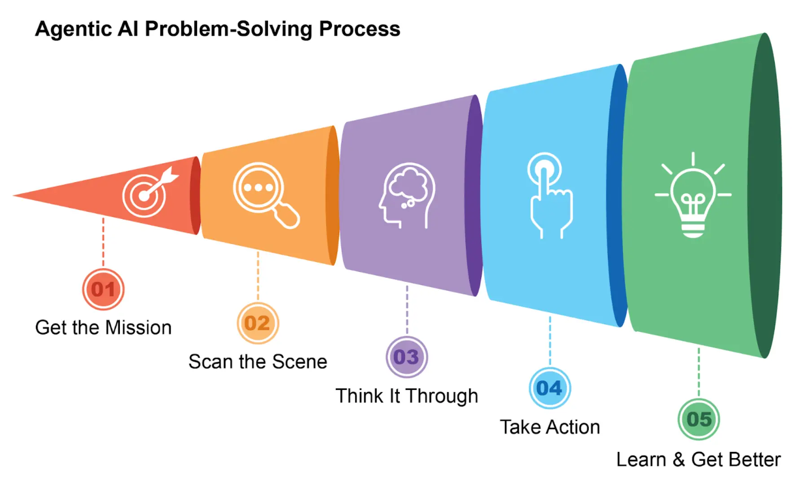
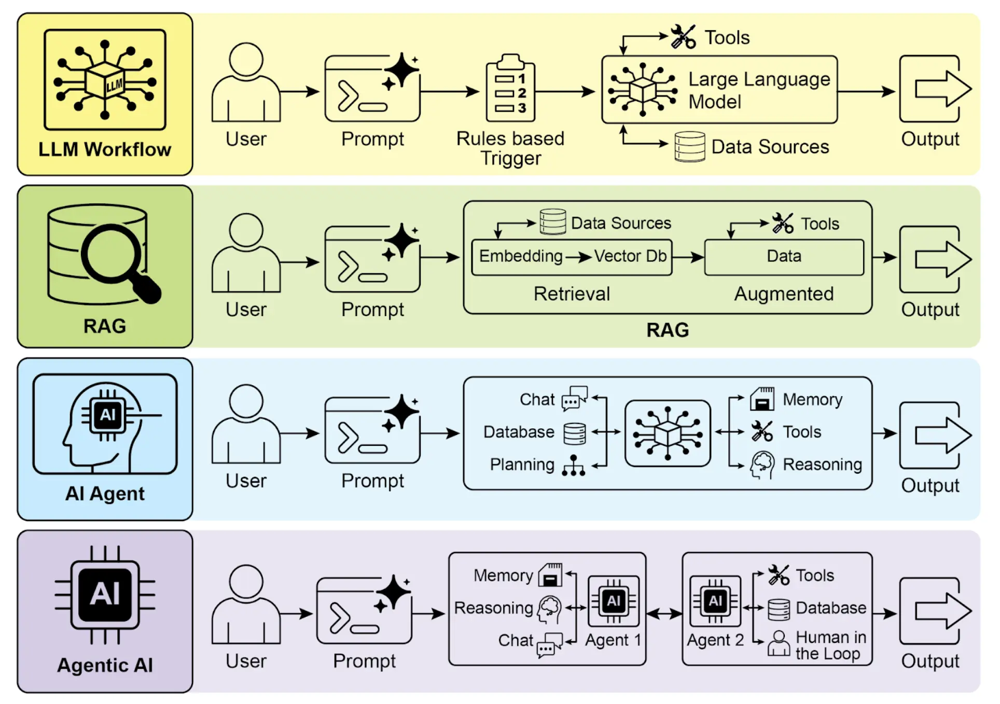
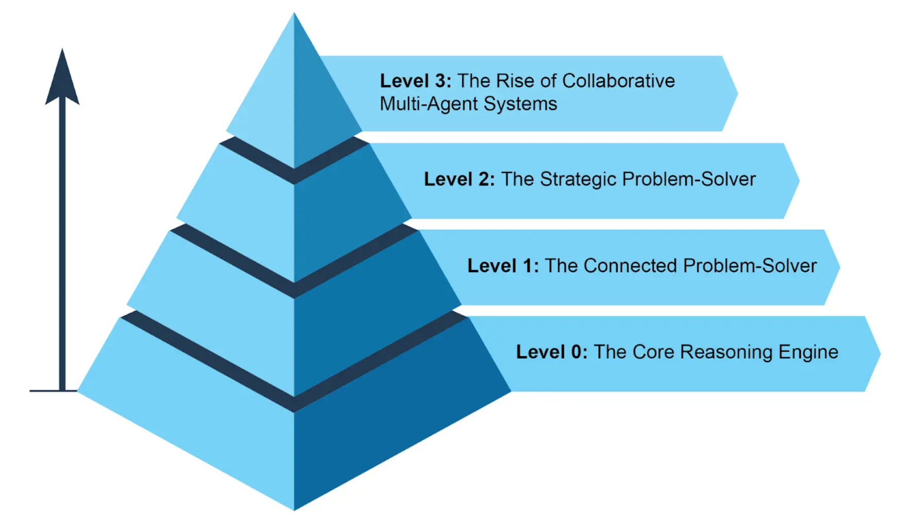
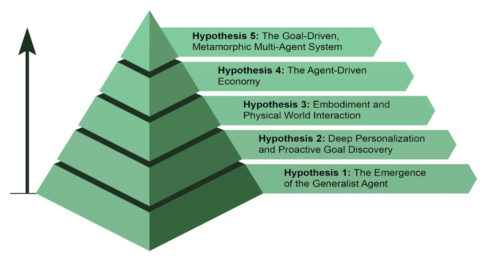

简单来说，**智能体**是一种能够感知环境并采取行动以实现特定目标的系统。它是从传统大语言模型（LLM）演化而来，具备规划、工具使用和环境交互等能力。可以 把智能体想象成一个能在工作中不断学习的智能助手。它遵循一个简单的五步循环来完成任务（见图 1）：

1.   **获取任务目标**：你给它一个目标，比如“帮我安排日程”。
2.   **扫描环境信息**：它会收集所有必要的信息——阅读邮件、检查日历、访问联系人——以了解当前状况。
3.   **制定计划**：它会思考并制定实现目标的最佳方案。
4.   **执行行动**：它会发送邀请、安排会议、更新你的日历来落实计划。
5.   **学习与优化**：它会观察结果并不断调整。例如，如果会议被重新安排，系统会从中学习以提升未来表现。

图 1：智能体像智能助手一样，通过经验不断学习，采用五步循环完成任务。

智能体正在以惊人的速度普及。最新研究显示，大多数大型 IT 企业都在积极使用智能体，其中五分之一是在过去一年内刚刚开始。金融市场也高度关注这一趋势。到 2024 年底，智能体初创公司融资已超过 20 亿美元，市场规模达到 52 亿美元，预计到 2034 年将激增至近 2000 亿美元。简而言之，智能体将在未来经济中扮演极为重要的角色。

短短两年间，AI 范式发生了巨大转变，从简单自动化迈向复杂自主系统（见图 2）。最初，工作流依赖基础提示和触发器，利用 LLM 处理数据。随后，检索增强生成（RAG）技术出现，通过事实信息提升模型可靠性。接着，单体智能体诞生，能够调用多种工具。如今，我们正步入智能体 (Agentic AI) 时代，多个专业智能体协作完成复杂目标，AI 的协同能力实现了质的飞跃。

图 2：从 LLM 到 RAG，再到 RAG，最终迈向智能体。

本书旨在探讨专业智能体如何协作、互动以实现复杂目标的设计模式，每一章都将展示一种协作与交互范式。

在此之前，让我们先看几个智能体复杂度的典型实例（见图 3）。

Level 0：核心推理引擎
--------------

LLM 本身并不是智能体，但可以作为基础智能体系统的推理核心。在“Level 0”配置下，LLM 不具备工具、记忆或环境交互能力，仅依靠预训练知识进行响应。它擅长解释已知概念，但完全无法感知最新事件。例如，如果 2025 年奥斯卡最佳影片不在其训练数据中，它就无法回答。

Level 1：连接型问题解决者
----------------

此阶段，LLM 通过连接外部工具成为真正的智能体。它的问题解决能力不再局限于预训练知识，而是能执行一系列操作，从互联网（搜索）或数据库（RAG）等渠道收集和处理信息。详细内容见 [第 14 章]。

例如，查找新电视剧时，智能体会识别需要最新信息，使用搜索工具获取并整合结果。它还能调用专业工具提升准确率，比如通过金融 API 获取 AAPL 的实时股价。跨步骤与外部世界交互，是 Level 1 智能体的核心能力。

Level 2：战略型问题解决者
----------------

此阶段，智能体能力大幅提升，具备战略规划、主动协助和自我优化，提示工程与上下文工程成为核心技能。

首先，智能体不再只用单一工具，而是通过战略性问题解决应对复杂多步骤任务。执行过程中，它主动进行上下文工程：即为每一步战略性筛选、打包和管理最相关的信息。例如，查找两地之间的咖啡馆，智能体先用地图工具获取信息，再将输出内容（如街道名列表）精简后传递给本地搜索工具，避免信息过载，确保高效准确。要让 AI 达到最高准确率，必须提供简短、聚焦且高效的上下文。上下文工程正是通过战略性筛选和管理关键信息，实现模型注意力的有效分配。详细内容见 [附录 A]。

这一阶段还带来主动、持续的操作。例如，旅行助手连接邮箱后，会从冗长的航班确认邮件中提取关键信息（航班号、日期、地点），再打包给日历和天气 API。

在软件工程等专业领域，智能体通过上下文工程管理整个工作流。收到 bug 报告后，它会读取报告和代码库，并将大量信息精炼为高效上下文，从而高效编写、测试和提交正确的代码补丁。

最后，智能体通过优化自身上下文工程实现自我提升。它会主动请求反馈，学习如何更好地整理初始输入，从而自动优化未来任务的信息打包方式，形成强大的自动反馈循环，不断提升准确率和效率。详细内容见 [第 17 章]。

图 3：展示智能体复杂度的不同实例。

Level 3：协作型多智能体系统崛起
-------------------

Level 3 标志着 AI 开发范式的重大转变，不再追求单一超级智能体，而是发展复杂的协作型多智能体系统。该模式认为，复杂挑战往往不是由单一通才解决，而是由多个专业团队协作完成。这与人类组织结构高度相似，不同部门分工协作，共同实现多元目标。系统的集体优势正是通过分工与协同实现的。详细内容见第 7 章。

以新产品发布为例，不是一个智能体包揽所有环节，而是由“项目经理”智能体统筹，分派任务给“市场调研”、“产品设计”、“营销推广”等专业智能体。成功的关键在于各智能体之间的高效沟通与信息共享，确保所有努力协同达成共同目标。

虽然自主团队式自动化已在开发中，但目前仍面临挑战。多智能体系统的效能受限于所用 LLM 的推理能力，且智能体之间真正互相学习和协同提升还处于初级阶段。突破这些技术瓶颈，是实现自动化全流程业务的关键一步。

智能体未来：五大假设
----------

智能体在软件自动化、科学研究、客户服务等领域正以前所未有的速度发展。当前系统虽已强大，但仅是起点。下一波创新将聚焦于提升智能体的可靠性、协作性和深度融合。以下是五大未来假设（见图 4）。

假设一：通才智能体的出现
------------

第一种假设认为，智能体将从狭窄的专家型进化为真正的通才，能够高可靠性地管理复杂、模糊和长期目标。例如，你只需一句话：“帮我规划公司 30 人下季度里斯本团建”，智能体就能全程管理项目数周，包括预算审批、航班谈判、场地选择、收集员工反馈并制定详细行程，并定期汇报进度。实现如此高度自治，需要 AI 在推理、记忆和可靠性方面取得突破。另一种可行路径是“小语言模型”（SLM）的崛起，即用多个小型专家智能体拼搭系统，而非扩展单一大模型。这种“乐高式”方法更便宜、易调试、易部署。最终，通才大模型与小型专家智能体的组合都可能成为未来主流，甚至互为补充。

假设二：深度个性化与主动目标发现
----------------

第二种假设认为，智能体将成为深度个性化、主动发现目标的伙伴。我们正见证新型智能体的诞生：主动型伙伴。它们通过学习你的行为和目标，从被动执行命令转向主动预测需求。当 AI 系统不再只是响应聊天或指令，而是主动发起并执行任务，与用户协作时，就进入了主动目标发现领域。

例如，你在探索可持续能源时，智能体会识别你的潜在目标，主动推荐课程或总结研究资料。虽然这些系统尚在发展，但趋势已十分明确。未来，智能体将越来越主动，只要确信有帮助就会主动行动，最终成为不可或缺的盟友，帮助你发现和实现尚未明确表达的目标。

图 4：关于智能体未来的五大假设。

假设三：具身化与物理世界交互
--------------

第三种假设认为，智能体将突破纯数字领域，进入物理世界。通过将智能体与机器人结合，将诞生“具身智能体”。未来，你无需预约维修工，只需让家庭智能体修理漏水水龙头。它会用视觉传感器感知问题，查阅管道知识库制定方案，并精准控制机械臂完成修理。这将是数字智能与物理行动融合的巨大飞跃，彻底改变制造、物流、养老和家庭服务等领域。

假设四：智能体驱动经济
-----------

第四种假设认为，高度自治的智能体将成为经济参与者，创造新市场和商业模式。未来，智能体可能作为独立经济实体，专注于最大化某一目标（如利润）。创业者可以部署智能体运营整个电商业务：智能体通过社交媒体分析发现热门产品，自动生成营销文案和视觉素材，与其他自动化系统协作管理供应链，并根据实时需求动态调整价格。这将催生一个全新、高效的“智能体经济”，其速度和规模远超人类直接管理。

假设五：目标驱动、变形多智能体系统
-----------------

第五种假设认为，智能系统将不再依赖显式编程，而是根据用户声明的目标自主实现。用户只需提出期望结果，系统就能自动规划并达成。这标志着变形多智能体系统的诞生，具备个体和整体自我优化能力。

该系统是动态实体，而非单一智能体。它能分析自身表现，动态调整多智能体结构，按需创建、复制或移除智能体，组建最优团队。进化体现在多个层面：

*   架构级修改：个体智能体可重写自身代码，重构内部结构以提升效率。
*   指令级修改：系统持续自动优化提示和上下文工程，无需人工干预就能为每个智能体提供最优指令和信息。

例如，创业者只需声明目标：“打造成功的手工咖啡电商”。系统无需额外编程即可启动：先生成“市场调研”和“品牌建设”Agent，根据初步结果再移除品牌智能体，新增“Logo 设计”、“网店平台”、“供应链”三个专业智能体，并不断优化各自的提示。如果网店智能体成为瓶颈，系统会将其复制为三个并行智能体，分别负责网站不同部分，实时重构团队以实现目标。

总结
--

本质上，智能体是从传统模型跃升而来的自主系统，能够感知、规划并行动以实现特定目标。技术演进正从单一工具型智能体迈向复杂协作型多智能体系统，能够应对多维任务。未来，通才型、个性化甚至具身化智能体将成为经济参与者。持续发展预示着向自我优化、目标驱动系统的重大转变，这类系统有望自动化整个工作流，彻底重塑我们与技术的关系。

参考文献
----

*   [Cloudera, Inc. – 96% 的企业正在增加智能体的使用（cloudera.com）](https://www.cloudera.com/about/news-and-blogs/press-releases/2025-04-16-96-percent-of-enterprises-are-expanding-use-of-ai-agents-according-to-latest-data-from-cloudera.html)
*   [自主生成式智能体– 德勤（deloitte.com）](https://www.deloitte.com/us/en/insights/industry/technology/technology-media-and-telecom-predictions/2025/autonomous-generative-ai-agents-still-under-development.html)
*   [全球智能体市场规模、趋势与预测 2025–2034 – Market.us（market.us）](https://market.us/report/agentic-ai-market/)