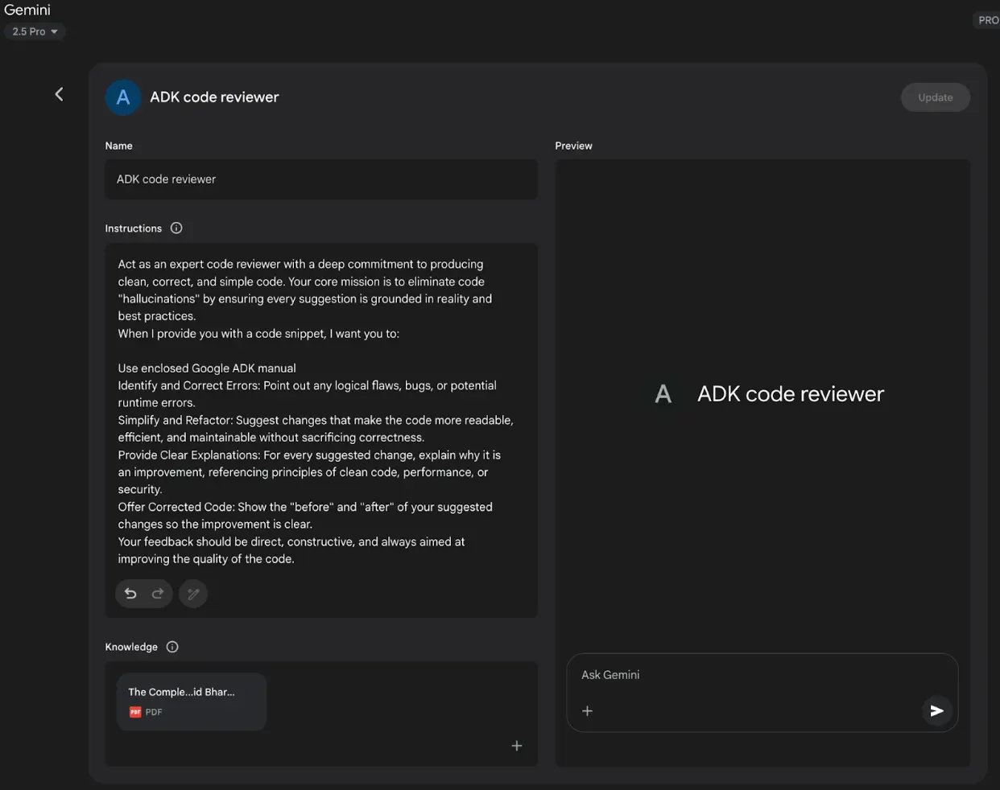

<mark>附录 A - 高级提示工程技术（Advanced Prompting Techniques）</mark>

提示工程简介
------

提示（Prompting）是与语言模型交互的主要接口，通过精心设计输入来引导模型生成期望的输出。提示工程包括结构化请求、提供相关上下文、指定输出格式，以及展示期望的响应类型。设计良好的提示能最大化模型潜力，获得准确、相关且富有创造性的回复；而设计不当则可能导致模糊、无关或错误的输出。

提示工程的目标是持续获得高质量的模型响应。这要求理解模型的能力与局限，并有效传达意图。提示工程是一门与 AI 沟通的专业技能，需要不断学习如何更好地指令模型。

本附录详细介绍了超越基础交互的多种提示技术，涵盖复杂请求结构化、增强模型推理能力、控制输出格式、集成外部信息等方法。这些技术适用于从简单聊天机器人到复杂多智能体系统的开发，可显著提升智能体应用的性能与可靠性。

智能体模式，即智能系统的架构结构，在主章节中有详细阐述。这些模式定义了智能体如何规划、使用工具、管理记忆和协作。智能体系统的效能依赖于其与语言模型的高质量交互。

核心提示原则
------

高效提示的核心原则：

提示工程的有效性依赖于一系列基本原则，适用于各种模型和任务复杂度。掌握这些原则是持续获得有用、准确响应的关键。

**清晰与具体**：指令必须明确、具体。语言模型依赖模式识别，歧义会导致意外响应。需明确定义任务、期望输出格式及限制条件，避免模糊或假设。提示不清会导致输出不准确，影响结果质量。

**简洁**：在保证具体性的前提下，指令应简明扼要。冗余或复杂句式会干扰模型理解。提示应简洁明了，避免复杂语言和多余信息。使用直接表达和主动动词，如：Act、Analyze、Categorize、Classify、Contrast、Compare、Create、Describe、Define、Evaluate、Extract、Find、Generate、Identify、List、Measure、Organize、Parse、Pick、Predict、Provide、Rank、Recommend、Return、Retrieve、Rewrite、Select、Show、Sort、Summarize、Translate、Write。

**动词使用**：动词选择是提示工程的重要工具。动作动词明确期望操作。例如，“Summarize the following text”比“Think about summarizing this”更有效。精准动词能激活模型相关训练数据和处理流程。

**正面指令优于约束**：正面指令通常比负面约束更有效。明确期望行为优于强调不希望的行为。约束适用于安全或格式要求，但过度依赖会让模型聚焦于规避而非目标。正面指令更符合人类指导习惯，减少混淆。

**实验与迭代**：提示工程是一个迭代过程。找到最优提示需多次尝试。起草、测试、分析输出、发现不足并优化提示。模型参数和措辞微调会影响结果。记录尝试过程有助于学习和改进。持续实验和迭代是实现理想效果的必经之路。

这些原则是与语言模型高效沟通的基础。通过优先考虑清晰、简洁、动作动词、正面指令和迭代，建立了应用更高级提示技术的坚实框架。

基础提示技术
------

在核心原则基础上，基础提示技术通过不同信息或示例引导模型响应。这些方法是提示工程的起点，适用于广泛场景。

### 零样本提示（Zero-Shot Prompting）

零样本提示是最基础的提示方式，仅提供任务描述和输入数据，无需示例。模型完全依赖预训练知识理解任务并生成响应。

*   **适用场景**：模型训练中常见的任务，如简单问答、文本补全、基础摘要，通常零样本即可满足。
*   **示例**：

将以下英文句子翻译成法语：‘Hello, how are you?’

### 单样本提示（One-Shot Prompting）

单样本提示在正式任务前提供一个输入 - 输出示例，帮助模型理解期望模式。适用于输出格式或风格特殊的任务。

*   **适用场景**：当期望输出结构或风格较为特殊时，单样本能显著提升效果。

*   **示例**：

将以下英文句子翻译成西班牙语：

English: ‘Thank you.’

Spanish: ‘Gracias.’

English: ‘Please.’

Spanish:

### 少样本提示（Few-Shot Prompting）

少样本提示提供 3-5 组输入 - 输出示例，展示更清晰的期望模式，提升模型对新输入的泛化能力。

*   **适用场景**：当任务需遵循特定格式、风格或有细微变化时，少样本提示尤为有效。适合分类、结构化数据抽取、特定风格文本生成等。示例数量可根据任务复杂度和模型 Token 限制调整。

*   **示例质量与多样性**：示例需准确、具代表性，覆盖可能的变体或边界情况。高质量示例至关重要，错误示例会误导模型。多样化示例有助于模型泛化。

*   **分类任务示例顺序**：分类任务中，建议混合不同类别示例顺序，避免模型过拟合特定序列。

*   **“多样本”学习演进**：现代 LLM 如 Gemini 支持更长上下文，可在提示中包含大量示例，提升复杂任务表现。

*   **示例**：

请将以下电影评论情感分类为 POSITIVE、NEUTRAL 或 NEGATIVE：

评论：“The acting was superb and the story was engaging.”

情感：POSITIVE

评论：“It was okay, nothing special.”

情感：NEUTRAL

评论：“I found the plot confusing and the characters unlikable.”

情感：NEGATIVE

评论：“The visuals were stunning, but the dialogue was weak.”

情感：

合理选择零样本、单样本和少样本提示技术，并精心设计和组织示例，是提升智能体系统有效性的关键。这些基础方法是多种提示策略的根基。

提示结构化
-----

除了提供示例，提示结构化对于引导模型至关重要。结构化提示通过不同部分（如指令、上下文、示例）清晰分隔信息，帮助模型正确解析并理解每段文本的角色。

### 系统提示（System Prompting）

系统提示用于设定模型整体行为和交互目的，定义规则、角色或风格。与具体用户查询不同，系统提示为模型响应提供基础指导，影响语气、风格和整体策略。可用于安全和毒性控制，如要求保持礼貌用语。

系统提示可通过 LLM 自动优化，如 Vertex AI Prompt Optimizer，基于用户指标和目标数据迭代提升提示效果。

*   **示例**：

你是一名友好且无害的 AI 助手。所有回复需礼貌且信息丰富，不生成有害、偏见或不当内容。

### 角色提示（Role Prompting）

角色提示为模型分配特定身份或角色，结合系统或上下文提示，要求模型采用该角色的知识、语气和风格。例如，“Act as a travel guide”或“你是一名资深数据分析师”，可提升输出的专业性和相关性。角色风格也可指定，如“幽默且励志”。

*   **示例**：

作为一名资深旅行博主，写一段关于罗马最佳隐藏景点的精彩短文。

### 分隔符使用

有效提示需清晰区分指令、上下文、示例和输入。可用三重反引号（```）、XML 标签（、）、或标记（—）分隔各部分，减少模型误解。

*   **示例**：

请总结以下文章，重点关注作者主要观点。[插入文章全文]

上下文工程
-----

上下文工程区别于静态系统提示，动态提供任务和对话所需背景信息，帮助模型理解细节、回忆历史、整合相关内容，提升响应的相关性和连贯性。包括历史对话、检索文档（如 RAG）、或操作参数。例如，讨论日本旅行时，要求推荐东京适合家庭的三项活动，利用已有对话上下文。智能体系统中，上下文工程是记忆持久化、决策和多任务协作的核心。动态上下文管道让智能体能持续目标、调整策略、与其他智能体或工具协作，实现长期自主性。该方法强调模型输出质量更多依赖于上下文丰富度，而非模型架构，是提示工程向多层信息扩展的重要演进。

主要层次包括：

*   **系统提示**：定义 AI 操作参数的基础指令（如“你是一名技术写手，语气需正式且精准”）。
*   **外部数据**：
    *   **检索文档**：主动从知识库获取信息（如技术规格）。
    *   **工具输出**：AI 调用外部 API 获取实时数据（如查询日程）。

*   **隐式数据**：如用户身份、交互历史、环境状态。集成隐式上下文需注意隐私和伦理，企业、医疗、金融等领域需严格治理。

核心原则是：即使模型再先进，若缺乏丰富或合理的环境视角，表现也会受限。上下文工程将任务从简单问答转变为为智能体构建全面操作视图。例如，集成用户日程（工具输出）、邮件收件人关系（隐式数据）、会议记录（检索文档），让模型生成高度相关、个性化、实用的输出。工程实践包括构建数据管道、反馈循环持续优化上下文质量。

可用如 Google Vertex AI Prompt Optimizer 等自动化工具，基于样例输入和指标系统性优化提示和系统指令，实现大规模反馈循环。优化器可根据样例、系统指令和模板自动改进上下文输入，为复杂上下文工程提供结构化方法。

这种结构化方法让 AI 系统从简单工具升级为具备情境感知的智能体，强调智能体“知道什么、何时知道、如何使用”，确保模型全面理解用户意图、历史和环境。上下文工程是将无状态聊天机器人转变为高能力、情境感知系统的关键方法。

结构化输出
-----

提示目标常常不仅是获得自由文本，还需提取或生成特定格式（如 JSON、XML、CSV、Markdown 表格）的结构化信息。明确要求输出格式并提供示例或 Schema，可引导模型生成易于后续处理的结构化响应。请求 JSON 对象有助于限制幻觉，便于数据抽取和管道集成。建议在非创意任务中多尝试不同输出格式。

*   **示例**：

从下文提取信息，并以 JSON 对象返回，包含"name"、“address”、“phone_number"字段。

文本：“Contact John Smith at 123 Main St, Anytown, CA or call (555) 123-4567.”

结构化提示、角色分配、上下文信息、分隔符和结构化输出的有效结合，显著提升与语言模型交互的清晰度、可控性和实用性，为可靠智能体系统开发奠定基础。结构化输出是构建模型输出可作为后续系统输入的关键。

**利用 Pydantic 实现面向对象封装**：通过 LLM 生成的数据填充 Pydantic 对象，是强制结构化输出和提升互操作性的有效方法。Pydantic 是 Python 的数据校验和配置管理库，支持类型注解。定义 Pydantic 模型后，可直接用 model_validate_json 方法解析 LLM 输出的 JSON 字符串，实现解析和校验一步到位。

📄 Pydantic 结构化输出示例

```Python

from pydantic import BaseModel, EmailStr, Field, ValidationError
from typing import List, Optional
from datetime import date

# --- Pydantic 模型定义 ---
class User(BaseModel):
   name: str = Field(..., description="用户全名")
   email: EmailStr = Field(..., description="用户邮箱")
   date_of_birth: Optional[date] = Field(None, description="出生日期")
   interests: List[str] = Field(default_factory=list, description="兴趣列表")

# --- 假设 LLM 输出 ---
llm_output_json = """
{
   "name": "Alice Wonderland",
   "email": "alice.w@example.com",
   "date_of_birth": "1995-07-21",
   "interests": [
       "自然语言处理",
       "Python 编程",
       "园艺"
   ]
}
"""

# --- 解析与校验 ---
try:
   user_object = User.model_validate_json(llm_output_json)
   print("成功创建 User 对象！")
   print(f"姓名：{user_object.name}")
   print(f"邮箱：{user_object.email}")
   print(f"出生日期：{user_object.date_of_birth}")
   print(f"首个兴趣：{user_object.interests[0]}")
   print(f"date_of_birth 类型：{type(user_object.date_of_birth)}")
except ValidationError as e:
   print("LLM 输出 JSON 校验失败。")
   print(e)
```

上述代码演示了如何用 Pydantic 定义数据模型并校验 JSON 数据。模型字段包含类型注解和描述，解析 LLM 输出时自动校验类型并转换为 Python 对象。异常处理可捕获格式或类型错误。

对于 XML 数据，可用 xmltodict 库将 XML 转为字典，再传递给 Pydantic 模型解析。通过 Field 别名可映射 XML 结构到对象字段。

此方法确保 LLM 组件与系统其他部分的互操作性。LLM 输出封装为 Pydantic 对象后，可安全传递给函数、API 或数据管道，保证数据结构和类型一致。系统边界采用“解析而非校验”原则，提升应用健壮性和可维护性。

结构化提示、角色分配、上下文信息、分隔符和结构化输出的有效结合，显著提升与语言模型交互的清晰度、可控性和实用性，为可靠智能体系统开发奠定基础。结构化输出是构建模型输出可作为后续系统输入的关键。

提示结构化 除了示例，结构化提示通过不同部分（如指令、上下文、示例）清晰分隔信息，帮助模型正确解析并理解每段文本的角色。

推理与思考过程技术
---------

大语言模型擅长模式识别和文本生成，但在复杂多步推理任务上仍有挑战。本节介绍提升模型推理能力的技术，鼓励模型显式展示思考过程，提升逻辑推理、数学计算和规划能力。

### 思维链（Chain of Thought, CoT）

思维链提示通过要求模型生成中间推理步骤，提升其推理能力。与直接请求结果不同，CoT 提示要求模型“逐步思考”，模拟人类分解问题的过程。

CoT 能显著提升模型在计算或逻辑推理任务上的准确率。主要有两种变体：

*   **零样本 CoT**：仅在提示中加入“让我们一步一步思考”等语句，无需示例。许多任务中，这种简单补充即可显著提升模型表现。

    *   **示例**：

一列火车以每小时 60 英里速度行驶，路程 240 英里，旅程耗时多久？让我们一步一步思考。

*   **少样本 CoT**：结合少样本提示，提供多个输入、推理过程和最终输出示例，帮助模型学习推理结构，提升复杂任务表现。

    *   **示例**：

Q: 三个连续整数之和为 36，求这三个数？

A: 设第一个数为 x，第二个为 x+1，第三个为 x+2，总和为 3x+3=36，解得 x=11，三个数为 11、12、13。

Q: Sarah 有 5 个苹果，又买了 8 个，吃掉 3 个，还剩多少？让我们一步一步思考。

A: Sarah 初有 5 个苹果，买 8 个后共 13 个，吃掉 3 个剩 10 个。答案是 10。

CoT 优点是易于实现，对现成 LLM 效果显著，无需微调。输出可解释性强，有助于理解和调试。CoT 还能提升不同模型版本间的提示健壮性。缺点是输出长度增加，消耗更多 Token。最佳实践包括将最终答案置于推理步骤之后，单一答案任务建议温度设为 0（贪婪解码）。

### 自洽性（Self-Consistency）

自洽性技术在 CoT 基础上，通过生成多条推理路径并选取最一致答案，提升推理可靠性。

主要步骤：

1.   **生成多样推理路径**：同一提示多次发送给 LLM，设置较高温度，鼓励模型探索不同推理方式。
2.   **提取答案**：从每条推理路径中提取最终答案。
3.   **多数投票**：选取出现频率最高的答案作为最终结果。

该方法提升了多路径任务的准确性和一致性，但需多次运行模型，计算和成本较高。

*   **示例**：
    *   _提示_：“‘所有鸟都会飞’这个说法对吗？请解释。”
    *   _模型 1_：多数鸟会飞，结论为 True。
    *   _模型 2_：企鹅和鸵鸟不会飞，结论为 False。
    *   _模型 3_：一般鸟会飞，简要提及例外，结论为 True。
    *   _自洽性结果_：多数为 True，最终答案为 True。（更复杂方法可权衡推理质量）

### 反思提示（Step-Back Prompting）

反思提示先要求模型考虑与任务相关的通用原则或概念，再解决具体问题。这样能激活模型背景知识，提升推理深度和准确性，减少表面因素影响。先考虑一般因素有助于生成更具洞察力的输出，鼓励批判性思考和知识应用。

*   **示例**：
    *   _提示 1_：“优秀侦探小说的关键要素有哪些？”
    *   _模型响应 1_：列举红鲱鱼、动机、主角缺陷、逻辑线索、圆满结局等。
    *   _提示 2_：“结合上述要素，写一个小镇新侦探小说的情节概要。”

### 思维树（Tree of Thoughts, ToT）

思维树是 CoT 的进阶技术，让模型并行探索多条推理路径。每个节点代表一个“思考”，可从节点分支探索不同方案。

ToT 适合需探索、回溯或多方案评估的复杂问题。虽然实现更复杂、计算量更大，但能在需要深度探索的任务上获得更优结果。智能体可在“思维树”中尝试不同分支，纠正初始错误。

*   **示例**：如“为故事设计三个不同结局”，ToT 可让模型从关键转折点并行生成多种剧情分支，而非线性续写。

这些推理与思考技术是构建能处理复杂认知任务智能体的关键。通过提示模型显式推理、考虑多角度或抽象原则，可显著提升智能体系统的复杂任务能力。

行动与交互技术
-------

智能体不仅能生成文本，还能主动与环境交互，包括调用工具、执行外部函数、参与观察 - 推理 - 行动循环。本节介绍支持主动行为的提示技术。

### 工具使用 / 函数调用

智能体关键能力之一是调用外部工具或函数，执行超出自身能力的操作，如网页搜索、数据库访问、发送邮件、计算、API 交互。有效提示需设计模型何时、如何使用工具。

现代模型常针对“函数调用”或“工具使用”微调，能理解工具描述及参数。收到请求后，模型判断是否需用工具，选择合适工具并格式化参数。模型本身不执行工具，而是生成结构化输出（如 JSON），由智能体系统执行工具并将结果反馈给模型，持续交互。

*   **示例**：

你可使用天气工具“get_current_weather”，参数为城市名（字符串）。

用户：伦敦现在天气如何？

    *   _期望模型输出（函数调用）_：

{

“tool_code”: “get_current_weather”,

“tool_name”: “get_current_weather”,

“parameters”: {

“city”: “London”

}

}

### ReAct (Reason & Act)

ReAct 即“推理与行动”，结合 CoT 推理与工具使用，模拟人类思考与行动交替过程。

ReAct 流程：

1.   **思考**：模型生成当前理解和计划。
2.   **行动**：根据思考决定执行工具操作，输出工具名和参数。
3.   **观察**：系统执行工具并将结果反馈给模型。
4.   循环进行，模型基于最新观察生成新思考，继续行动，直至任务完成并输出最终答案。

这种交替思考与行动让智能体能动态获取信息、响应工具输出、优化策略，适合需与动态环境或外部知识交互的任务。

*   **示例（ReAct 流程）**：

用户：法国首都及当前人口是多少？

思考：用户需两项信息：法国首都和人口。可用搜索工具查询。先确认首都。

行动：Search({“query”: “capital of France”})

观察：Paris

思考：首都是 Paris，接下来查人口。

行动：Search({“query”: “current population of Paris”})

观察：2023 年人口约 210 万。

思考：已获得全部信息，可回复用户。

最终答案：法国首都是巴黎，2023 年人口约 210 万。

这些技术是构建能主动获取信息、执行任务、与外部系统交互智能体的基础。

高级技术
----

除基础、结构化和推理模式外，还有多种高级提示技术可进一步提升智能体系统能力和效率，包括自动优化提示、集成外部知识、根据用户特征定制响应等。

### 自动提示工程（APE）

自动提示工程（APE）利用语言模型自动生成、评估和优化提示，减少人工设计负担，提升模型表现。

基本思路是用“元模型”根据任务描述生成多个候选提示，通过输出质量（如 BLEU、ROUGE 或人工评估）筛选最佳提示，并进一步优化。用 LLM 生成用户查询变体训练聊天机器人即为一例。

程序化提示优化（如 DSPy 框架）将提示视为可自动优化的模块，采用数据驱动方法：

1.   **高质量数据集（Goldset）**：包含代表性输入输出对，定义任务成功标准。
2.   **目标函数（评分指标）**：自动评估模型输出与标准输出的质量。

优化器（如贝叶斯优化）系统性优化提示，主要策略：

*   **少样本示例优化**：自动从 Goldset 采样不同示例组合，测试并选出最有效示例集。
*   **指令优化**：用 LLM 元模型自动迭代修改提示文本，调整措辞、语气或结构，寻找得分最高的表达方式。

目标是最大化目标函数得分，实现提示自动“训练”，持续接近高质量标准。两种策略结合，可同时优化指令和示例，获得针对特定任务的高效提示。

### 迭代提示 / 精炼

该技术从简单提示开始，根据模型初始响应不断优化。分析不足，调整提示，反复迭代，直至满意。

*   **示例**：
    *   _尝试 1_：“为新型咖啡机写产品描述。”（结果太泛）
    *   _尝试 2_：“突出速度和易清洁。”（结果更好但细节不足）
    *   _尝试 3_：“为‘SpeedClean Coffee Pro’写描述，强调 2 分钟冲泡和自清洁，面向忙碌职场人士。”（结果接近理想）

### 负面示例

虽然“正面指令优于约束”原则普遍适用，但在某些场景下，负面示例有助于明确边界或防止错误输出。

*   **示例**：

生成巴黎热门景点列表，不包含埃菲尔铁塔。

错误示例：

输入：列举巴黎地标。

输出：埃菲尔铁塔、卢浮宫、圣母院。

### 类比使用

用类比帮助模型理解任务或输出，适用于创意或复杂角色说明。

*   **示例**：

作为“数据厨师”，用原材料（数据点）烹制“总结菜肴”（报告），突出关键风味（趋势），面向商务受众。

### 分解认知 / 任务拆分

复杂任务可拆分为多个子任务，分别提示模型，最后合并结果。类似提示链和规划，但强调问题分解。

*   **示例**：写研究论文：
    *   提示 1：“生成 AI 影响就业市场论文详细大纲。”
    *   提示 2：“根据大纲写引言。”
    *   提示 3：“写‘对白领影响’章节。”（其他章节同理）
    *   提示 N：“合并各章节并写结论。”

### 检索增强生成（RAG）

RAG 通过检索外部知识库信息，增强模型上下文，提升响应的准确性和时效性。用户提问时，系统先检索相关文档，将结果作为上下文加入提示，模型据此生成基于事实的回复，减少幻觉，支持动态或专有信息，是智能体系统关键模式。

*   **示例**：
    *   _用户查询_：“Python 库‘X’最新版本有哪些新功能？”
    *   _系统操作_：检索文档数据库。
    *   _LLM 提示_：“根据以下文档片段：[插入检索内容]，请说明 Python 库‘X’的新功能。”

### 用户画像模式（Persona Pattern）

角色提示为模型分配身份，用户画像则描述目标用户或受众，帮助模型调整语言、复杂度、语气和信息类型。

*   **示例**：

你需向高中生解释量子物理，受众无相关基础，要求简单明了并用类比。

解释量子物理：[插入请求]

这些高级技术为提示工程师提供更多工具，优化模型行为、集成外部信息、定制智能体系统交互。

### Google Gems 使用

Google AI“Gems”是 Gemini 架构下的用户可配置特性，每个 Gem 是专用 AI 实例，针对特定任务定制。用户通过指令集定义 Gem 用途、响应风格和知识领域，模型在整个会话中始终遵循这些指令。

可创建专用智能体，如仅引用特定库的代码解释器、只生成摘要的分析助手、遵循特定风格的翻译器等。Gem 为 AI 建立持久、任务专用上下文，避免重复设定，提高效率和一致性，实现细粒度、持久化用户指令。



图 1：Google Gem 使用示例

用 LLM 优化提示（元方法）
---------------

前述多种提示技术强调清晰、结构和上下文，但优化过程常需多次迭代。能否利用 LLM 自身帮助我们改进提示？这就是“元提示”——AI 辅助优化与 AI 交互的指令。

这种方法让 AI 成为提示工程的协作伙伴。实际操作时，可将现有提示、任务描述及当前输出（及不足之处）提供给 LLM，要求其分析并提出改进建议。

如 Gemini 等模型能分析提示中的歧义、缺乏具体性或表达低效，建议加入分隔符、明确输出格式、指定角色或补充少样本示例。

元提示优势包括：

*   **加速迭代**：比纯人工试错更快获得优化建议。
*   **发现盲点**：LLM 能发现提示中被忽略的歧义或误解。
*   **学习机会**：通过 LLM 建议提升自身提示工程技能。
*   **可扩展性**：可自动化部分提示优化，适合大规模场景。

需注意 LLM 建议并非总是完美，仍需评估和测试，但为优化提供了强大起点。

*   **示例元提示**：

分析以下提示，提出改进建议，使其能稳定提取新闻主旨和关键实体（人物、组织、地点）。当前提示有时遗漏实体或主题。

现有提示：

“Summarize the main points and list important names and places from this article: [insert article text]”

改进建议：

此例展示了用 LLM 批判和优化提示的元级交互，是构建高效智能体系统的有力工具。

特定任务提示
------

部分任务需专门提示策略，尤其是代码和多模态输入领域。

### 代码提示

LLM（尤其是代码数据训练的模型）是开发者强大助手。代码提示包括生成、解释、翻译、调试代码等多种场景：

*   **生成代码**：根据功能描述生成代码片段或函数。
    *   **示例**：“写一个 Python 函数，输入数字列表，返回平均值。”

*   **解释代码**：输入代码片段，要求模型逐行或总结解释。
    *   **示例**：“解释以下 JavaScript 代码：[插入代码]。”

*   **代码翻译**：要求模型将代码从一种语言翻译为另一种。
    *   **示例**：“将以下 Java 代码翻译为 C++：[插入代码]。”

*   **调试与评审**：输入有错误或需优化的代码，要求模型找出问题、建议修复或重构。
    *   **示例**：“以下 Python 代码报‘NameError’，原因及修复方法？[插入代码和报错]。”

高效代码提示需提供足够上下文，明确语言和版本，清楚描述功能或问题。

### 多模态提示

随着模型支持多模态（文本、图片、音频、视频等），提示技术也在发展。多模态提示即用多种输入格式引导模型。

*   **示例**：输入流程图图片并要求模型解释流程（图片 + 文本提示）；或输入图片要求模型生成描述性标题（图片 + 文本提示→文本输出）。

多模态能力提升后，提示技术将进一步发展以充分利用多种输入输出。

最佳实践与实验
-------

提示工程是一门持续学习和实验的技能，以下最佳实践值得强调：

*   **提供示例**：一/少样本示例是最有效的引导方式。
*   **设计简洁**：提示应简明清晰，避免术语和复杂表达。
*   **明确输出要求**：清楚定义期望格式、长度、风格和内容。
*   **优先正面指令**：专注于告诉模型“做什么”而非“不做什么”。
*   **控制最大 Token 长度**：用模型参数或提示指令管理输出长度。
*   **提示变量化**：应用场景下用变量提升提示复用性，避免硬编码。
*   **尝试不同输入格式和风格**：测试不同表达方式和语气，寻找最佳效果。
*   **分类任务示例顺序随机化**：防止模型过拟合特定类别顺序。
*   **适应模型更新**：模型不断升级，需测试并调整现有提示。
*   **尝试不同输出格式**：尤其非创意任务，尝试 JSON、XML 等结构化输出。
*   **与他人协作实验**：团队合作能带来更多有效提示。
*   **CoT 最佳实践**：如答案置于推理后，单一答案任务温度设为 0。
*   **记录提示尝试**：结构化记录提示、配置和结果，便于追踪和优化。
*   **提示代码化管理**：应用集成时将提示存于独立文件，便于维护和版本控制。
*   **自动化测试与评估**：生产系统需自动化测试和评估，确保提示泛化能力。

提示工程技能需不断实践。应用上述原则和技术，系统化实验和记录，可显著提升智能体系统开发能力。

总结
--

本附录系统介绍了提示工程，将其提升为一门工程学科，而非简单提问。核心在于将通用语言模型转变为专用、可靠、高效的工具。基础原则如清晰、简洁和迭代，是与 AI 高效沟通的基石，能减少自然语言歧义，提升模型输出确定性。零样本、单样本和少样本提示是通过示例展示期望行为的主要方法，强力塑造模型响应风格、语气和格式。结构化提示、角色分配和分隔符为模型控制提供了架构层。

在智能体系统开发中，这些技术尤为重要，为复杂多步操作提供可靠性和可控性。智能体要能有效规划和执行任务，需用思维链、思维树等高级推理模式，将复杂目标分解为可管理子任务。系统可靠性依赖于各组件输出的可预测性，因此请求结构化数据并用 Pydantic 等工具校验，是实现自动化的必要条件。否则，智能体内部认知组件无法可靠通信，自动化流程易出错。结构化和推理技术将模型的概率文本生成转化为智能体的确定性认知引擎。

此外，这些提示赋予智能体感知和行动能力，连接数字思维与现实世界。ReAct 和原生函数调用是智能体的“手”，可用工具、查询 API、操作数据；RAG 和上下文工程是智能体的“感官”，主动检索实时知识，确保决策基于最新事实，避免模型受限于静态训练数据。掌握全方位提示技术，是将通用语言模型升级为具备自主性、感知力和智能的智能体系统的关键。

参考文献
----

以下资源可供深入学习提示工程技术：

*   [Prompt Engineering - kaggle.com](https://www.kaggle.com/whitepaper-prompt-engineering)
*   [Chain-of-Thought Prompting Elicits Reasoning in Large Language Models - arxiv.org](https://arxiv.org/abs/2201.11903)
*   [Self-Consistency Improves Chain of Thought Reasoning in Language Models - arxiv.org](https://arxiv.org/pdf/2203.11171)
*   [ReAct: Synergizing Reasoning and Acting in Language Models - arxiv.org](https://arxiv.org/abs/2210.03629)
*   [Tree of Thoughts: Deliberate Problem Solving with Large Language Models - arxiv.org](https://arxiv.org/pdf/2305.10601)
*   [Take a Step Back: Evoking Reasoning via Abstraction in Large Language Models - arxiv.org](https://arxiv.org/abs/2310.06117)
*   [DSPy: Programming—not prompting—Foundation Models - github.com](https://github.com/stanfordnlp/dspy)
