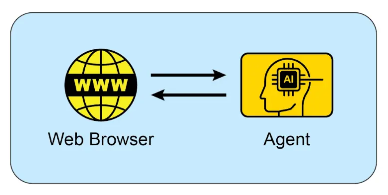

<mark> 附录 B - 智能体交互：从 GUI 到现实世界环境（AI Agentic: From GUI to Real world environment） </mark>

智能体正通过与数字界面和物理世界的交互，执行越来越复杂的任务。它们在不同环境中的感知、处理和行动能力，正在根本性地改变自动化、人机交互和智能系统。本附录将探讨智能体如何与计算机及其环境互动，重点介绍相关技术进展与项目。

交互：智能体与计算机
----------

AI 从对话伙伴进化为主动、任务导向的智能体，核心驱动力是 Agent-Computer Interface（ACI，智能体 - 计算机接口）。ACI 让 AI 能直接与计算机的图形用户界面（GUI）互动，像人类一样识别和操作屏幕上的图标、按钮等视觉元素。这种方式突破了传统自动化对 API 和系统调用的依赖，摆脱了开发者预设脚本的限制。通过“视觉前门”进入软件，AI 能以更灵活强大的方式自动化复杂数字任务，主要流程包括：

*   **视觉感知**：智能体首先捕获屏幕的视觉信息，相当于截屏。
*   **GUI 元素识别**：分析图像，区分不同的 GUI 元素。智能体需学会将屏幕视为结构化布局，识别可点击的“提交”按钮、静态横幅图片、可编辑文本框和标签等。
*   **上下文理解**：ACI 模块作为视觉数据与智能体核心（通常为大语言模型 LLM）之间的桥梁，结合任务语境解释这些元素。例如，理解放大镜图标通常代表“搜索”，一组单选按钮表示选项。该模块提升 LLM 的推理能力，使其能基于视觉证据制定计划。
*   **动态操作与反馈**：智能体通过程序控制鼠标和键盘，执行点击、输入、滚动、拖拽等操作，并实时监控屏幕反馈，动态应对变化、加载界面、弹窗或错误，顺利完成多步骤流程。

这一技术已进入实际应用阶段，多个领先 AI 实验室已推出具备 GUI 交互能力的智能体：

**ChatGPT Operator（OpenAI）**：定位为数字助手，能在桌面上自动化多种应用任务。它理解屏幕元素，可将数据从表格转移到 CRM 平台、预订复杂行程、填写在线表单，无需针对每个服务开发专用 API。Operator 致力于提升个人和企业生产力，自动处理重复性数字工作。

**Google Project Mariner**：作为研究原型，Mariner 在 Chrome 浏览器中运行（见图 1），理解用户意图并自主完成网页任务。例如，用户可让其查找指定预算和区域的三套出租公寓，Mariner 会自动访问房产网站、筛选、浏览并整理信息。该项目探索让浏览器主动为用户工作的“智能体式”体验。

图 1：智能体与网页浏览器的交互

**Anthropic 的 Computer Use**：该功能让 Claude 模型成为桌面环境的直接用户。通过截屏感知界面、程序控制鼠标键盘，Claude 可跨多个应用自动化工作流。例如，分析 PDF 报告数据、在表格软件中计算、生成图表并粘贴到邮件草稿，整个流程无需人工干预。

**Browser Use**：这是一个开源库，提供高级 API 用于浏览器自动化。它让智能体能访问和控制网页 DOM，简化底层浏览器协议操作。智能体可执行复杂动作，如嵌套数据提取、表单提交、多页面自动导航，将非结构化网页数据转化为可分析的结构化信息。

交互：智能体与环境
---------

超越计算机屏幕，AI 智能体正被设计用于与复杂、动态的现实环境互动，这需要更高级的感知、推理和执行能力。

Google 的 **Project Astra** 是推动智能体环境交互的代表性项目。Astra 致力于打造日常生活中的通用智能体，融合多模态输入（视觉、听觉、语音）和输出，理解并与世界环境进行上下文互动。该项目强调快速理解、推理和响应，让智能体通过摄像头和麦克风“看见”“听见”周围环境，并以自然对话方式实时协助用户。Astra 的愿景是让智能体能无缝协助用户完成如寻找物品、调试代码等任务，实现对物理环境的深度理解，远超传统语音助手。

Google 的 **Gemini Live**，将标准 AI 交互升级为流畅动态的对话。用户可用语音与 AI 交流，获得自然语音回复，甚至可随时打断或切换话题，AI 会即时适应。界面支持视觉信息输入，如用手机摄像头拍摄、屏幕共享或上传文件，实现更具上下文感知的交流。高级版本还能识别语气、过滤背景噪音，提升理解能力。例如，用户只需用摄像头指向任务，即可获得实时操作指导。

OpenAI 的 **GPT-4o 模型**，主打“全模态”交互，能在语音、视觉、文本间进行推理，响应速度接近人类实时对话。用户可通过视频流提问、实现语言翻译等。OpenAI 提供“实时 API”，支持低延迟语音交互应用开发。

OpenAI 的 **ChatGPT 智能体**，在架构上实现重大突破，集成多项新能力：可自主浏览互联网获取实时数据、动态生成并执行代码（如数据分析）、直接与第三方软件集成。智能体可根据单一指令自动完成复杂流程，如市场分析与演示文稿生成、物流规划与交易执行。OpenAI 同步发布“系统卡”，明确 AI 在线操作带来的安全风险，并在架构中加入多重防护，如敏感操作需用户授权、内容过滤机制等。公司正通过用户反馈持续优化安全策略。

**Seeing AI**，微软推出的免费移动应用，为盲人和低视力用户实时讲解周围环境。应用利用设备摄像头和 AI，识别并描述物体、文本、人物等。核心功能包括文档朗读、货币识别、条码扫描、场景和颜色描述，极大提升视障用户的独立性。

**Anthropic Claude 4 系列**，Claude 4 拥有高级推理与分析能力，除文本外还支持视觉信息处理，可分析图片、图表和文档，适合复杂多步骤任务和详细分析。虽然实时对话不是其主要定位，但其智能基础适合构建高能力智能体。

Vibe Coding：与 AI 的直觉式开发
-----------------------

除了直接与 GUI 和现实世界互动，开发者与 AI 协作开发软件也出现了新范式——“vibe coding”（氛围式编码）。这种方式不再依赖精确的逐步指令，而是通过更直觉、对话和迭代的方式与 AI 编程助手互动。开发者只需给出高层目标、期望“氛围”或大致方向，AI 即可生成相应代码。

其特点包括：

*   **对话式提示**：开发者不需详细规格，只需表达需求，如“创建一个简洁现代的落地页”或“让这个函数更 Pythonic、更易读”，AI 会理解“现代”或“Pythonic”的氛围并生成代码。
*   **迭代优化**：AI 的初步输出只是起点，开发者可用自然语言反馈，如“按钮改成蓝色”“加上错误处理”，反复交流直到满意为止。
*   **创意协作**：AI 作为创意伙伴，主动提出开发者未曾想到的方案，加速开发并激发创新。
*   **关注‘做什么’而非‘怎么做’**：开发者只需关注目标（做什么），具体实现（怎么做）交由 AI，便于快速原型和多方案探索，无需陷入样板代码细节。
*   **可选记忆库**：为保持长对话上下文，开发者可用“记忆库”存储关键信息、偏好或约束，如保存编码风格或项目需求，确保后续代码生成保持一致，无需重复说明。

随着 GPT-4、Claude、Gemini 等强大 AI 模型集成进开发环境，vibe coding 越来越流行。这些工具不仅自动补全代码，更主动参与软件开发的创意过程，让开发更高效、易于创新。软件工程的本质正在改变，强调创意和高层思考，而非死记语法和 API。

关键要点
----

*   智能体正从简单自动化进化为通过 GUI 视觉控制软件，像人类一样操作界面。
*   下一个前沿是现实世界交互，如 Google Astra 利用摄像头和麦克风“看见”“听见”物理环境。
*   领先科技公司正融合数字与物理能力，打造能跨领域工作的通用 AI 助手。
*   这一变革催生了新一代主动、具备上下文感知能力的 AI 伙伴，能协助用户日常生活中的多种任务。

总结
--

智能体正经历重大变革，从基础自动化迈向与数字和物理环境的深度交互。通过视觉感知操作 GUI，智能体可像人类一样操控软件，无需传统 API。各大科技实验室正推动智能体自动化复杂、多应用工作流。与此同时，智能体正向现实世界拓展，如 Google Project Astra 利用摄像头和麦克风实现环境感知和互动，具备多模态、实时理解能力，接近人类交互体验。

最终愿景是数字与物理能力的融合，打造能在所有用户环境中无缝工作的通用 AI 助手。软件开发方式也因“vibe coding”发生变革，开发者与 AI 以更直觉、对话的方式协作，关注高层目标和创意，提升开发效率与创新力。AI 智能体正成为主动、具备上下文感知能力的伙伴，助力我们日常生活的方方面面。

参考文献
----

*   [OpenAI Operator – openai.com](https://openai.com/index/introducing-operator/)
*   [OpenAI ChatGPT 智能体– openai.com](https://openai.com/index/introducing-chatgpt-agent/)
*   [Browser Use – docs.browser-use.com](https://docs.browser-use.com/introduction)
*   [Project Mariner – deepmind.google](https://deepmind.google/models/project-mariner/)
*   [Anthropic Computer Use – anthropic.com](https://docs.anthropic.com/en/docs/build-with-claude/computer-use)
*   [Project Astra – deepmind.google](https://deepmind.google/models/project-astra/)
*   [Gemini Live – gemini.google](https://gemini.google/overview/gemini-live/?hl=zh-CN)
*   [OpenAI GPT-4 – openai.com](https://openai.com/index/gpt-4-research/)
*   [Claude 4 – anthropic.com](https://www.anthropic.com/news/claude-4)
