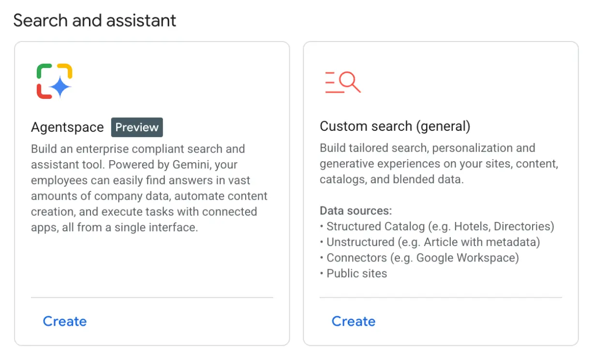
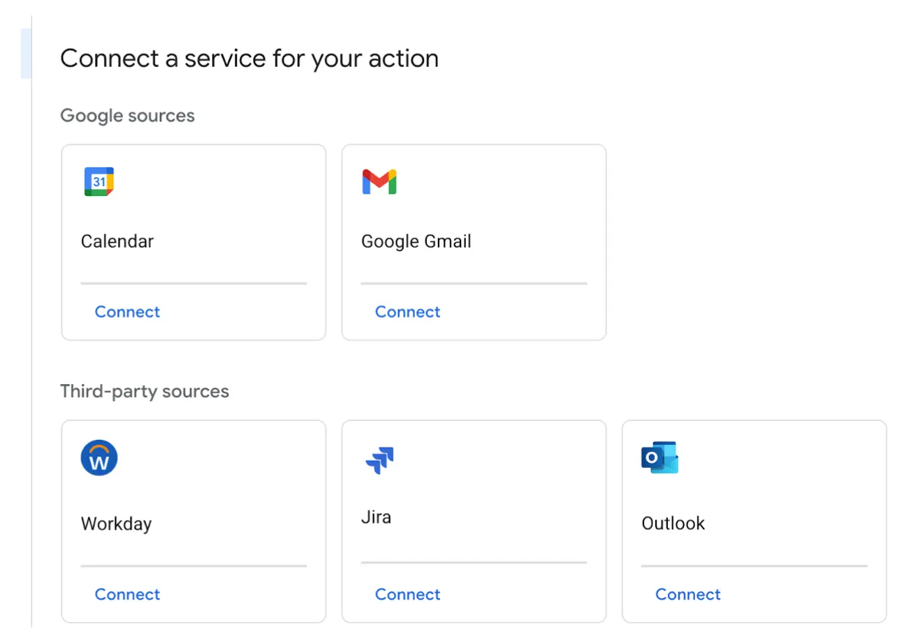
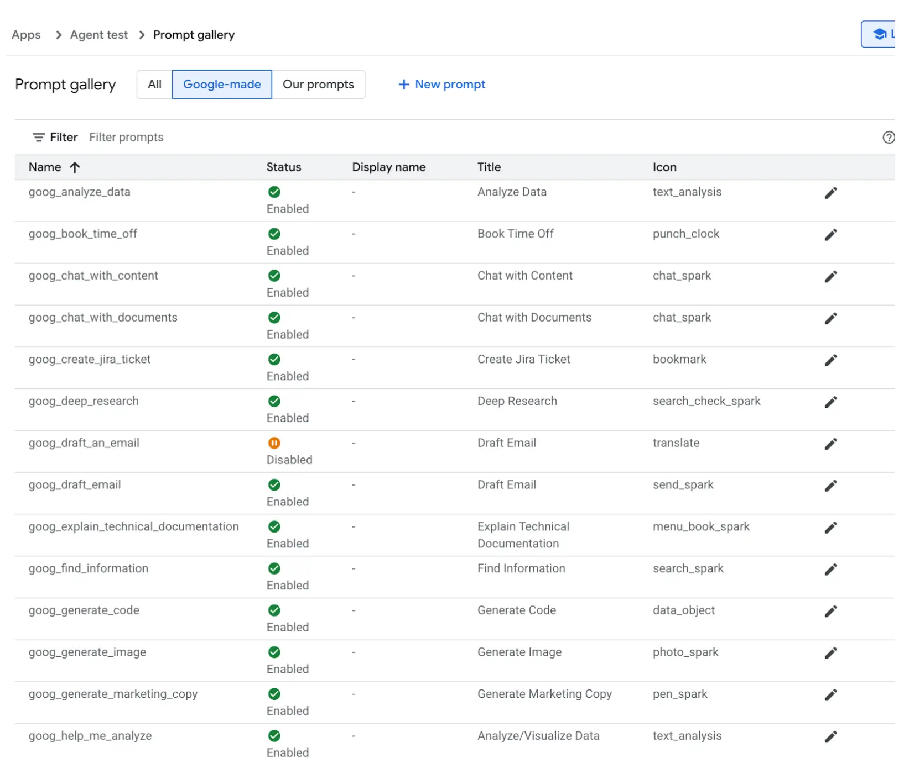
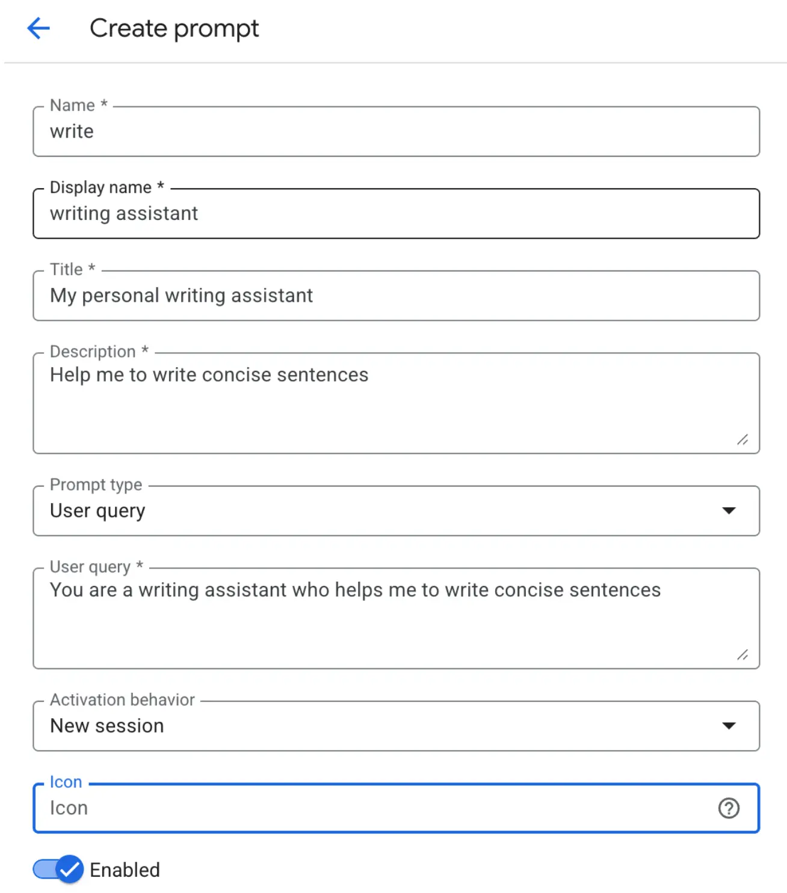
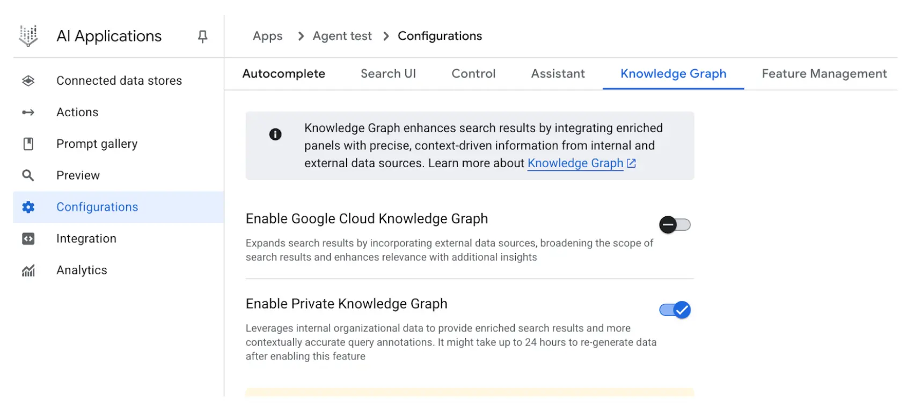
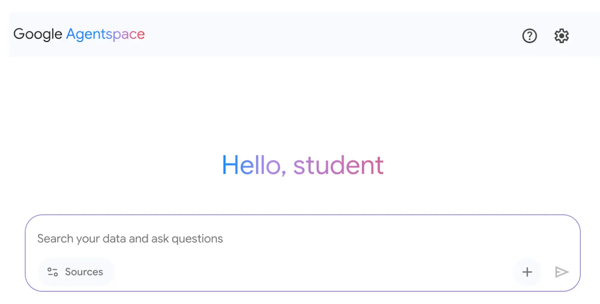

# 附录D: 基于AgentSpace构建智能体（Building an Agent with AgentSpace）</mark>

概述
--

AgentSpace 是一个旨在推动“智能体驱动型企业”的平台，通过将人工智能集成到日常工作流中，提升组织的智能化水平。其核心功能是为企业的所有数字资产（如文档、邮件、数据库等）提供统一的搜索能力，并利用 Google Gemini 等先进 AI 模型，理解并整合来自不同来源的信息。

该平台支持创建和部署专用的 AI“智能体”，这些智能体不仅仅是聊天机器人，还能自主推理、规划并执行多步任务。例如，一个智能体可以自动调研主题、整理带有引用的报告，甚至生成音频摘要。

为实现上述功能，AgentSpace 构建了企业知识图谱，映射人与文档、数据之间的关系，使 AI 能够理解上下文，提供更相关和个性化的结果。平台还内置了无代码界面 Agent Designer，帮助用户无需深厚技术背景即可定制智能体。

此外，AgentSpace 支持多智能体系统，不同智能体可通过开放协议 Agent2Agent (A2A) 协议进行通信与协作，实现更复杂的流程编排。安全性也是基础保障，包括基于角色的访问控制和数据加密，保护企业敏感信息。最终目标是将智能自主系统深度嵌入企业运营，提升生产力和决策能力。

如何通过 AgentSpace UI 构建智能体
------------------------

如图 1 所示，可在 Google Cloud 控制台选择 AI 应用，进入 AgentSpace。

图 1：如何通过 Google Cloud 控制台访问 AgentSpace

您的智能体可连接多种服务，包括日历、Google 邮件、Workaday、Jira、Outlook 和 Service Now（见图 2）。

图 2：集成 Google 及第三方平台等多种服务

智能体可选择使用 Google 提供的预设提示词库中的提示词（如图 3）。

图 3：Google 预设提示词库

或者，您也可以自定义提示词（如图 4），并由智能体使用。

图 4：自定义智能体提示词

AgentSpace 还支持多项高级功能，如集成数据存储、自有知识图谱或 Google 知识图谱、Web 界面用于公开智能体，以及分析功能用于监控使用情况等（见图 5）。

图 5：AgentSpace 高级功能

完成后，即可访问 AgentSpace 聊天界面（图 6），与您的智能体进行交互。

图 6：AgentSpace 用户界面，可与智能体聊天

总结
--

综上，AgentSpace 为企业在现有数字基础设施中开发和部署智能体提供了完整框架。系统架构将复杂的后端流程（如自主推理和知识图谱映射）与可视化界面结合，用户可通过界面集成多种数据服务、配置提示词，实现定制化、具备上下文感知能力的自动化系统。

这种方式屏蔽了底层技术复杂性，使用户无需编程即可构建多智能体系统。核心目标是将自动化分析与运营能力直接嵌入工作流，提升流程效率和数据驱动分析能力。实际操作可参考 Google Cloud Skills Boost 上的“使用 Agentspace 构建生成式智能体”实验课程，获得结构化的实操学习体验。

参考资料
----

*   [使用 Agent Designer 创建无代码智能体 - cloud.google.com](https://cloud.google.com/agentspace/agentspace-enterprise/docs/agent-designer)
*   [Google Cloud Skills Boost - cloudskillsboost.google](https://www.cloudskillsboost.google/)

