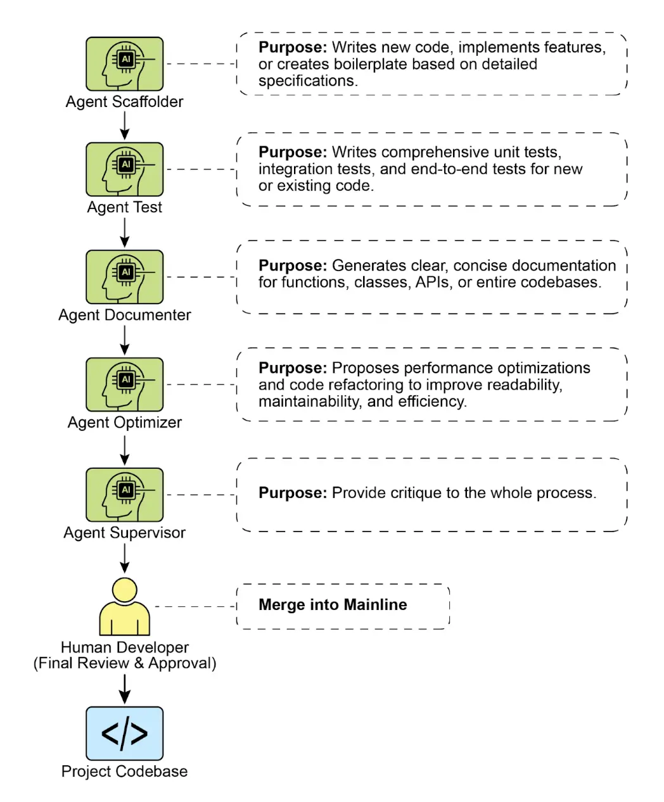

<mark> 附录 G - 编程智能体（Coding Agents） </mark>

Vibe Coding：创新起点
----------------

“Vibe Coding”已成为快速创新和创意探索的强大技术。这种实践利用大语言模型（LLM）生成初稿、梳理复杂逻辑或构建快速原型，大幅降低开发初期的阻力。它对于克服“空白页”问题尤为宝贵，让开发者能迅速将模糊概念转化为可运行的代码。Vibe Coding 在探索陌生 API 或测试新颖架构模式时尤其有效，因为它无需一开始就追求完美实现。生成的代码常常成为创意催化剂，为开发者提供批判、重构和扩展的基础。其核心优势在于加速软件生命周期的发现与构思阶段。然而，Vibe Coding 虽然擅长头脑风暴，要开发健壮、可扩展、易维护的软件，仍需更结构化的方法——从纯生成转向与专业编程智能体的协作。

智能体作为团队成员
---------

最初的浪潮聚焦于原始代码生成——适合构思的“Vibe Code”，而如今行业正转向更集成、更强大的生产范式。高效的开发团队不再只是将任务委托给智能体，而是通过一组专业编程智能体来增强自身。这些智能体如同不知疲倦的专业团队成员，放大人类创造力，显著提升团队的可扩展性和开发速度。

这一演变在行业领袖的言论中有所体现。2025 年初，Alphabet CEO Sundar Pichai 表示，Google **“有超过 30% 的新代码由我们的 Gemini 模型辅助或生成，彻底改变了开发速度。”** 微软也有类似声明。这一行业趋势表明，真正的前沿不是取代开发者，而是赋能开发者。目标是增强关系——人类引领架构与创意解决方案，智能体负责测试、文档、评审等专业、可扩展任务。

本章提出了一个基于核心理念的人机智能体团队组织框架：人类开发者作为创意主导和架构师，智能体则是倍增器。该框架基于三大原则：

1.   **人类主导编排**：开发者是团队负责人和项目架构师，始终参与流程，编排工作流、设定目标并做最终决策。智能体虽强大，但只是协作伙伴。开发者决定调用哪个智能体，提供必要上下文，并对所有智能体生成结果进行最终把关，确保符合项目质量和长期愿景。
2.   **上下文至上**：智能体的表现完全依赖于上下文的质量和完整性。强大的 LLM 若缺乏优质上下文也无用。因此，框架强调由人类主导的精细上下文准备，避免自动化黑盒检索。开发者需为每个智能体精心准备“任务简报”，包括：
    *   **完整代码库**：提供所有相关源码，让智能体理解现有模式和逻辑。
    *   **外部知识**：补充文档、API 定义或设计文档。
    *   **人类简报**：明确目标、需求、PR 描述和风格指南。

3.   **直连模型访问**：为获得最优结果，智能体需直连前沿模型（如 Gemini 2.5 PRO、Claude Opus 4、OpenAI、DeepSeek 等）。使用弱模型或经中间平台转发会削弱性能。框架强调人类与底层模型的纯粹对话，确保每个智能体都能发挥最大潜力。

该框架将开发生命周期的核心功能分配给一组专业智能体，由人类开发者作为中心编排者，分派任务并整合结果。

### 核心组件

为充分发挥前沿大语言模型的能力，框架将不同开发角色分配给一组专业智能体。这些智能体不是独立应用，而是在 LLM 内通过精心设计的角色化提示和上下文唤起的“人格”。这种方式确保模型能力精准聚焦于当前任务，从初始编码到细致评审。

**编排者：人类开发者**

在协作框架中，人类开发者是编排者，作为团队智核和最终权威。

*   **角色**：团队负责人、架构师和最终决策者。编排者定义任务、准备上下文并验证所有智能体工作成果。
    *   **界面**：开发者自己的终端、编辑器及所选智能体的原生 Web UI。

**上下文准备区**

成功的智能体交互基础是开发者精心准备的完整、针对性任务简报。

*   **角色**：每个任务专属工作区，确保智能体获得完整准确的简报。
    *   **实现**：临时目录（task-context/），包含目标、代码和相关文档的 markdown 文件。

**专业智能体**

通过针对性提示，可构建一组专业智能体，分别负责特定开发任务。

*   **脚手架智能体：实现者**
    *   **目的**：根据详细规格编写新代码、实现功能或创建模板。
    *   **调用提示**：“你是一名高级软件工程师。根据 01_BRIEF.md 的需求和 02_CODE/ 的现有模式，实现该功能……”

*   **测试工程师智能体：质量守护者**
    *   **目的**：为新或现有代码编写全面单元测试、集成测试和端到端测试。
    *   **调用提示**：“你是一名质量保证工程师。请为 02_CODE/ 提供的代码编写完整单元测试，覆盖所有边界情况并遵循项目测试理念。”

*   **文档智能体：记录者**
    *   **目的**：为函数、类、API 或整个代码库生成清晰简明的文档。
    *   **调用提示**：“你是一名技术写手。请为所提供代码定义的 API 端点生成 markdown 文档，包含请求/响应示例并解释每个参数。”

*   **优化智能体：重构伙伴**
    *   **目的**：提出性能优化和代码重构建议，提升可读性、可维护性和效率。
    *   **调用提示**：“分析所提供代码的性能瓶颈或可重构区域，提出具体改进建议并解释原因。”

*   **流程智能体：代码监督者**
    *   **批判**：初步识别潜在 bug、风格违规和逻辑缺陷，类似静态分析工具。
    *   **反思**：分析自身批判，综合发现，优先排序关键问题，剔除琐碎建议，并为开发者提供高层次、可执行摘要。
    *   **调用提示**：“你是一名首席工程师，负责代码评审。首先详细批判变更，其次反思批判并给出简明、优先级排序的反馈摘要。”

最终，这种人类主导模式实现了开发者战略指挥与智能体战术执行的强大协同。开发者得以超越日常琐事，将精力聚焦于最具价值的创意与架构挑战。

实践落地
----

### 环境搭建清单

要高效实施人机智能体团队框架，建议如下配置，兼顾控制力与效率：

1.   **配置前沿模型访问**

至少为 Gemini 2.5 Pro 和 Claude 4 Opus 等主流大模型申请 API 密钥。双供应商策略便于对比分析，也能规避单平台限制或宕机。凭证需像生产密钥一样安全管理。
2.   **实现本地上下文编排器**

不用零散脚本，而是采用轻量 CLI 工具或本地智能体运行器管理上下文。工具应支持在项目根目录定义简单配置文件（如 `context.toml`），指定哪些文件、目录或 URL 汇总为 LLM 提示负载。这样每次请求都能完全透明地控制模型可见内容。
3.   **建立版本化提示库**

在项目 Git 仓库内新建 `/prompts` 目录，存放各专业智能体的调用提示（如 `reviewer.md`、`documenter.md`、`tester.md`）markdown 文件。将提示当作代码管理，便于团队协作、优化和版本迭代。
4.   **用 Git 钩子集成智能体流程**

通过本地 Git 钩子自动化评审流程。例如，pre-commit 钩子可自动调用 Reviewer 智能体对暂存变更进行评审，其批判与反思摘要直接在终端展示，让质量保障环节融入开发节奏。

图 1：编程专家智能体示例

### 领导增强团队的原则

成功领导该框架需从独立开发者转变为人机团队负责人，遵循以下原则：

*   **保持架构主导权**

你的职责是设定战略方向并主导高层架构，定义“做什么”和“为什么”，用智能体团队加速“怎么做”。你是设计的最终裁判，确保每个组件契合项目长期愿景和质量标准。
*   **精通任务简报艺术**

智能体输出质量直接取决于输入质量。精心准备简报，确保每项任务上下文清晰、明确、全面。把提示当作新成员的完整任务包，而非简单命令。
*   **成为终极质量门槛**

智能体输出永远是建议而非命令。将 Reviewer 智能体的反馈视为重要信号，但你才是最终质量门槛。用你的领域知识和项目经验验证、质疑并批准所有变更，守护代码库完整性。
*   **开展迭代对话**

最佳结果源于对话而非独白。若智能体初稿不完美，不要直接否定——而是修正、补充上下文并再次提示。尤其与 Reviewer 智能体的“反思”输出，应作为协作讨论的起点，而非终结报告。

总结
--

代码开发的未来已然到来——它是增强型的。孤独编码者时代已让位于开发者领导专业智能体团队的新范式。这一模式不是削弱人类角色，而是通过自动化琐事、扩展个人影响力，实现前所未有的开发速度。

将战术执行交给智能体，开发者可将认知精力专注于战略创新、坚韧架构设计和创造性问题解决，打造令用户满意的产品。人机关系已被重新定义，不再是对抗，而是人类智慧与 AI 的协作，共同组成无缝一体的团队。

参考文献
----

*   [AI 负责生成 Google 超过 30% 的代码 - reddit.com](https://www.reddit.com/r/singularity/comments/1k7rxo0/ai_is_now_writing_well_over_30_of_the_code_at/)
*   [AI 负责生成微软超过 30% 的代码 - businesstoday.in](https://www.businesstoday.in/tech-today/news/story/30-of-microsofts-code-is-now-ai-generated-says-ceo-satya-nadella-474167-2025-04-30)
