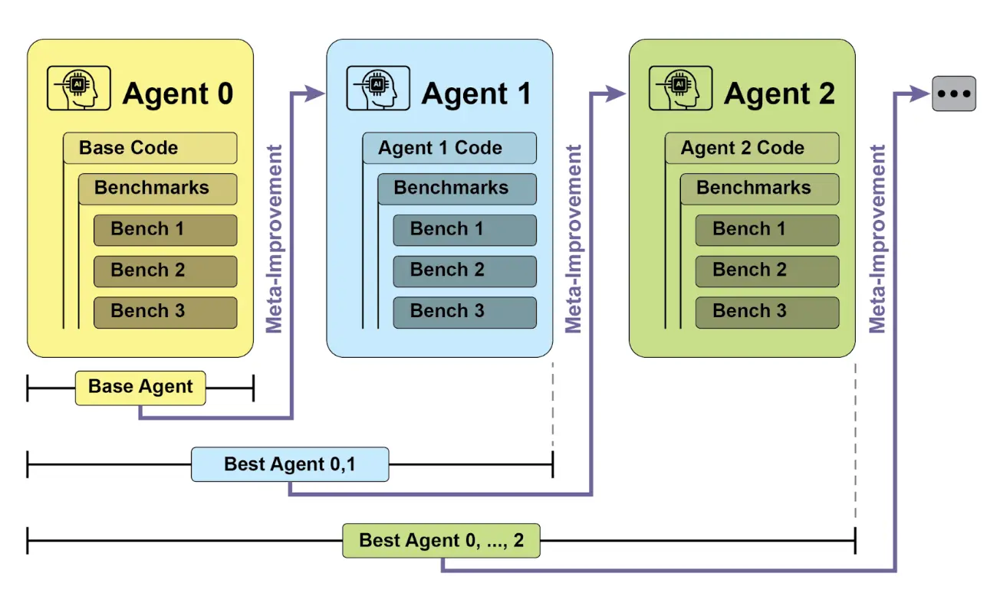
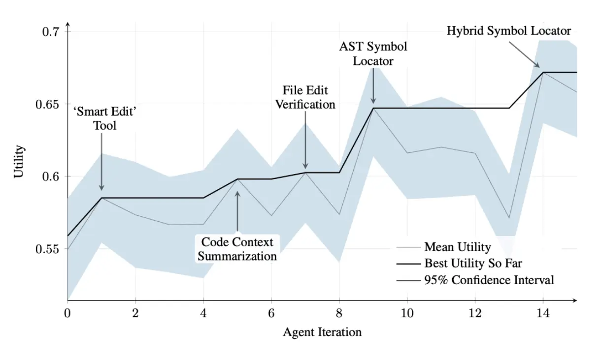
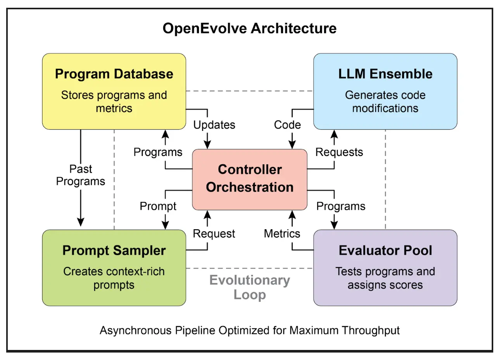

# <mark>第 9 章：学习与适应（Learning and Adaptation）</mark>


学习与适应是提升智能体能力的关键。这些过程使智能体能够突破预设参数，通过经验和环境交互自主改进。通过学习和适应，智能体能够有效应对新情况，并在无需持续人工干预的情况下优化自身表现。本章将详细探讨智能体学习与适应的原理与机制。

总览
--

智能体通过根据新经验和数据改变思维、行为或知识来实现学习与适应。这使智能体能够从简单执行指令，逐步变得更智能。

*   **强化学习（Reinforcement Learning）**：智能体尝试各种行为，对正向结果获得奖励，对负向结果受到惩罚，从而在变化环境中学习最优策略。适用于控制机器人或玩游戏的智能体。
*   **监督学习（Supervised Learning）**：智能体通过标注样本学习，将输入与期望输出关联，实现决策和模式识别。适合邮件分类或趋势预测等任务。
*   **无监督学习（Unsupervised Learning）**：智能体在无标签数据中发现隐藏关联和模式，有助于洞察、组织和构建环境认知地图。适用于无明确指导的数据探索。
*   **少样本/零样本学习与 LLM 智能体**：利用大语言模型（LLM）的智能体可通过极少样本或明确指令快速适应新任务，实现对新命令或场景的快速响应。
*   **在线学习（Online Learning）**：智能体持续用新数据更新知识，适用于实时反应和动态环境中的持续适应。对处理连续数据流的智能体至关重要。
*   **基于记忆的学习（Memory-Based Learning）**：智能体回忆过去经验，在类似场景下调整当前行为，提升上下文感知和决策能力。适合具备记忆回溯能力的智能体。

智能体通过改变策略、理解或目标来适应环境，这对处于不可预测、变化或新环境中的智能体尤为重要。

**PPO（Proximal Policy Optimization）** 是一种强化学习算法，常用于训练在连续动作空间（如机器人关节或游戏角色控制）中的智能体。其核心目标是稳定且可靠地提升智能体的决策策略（policy）。

PPO 的核心思想是对策略进行小幅、谨慎的更新，避免因剧烈变化导致性能崩溃。主要流程如下：

1.   数据收集：智能体用当前策略与环境交互，收集一批经验（状态、动作、奖励）。
2.   评估“智能体目标”：PPO 计算策略更新对期望奖励的影响，但采用特殊的“裁剪”目标函数。
3.   “裁剪”机制：这是 PPO 稳定性的关键。它为当前策略设定一个“信任区间”，防止策略更新过大。裁剪机制如同安全刹车，确保智能体不会因一次大步更新而丧失已学知识。

简而言之，PPO 在提升性能的同时保持策略稳定，避免训练过程中的灾难性失败，实现更稳健的学习。

**DPO（Direct Preference Optimization）** 是一种专为 LLM 与人类偏好对齐设计的新方法，相较于 PPO 更直接、简化。

理解 DPO 需先了解传统的 PPO 对齐流程：

*   PPO 方法（两步）：
    1.   奖励模型训练：收集人类反馈数据（如“响应 A 优于响应 B”），训练奖励模型预测人类评分。
    2.   用 PPO 微调 LLM：LLM 目标是生成能获得奖励模型高分的响应，奖励模型充当“裁判”。

这种两步流程较为复杂且不稳定，LLM 可能“钻空子”骗取高分但输出低质量响应。

*   DPO 方法（直接）：DPO 跳过奖励模型，直接用偏好数据更新 LLM 策略。
*   其数学机制直接将偏好数据与最优策略关联，教模型“提升生成偏好响应的概率，降低生成不受欢迎响应的概率”。

本质上，DPO 通过直接优化语言模型的人类偏好数据，简化了对齐流程，避免了奖励模型训练的复杂性和不稳定性，使对齐更高效、稳健。

实践应用与场景
-------

自适应智能体通过经验数据驱动的迭代更新，在多变环境中表现更优。

*   **个性化助手智能体** 通过长期分析用户行为，优化交互协议，实现高度定制化响应。
*   **交易机器人智能体** 根据实时高分辨率市场数据动态调整模型参数，优化决策算法，提升收益并降低风险。
*   **应用智能体** 根据用户行为动态调整界面和功能，提升用户参与度和系统易用性。
*   **机器人与自动驾驶智能体** 整合传感器数据和历史行为分析，提升导航与响应能力，实现安全高效运行。
*   **反欺诈智能体** 通过新识别的欺诈模式优化预测模型，提升安全性并减少损失。
*   **推荐系统智能体** 通过用户偏好学习算法提升内容推荐精准度，实现个性化和上下文相关推荐。
*   **游戏智能体** 动态调整策略算法，提升游戏复杂度和挑战性，增强玩家体验。
*   **知识库学习智能体**：智能体可利用 RAG（检索增强生成）维护动态知识库，存储成功策略和遇到的挑战，在决策时参考这些数据，提升适应新场景的能力（详见第十四章）。

案例分析：自我改进编码智能体（SICA）
--------------------

自我改进编码智能体（SICA），由 Maxime Robeyns、Laurence Aitchison 和 Martin Szummer 开发，展示了智能体自主修改自身源代码的能力。与传统“一个智能体训练另一个智能体”不同，SICA 既是修改者也是被修改者，通过迭代优化自身代码，在多种编程挑战中提升表现。

SICA 的自我改进流程如下（见图 1）：首先，SICA 回顾历史版本及其基准测试表现，选出得分最高的版本（综合成功率、时间和计算成本加权）。该版本进行新一轮自我修改，分析归档以发现改进点，并直接修改代码库。修改后的智能体再次进行基准测试，结果记录归档。此过程不断循环，实现基于历史表现的学习。该机制使 SICA 无需传统训练范式即可进化能力。



图 1：SICA 的自我改进流程，基于历史版本学习和适应

SICA 在自我改进过程中，代码编辑和导航能力显著提升。最初采用简单文件覆盖方式，随后开发了“智能编辑器”，实现更智能的上下文编辑。之后演化为“差异增强智能编辑器”，结合 diff 进行有针对性的修改和模式编辑，并开发了“快速覆盖工具”以降低处理负担。

SICA 进一步实现了“最小差异输出优化”和“上下文敏感差异最小化”，利用 AST（抽象语法树）解析提升效率，并增加了“智能编辑器输入归一化”。导航方面，SICA 独立开发了“AST 符号定位器”，利用代码结构定位定义，后续又开发了“混合符号定位器”，结合快速搜索和 AST 检查，并通过“混合符号定位器中的优化 AST 解析”聚焦相关代码段，提升搜索速度（见图 2）。



图 2：迭代过程中的性能变化，关键改进标注了对应工具或智能体修改（图片由 Maxime Robeyns、Martin Szummer、Laurence Aitchison 提供）

SICA 架构包括基础工具集（文件操作、命令执行、算术计算）、结果提交机制和专用子智能体（编码、问题求解、推理）。这些子智能体负责分解复杂任务，并管理 LLM 的上下文长度，尤其在长周期改进时。

异步监督者（另一个 LLM）负责监控 SICA 行为，识别循环或停滞等问题，并可干预终止执行。监督者接收 SICA 行动报告，包括调用图和消息、工具操作日志，以识别低效模式。

SICA 的 LLM 在上下文窗口（短期记忆）中结构化信息，包括系统提示（目标、工具和子智能体文档、系统指令）、核心提示（问题描述、打开文件内容、目录结构）、助手消息（推理步骤、工具和子智能体调用及结果、监督者通信）。这种结构提升信息流效率，减少处理时间和成本。最初，文件变更以 diff 记录，仅显示修改内容并定期合并。

**SICA 代码解析**：深入 SICA 实现可见其关键设计选择。系统采用模块化架构，包含编码、问题求解、推理等子智能体，由主智能体调用，类似工具调用，便于分解复杂任务并高效管理上下文长度，尤其在多轮元改进时。

该项目持续开发，旨在为后训练 LLM 工具使用和其他智能体任务提供强大框架，完整代码可在 [GitHub 仓库](https://github.com/MaximeRobeyns/self_improving_coding_agent/)获取和贡献。

安全方面，项目强调 Docker 容器化，智能体在专用容器内运行，实现与主机隔离，降低因智能体可执行 shell 命令而导致的文件系统风险。

系统还具备强大的可观测性，通过交互网页可视化事件总线和调用图，用户可全面了解智能体行为，检查事件、阅读监督者消息、折叠子智能体轨迹以便理解。

核心智能方面，框架支持多种 LLM 集成，便于不同模型实验以适应具体任务。异步监督者作为关键组件，与主智能体并行运行，定期评估行为偏差或停滞，可发送通知或终止执行。监督者接收系统状态文本表示，包括调用图和事件流（LLM 消息、工具调用及响应），可检测低效模式或重复工作。

初期 SICA 实现的一大挑战是让 LLM 智能体在每轮元改进中自主提出新颖、创新、可行且有趣的修改。这一限制，尤其是在促进 LLM 智能体开放式学习和真实创造力方面，仍是当前研究重点。

AlphaEvolve 与 OpenEvolve
------------------------

**AlphaEvolve** 是 Google 开发的智能体，专注于发现和优化算法。它结合了 LLM（Gemini Flash 和 Pro）、自动评估系统和进化算法框架，旨在推动理论数学和实际计算应用。

AlphaEvolve 采用 Gemini 模型集成，Flash 负责生成大量初始算法方案，Pro 进行深入分析和优化。算法方案通过自动评估系统按预设标准打分，反馈用于迭代优化，最终获得新颖且高效的算法。

在实际应用中，AlphaEvolve 已部署于 Google 基础设施，实现数据中心调度优化，全球算力资源使用降低 0.7%。还为硬件设计（如 TPU 的 Verilog 代码）提出优化建议，并加速 AI 性能，包括 Gemini 架构核心内核提速 23%，FlashAttention GPU 指令优化高达 32.5%。

在基础研究领域，AlphaEvolve 发现了新的矩阵乘法算法，如 4x4 复数矩阵仅用 48 次标量乘法，超越以往方案。在更广泛的数学研究中，AlphaEvolve 在 75% 的开放问题中重新发现了现有最优解，20% 的问题实现了突破，如“亲吻数问题”等。

**OpenEvolve** 是一种进化式编码智能体，利用 LLM（见图 3）迭代优化代码。其核心是 LLM 驱动的代码生成、评估和选择流程，持续提升程序在多任务下的表现。OpenEvolve 支持整个代码文件进化，不局限于单一函数，兼容多种编程语言和 OpenAI API，具备多目标优化、灵活提示工程和分布式评估能力，能高效处理复杂编程挑战。



图 3：OpenEvolve 内部架构由控制器管理，协调程序采样器、程序数据库、评估池和 LLM 集群，核心功能是促进学习与适应，提升代码质量。

以下代码片段演示如何用 OpenEvolve 库对程序进行进化优化。初始化时指定初始程序、评估文件和配置文件路径，`evolve.run(iterations=1000)` 启动进化过程，迭代 1000 次寻找最优程序，最后输出最佳程序的各项指标（保留四位小数）。

📄 OpenEvolve 进化示例

```Python

from openevolve import OpenEvolve

# 初始化系统
evolve = OpenEvolve(
    initial_program_path="path/to/initial_program.py",
    evaluation_file="path/to/evaluator.py",
    config_path="path/to/config.yaml"
)

# 运行进化过程
best_program = await evolve.run(iterations=1000)
print(f"最佳程序指标：")
for name, value in best_program.metrics.items():
    print(f"  {name}: {value:.4f}")
```

一图速览
----

**是什么**：智能体 常常处于动态且不可预测的环境，预设逻辑难以应对新情况。面对未预料的场景，智能体性能会下降。若无法从经验中学习，智能体无法优化策略或实现个性化，限制了其在复杂现实场景中的自主性和有效性。

**为什么**：标准解决方案是集成学习与适应机制，将静态智能体转变为动态进化系统。这样智能体可根据新数据和交互自主优化知识和行为。智能体系统可采用强化学习等多种方法，甚至如 SICA 通过自我修改实现进化。Google AlphaEvolve 等先进系统结合 LLM 和进化算法，发现全新高效解决方案。持续学习使智能体能掌握新任务、提升性能、适应变化，无需频繁人工重编程。

**经验法则**：当智能体需在动态、不确定或不断变化的环境中运行时，应采用此模式。适用于需要个性化、持续性能提升和自主应对新情况的应用。

**视觉总结**


图 4：学习与适应模式

关键要点
----

*   学习与适应让智能体通过经验不断提升能力，应对新情况。
*   “适应”是智能体因学习而表现出的行为或知识变化。
*   SICA 智能体通过自我修改代码实现自我改进，催生了智能编辑器和 AST 符号定位器等工具。
*   专用“子智能体”和“监督者”有助于自我改进系统分解大任务并保持进度。
*   LLM 的“上下文窗口”结构（系统提示、核心提示、助手消息）对智能体效率至关重要。
*   此模式适用于需在不断变化、不确定或需个性化环境中运行的智能体。
*   构建能学习的智能体通常需集成机器学习工具并管理数据流。
*   配备基础编码工具的智能体可自主编辑自身代码，从而提升基准任务表现。
*   AlphaEvolve 是 Google 的智能体，结合 LLM 和进化框架，实现算法自主发现与优化，推动基础研究和实际计算应用。

总结
--

本章探讨了学习与适应在人工智能中的关键作用。智能体通过持续数据获取和经验积累提升性能。SICA 智能体通过自主修改代码实现能力进化，成为典型案例。

我们回顾了智能体的基本组成，包括架构、应用、规划、多智能体协作、记忆管理以及学习与适应。学习原理对多智能体系统的协同提升尤为重要。为实现这一目标，调优数据需准确反映完整交互轨迹，捕捉每个智能体的输入与输出。

这些要素推动了如 Google AlphaEvolve 等重大进展。该 AI 系统通过 LLM、自动评估和进化方法自主发现和优化算法，推动科学研究和计算技术进步。多种模式可组合构建复杂 AI 系统。AlphaEvolve 等发展表明，智能体自主发现和优化算法已成为现实。

参考文献
----

*   Sutton, R. S., & Barto, A. G. (2018). _强化学习导论_. MIT 出版社。
*   Goodfellow, I., Bengio, Y., & Courville, A. (2016). _深度学习_. MIT 出版社。
*   Mitchell, T. M. (1997). _机器学习_. McGraw-Hill.
*   Schulman, J., Wolski, F., Dhariwal, P., Radford, A., & Klimov, O. (2017). “Proximal Policy Optimization Algorithms.” arXiv: [1707.06347](https://arxiv.org/abs/1707.06347).
*   Robeyns, M., Aitchison, L., & Szummer, M. (2025). “A Self-Improving Coding Agent.” arXiv: [2504.15228](https://arxiv.org/pdf/2504.15228). [GitHub - MaximeRobeyns/self_improving_coding_agent](https://github.com/MaximeRobeyns/self_improving_coding_agent)
*   AlphaEvolve 博客： [deepmind.google/discover/blog/alphaevolve-a-gemini-powered-coding-agent-for-designing-advanced-algorithms](https://deepmind.google/discover/blog/alphaevolve-a-gemini-powered-coding-agent-for-designing-advanced-algorithms/)
*   OpenEvolve: [GitHub - codelion/openevolve](https://github.com/codelion/openevolve)
