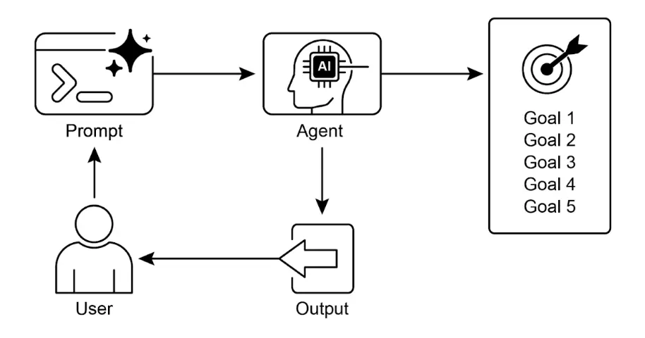

# <mark>第 11 章：目标设定与监控（Goal Setting and Monitoring）</mark>

要让智能体真正高效且有目标地工作，仅仅具备信息处理或工具使用能力是不够的；它们还需要明确的方向感，以及判断自己是否取得成功的方法。这正是目标设定与监控模式的核心：为智能体设定具体目标，并赋予其追踪进度、判断目标是否达成的能力。

目标设定与监控模式概述
-----------

想象一下你在规划一次旅行。你不会凭空出现在目的地，而是先确定想去哪里（目标状态），了解自己的出发点（初始状态），考虑可选方案（交通方式、路线、预算），然后制定一系列步骤：订票、收拾行李、前往机场/车站、登机/乘车、抵达、寻找住宿等。这个逐步推进的过程，往往还要考虑依赖关系和约束条件，本质上就是智能体系统中的“规划”。

在智能体的语境下，规划通常指智能体根据高层目标，自动或半自动地生成一系列中间步骤或子目标。这些步骤可以顺序执行，也可能涉及更复杂的流程，甚至结合工具使用、路由或多智能体协作等其他模式。规划机制可能采用高级搜索算法、逻辑推理，或越来越多地利用大语言模型（LLM）根据训练数据和任务理解生成合理有效的计划。

优秀的规划能力让智能体能够应对非简单、非单步的问题，处理多方面请求，适应变化（如重新规划），并编排复杂工作流。它是许多高级智能体行为的基础，将简单的响应式系统转变为能够主动达成目标的系统。

实践应用与场景
-------

目标设定与监控模式对于构建能够自主可靠运行于复杂现实场景的智能体至关重要。常见应用包括：

*   **客户支持自动化**：智能体的目标是“解决客户的账单问题”，它监控对话、查询数据库、使用工具调整账单，通过确认账单变更和客户反馈来判断是否成功，未解决则自动升级处理。
*   **个性化学习系统**：学习智能体的目标是“提升学生对代数的理解”，它监控学生练习进度，调整教学内容，跟踪准确率和完成时间等指标，学生遇到困难时自动调整策略。
*   **项目管理助手**：智能体被赋予“确保项目里程碑 X 在 Y 日期前完成”的目标，监控任务状态、团队沟通和资源情况，发现延误时主动预警并建议纠正措施。
*   **自动化交易机器人**：交易智能体的目标是“在风险容忍范围内最大化投资组合收益”，持续监控市场数据、当前投资组合和风险指标，条件满足时自动交易，风险超标时调整策略。
*   **机器人与自动驾驶**：自动驾驶车辆的主要目标是“安全地将乘客从 A 地送到 B 地”，实时监控环境（其他车辆、行人、信号灯）、自身状态（速度、油量）、路线进度，动态调整驾驶行为以安全高效达成目标。
*   **内容审核**：智能体的目标是“识别并移除平台 X 上的有害内容”，监控新内容，应用分类模型，跟踪误判率，自动调整过滤标准或将疑难案例升级给人工审核。

该模式为需要可靠达成特定结果、适应动态环境的智能体提供了智能自我管理的基础框架。

实战代码示例
------

下面以 LangChain 和 OpenAI API 为例，展示一个目标设定与监控模式的 Python 脚本。该智能体可自主生成并优化 Python 代码，核心功能是针对指定问题反复迭代生成、评估和完善代码，直到满足用户设定的质量标准。

它采用“目标设定与监控”模式，不是一次性生成代码，而是进入循环：生成、评估、改进。智能体通过 AI 判断代码是否达成初始目标，最终输出经过多轮优化、带注释且可直接使用的 Python 文件。

**依赖安装**：

```
pip install langchain_openai openai python-dotenv
.env #文件需包含 OPENAI_API_KEY
```

你可以将该脚本理解为一个被分配项目任务的 AI 程序员（见下图 Fig. 1）。流程从你提供详细项目说明（即具体编程问题）开始。

📄 目标设定与监控示例

```Python

# MIT License
# Copyright (c) 2025 Mahtab Syed
# https://www.linkedin.com/in/mahtabsyed/

"""
实战代码示例 - 迭代 2
- 以 LangChain 和 OpenAI API 展示目标设定与监控模式：

目标：构建一个 AI 智能体，能根据指定目标为用例编写代码：
- 接收编程问题（用例）作为输入。
- 接收目标列表（如“简单”、“已测试”、“处理边界情况”）作为输入。
- 使用 LLM（如 GPT-4o）生成并优化 Python 代码，直到目标达成（最多 5 次迭代，可自定义）。
- 判断目标是否达成时，LLM 仅返回 True 或 False，便于停止迭代。
- 最终将代码保存为 .py 文件，文件名简洁，带头部注释。
"""

import os
import random
import re
from pathlib import Path
from langchain_openai import ChatOpenAI
from dotenv import load_dotenv, find_dotenv

# 🔐 Load environment variables
_ = load_dotenv(find_dotenv())
OPENAI_API_KEY = os.getenv("OPENAI_API_KEY")
if not OPENAI_API_KEY:
   raise EnvironmentError("❌ Please set the OPENAI_API_KEY environment variable.")

# ✅ Initialize OpenAI model
print("📡 Initializing OpenAI LLM (gpt-4o)...")
llm = ChatOpenAI(
   model="gpt-4o", # If you dont have access to got-4o use other OpenAI LLMs
   temperature=0.3,
   openai_api_key=OPENAI_API_KEY,
)

# --- Utility Functions ---

def generate_prompt(
   use_case: str, goals: list[str], previous_code: str = "", feedback: str = ""
) -> str:
   print("📝 Constructing prompt for code generation...")
   base_prompt = f"""
You are an AI coding agent. Your job is to write Python code based on the following use case:

Use Case: {use_case}

Your goals are:
{chr(10).join(f"- {g.strip()}" for g in goals)}
"""
   if previous_code:
       print("🔄 Adding previous code to the prompt for refinement.")
       base_prompt += f"\nPreviously generated code:\n{previous_code}"
   if feedback:
       print("📋 Including feedback for revision.")
       base_prompt += f"\nFeedback on previous version:\n{feedback}\n"

   base_prompt += "\nPlease return only the revised Python code. Do not include comments or explanations outside the code."
   return base_prompt

def get_code_feedback(code: str, goals: list[str]) -> str:
   print("🔍 Evaluating code against the goals...")
   feedback_prompt = f"""
You are a Python code reviewer. A code snippet is shown below. Based on the following goals:

{chr(10).join(f"- {g.strip()}" for g in goals)}

Please critique this code and identify if the goals are met. Mention if improvements are needed for clarity, simplicity, correctness, edge case handling, or test coverage.

Code:
{code}
"""
   return llm.invoke(feedback_prompt)

def goals_met(feedback_text: str, goals: list[str]) -> bool:
   """
   Uses the LLM to evaluate whether the goals have been met based on the feedback text.
   Returns True or False (parsed from LLM output).
   """
   review_prompt = f"""
You are an AI reviewer.

Here are the goals:
{chr(10).join(f"- {g.strip()}" for g in goals)}

Here is the feedback on the code:
\"\"\"
{feedback_text}
\"\"\"

Based on the feedback above, have the goals been met?

Respond with only one word: True or False.
"""
   response = llm.invoke(review_prompt).content.strip().lower()
   return response == "true"

def clean_code_block(code: str) -> str:
   lines = code.strip().splitlines()
   if lines and lines[0].strip().startswith("```"):
       lines = lines[1:]
   if lines and lines[-1].strip() == "```":
       lines = lines[:-1]
   return "\n".join(lines).strip()

def add_comment_header(code: str, use_case: str) -> str:
   comment = f"# This Python program implements the following use case:\n# {use_case.strip()}\n"
   return comment + "\n" + code

def to_snake_case(text: str) -> str:
   text = re.sub(r"[^a-zA-Z0-9 ]", "", text)
   return re.sub(r"\s+", "_", text.strip().lower())

def save_code_to_file(code: str, use_case: str) -> str:
   print("💾 Saving final code to file...")

   summary_prompt = (
       f"Summarize the following use case into a single lowercase word or phrase, "
       f"no more than 10 characters, suitable for a Python filename:\n\n{use_case}"
   )
   raw_summary = llm.invoke(summary_prompt).content.strip()
   short_name = re.sub(r"[^a-zA-Z0-9_]", "", raw_summary.replace(" ", "_").lower())[:10]

   random_suffix = str(random.randint(1000, 9999))
   filename = f"{short_name}_{random_suffix}.py"
   filepath = Path.cwd() / filename

   with open(filepath, "w") as f:
       f.write(code)

   print(f"✅ Code saved to: {filepath}")
   return str(filepath)

# --- Main Agent Function ---

def run_code_agent(use_case: str, goals_input: str, max_iterations: int = 5) -> str:
   goals = [g.strip() for g in goals_input.split(",")]

   print(f"\n🎯 Use Case: {use_case}")
   print("🎯 Goals:")
   for g in goals:
       print(f"  - {g}")

   previous_code = ""
   feedback = ""

   for i in range(max_iterations):
       print(f"\n=== 🔁 Iteration {i + 1} of {max_iterations} ===")
       prompt = generate_prompt(use_case, goals, previous_code, feedback if isinstance(feedback, str) else feedback.content)

       print("🚧 Generating code...")
       code_response = llm.invoke(prompt)
       raw_code = code_response.content.strip()
       code = clean_code_block(raw_code)
       print("\n🧾 Generated Code:\n" + "-" * 50 + f"\n{code}\n" + "-" * 50)

       print("\n📤 Submitting code for feedback review...")
       feedback = get_code_feedback(code, goals)
       feedback_text = feedback.content.strip()
       print("\n📥 Feedback Received:\n" + "-" * 50 + f"\n{feedback_text}\n" + "-" * 50)

       if goals_met(feedback_text, goals):
           print("✅ LLM confirms goals are met. Stopping iteration.")
           break

       print("🛠️ Goals not fully met. Preparing for next iteration...")
       previous_code = code

   final_code = add_comment_header(code, use_case)
   return save_code_to_file(final_code, use_case)

# --- CLI Test Run ---

if __name__ == "__main__":
   print("\n🧠 Welcome to the AI Code Generation Agent")

   # Example 1
   use_case_input = "Write code to find BinaryGap of a given positive integer"
   goals_input = "Code simple to understand, Functionally correct, Handles comprehensive edge cases, Takes positive integer input only, prints the results with few examples"
   run_code_agent(use_case_input, goals_input)

   # Example 2
   # use_case_input = "Write code to count the number of files in current directory and all its nested sub directories, and print the total count"
   # goals_input = (
   #     "Code simple to understand, Functionally correct, Handles comprehensive edge cases, Ignore recommendations for performance, Ignore recommendations for test suite use like unittest or pytest"
   # )
   # run_code_agent(use_case_input, goals_input)

   # Example 3
   # use_case_input = "Write code which takes a command line input of a word doc or docx file and opens it and counts the number of words, and characters in it and prints all"
   # goals_input = "Code simple to understand, Functionally correct, Handles edge cases"
   # run_code_agent(use_case_input, goals_input)
```

你会同时提供一份严格的质量检查表，作为最终代码必须满足的目标，例如“解决方案必须简单”、“功能正确”、“能处理异常边界情况”等。


图 1：目标设定与监控示例

AI 程序员拿到任务后，先生成代码初稿，但不会立即提交，而是先进行自我评审。它会将自己的代码与质量检查表逐项对比，像 QA 检查员一样自查。评审后，智能体会给出简单结论：“True”表示全部达标，“False”则说明尚未达标。

如果结果为“False”，AI 会进入修正阶段，利用自我评审的反馈定位问题并智能重写代码。这个循环会持续进行，每次迭代都更接近目标，直到最终获得“True”或达到最大迭代次数，类似开发者在截止日期前不断完善代码。最终，脚本会将通过所有检查的代码加注释并保存为新 Python 文件，方便直接使用。

**注意事项**：本示例仅为说明原理，并非生产级代码。实际应用中需考虑更多因素。LLM 可能无法完全理解目标含义，或错误判断已达成目标。即使目标明确，模型也可能出现“幻觉”。当同一个 LLM 既负责写代码又负责评审时，发现自身偏离目标的能力有限。

LLM 并不会凭空生成完美代码，最终仍需人工运行和测试。此外，示例中的“监控”较为基础，存在无限循环风险。

```
请作为一名专业代码评审员，致力于编写简洁、正确、易读的代码。你的核心任务是消除代码“幻觉”，确保每条建议都符合实际和最佳实践。
当我提供代码片段时，请：

-- 识别并纠正错误：指出任何逻辑缺陷、bug 或潜在运行错误。

-- 简化与重构：提出让代码更易读、高效、可维护的修改建议，前提是保证正确性。

-- 清晰解释：每条建议都要说明改进原因，参考代码规范、性能或安全原则。

-- 提供修正版代码：展示修改前后的对比，让改进一目了然。

你的反馈应直接、建设性，始终以提升代码质量为目标。
```

更健壮的做法是将不同职责分配给多个智能体。例如，我用 Gemini 构建了一个多智能体团队，每个成员有专属角色：

*   编程助手：协助编写和头脑风暴代码。
*   代码评审员：发现错误并提出改进建议。
*   文档员：生成清晰简明的文档。
*   测试编写员：编写全面的单元测试。
*   提示优化师：优化与 AI 的交互提示。

在这种多智能体系统中，代码评审员与编程助手分离，评审更客观，测试编写员则能补足自动化测试需求。

更复杂的控制和生产级代码实现，留给有兴趣的读者进一步探索。

一图速览
----

**是什么**：智能体常常缺乏明确方向，导致只能被动响应任务，无法独立解决复杂多步问题或编排高级工作流。没有目标就无法判断自身行为是否有效，限制了自主性和实际效能，尤其在动态现实场景下仅靠任务执行远远不够。

**为什么**：目标设定与监控模式通过为智能体嵌入“目标感”和自我评估机制，提供标准化解决方案。它要求明确、可衡量的目标，并建立持续监控机制，实时追踪智能体及环境状态，形成关键反馈回路，使智能体能自我评估、纠偏和适应。开发者可借此将简单响应式智能体升级为主动、可靠的自主系统。

**经验法则**：当智能体需要自主执行多步任务、适应动态环境、并可靠达成高层目标且无需持续人工干预时，应采用此模式。

**视觉总结**：



图 2：目标设计模式

关键要点
----

主要要点包括：

*   目标设定与监控赋予智能体目标感和进度追踪机制。
*   目标应具体、可衡量、可达成、相关且有时限（SMART）。
*   明确指标和成功标准是有效监控的关键。
*   监控包括观察智能体行为、环境状态和工具输出。
*   监控反馈回路让智能体能自适应、修正计划或升级问题。
*   在 Google 的 ADK 中，目标通常通过智能体指令传递，监控则通过状态管理和工具交互实现。

总结
--

本章聚焦于目标设定与监控这一关键范式，阐述了其如何将智能体从被动响应系统转变为主动、目标驱动的实体。强调了明确、可衡量目标和严格监控流程的重要性，并通过实际应用展示了该范式在客户服务、机器人等领域支持可靠自主运行的能力。代码示例则展示了如何在结构化框架下实现这些原则，通过智能体指令和状态管理引导和评估目标达成。为智能体赋予制定和监督目标的能力，是迈向真正智能、可问责 AI 系统的基础。

参考文献
----

*   [SMART 目标框架 - wikipedia.org](https://en.wikipedia.org/wiki/SMART_criteria)