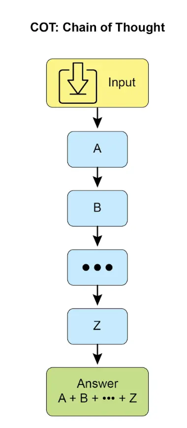
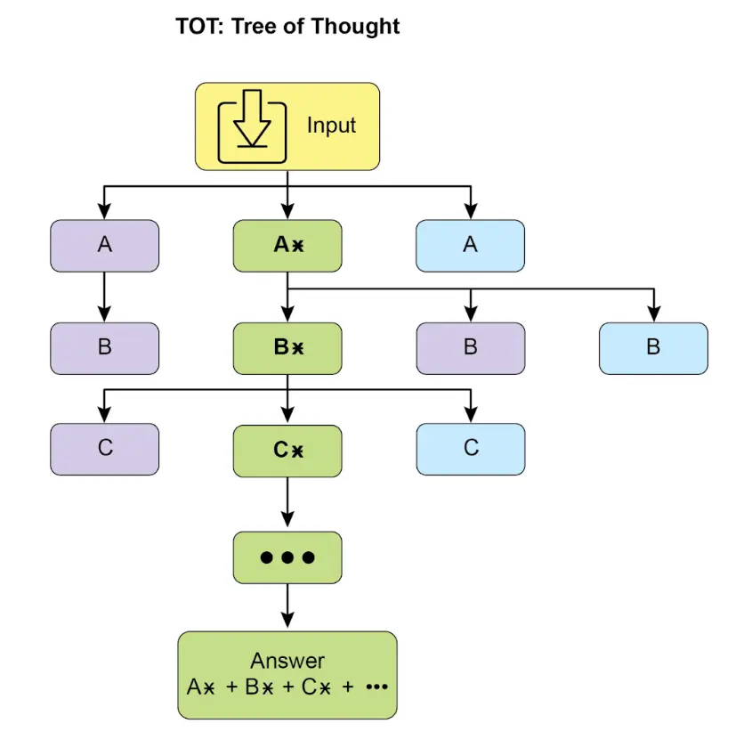
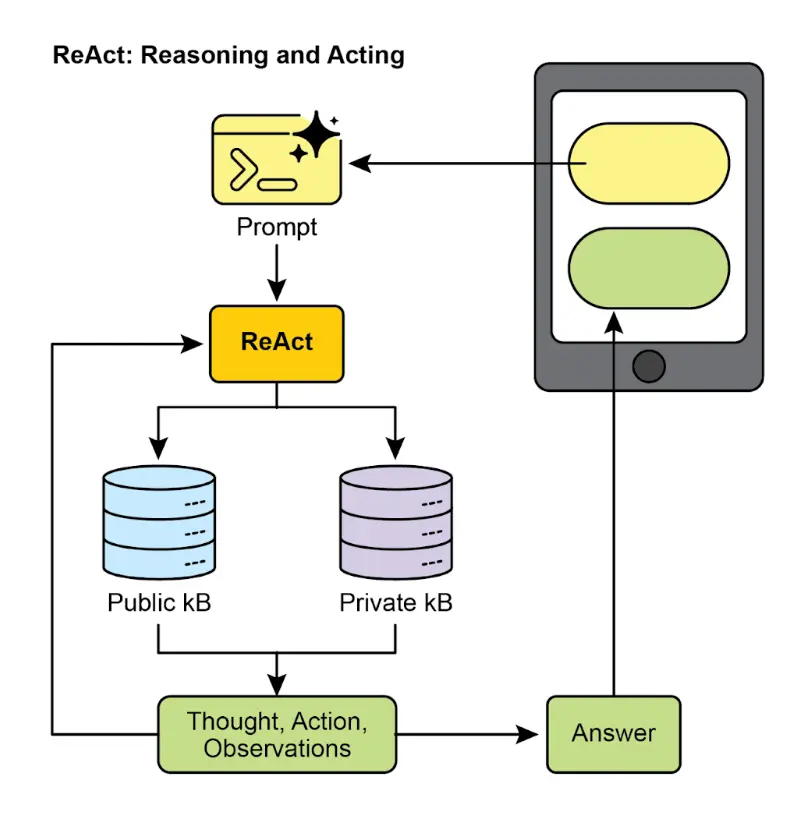
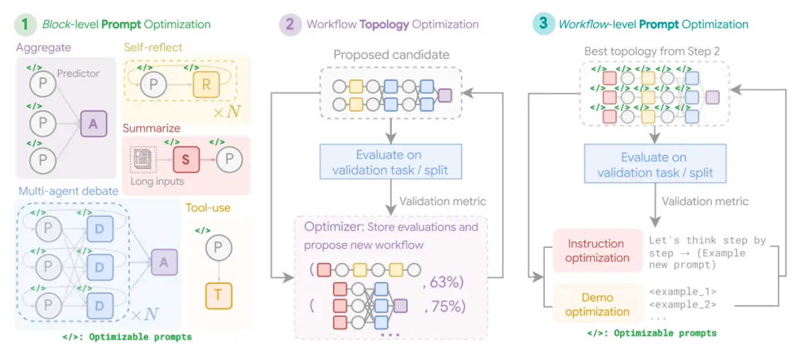
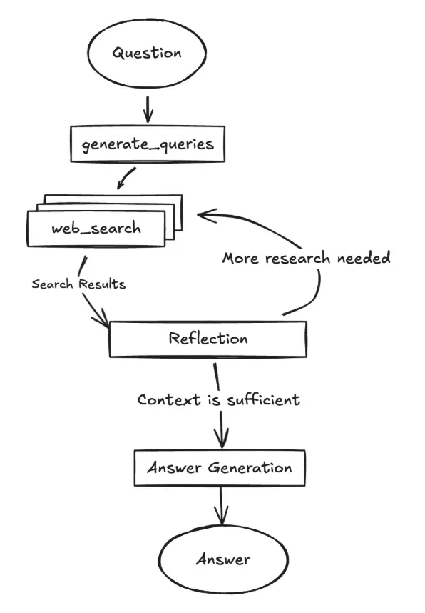
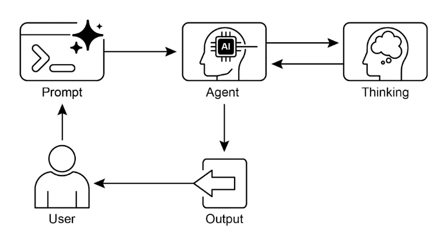

# <mark>第 17 章：推理技术（Reasoning Techniques）</mark>

本章深入探讨智能体的高级推理方法，重点关注多步逻辑推理和问题分解。这些技术不仅仅是简单的顺序操作，而是让智能体的内部推理过程变得显式化，使其能够拆解问题、考虑中间步骤，并得出更稳健、准确的结论。一个核心原则是，在推理阶段分配更多的计算资源，即允许智能体或底层大模型拥有更多的处理时间或步骤来分析问题并生成响应。智能体可以进行迭代优化、探索多种解决路径，或调用外部工具。推理时增加计算资源，尤其在需要深入分析和思考的复杂问题上，能显著提升准确性、连贯性和健壮性。

实践应用与场景
-------

实际应用包括：

*   **复杂问答**：解决多跳问题，需要整合多源数据并进行逻辑推理，可能涉及多条推理路径，延长推理时间有助于信息综合。
*   **数学问题求解**：将数学问题拆分为更小的可解部分，展示逐步过程，并通过代码执行实现精确计算，延长推理时间可生成更复杂的代码并验证结果。
*   **代码调试与生成**：智能体解释生成或修正代码的理由，逐步定位问题，并根据测试结果迭代优化（自我纠错），延长推理时间有助于更彻底的调试。
*   **战略规划**：通过推理权衡多种方案、后果和前提条件，并根据实时反馈调整计划（ReAct），延长思考可提升方案的有效性和可靠性。
*   **医学诊断**：系统评估症状、检测结果和病史，分阶段阐述推理过程，可能调用外部工具获取数据（ReAct），增加推理时间有助于更全面的鉴别诊断。
*   **法律分析**：分析法律文件和判例，形成论点或建议，详细说明逻辑步骤，并通过自我纠错确保一致性，延长推理时间有助于更深入的法律研究和论证。

推理技术
----

首先介绍提升 AI 模型问题解决能力的核心推理技术。

**链式思维（Chain-of-Thought, CoT）** 提示显著增强了大模型的复杂推理能力，通过模拟逐步思考过程（见图 1）。CoT 提示引导模型生成一系列中间推理步骤，而不是直接给出答案。这种显式分解让模型能将复杂问题拆解为更易处理的子问题，显著提升多步推理任务的表现，如算术、常识推理和符号操作。CoT 的优势在于将难题转化为一系列简单步骤，提高推理透明度，有助于调试和理解。实现方式包括提供 few-shot 示例或直接指令“逐步思考”。CoT 已成为现代大模型高级推理的基石，尤其适用于自主智能体，使其在复杂环境下执行更可靠、可审计的操作。



图 1：CoT 提示及智能体生成的详细逐步响应

示例：首先通过指令定义 AI 的角色和五步流程，随后展示 CoT 的实际过程，包括“智能体思考过程”（内部链式思维）和“最终答案”。

```
你是一名信息检索智能体，目标是通过逐步思考全面准确地回答用户问题。

流程如下：

1. **分析问题**：理解核心主题和具体需求，识别关键实体、关键词和信息类型。
2. **制定检索查询**：根据分析生成精准的检索查询，用于知识库或外部工具。
3. **模拟信息检索（自我纠错/推理）**：对每个查询，思考可能获得的信息，预判关键内容，识别歧义或缺失。
4. **信息综合**：基于检索和原始问题，整合信息形成完整答案，确保覆盖所有要点。
5. **审查与优化**：最终前，批判性评估答案，检查准确性、全面性、易读性和简洁性，必要时改进。

**用户问题**：“简述经典计算机与量子计算机的主要区别，并简要描述量子计算的一个应用。”

**智能体思考过程（内部 CoT 输出）**：

**思考 1（分析问题）**：用户需了解两点：1. 经典与量子计算机主要区别；2. 一个量子计算应用。关键词：经典计算机、量子计算机、区别、应用。

**思考 2（制定检索查询）**：
- “经典与量子计算机区别”
- “量子计算机工作原理”
- “经典计算机工作原理”
- “量子计算应用”

**思考 3（模拟检索与关键概念）**：
- 区别：比特 vs. 量子比特，叠加、纠缠、概率性、特定问题计算能力。
- 工作原理：经典用晶体管/二进制，量子用量子力学。
- 应用：药物研发、材料科学、密码学、优化。

**思考 4（信息综合）**：
经典计算机用比特（0 或 1），信息处理为顺序。量子计算机用量子比特，可同时为 0 和 1（叠加），可纠缠，计算方式完全不同。能高效解决如大数分解、分子模拟等问题。应用如药物研发，可精确模拟分子，加速新药开发。

**思考 5（审查与优化）**：
- 区别已覆盖（比特/量子比特、叠加、纠缠、处理方式）。
- 应用已给出（药物研发）。
- 简洁、清晰，符合要求。

**智能体最终答案**：

经典计算机用比特（0 或 1）顺序处理信息，量子计算机用量子比特，可同时处于多种状态（叠加），并可纠缠，实现指数级复杂计算。量子计算可高效解决如分子结构模拟、复杂加密破解等问题。药物研发是其重要应用，可精确模拟分子行为，推动新药开发。
```

**树式思维（Tree-of-Thought, ToT）** 在链式思维基础上扩展，允许模型探索多条推理路径，形成树状结构（见图 2）。模型可回溯、自我纠错、探索多种方案，最终选择最佳答案。此迭代过程提升模型处理复杂任务（如战略规划、决策）的能力。



图 2：树式思维示例

**自我纠错**（Self-correction）是智能体推理过程中的关键环节，尤其在链式思维中。智能体对生成内容和中间思考进行自我评估，发现歧义、信息缺失或错误，并迭代优化，确保最终输出准确、完整。此机制显著提升内容质量和可靠性，详见第 4 章示例。

示例：自我纠错智能体通过五步流程，批判性审查初稿，识别弱点并提出具体改进建议，最终生成优化后的内容。

```
你是一名高度批判且注重细节的自我纠错智能体，任务是审查已生成内容，找出改进点，使其更准确、全面、吸引人且符合要求。

自我纠错流程：

1. **理解原始需求**：回顾初始提示/要求，明确意图和约束。
2. **分析当前内容**：仔细阅读待纠正内容。
3. **识别差距/弱点**：对照原始需求，查找准确性、完整性、清晰度、风格、吸引力、冗余等问题。
4. **提出具体改进**：针对每个弱点，给出可操作的建议。
5. **生成修订内容**：根据建议重写内容，确保最终版本完善可用。

**原始需求**：“写一条简短、吸引人的社交媒体文案（不超过 150 字符），宣布新环保产品线‘GreenTech Gadgets’。”

**初稿**：

“我们有新产品。它们很环保也很科技。快来买 GreenTech Gadgets！”

**自我纠错智能体思考过程**：

**思考 1（理解需求）**：简短吸引人，150 字符内，宣布“GreenTech Gadgets”新品环保产品线。

**思考 2（分析内容）**：64 字符，内容平淡。

**思考 3（识别弱点）**：
- 吸引力不足，表达普通。
- 环保未突出。
- 号召性一般。
- 动词和表达需加强。
- 缺乏新品发布的兴奋感。

**思考 4（提出改进）**：
- 更有活力和吸引力。
- 强调环保和创新。
- 用更强动词和主动语态。
- 明确号召行动。
- 保持 150 字符内。

**思考 5（生成修订内容）**：
原文：“我们有新产品。它们很环保也很科技。快来买 GreenTech Gadgets！”
修订 1：“🌱发现 GreenTech Gadgets！全新环保产品线，创新与可持续并存。绿色智能，立即选购！#EcoFriendly #GreenTech”（148 字符）

**最终修订内容**：

🌱发现 GreenTech Gadgets！全新环保产品线，创新与可持续并存。绿色智能，立即选购！#EcoFriendly #GreenTech
```

该技术将质量控制直接嵌入内容生成流程，使智能体输出更精确、优质，更好满足复杂需求。

**程序辅助语言模型（PALMs）** 将大模型与符号推理结合，允许模型生成并执行代码（如 Python），将复杂计算、逻辑操作和数据处理交由确定性编程环境完成。模型可生成代码、执行并将结果转化为自然语言，结合理解与精确计算，提升复杂问题的可靠性和准确性。示例为 Google ADK 工具集中的代码生成与执行。

📄 Google ADK 工具集代码生成与执行示例

```Python

from google.adk.tools import agent_tool
from google.adk.agents import Agent
from google.adk.tools import google_search
from google.adk.code_executors import BuiltInCodeExecutor

search_agent = Agent(
    model='gemini-2.0-flash',
    name='SearchAgent',
    instruction="""
    你是 Google 搜索专家
    """,
    tools=[google_search],
)

coding_agent = Agent(
    model='gemini-2.0-flash',
    name='CodeAgent',
    instruction="""
    你是代码执行专家
    """,
    code_executor=[BuiltInCodeExecutor],
)

root_agent = Agent(
    name="RootAgent",
    model="gemini-2.0-flash",
    description="Root Agent",
    tools=[agent_tool.AgentTool(agent=search_agent), agent_tool.AgentTool(agent=coding_agent)],
)
```

**可验证奖励强化学习（RLVR）**：传统链式思维（CoT）仅生成单一推理路径，难以适应复杂问题。新型“推理模型”通过推理前分配可变“思考时间”，生成更长、更动态的推理链，支持自我纠错和回溯。关键创新是“可验证奖励强化学习”训练策略，模型在有标准答案的问题上（如数学、代码）通过试错学习生成有效的长推理链，无需人工监督。最终，模型不仅给出答案，还生成“推理轨迹”，展现规划、监控和评估能力。这是自主智能体发展的基础。

**ReAct**（推理与行动，见图 3，KB 为知识库）将链式思维与智能体工具交互结合。智能体不仅推理，还能执行工具调用，如数据库查询、计算或 API 交互。ReAct 采用“思考 - 行动 - 观察 - 思考…”循环，智能体根据反馈动态调整计划，纠错并实现目标。相比线性 CoT，ReAct 更灵活、健壮，适合需要多次环境交互的复杂任务。此方法让智能体不仅能推理，还能实际执行步骤并与动态环境互动。



图 3：推理与行动

**CoD（辩论链）** 是微软提出的 AI 框架，多个模型协作辩论解决问题，超越单一 AI 的链式思维。类似“AI 圆桌会议”，不同模型提出观点、互相批评、交换反驳意见。目标是提升准确性、减少偏见、提高答案质量，形成透明可信的推理记录。代表从单一智能体到多智能体协作的转变。

**GoD（辩论图）** 是更高级的智能体框架，将讨论建模为动态非线性网络。每个论点为节点，边表示“支持”或“反驳”等关系，反映真实辩论的多线程特性。新问题可动态分支、独立发展甚至合并。结论不是序列终点，而是找到最有力、最可验证的论点集。“可验证”包括公认事实、搜索验证和多模型共识，确保信息基础更稳健可靠。此方法为复杂协作推理提供更全面的模型。

**MASS（多智能体系统搜索，进阶话题）**：多智能体系统设计的有效性取决于单体智能体的提示质量和交互拓扑。MASS 框架通过多阶段优化，自动探索和优化 MAS 设计空间。

MASS 包含三步：

**1. 块级提示优化**：先优化各智能体模块的提示，确保单体性能优异。例如，针对 HotpotQA，Debator 智能体被设定为“权威事实核查员”，专注于信息综合和错误识别。

**2. 工作流拓扑优化**：在优化单体后，MASS 通过影响加权方法高效搜索最佳智能体交互结构。例如，MBPP 编码任务发现迭代自我纠错与外部验证结合的混合结构最优。



图 4：（作者供图）MASS 框架三阶段优化流程，先独立优化模块提示，再优化系统拓扑，最后整体优化全局提示。

**3. 工作流级提示优化**：最终对整个系统的提示进行全局优化，确保协同和依赖关系最优。例如，针对 DROP 数据集，最终优化后的 Predictor 智能体提示融合了数据集摘要、few-shot 示例和高风险场景设定，最大化准确性。

关键原则：

*   先优化单体提示再组合系统。
*   优先探索有影响力的拓扑结构。
*   通过全局优化建模智能体间依赖。

推理扩展定律
------

该定律描述了 LLM 性能与推理阶段分配计算资源的关系。与训练扩展定律不同，推理扩展定律关注模型生成答案时的动态权衡。核心观点是：通过推理阶段增加计算资源（如生成多个候选答案并筛选），小模型也能获得优异结果。此策略不一定依赖更强硬件，而是采用更复杂的推理算法，如多样性搜索或自洽方法。这样的小模型在“思考预算”充足时，甚至可超越简单推理的大模型。

推理扩展定律为智能体系统的高效、经济部署提供理论依据。它挑战“模型越大越好”的直觉，强调合理分配推理资源可优化性能、响应延迟和运维成本。开发者可据此做出更精细的资源分配和性能优化决策，实现更经济高效的 AI 部署。

实践代码示例
------

Google 开源的 DeepSearch 代码（`gemini-fullstack-langgraph-quickstart` 仓库，见图 6）为开发者提供了基于 Gemini 2.5 和 LangGraph 的全栈智能体模板。支持本地 LLM（如 Gemma），采用 Docker 和模块化项目结构，便于快速原型开发。该项目为演示用途，非生产后端。



图 5：（作者供图）DeepSearch 多次反思步骤示例

项目包含 React 前端和 LangGraph 后端，支持高级研究与对话 AI。LangGraph 智能体用 Gemini 生成搜索查询，结合 Google Search API 进行 Web 检索，采用反思推理识别知识空缺并迭代优化答案。前后端支持热重载，结构分为 `frontend/` 和 `backend/`。需配置 Gemini API Key，安装 Node.js、npm、Python 3.8+。后端智能体定义于 `backend/src/agent/graph.py`，流程包括生成查询、Web 检索、反思、最终答案。生产部署需 Redis 和 Postgres，Docker 支持一键启动。技术栈包括 React、Vite、Tailwind CSS、Shadcn UI、LangGraph、Google Gemini，遵循 Apache 2.0 许可。

📄 DeepSearch 与 LangGraph 示例

```Python

# 创建 Agent 图
from langgraph.graph import StateGraph, START, END

builder = StateGraph(OverallState, config_schema=Configuration)

# 定义节点
builder.add_node("generate_query", generate_query)
builder.add_node("web_research", web_research)
builder.add_node("reflection", reflection)
builder.add_node("finalize_answer", finalize_answer)

# 设置入口节点
builder.add_edge(START, "generate_query")

# 并行分支继续搜索
builder.add_conditional_edges(
    "generate_query", continue_to_web_research, ["web_research"]
)

# Web 检索后反思
builder.add_edge("web_research", "reflection")

# 反思后条件分支
builder.add_conditional_edges(
    "reflection", evaluate_research, ["web_research", "finalize_answer"]
)

# 最终答案
builder.add_edge("finalize_answer", END)

graph = builder.compile(name="pro-search-agent")
```

智能体如何“思考”？
----------

总结来说，智能体的思考过程是一种结构化方法，结合推理与行动解决问题。智能体通过 LLM 生成一系列“思考”，指导后续行动。典型流程为：

1.   **思考**：生成文本思考，分解问题、制定计划或分析现状，使推理过程透明可控。
2.   **行动**：根据思考，从预定义动作集中选择行动，如在线搜索、信息检索或给出最终答案。
3.   **观察**：根据行动获得环境反馈，如搜索结果或网页内容。

此循环不断重复，直到智能体认为已获得最终解决方案并执行“结束”动作。

该方法依赖 LLM 的高级推理与规划能力。ReAct 框架常用 few-shot 学习，向 LLM 提供人类问题解决示例，指导智能体有效结合思考与行动。

智能体思考频率可根据任务调整。知识密集型任务如事实核查，通常每步都插入思考以保证逻辑流畅；而决策型任务如环境导航，则可灵活插入思考。

一图速览
----

**是什么**：复杂问题解决不仅仅是直接给出答案，AI 面临的核心挑战是如何分解、推理和规划多步任务。显式化智能体的“思考”过程，使其能系统性地解决难题。

**为什么**：标准化解决方案是一套推理技术，为智能体提供结构化问题解决框架。链式思维、树式思维引导模型分解问题、探索多种路径；自我纠错确保答案迭代优化；ReAct 框架结合推理与行动，使智能体能与外部环境交互并动态调整计划。显式推理、探索、优化与工具使用结合，打造更强大、透明、可靠的 AI 系统。

**经验法则**：当问题过于复杂，无法一次性解决，需要分解、多步逻辑、外部数据或工具交互、战略规划和适应时，优先采用这些推理技术。适用于需要展示“思考过程”与最终答案同等重要的任务。

**视觉总结**



图 6：推理设计模式

关键要点
----

*   显式推理让智能体能制定透明多步计划，是自主行动和用户信任的基础。
*   ReAct 框架赋予智能体核心操作循环，使其能动态行动并与环境交互。
*   推理扩展定律表明智能体性能不仅取决于模型大小，还取决于分配的“思考时间”，实现更高质量的自主行动。
*   链式思维（CoT）是智能体的内部独白，通过分步规划将复杂目标拆解为可执行动作序列。
*   树式思维和自我纠错赋予智能体深度思考能力，可评估多种策略、纠错并优化方案。
*   协作框架如辩论链（CoD）推动从单体到多智能体系统，团队协作能解决更复杂问题并减少偏见。
*   Deep Research 等应用展示了这些技术如何让智能体自主执行复杂、长期任务，如深入调查。
*   MASS 框架自动优化智能体提示和交互结构，确保多智能体系统整体性能最优。
*   集成这些推理技术，打造真正自主、可托付的智能体，能独立规划、行动和解决复杂问题。

总结
--

现代 AI 正从被动工具进化为自主智能体，能通过结构化推理解决复杂目标。智能体行为始于链式思维（CoT）驱动的内部独白，制定连贯计划。真正的自主性依赖自我纠错和树式思维（ToT），智能体能评估多种策略并独立优化结果。ReAct 框架实现从思考到行动的跃迁，使智能体能通过工具与环境互动，形成“思考 - 行动 - 观察”核心循环，动态调整策略。

智能体深度思考能力依赖推理扩展定律，更多“思考时间”带来更强自主行动。多智能体系统是下一个前沿，辩论链（CoD）等框架实现智能体协作共识。实际应用如 Deep Research 已展示智能体可自主完成复杂多步调查。最终目标是打造可靠、透明的自主智能体，能独立管理和解决复杂问题。通过显式推理与行动结合，AI 正在成为真正的自主问题解决者。

参考文献
----

相关研究包括：

*   Wei 等（2022），《Chain-of-Thought Prompting Elicits Reasoning in Large Language Models》
*   Yao 等（2023），《Tree of Thoughts: Deliberate Problem Solving with Large Language Models》
*   Gao 等（2023），《Program-Aided Language Models》
*   Yao 等（2023），《ReAct: Synergizing Reasoning and Acting in Models》
*   《Inference Scaling Laws: An Empirical Analysis of Compute-Optimal Inference for LLM Problem-Solving》（2024）
*   [《Multi-Agent Design: Optimizing Agents with Better Prompts and Topologies》 - arxiv.org/abs/2502.02533](https://arxiv.org/abs/2502.02533)
