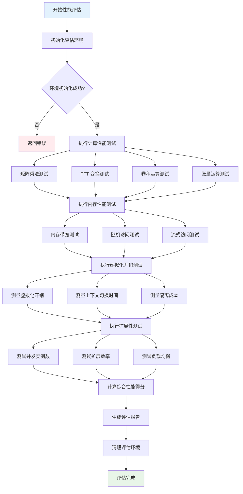
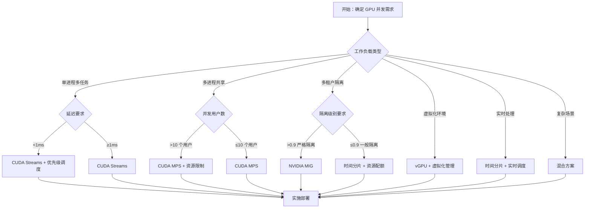

# GPU 虚拟化与资源管理技术深度解析 - 第一部分：基础理论篇

## 概述

《**GPU 虚拟化与资源管理技术深度解析**》是一套完整的 GPU 资源管理技术体系文档，旨在为 AI 时代的 GPU 资源高效利用提供全面的理论指导和实践方案。随着大语言模型、深度学习等 AI 应用的爆发式增长， GPU 资源已成为现代计算基础设施的核心瓶颈。本系列文档系统性地解决了 GPU 资源利用率低、多租户隔离困难、成本高昂等关键问题。

本系列采用"理论→技术→实践→应用"的递进式架构，涵盖 GPU 虚拟化与资源管理的完整技术栈：

**第一部分：基础理论篇** - 构建技术认知框架

- 深入分析 AI 时代 GPU 资源需求激增的技术背景
- 系统梳理传统 GPU 使用模式的六大核心局限性
- 建立 GPU 虚拟化、切分、远程调用三大核心技术体系
- 提供科学的技术选型决策框架和 ROI 评估模型

**第二部分：虚拟化技术篇** - 掌握核心实现机制

- 硬件级虚拟化： NVIDIA MIG 、 AMD SR-IOV 、 GPU Passthrough 深度解析
- 内核态虚拟化：虚拟 GPU 管理器、资源调度器、上下文管理器设计
- 用户态虚拟化： HAMi 项目架构、 CUDA API 拦截、性能优化机制
- 提供完整的技术对比分析和选择指南

**第三部分：资源管理与优化篇** - 实现高效资源调度

- GPU 切分技术： HAMi 与 MIG 集成、动态切片、混合调度策略
- CUDA 流和 MPS ：并发执行优化、多进程服务、性能调优
- 核心算法：显存管理、计算调度、性能隔离、监控分析
- 针对 AI 大模型训练场景的专项优化策略

**第四部分：实践应用篇** - 落地生产环境

- 完整的部署指南：环境准备、配置优化、容器生态集成
- 运维最佳实践：监控体系、故障排查、自动化恢复
- 云平台集成：公有云、私有云、混合云 GPU 管理策略
- 性能评估与基准测试：指标体系、测试工具、优化策略

本系列重点解决 GPU 资源管理的三大核心挑战：

1. **资源利用率提升**：通过虚拟化和切分技术，将 GPU 利用率从传统的 20-30%提升至 70-90%
2. **多租户安全隔离**：实现硬件级、内核级、用户级的多层次隔离机制，确保企业级安全要求
3. **成本效益优化**：通过资源池化和智能调度，显著降低 GPU TCO （总拥有成本）

本系列的目标读者与应用场景：

- **AI 工程师**：掌握 GPU 资源优化技术，提升模型训练和推理效率
- **系统架构师**：设计高效的 GPU 集群架构，支撑大规模 AI 应用
- **运维工程师**：实现 GPU 资源的自动化管理和监控
- **技术决策者**：基于科学的评估框架进行 GPU 技术选型

**第一部分：基础理论篇：**

本篇作为整个系列的理论基础，将从 GPU 计算资源需求的时代背景出发，系统分析传统 GPU 使用模式的技术局限性，建立 GPU 虚拟化、切分和远程调用的核心技术体系，并提供科学的技术选型决策框架。通过本篇的学习，读者将建立完整的 GPU 资源管理技术认知框架，为后续深入学习技术实现和实践应用奠定坚实基础。

## 目录

- [GPU 虚拟化与资源管理技术深度解析 - 第一部分：基础理论篇](#gpu-虚拟化与资源管理技术深度解析---第一部分基础理论篇)
  - [概述](#概述)
  - [目录](#目录)
  - [1. 术语表](#1-术语表)
  - [2. 引言](#2-引言)
    - [2.1 GPU 计算资源需求的快速增长背景](#21-gpu-计算资源需求的快速增长背景)
      - [2.1.1 关键驱动因素](#211-关键驱动因素)
      - [2.1.2 最新 GPU 架构对虚拟化技术的影响](#212-最新-gpu-架构对虚拟化技术的影响)
      - [2.1.3 技术趋势对虚拟化的推动作用](#213-技术趋势对虚拟化的推动作用)
      - [2.1.4 虚拟化技术性能验证](#214-虚拟化技术性能验证)
    - [2.2 传统 GPU 使用模式的局限性](#22-传统-gpu-使用模式的局限性)
      - [2.2.1 资源利用率低下](#221-资源利用率低下)
      - [2.2.2 资源分配不灵活](#222-资源分配不灵活)
      - [2.2.3 多租户隔离困难](#223-多租户隔离困难)
      - [2.2.4 扩展性受限](#224-扩展性受限)
      - [2.2.5 远程访问与网络依赖问题](#225-远程访问与网络依赖问题)
      - [2.2.6 技术栈集成与标准化缺失](#226-技术栈集成与标准化缺失)
    - [2.3 GPU 管理核心技术概览](#23-gpu-管理核心技术概览)
      - [2.3.1 GPU 虚拟化技术](#231-gpu-虚拟化技术)
      - [2.3.2 GPU 切分技术](#232-gpu-切分技术)
      - [2.3.3 GPU 远程调用技术](#233-gpu-远程调用技术)
      - [2.3.4 技术集成与协同](#234-技术集成与协同)
    - [2.4 本文研究范围](#24-本文研究范围)
      - [2.4.1 核心技术领域](#241-核心技术领域)
      - [2.4.2 实现层面分析](#242-实现层面分析)
      - [2.4.3 应用场景覆盖](#243-应用场景覆盖)
      - [2.4.4 技术边界和限制](#244-技术边界和限制)
      - [2.4.5 目标读者群体](#245-目标读者群体)
    - [2.5 核心概念解析](#25-核心概念解析)
      - [2.5.1 GPU 切分技术](#251-gpu-切分技术)
      - [2.5.2 时间片调度机制](#252-时间片调度机制)
      - [2.5.3 显存超分技术](#253-显存超分技术)
      - [2.5.4 侧信道攻击防护](#254-侧信道攻击防护)
      - [2.5.5 CUDA MPS 多进程服务技术](#255-cuda-mps-多进程服务技术)
      - [2.5.6 GPU 资源池化技术](#256-gpu-资源池化技术)
      - [2.5.7 容器化 GPU 管理](#257-容器化-gpu-管理)
  - [3. 技术选型决策框架](#3-技术选型决策框架)
    - [3.1 技术选型评估维度](#31-技术选型评估维度)
      - [3.1.1 性能指标评估](#311-性能指标评估)
      - [3.1.2 成本效益分析](#312-成本效益分析)
      - [3.1.3 技术成熟度评估](#313-技术成熟度评估)
      - [3.1.4 生态兼容性分析](#314-生态兼容性分析)
    - [3.2 应用场景分类与匹配](#32-应用场景分类与匹配)
      - [3.2.1 云计算环境需求分析](#321-云计算环境需求分析)
      - [3.2.2 边缘计算场景特征](#322-边缘计算场景特征)
      - [3.2.3 高性能计算集群要求](#323-高性能计算集群要求)
      - [3.2.4 AI 训练与推理场景](#324-ai-训练与推理场景)
      - [3.2.5 GPU 并发机制技术对比](#325-gpu-并发机制技术对比)
    - [3.5 ROI 计算模型](#35-roi-计算模型)
      - [3.5.1 成本构成分析](#351-成本构成分析)
      - [3.5.2 收益量化方法](#352-收益量化方法)
      - [3.5.3 投资回报评估](#353-投资回报评估)
  - [第一部分总结](#第一部分总结)

---

## 1. 术语表

| 术语 | 全称 | 定义 |
|------|------|------|
| GPU | Graphics Processing Unit | 图形处理单元，专门用于并行计算的处理器 |
| MIG | Multi-Instance GPU | NVIDIA 的多实例 GPU 技术，可将单个 GPU 分割为最多 7 个独立实例，每个实例具有专用的高带宽内存、缓存和计算核心，提供硬件级隔离和 QoS 保证 |
| MPS | Multi-Process Service | NVIDIA 的多进程服务，允许多个 CUDA 应用程序并发访问单个 GPU |
| HAMi | Heterogeneous AI Computing Middleware | 异构 AI 计算中间件，开源 GPU 资源管理方案 |
| CUDA | Compute Unified Device Architecture | NVIDIA 的并行计算平台和编程模型 |
| API | Application Programming Interface | 应用程序编程接口 |
| cgroup | Control Groups | Linux 内核功能，用于限制和隔离进程组的资源使用 |
| ioctl | Input/Output Control | 设备输入输出控制系统调用 |
| mmap | Memory Map | 内存映射系统调用 |
| QoS | Quality of Service | 服务质量，用于保证网络或系统性能 |
| SLA | Service Level Agreement | 服务级别协议 |
| ROI | Return on Investment | 投资回报率 |
| NPU | Neural Processing Unit | 神经网络处理单元 |
| DPU | Data Processing Unit | 数据处理单元 |
| FPGA | Field-Programmable Gate Array | 现场可编程门阵列 |
| VGPU | Virtual GPU | 虚拟 GPU ，通过软件实现的 GPU 虚拟化技术 |
| SR-IOV | Single Root I/O Virtualization | 单根 I/O 虚拟化， PCIe 标准规范，允许单个物理设备在 PCIe 总线上呈现为多个虚拟功能(VF)，实现硬件级资源隔离。 AMD MxGPU 基于此技术实现 GPU 虚拟化 |
| IOMMU | Input-Output Memory Management Unit | 输入输出内存管理单元，用于设备虚拟化 |
| PCIe | Peripheral Component Interconnect Express | 高速串行计算机扩展总线标准 |
| NUMA | Non-Uniform Memory Access | 非统一内存访问架构 |
| UVM | Unified Virtual Memory | 统一虚拟内存， CUDA 的内存管理技术 |
| COW | Copy-on-Write | 写时复制，内存管理优化技术 |
| LRU | Least Recently Used | 最近最少使用，缓存替换算法 |
| OOM | Out of Memory | 内存不足错误 |
| ZSTD | Zstandard | 高效的无损数据压缩算法 |
| LZ4 | - | 快速无损数据压缩算法 |
| RDMA | Remote Direct Memory Access | 远程直接内存访问技术 |
| InfiniBand | - | 高性能计算和数据中心互连技术 |
| NVLink | - | NVIDIA 的高速 GPU 互连技术 |
| NVSwitch | - | NVIDIA 的 GPU 交换芯片 |
| NCCL | NVIDIA Collective Communication Library | NVIDIA 集合通信库 |
| cuDNN | CUDA Deep Neural Network Library | CUDA 深度神经网络库 |
| TensorRT | - | NVIDIA 的深度学习推理优化库 |
| Triton | - | NVIDIA 的推理服务器 |
| Docker | - | 容器化平台 |
| Kubernetes | K8s | 容器编排平台 |
| Prometheus | - | 开源监控和告警系统 |
| Grafana | - | 开源数据可视化平台 |
| ROCm | Radeon Open Compute | AMD 的开源 GPU 计算平台 |
| HIP | Heterogeneous-Compute Interface for Portability | AMD 的异构计算接口 |
| HBM | High Bandwidth Memory | 高带宽内存 |
| GDDR | Graphics Double Data Rate | 图形双倍数据速率内存 |
| ECC | Error-Correcting Code | 错误纠正码内存 |
| DMA | Direct Memory Access | 直接内存访问 |
| IOVA | I/O Virtual Address | I/O 虚拟地址 |
| SMMU | System Memory Management Unit | 系统内存管理单元 |
| ATS | Address Translation Services | 地址转换服务 |
| PASID | Process Address Space Identifier | 进程地址空间标识符 |

---

## 2. 引言

随着人工智能、深度学习、科学计算等领域的快速发展， GPU 计算资源需求呈现指数级增长态势。 GPU 已从传统的图形渲染专用处理器演进为现代计算基础设施的核心组件，在大规模机器学习训练和推理任务中发挥关键作用。然而，传统 GPU 使用模式在资源利用效率、多租户隔离、弹性扩展等方面存在显著局限性。

本文系统性地分析 GPU 管理技术的发展背景、传统使用模式的技术瓶颈、 GPU 虚拟化技术的核心价值和发展趋势，并明确研究范围和核心概念，为深入理解后续技术内容构建理论基础。

### 2.1 GPU 计算资源需求的快速增长背景

近年来， AI 应用的复杂度和规模呈现持续增长趋势，特别是大语言模型（ LLM ）的快速发展，对 GPU 计算能力提出了前所未有的技术挑战。从 GPT-3 的 1750 亿参数规模发展至 GPT-4 的 [1.8 万亿参数体量](https://explodingtopics.com/blog/gpt-parameters)，模型参数规模的指数级增长直接驱动了 GPU 计算资源需求的急剧扩张。

#### 2.1.1 关键驱动因素

- **模型规模增长**：从 BERT 的 3.4 亿参数发展到当前的万亿级参数
- **应用场景扩展**：从研究机构扩展到金融、医疗、自动驾驶、制造业等各行各业
- **计算密集度提升**：大模型训练需要数千张 GPU 协同工作，实时推理服务对性能要求极高

#### 2.1.2 最新 GPU 架构对虚拟化技术的影响

随着 GPU 架构的快速演进，最新一代 GPU 在虚拟化支持方面带来了显著的技术突破，为 GPU 资源管理提供了新的可能性：

**NVIDIA H100 架构创新：**

- **增强的 MIG 支持**： H100 提供[多版本配置](https://www.nvidia.com/en-us/data-center/h100)：
  - SXM5 版本： 80GB HBM3 显存，支持第二代 MIG 技术
  - NVL 版本： 188GB HBM3 显存，通过 NVLink 桥接
  - 单卡最多[划分 7 个实例，支持动态配置无需 GPU 重置](https://docs.nvidia.com/launchpad/ai/h100-mig/latest/h100-mig-gpu.html)
  - 每个实例提供前代 3 倍计算资源及近 2 倍内存带宽
- **MIG 性能优化**：新的 Streaming Multiprocessor （ SM ）架构减少了上下文切换开销，MIG 实例相对于物理 GPU 具有接近原生的性能表现
- **安全隔离增强**：硬件级的 Confidential Computing 支持，为多租户环境提供了更强的安全保障
- **NVLink 4.0 支持**： 900GB/s 的互连带宽为分布式 GPU 虚拟化提供了高速通信基础

**AMD MI300 系列突破：**

- **MI300X 显存架构**： 192GB HBM3 [显存配置](https://www.amd.com/en/products/accelerators/instinct/mi300x.html)
  - 8,192 位内存总线接口
  - 5.2Gbps 数据速率，提供 **5.325TB/s** 峰值带宽
  - [**第三代 Infinity Fabric 互连技术**](https://www.amd.com/en/technologies/infinity-architecture)
    - 芯片间互连带宽提升至 **896GB/s**
    - 支持自适应路由和错误纠正机制
    - 延迟降低至纳秒级
- **统一内存架构**： MI300X 集成了 HBM3 内存，为虚拟化环境下的内存管理提供了新的优化空间
- **CDNA 3 架构优势**：原生支持虚拟化工作负载，在多租户场景下性能表现更加稳定
- **ROCm 6.0 生态**：完善的开源软件栈为 GPU 虚拟化提供了更多技术选择

**Intel 数据中心 GPU 进展：**

- **Xe-HPC 架构**： Intel Ponte Vecchio 在设计之初就考虑了虚拟化需求，提供了硬件级的资源隔离机制
- **oneAPI 统一编程模型**：为跨厂商 GPU 虚拟化提供了标准化的软件接口

#### 2.1.3 技术趋势对虚拟化的推动作用

- **硬件虚拟化能力增强**：新一代 GPU 普遍加强了硬件级虚拟化支持，降低了软件虚拟化的复杂度
- **内存容量大幅提升**： H100 的 80GB HBM3 、 MI300X 的 192GB HBM3 为显存超分技术提供了更大的优化空间
- **互连技术进步**： NVLink 、 Infinity Fabric 等高速互连技术使得跨节点 GPU 虚拟化成为可能
- **AI 专用指令集**： Transformer Engine 、 Matrix Engine 等专用计算单元为 AI 工作负载的虚拟化优化提供了新的维度

#### 2.1.4 虚拟化技术性能验证

随着 GPU 虚拟化技术的成熟，业界开始通过标准化基准测试验证不同虚拟化方案的实际性能表现。这里的虚拟化技术主要包括两大类：

- **传统虚拟化技术**：基于 Hypervisor 的 GPU 透传（GPU Passthrough）和虚拟 GPU（vGPU）技术，利用 Hypervisor 直接将 GPU 资源分配给虚拟机，实现了硬件级别的资源隔离和性能优化。
- **硬件切分技术**：如 NVIDIA MIG（Multi-Instance GPU）、AMD SR-IOV 等原生硬件级别的资源分割方案，将 GPU 资源切分多个实例，每个实例可以独立分配给不同的虚拟机/容器，实现了硬件级别的资源隔离和性能优化。

**技术对比表格：**

| 对比维度 | 传统虚拟化技术 | 硬件切分技术 |
|---------|---------------|-------------|
| **技术原理** | 基于 Hypervisor 的软件虚拟化层，通过虚拟化管理程序实现资源分配 | 基于 GPU 硬件原生支持的资源分割，直接在硬件层面进行资源切分 |
| **实现方式** | GPU 透传（Passthrough）、虚拟 GPU（vGPU） | NVIDIA MIG、AMD SR-IOV、Intel GPU 虚拟化 |
| **性能开销** | 存在 Hypervisor 层开销，但现代技术已将开销降至极低 | 接近原生性能，硬件级别切分几乎无额外开销 |
| **资源隔离** | 通过 Hypervisor 实现强隔离，支持不同操作系统 | 硬件级别的强隔离，提供更彻底的资源分离 |
| **灵活性** | 高度灵活，支持动态资源调整和迁移 | 相对固定，切分配置通常需要重启或重新配置 |
| **兼容性** | 广泛兼容各种 GPU 型号和操作系统 | 依赖特定 GPU 硬件支持，兼容性相对有限 |
| **管理复杂度** | 需要虚拟化平台管理，但工具链成熟 | 配置相对简单，但需要专门的管理工具 |
| **适用场景** | 企业虚拟化环境、云计算平台、需要 VM 迁移的场景 | 容器化环境、高性能计算、需要硬件级隔离的场景 |
| **技术成熟度** | 技术成熟，生态完善，广泛部署 | 相对较新，但发展迅速，逐渐成为主流 |

**性能验证结果表明**：

**VMware vSphere 虚拟化验证：**

根据 [VMware 与 NVIDIA 的 MLPerf Inference v3.0 基准测试报告](https://blogs.vmware.com/cloud-foundation/2023/04/17/no-virtualization-tax-for-mlperf-inference-v3-0-using-nvidia-hopper-and-ampere-vgpus-and-nvidia-ai-software-with-vsphere-8-0-1/)，使用 H100 和 A100 vGPU 在 vSphere 8.0.1 平台上的性能可达到裸机性能的 94%-105%

- **测试环境**： Dell PowerEdge R750xa 服务器， 2x Intel Xeon Platinum 8358 处理器， 2x NVIDIA H100-PCIE-80GB GPU
- **基准测试任务**： BERT 、 RetinaNet 、 3D U-Net 、 RNNT 等 AI 工作负载
- **技术意义**：验证了企业级虚拟化平台在 AI 工作负载下的生产就绪性

**云服务商与开源社区验证：**

- **云服务商验证**：
  - **传统虚拟化技术**：AWS EC2 P4d 实例（基于 vGPU 技术）、Azure NV 系列（基于 GPU 透传）、GCP A2 实例（基于 GPU 透传）等通过大规模部署验证了传统虚拟化技术在生产环境中的稳定性
  - **硬件切分技术**：AWS EC2 P4de 实例（支持 NVIDIA MIG）、Azure ND A100 v4 系列（支持 MIG）等验证了硬件切分技术的性能表现和资源隔离效果

- **开源社区贡献**：
  - **Kubernetes 生态**：通过 NVIDIA GPU Operator、AMD GPU Operator 等项目验证了 MIG 和 SR-IOV 等硬件切分技术的容器化部署能力
  - **OpenStack 生态**：通过 Nova、Cyborg 等组件验证了传统 vGPU 技术和新兴硬件切分技术的兼容性和可扩展性

### 2.2 传统 GPU 使用模式的局限性

传统 GPU 使用模式在现代 AI 工作负载场景下暴露出显著的技术局限性，这些瓶颈严重制约了 GPU 资源的有效利用率和系统架构的可扩展性。

#### 2.2.1 资源利用率低下

**问题描述：**
单个应用往往无法充分利用整个 GPU 的计算能力，导致严重的资源浪费。

**具体表现：**

- **计算资源闲置**：许多 AI 推理任务无法充分利用 GPU 计算能力（典型场景下利用率偏低）
- **显存浪费**：小模型推理显存使用量远低于 GPU 配备容量
- **批处理效率低**：单任务处理无法充分利用 GPU 的并行处理能力
- **峰谷差异大**：业务高峰期资源不足，低谷期大量闲置

**典型场景：**

- 推理服务在生产环境中的 GPU 利用率普遍偏低
- 开发测试环境中资源利用率更低

*注：具体利用率数据因工作负载类型、模型规模和部署方式而异。*

#### 2.2.2 资源分配不灵活

**问题描述：**
GPU 通常以整卡为单位分配，无法满足不同应用的精细化资源需求。

**具体挑战：**

- **粒度过粗**：无法根据应用实际需求分配适量的计算资源
- **资源浪费**：小任务占用整张 GPU 卡，造成资源浪费
- **调度困难**：无法实现多个小任务共享单张 GPU
- **成本高昂**：每个应用都需要独占 GPU ，增加硬件成本

**业务影响：**

- 开发团队需要排队等待 GPU 资源
- 无法支持细粒度的资源计费
- 难以实现按需扩缩容

#### 2.2.3 多租户隔离困难

**问题描述：**
多个应用共享 GPU 时缺乏有效的隔离机制，容易出现资源竞争和安全问题。

**安全风险：**

- **数据泄露**：共享显存可能导致敏感数据泄露
- **侧信道攻击**：恶意应用可能通过时序分析获取其他应用信息
- **资源抢占**：高优先级任务可能被低优先级任务影响
- **故障传播**：一个应用的异常可能影响其他应用

**管理挑战：**

- 缺乏有效的资源配额管理
- 难以实现公平调度
- 无法提供 SLA 保障

#### 2.2.4 扩展性受限

**问题描述：**
传统模式下， GPU 资源的扩展受到物理硬件的限制，难以实现弹性伸缩。

**技术限制：**

- **物理边界**：单机 GPU 数量受主板和电源限制
- **网络瓶颈**：跨节点 GPU 通信延迟高
- **管理复杂**：大规模 GPU 集群管理复杂度指数级增长
- **故障处理**：硬件故障影响整个节点的可用性

**运维挑战：**

- 无法快速响应业务需求变化
- 硬件采购和部署周期长
- 维护成本随规模线性增长

#### 2.2.5 远程访问与网络依赖问题

**问题描述：**
传统 GPU 使用模式缺乏有效的远程访问机制，限制了资源的灵活调度和跨地域协作。

| 问题类别 | 具体挑战 | 问题描述 |
|---------|---------|----------|
| **网络性能瓶颈** | 延迟敏感 | GPU 计算任务对网络延迟极其敏感，传统网络架构难以满足实时性要求 |
| | 带宽限制 | 大规模数据传输受网络带宽限制，影响整体性能 |
| | 协议开销 | 传统网络协议开销大，不适合 GPU 密集型计算场景 |
| | QoS 保障 | 缺乏针对 GPU 工作负载的网络服务质量保障机制 |
| **资源调度局限** | 地域限制 | GPU 资源无法跨数据中心灵活调度 |
| | 负载均衡困难 | 难以实现跨节点的智能负载分配 |
| | 故障恢复复杂 | 网络故障时缺乏有效的容错和恢复机制 |
| | 资源发现困难 | 缺乏统一的远程 GPU 资源发现和管理机制 |
| **安全与可靠性挑战** | 数据传输安全 | 远程访问时数据传输缺乏有效加密保护 |
| | 身份认证复杂 | 跨网络的身份验证和授权机制不完善 |
| | 网络攻击风险 | 暴露在网络中的 GPU 服务面临安全威胁 |
| | 服务可用性 | 网络不稳定导致 GPU 服务可用性下降 |

#### 2.2.6 技术栈集成与标准化缺失

**问题描述：**
现有 GPU 管理技术缺乏统一标准，各厂商方案互不兼容，增加了系统集成复杂度。

| 问题类别 | 具体问题 | 问题描述 |
|---------|---------|----------|
| **标准化问题** | 接口不统一 | 不同厂商的 GPU 虚拟化接口标准不一致 |
| | 协议碎片化 | 缺乏统一的 GPU 资源管理协议 |
| | API 兼容性差 | 应用程序难以在不同 GPU 管理平台间迁移 |
| | 监控标准缺失 | 缺乏统一的 GPU 资源监控和度量标准 |
| **集成复杂性** | 多技术栈并存 | 虚拟化、切分、远程调用技术各自独立，难以协同 |
| | 配置管理复杂 | 不同技术方案的配置和管理方式差异巨大 |
| | 运维工具分散 | 缺乏统一的 GPU 资源运维管理工具 |
| | 技能要求高 | 需要掌握多种技术栈，增加人力成本 |
| **对核心技术的影响** | 虚拟化技术 | 缺乏标准化导致虚拟化方案选择困难，厂商锁定风险高 |
| | 切分技术 | 不同切分方案无法互操作，资源池化效果受限 |
| | 远程调用技术 | 协议不统一导致跨平台远程调用困难，限制了资源的全局优化 |

### 2.3 GPU 管理核心技术概览

现代 GPU 资源管理涉及三大核心技术：虚拟化、切分和远程调用。这些技术相互补充，共同构建了完整的 GPU 资源管理解决方案。本节将系统介绍这三大技术的基本原理和实现方式，为后续章节的深入分析奠定基础。

#### 2.3.1 GPU 虚拟化技术

**技术原理：**

GPU 虚拟化通过在硬件和应用之间引入抽象层，实现 GPU 资源的灵活分配、安全隔离和高效利用。


**主要实现方式：**

- **硬件级虚拟化层**：直接在 GPU 硬件层面提供虚拟化支持
  - **定义**：利用 GPU 硬件内置的虚拟化功能，在物理层面实现资源隔离
  - **技术特点**：硬件级隔离、性能开销最小、安全性最高
  - **典型示例**： NVIDIA MIG （将 A100/H100 划分为独立 GPU 实例）、 AMD SR-IOV （ PCIe 级别的硬件虚拟化）、 GPU Passthrough （虚拟机直接访问物理 GPU ）

- **内核态虚拟化层**：在操作系统内核层面实现 GPU 资源虚拟化
  - **定义**：通过修改或拦截 GPU 硬件驱动程序，在内核空间实现资源管理和调度
  - **技术特点**：系统级控制、精细资源管理、需要内核模块支持
  - **典型示例**： NVIDIA vGPU （通过 Hypervisor 实现）、 Intel GVT-g （内核级 GPU 虚拟化）、自定义内核模块拦截 ioctl 系统调用

- **用户态虚拟化层**：在用户空间实现 GPU 资源的配额控制和管理
  - **定义**：通过拦截 GPU API 调用，在应用程序层面实现资源限制和调度
  - **技术特点**：部署简单、兼容性好、无需内核修改、基于软件配额
  - **典型示例**： HAMi （通过 LD_PRELOAD 拦截 CUDA API ）、 vCUDA （虚拟 CUDA 运行时）、 Docker GPU 资源限制、 Kubernetes GPU 共享插件

- **混合虚拟化**：结合多种虚拟化技术的综合解决方案
  - **定义**：同时使用硬件和软件虚拟化技术，发挥各自优势
  - **技术特点**：灵活性高、适应性强、可根据场景选择最优方案
  - **典型示例**： MIG+容器化（硬件隔离+软件管理）、 SR-IOV+API 拦截（硬件虚拟化+软件配额）、多层次资源管理架构

**核心价值：**

- 提高资源利用率和灵活性
- 实现多租户安全隔离
- 支持动态资源调整和负载均衡

#### 2.3.2 GPU 切分技术


**虚拟化与切分的关系：**

GPU 虚拟化和 GPU 切分是两个相关但不同的概念：

- **GPU 虚拟化**：是实现技术手段，通过软件或硬件层面创建虚拟 GPU 实例，提供资源抽象和隔离
- **GPU 切分**：是资源分配策略，定义如何将物理 GPU 资源划分给不同的虚拟实例或应用
- **关系**：虚拟化提供了实现切分的技术基础，切分定义了虚拟化的资源分配方式

**技术原理：**

GPU 切分技术将单个物理 GPU 划分为多个独立的逻辑单元，每个单元可以独立运行不同的工作负载。切分技术通常与虚拟化技术结合使用，虚拟化负责创建隔离环境，切分负责定义资源分配策略。

**主要切分方式：**

- **时间切分**：基于时间片的 GPU 计算资源分配
  - 抢占式调度：支持高优先级任务抢占
  - 协作式调度：任务主动释放资源
  - 混合调度：结合抢占式和协作式的优势

- **空间切分**：将 GPU 物理资源进行空间划分
  - 计算单元切分： SM （流多处理器）级别的资源分割
  - 显存切分：独立的显存空间分配
  - 带宽切分：内存带宽的隔离和限制

- **混合切分**：时间和空间切分的组合
  - 动态调整：根据负载动态调整切分策略
  - 优先级管理：不同优先级任务的差异化处理

**解决方案要点：**

- **性能隔离机制**：通过硬件级隔离和软件配额实现公平性保障
- **上下文切换优化**：采用轻量级切换算法和状态缓存技术降低开销
- **资源整合策略**：智能碎片整理和动态资源重分配机制

#### 2.3.3 GPU 远程调用技术


**技术原理：**

GPU 远程调用技术使应用程序能够透明地访问和使用远程 GPU 资源，突破单机 GPU 数量限制。

**主要实现架构：**

- **API 代理模式**：拦截本地 GPU API 调用并转发到远程 GPU
  - CUDA API 代理：透明的 CUDA 调用转发
  - OpenCL 代理：跨平台的 OpenCL 远程访问
  - 自定义协议：针对特定场景的优化协议

- **虚拟设备模式**：在本地创建虚拟 GPU 设备
  - 设备模拟：完整的 GPU 设备行为模拟
  - 驱动层代理：在驱动层面实现远程访问
  - 内核模块：内核态的远程 GPU 支持

- **分布式计算模式**：将计算任务分布到多个远程 GPU
  - 任务分解：将大任务分解为子任务
  - 负载均衡：智能的任务分配策略
  - 结果聚合：分布式计算结果的合并

**关键技术要素：**

- **网络优化**：低延迟、高带宽的网络通信
- **数据传输**：高效的数据序列化和传输机制
- **状态同步**：远程 GPU 状态的一致性管理
- **错误处理**：网络故障和设备故障的恢复机制

#### 2.3.4 技术集成与协同

**技术融合趋势：**

现代 GPU 管理系统通常将三大技术进行有机结合：

- **虚拟化+切分**：在虚拟化基础上实现更细粒度的资源切分
- **切分+远程调用**：将切分后的 GPU 资源通过网络提供服务
- **虚拟化+远程调用**：远程访问虚拟化的 GPU 资源池
- **三技术融合**：构建统一的 GPU 资源管理平台

**协同优势：**

- **资源利用最大化**：通过多层次的资源管理提高整体利用率
- **灵活性增强**：支持多样化的部署和使用模式
- **可扩展性提升**：突破单机限制，实现集群级资源管理
- **成本效益优化**：通过资源共享降低总体拥有成本

**实施考量：**

- **性能开销**：多层技术栈可能带来的性能损失
- **复杂度管理**：系统复杂度与维护成本的平衡
- **兼容性保障**：确保与现有应用和框架的兼容性
- **安全性要求**：多租户和网络环境下的安全保障

### 2.4 本文研究范围

本文将深入探讨 GPU 虚拟化、切分技术与远程调用机制，涵盖技术原理、实现方案、性能分析、应用场景等多个维度，为读者提供全面的技术指导和实践建议。

#### 2.4.1 核心技术领域

| 技术类别 | 核心技术 | 技术特点 |
|---------|---------|----------|
| **GPU 虚拟化技术** | 硬件层虚拟化 | NVIDIA MIG 、 AMD SR-IOV 等硬件级资源隔离 |
| | 内核态虚拟化 | 驱动层拦截和管理，系统级资源控制 |
| | 用户态虚拟化 | API 层封装和代理，应用级透明访问 |
| | 容器化 GPU 资源管理 | 容器级 GPU 资源分配和隔离 |
| **GPU 切分技术** | 时间片调度机制 | 算法优化，时间维度资源共享 |
| | 空间切分策略 | 资源隔离，空间维度资源分割 |
| | 混合切分模式 | 时空结合的设计与实现 |
| | 动态资源分配 | 负载均衡，自适应资源调整 |
| **远程 GPU 调用** | GPU 资源网络化访问 | 透明的远程 GPU 资源访问机制 |
| | 分布式 GPU 计算架构 | 多节点 GPU 资源协同计算 |
| | 跨节点 GPU 资源调度 | 集群级 GPU 资源统一调度 |
| | 网络优化和延迟控制 | 高性能网络通信和延迟优化 |

#### 2.4.2 实现层面分析

| 分析维度 | 关键要素 | 技术要点 |
|---------|---------|----------|
| **技术原理深度解析** | 底层硬件架构 | 虚拟化支持机制和硬件特性分析 |
| | 操作系统内核 | GPU 资源管理和内核级调度机制 |
| | 驱动程序适配 | 虚拟化层驱动程序设计和兼容性 |
| | 应用程序接口 | 透明化处理和 API 层封装技术 |
| **实现方案对比** | 技术特点分析 | 不同虚拟化方案的优劣势对比 |
| | 性能评估 | 开销分析和资源利用率优化 |
| | 安全性评估 | 隔离性机制和安全防护策略 |
| | 部署维护 | 复杂度评估和运维成本分析 |
| **代码实现示例** | 核心算法 | C 语言实现的关键算法逻辑 |
| | 数据结构 | 关键数据结构的设计和优化 |
| | 系统接口 | 系统调用和 API 封装实现 |
| | 异常处理 | 错误处理和异常恢复机制 |

#### 2.4.3 应用场景覆盖

| 应用场景 | 具体应用 | 技术特点 | 核心价值 |
|----------|----------|----------|----------|
| **云计算环境** | 公有云 GPU 服务 | 虚拟化实现、弹性扩缩容 | 资源池化、按需分配 |
| | 私有云 GPU 资源池 | 资源池化、统一管理 | 突破单机限制、大规模聚合 |
| | 混合云环境 | 跨云资源管理、数据安全 | 跨地域资源调度、故障隔离 |
| | 多租户 GPU 服务 | 安全隔离、资源配额 | 成本共享、 SLA 保障 |
| **企业级应用** | AI 训练平台 | 资源调度、任务排队 | 提高利用率、降低成本 |
| | 推理服务 | 资源优化、低延迟 | 弹性扩缩、快速响应 |
| | 开发测试环境 | 资源共享、成本控制 | 简化管理、降低运维复杂度 |
| | 高性能计算集群 | 大规模并行、高吞吐 | 集群级资源统一调度 |
| **边缘计算场景** | 边缘设备虚拟化 | 轻量化、低功耗 | 资源受限环境优化 |
| | 实时计算 | 低延迟、确定性调度 | 实时性保障、性能隔离 |
| | 资源受限环境 | 功耗优化、散热管理 | 智能资源分配、动态调整 |
| | 离线部署 | 自主运行、故障自愈 | 容错机制、服务可用性 |

#### 2.4.4 技术边界和限制

**本文涵盖范围：**

- 主流 GPU 厂商（ NVIDIA 、 AMD ）的虚拟化技术
- Linux 操作系统环境下的实现方案
- 容器和虚拟机两种虚拟化环境
- 深度学习和高性能计算工作负载

**不涉及内容：**

- 特定厂商的专有技术细节
- Windows 环境下的 GPU 虚拟化
- 移动设备 GPU 的虚拟化
- 图形渲染相关的 GPU 虚拟化

#### 2.4.5 目标读者群体

**技术开发人员：**

- 系统架构师和技术负责人
- GPU 虚拟化技术的开发工程师
- 云计算平台的技术人员
- AI 基础设施的运维工程师

**决策制定者：**

- 技术管理者和 CTO
- 云服务商的产品经理
- 企业 IT 部门负责人
- 投资和采购决策者

### 2.5 核心概念解析

为了更好地理解本文内容，以下对几个核心概念进行详细说明：

#### 2.5.1 GPU 切分技术

GPU 切分技术是将单个 GPU 的计算资源、显存等按需分配给多个应用或用户的核心技术。关于 GPU 切分的具体实现方式和技术分类，请参考《第二部分：虚拟化技术篇》第 4-6 章中的详细介绍，其中涵盖了硬件级、内核态、用户态和混合虚拟化四种主要实现方式。

#### 2.5.2 时间片调度机制

时间片调度是通过时间分片的方式让多个任务轮流使用 GPU 资源的调度策略，是软件级 GPU 虚拟化的核心机制：

**调度原理**：

- 将 GPU 的使用时间划分为固定或可变的时间片
- 每个任务在分配的时间片内独占 GPU 资源
- 时间片结束后，调度器切换到下一个任务

**关键技术**：

- **上下文切换**：保存和恢复 GPU 的执行状态，包括寄存器、缓存等
- **抢占机制**：支持高优先级任务抢占低优先级任务的执行
- **负载均衡**：根据任务特性和资源需求动态调整时间片大小

**性能考量**：

- 时间片过小会导致频繁的上下文切换开销
- 时间片过大会影响任务的响应性
- 需要根据具体应用场景进行优化调整

#### 2.5.3 显存超分技术

显存超分技术允许分配的虚拟显存总量超过物理显存容量，是提高 GPU 资源利用率的重要手段：

**核心策略**：

- **按需分页**：只有在实际访问时才分配物理显存页面
- **内存压缩**：使用 LZ4 、 ZSTD 等算法压缩不常用的显存数据
- **分层存储**：将冷数据迁移到系统内存或存储设备
- **智能预测**：基于访问模式预测和预加载热数据

**风险控制机制**：

- **内存压力监控**：实时监控显存使用情况，预警潜在的 OOM 风险
- **优雅降级**：在显存不足时自动降低任务优先级或暂停部分任务
- **QoS 保障**：为关键任务预留显存资源，确保服务质量
- **故障恢复**：提供快速的故障检测和恢复机制

**适用场景**：

- 推理服务：模型加载后显存使用相对稳定
- 批处理任务：可以容忍一定的性能波动
- 开发测试环境：对性能要求不严格的场景

#### 2.5.4 侧信道攻击防护

侧信道攻击是通过分析系统的物理特征（如功耗、时序、电磁辐射等）来获取敏感信息的攻击方式，在 GPU 虚拟化环境中需要特别关注：

**攻击类型**：

- **时序攻击**：通过分析 GPU 操作的执行时间推断数据特征
- **功耗攻击**：监控 GPU 功耗变化来推断计算模式
- **缓存攻击**：利用共享缓存的访问模式泄露信息
- **内存访问攻击**：通过内存访问模式分析推断数据结构

**防护机制**：

- **时间混淆**：在操作执行时间中加入随机延迟
- **功耗平衡**：通过虚拟负载平衡 GPU 功耗变化
- **缓存隔离**：为不同租户分配独立的缓存分区
- **内存加密**：对敏感数据进行硬件级加密
- **访问模式随机化**：随机化内存访问顺序和模式

**实施策略**：

- 根据安全等级要求选择合适的防护措施
- 平衡安全性和性能之间的关系
- 定期评估和更新防护机制的有效性

#### 2.5.5 CUDA MPS 多进程服务技术

CUDA MPS （ Multi-Process Service ）是 NVIDIA 提供的系统软件，允许多个 CUDA 应用程序并发访问单个 GPU ，是实现 GPU 资源共享的重要技术：

**核心原理**：

- **进程级并发**：允许多个 CUDA 进程同时在单个 GPU 上执行
- **资源共享**：多个进程共享 GPU 的计算单元和显存资源
- **透明访问**：对应用程序透明，无需修改现有 CUDA 代码
- **服务架构**：采用客户端-服务器架构， MPS 服务器管理 GPU 访问

**技术特点**：

- **并发执行**：支持多个 CUDA 内核同时在 GPU 上执行
- **内存隔离**：每个客户端进程拥有独立的 GPU 内存空间
- **资源限制**：可以为每个客户端设置计算和内存使用限制
- **错误隔离**：一个客户端的错误不会影响其他客户端

**适用场景**：

- **多进程场景**：采用 MPS 实现进程间 GPU 共享
- **推理服务**：多个推理实例并发处理请求
- **批处理任务**：多个小任务并行执行提高吞吐量
- **开发测试**：多个开发者共享 GPU 资源进行测试

**性能考量**：

- 相比独占模式， MPS 可能带来轻微的性能开销（通常<5%）
- 内存带宽可能成为多进程并发的瓶颈
- 需要根据具体工作负载特性进行性能调优

**与其他并发机制对比分析**：

| 对比维度 | CUDA MPS | 时间片调度 | MIG 切分 | 容器化调度 |
|---------|----------|-----------|---------|------------|
| **并发粒度** | 进程级 | 任务级 | 硬件级 | 容器级 |
| **资源隔离** | 内存隔离，计算共享 | 时间隔离 | 硬件隔离 | 命名空间隔离 |
| **性能开销** | 低（<5%） | 中等（上下文切换） | 极低 | 低到中等 |
| **配置复杂度** | 中等 | 低 | 高 | 中等 |
| **适用场景** | 多进程并发 | 批处理任务 | 严格隔离需求 | 云原生应用 |
| **故障隔离** | 进程级隔离 | 任务级隔离 | 硬件级隔离 | 容器级隔离 |
| **资源利用率** | 高 | 中等 | 中等到高 | 高 |
| **扩展性** | 单 GPU 限制 | 单 GPU 限制 | 单 GPU 限制 | 集群级扩展 |

**技术选型建议**：

- **选择 MPS**：当需要多个小型 CUDA 应用并发执行，且对隔离要求不严格时
- **选择时间片调度**：当应用可以容忍延迟，需要简单的资源共享时
- **选择 MIG**：当需要严格的硬件级隔离和确定性性能时
- **选择容器化调度**：当需要与云原生生态集成，实现大规模 GPU 集群管理时

**组合使用策略**：

- **MPS + 容器化**：在容器内使用 MPS 实现更细粒度的进程级并发
- **MIG + MPS**：在 MIG 实例内使用 MPS 进一步提高资源利用率
- **时间片 + MPS**：结合时间片调度和 MPS 实现多层次的资源共享

#### 2.5.6 GPU 资源池化技术

GPU 资源池化技术是将分布在不同节点的 GPU 资源统一管理，形成逻辑上的资源池，实现资源的统一调度和分配：

**核心原理**：

- **资源抽象**：将物理分散的 GPU 资源抽象为统一的资源池
- **统一调度**：通过中央调度器实现全局资源的优化分配
- **动态扩缩**：根据负载需求动态调整资源池规模
- **故障隔离**：单个节点故障不影响整个资源池的可用性

**关键技术组件**：

- **资源发现与注册**：自动发现和注册集群中的 GPU 资源
- **负载均衡算法**：基于资源利用率、任务特性的智能分配
- **跨节点通信**：高效的 GPU 间数据传输和同步机制
- **资源监控**：实时监控资源状态和性能指标

**实现架构模式**：

- **集中式管理**：单一控制节点管理所有 GPU 资源
- **分布式管理**：多个管理节点协同工作，提高可靠性
- **混合架构**：结合集中式和分布式的优势

**应用价值**：

GPU 资源池化技术在各种应用场景中的具体价值体现，请参考《第三部分：资源管理与优化篇》中的详细分析，涵盖云计算环境、企业级应用和边缘计算等多个领域的核心价值。

#### 2.5.7 容器化 GPU 管理

容器化 GPU 管理是在容器环境中实现 GPU 资源的分配、隔离和管理，是云原生 GPU 服务的基础技术：

**技术背景**：

- **云原生趋势**：容器技术成为现代应用部署的主流方式
- **资源标准化**：容器提供了标准化的资源管理接口
- **微服务架构**： GPU 服务需要适配微服务的部署模式
- **DevOps 集成**：与 CI/CD 流水线的无缝集成

**核心技术实现**：

- **设备插件机制**：通过 Kubernetes Device Plugin 暴露 GPU 资源
- **资源配额管理**：基于容器的 GPU 资源限制和配额
- **运行时集成**：与 Docker 、 containerd 等容器运行时的集成
- **调度策略**： GPU 感知的容器调度算法

**关键挑战与解决方案**：

- **设备隔离**：通过 cgroups 和 namespace 实现 GPU 设备隔离
- **驱动兼容**：容器内 GPU 驱动的版本兼容性管理
- **性能优化**：减少容器化带来的性能开销
- **安全加固**：容器环境下的 GPU 安全访问控制

**生态系统支持**：

- **NVIDIA GPU Operator**：自动化 GPU 节点配置和管理
- **AMD GPU Device Plugin**： AMD GPU 的 Kubernetes 集成
- **多厂商支持**：统一的 GPU 资源管理接口
- **监控工具**：容器化 GPU 资源的监控和告警

**最佳实践**：

- 合理设置资源请求和限制，避免资源竞争
- 使用 GPU 节点亲和性，优化任务调度
- 实施资源配额策略，确保公平使用
- 建立完善的监控和日志体系

---

## 3. 技术选型决策框架

在复杂的 GPU 管理技术生态中，如何根据具体应用场景选择合适的技术方案是一个关键挑战。本章构建了一个系统性的技术选型决策框架，帮助技术决策者基于量化指标和科学方法进行技术选型。

### 3.1 技术选型评估维度

技术选型需要从多个维度进行综合评估，确保选择的方案能够满足业务需求并具备良好的可持续性。

#### 3.1.1 性能指标评估

性能是 GPU 管理技术选型的核心考量因素，需要建立全面的性能评估体系。

**性能评估框架：**

**GPU 性能评估框架架构图：**

```mermaid
graph TB
    A[GPU 性能评估框架] --> B[性能指标体系]
    A --> C[基准测试套件]
    A --> D[评估执行流程]
    
    B --> B1[计算性能指标]
    B --> B2[内存性能指标]
    B --> B3[虚拟化开销指标]
    B --> B4[扩展性指标]
    
    B1 --> B11[吞吐量 GFLOPS]
    B1 --> B12[延迟 ms]
    B1 --> B13[利用率 %]
    B1 --> B14[效率比]
    
    B2 --> B21[内存带宽利用率]
    B2 --> B22[内存访问延迟]
    B2 --> B23[缓存命中率]
    B2 --> B24[内存效率]
    
    B3 --> B31[虚拟化开销 %]
    B3 --> B32[上下文切换时间]
    B3 --> B33[隔离成本]
    B3 --> B34[管理开销]
    
    B4 --> B41[最大并发实例数]
    B4 --> B42[扩展效率]
    B4 --> B43[负载均衡有效性]
    
    C --> C1[计算密集型测试]
    C --> C2[内存密集型测试]
    C --> C3[混合负载测试]
    
    C1 --> C11[矩阵乘法]
    C1 --> C12[FFT 变换]
    C1 --> C13[卷积运算]
    C1 --> C14[张量运算]
    
    C2 --> C21[内存带宽测试]
    C2 --> C22[随机访问测试]
    C2 --> C23[流式访问测试]
    
    C3 --> C31[AI 训练负载]
    C3 --> C32[AI 推理负载]
    C3 --> C33[HPC 仿真负载]
    
    style A fill:#e1f5fe
    style B fill:#f3e5f5
    style C fill:#e8f5e8
    style D fill:#fff3e0
```



**性能评估执行流程图：**



#### 3.1.2 成本效益分析

成本效益分析需要考虑技术方案的全生命周期成本和收益。

**成本构成分析表：**

| 成本类别 | 成本项目 | 典型占比 | 计算方式 | 影响因素 | 优化策略 |
|----------|----------|----------|----------|----------|----------|
| **初始投资** | 硬件采购成本 | 40-60% | 设备单价×数量 | 技术选型、规模 | 批量采购、租赁模式 |
| | 软件许可成本 | 10-20% | 许可费×用户数 | 厂商策略、功能需求 | 开源替代、谈判优化 |
| | 实施服务成本 | 15-25% | 人天×费率 | 复杂度、定制化程度 | 标准化实施、内部培养 |
| | 培训认证成本 | 3-8% | 人员×培训费 | 技术复杂度、人员基础 | 在线培训、内部传承 |
| **运营成本** | 电力制冷成本 | 20-30% | 功耗×电价×时间 | 设备效率、机房 PUE | 节能设备、优化调度 |
| | 维护支持成本 | 15-25% | 年维护费率 | 设备复杂度、 SLA 要求 | 预防性维护、自动化 |
| | 人员运维成本 | 30-40% | 人员×薪资 | 技术复杂度、自动化程度 | 自动化运维、技能提升 |
| | 设施租赁成本 | 10-15% | 机柜×租金 | 地理位置、服务等级 | 云化部署、资源共享 |

**收益量化分析表：**

| 收益类别 | 收益项目 | 量化方法 | 典型提升幅度 | 计算周期 | 风险因素 |
|----------|----------|----------|------------|----------|----------|
| **性能收益** | 计算性能提升 | 任务完成时间缩短×人力成本 | 20-50% | 月度 | 工作负载变化 |
| | 资源利用率提升 | 利用率提升×硬件成本摊销 | 30-80% | 月度 | 需求波动 |
| | 能效比提升 | 功耗降低×电力成本 | 10-30% | 月度 | 电价波动 |
| **运营收益** | 运维效率提升 | 运维时间节省×人力成本 | 40-70% | 月度 | 自动化程度 |
| | 故障率降低 | 故障损失减少×业务影响 | 50-90% | 年度 | 系统复杂度 |
| | 扩展性提升 | 快速扩展×机会成本 | 难以量化 | 项目级 | 业务增长 |
| **业务收益** | 新业务支撑 | 新业务收入×技术贡献度 | 难以量化 | 年度 | 市场变化 |
| | 竞争优势 | 市场份额×技术差异化 | 难以量化 | 年度 | 竞争态势 |

**ROI 计算模型：**

| 财务指标 | 计算公式 | 评估标准 | 决策阈值 | 适用场景 |
|----------|----------|----------|----------|----------|
| ROI | (总收益-总投资)/总投资×100% | >15%优秀，>10%良好，<5%需重评 | >10% | 短期项目 |
| NPV | ∑(年净现金流/(1+折现率)^年数) | >0 可行，越大越好 | >0 | 长期投资 |
| 投资回收期 | 累计净现金流=0 的时间点 | <3 年优秀，<5 年可接受 | <5 年 | 风险控制 |
| IRR | NPV=0 时的折现率 | >WACC 可行，越高越好 | >12% | 资本决策 |

#### 3.1.3 技术成熟度评估

技术成熟度直接影响方案的可靠性和风险水平。

**技术成熟度等级（ TRL ）分类：**

| 等级 | 名称 | 描述 | 特征 | 风险水平 |
|------|------|------|------|----------|
| TRL-1 | 基本原理观察 | 科学研究开始转化为应用研发 | 理论基础，无实际应用 | 极高 |
| TRL-2 | 技术概念形成 | 发明实际应用，形成技术概念 | 概念设计，初步可行性 | 很高 |
| TRL-3 | 概念验证 | 概念的分析和实验验证 | 实验室验证，概念可行 | 高 |
| TRL-4 | 实验室验证 | 组件和系统在实验室环境验证 | 组件集成，功能验证 | 中高 |
| TRL-5 | 相关环境验证 | 组件和系统在相关环境验证 | 接近真实环境测试 | 中 |
| TRL-6 | 原型演示 | 系统原型在相关环境演示 | 原型系统，性能验证 | 中低 |
| TRL-7 | 系统原型 | 系统原型在运营环境演示 | 接近最终产品 | 低 |
| TRL-8 | 系统完成 | 系统完成并通过测试验证 | 产品化就绪 | 很低 |
| TRL-9 | 运营验证 | 系统在最终形式下运营验证 | 商业化部署 | 极低 |

**技术成熟度评估指标：**

| 评估维度 | 权重 | 评分标准 | 高分特征 | 低分特征 |
|----------|------|----------|----------|----------|
| 技术稳定性 | 25% | 0-10 分 | 无重大 Bug ，性能稳定 | 频繁故障，性能波动大 |
| 生态支持度 | 20% | 0-10 分 | 丰富的工具链和文档 | 工具缺乏，文档不全 |
| 厂商承诺度 | 20% | 0-10 分 | 长期支持承诺，持续投入 | 支持不明确，投入减少 |
| 社区采用度 | 20% | 0-10 分 | 活跃社区，广泛采用 | 社区冷清，采用率低 |
| 标准合规性 | 15% | 0-10 分 | 符合行业标准 | 私有标准，兼容性差 |

#### 3.1.4 生态兼容性分析

生态兼容性决定了技术方案的集成难度和长期可维护性。

**硬件生态兼容性矩阵：**

| 技术方案 | NVIDIA GPU | AMD GPU | Intel GPU | x86 平台 | ARM 平台 | POWER 平台 | 兼容性评分 |
|----------|------------|---------|-----------|---------|---------|-----------|------------|
| 硬件虚拟化（ MIG ） | ✅ 完全支持 | ❌ 不支持 | ❌ 不支持 | ✅ 支持 | ⚠️ 部分支持 | ❌ 不支持 | 6/10 |
| 驱动层虚拟化 | ✅ 完全支持 | ✅ 完全支持 | ⚠️ 部分支持 | ✅ 支持 | ✅ 支持 | ⚠️ 部分支持 | 8/10 |
| 用户态虚拟化 | ✅ 完全支持 | ✅ 完全支持 | ✅ 完全支持 | ✅ 支持 | ✅ 支持 | ✅ 支持 | 10/10 |
| 容器化方案 | ✅ 完全支持 | ✅ 完全支持 | ✅ 完全支持 | ✅ 支持 | ✅ 支持 | ✅ 支持 | 10/10 |

**软件生态兼容性矩阵：**

| 技术方案 | Linux | Windows | 容器 | K8s | Docker | SLURM | OpenStack | 兼容性评分 |
|----------|-------|---------|------|-----|--------|-------|-----------|------------|
| 硬件虚拟化（ MIG ） | ✅ 完全 | ⚠️ 部分 | ✅ 完全 | ✅ 完全 | ✅ 完全 | ✅ 完全 | ⚠️ 部分 | 8/10 |
| 驱动层虚拟化 | ✅ 完全 | ✅ 完全 | ✅ 完全 | ✅ 完全 | ✅ 完全 | ✅ 完全 | ✅ 完全 | 10/10 |
| 用户态虚拟化 | ✅ 完全 | ✅ 完全 | ✅ 完全 | ✅ 完全 | ✅ 完全 | ⚠️ 部分 | ✅ 完全 | 9/10 |
| 容器化方案 | ✅ 完全 | ✅ 完全 | ✅ 完全 | ✅ 完全 | ✅ 完全 | ✅ 完全 | ✅ 完全 | 10/10 |

**AI 框架兼容性矩阵：**

| 技术方案 | TensorFlow | PyTorch | MXNet | JAX | PaddlePaddle | 兼容性评分 |
|----------|------------|---------|-------|-----|--------------|------------|
| 硬件虚拟化（ MIG ） | ✅ 完全支持 | ✅ 完全支持 | ✅ 完全支持 | ✅ 完全支持 | ✅ 完全支持 | 10/10 |
| 驱动层虚拟化 | ✅ 完全支持 | ✅ 完全支持 | ✅ 完全支持 | ✅ 完全支持 | ✅ 完全支持 | 10/10 |
| 用户态虚拟化 | ⚠️ 需适配 | ⚠️ 需适配 | ⚠️ 需适配 | ⚠️ 需适配 | ⚠️ 需适配 | 6/10 |
| 容器化方案 | ✅ 完全支持 | ✅ 完全支持 | ✅ 完全支持 | ✅ 完全支持 | ✅ 完全支持 | 10/10 |

**标准合规性评估：**

| 标准类型 | 标准名称 | 合规要求 | 硬件虚拟化 | 驱动虚拟化 | 用户态虚拟化 | 容器化 |
|----------|----------|----------|------------|------------|------------|--------|
| 计算标准 | OpenCL | API 兼容性 | ✅ 完全 | ✅ 完全 | ⚠️ 部分 | ✅ 完全 |
| | CUDA | 运行时兼容 | ✅ 完全 | ✅ 完全 | ⚠️ 部分 | ✅ 完全 |
| | ROCm | AMD 生态 | ❌ 不支持 | ✅ 完全 | ⚠️ 部分 | ✅ 完全 |
| 硬件标准 | PCIe | 设备访问 | ✅ 完全 | ✅ 完全 | ✅ 完全 | ✅ 完全 |
| | SR-IOV | 硬件虚拟化 | ✅ 完全 | ⚠️ 部分 | ❌ 不支持 | ❌ 不支持 |
| 容器标准 | OCI | 容器规范 | ✅ 完全 | ✅ 完全 | ✅ 完全 | ✅ 完全 |
| | CRI | 运行时接口 | ✅ 完全 | ✅ 完全 | ✅ 完全 | ✅ 完全 |

### 3.2 应用场景分类与匹配

不同的应用场景对 GPU 管理技术有不同的需求特征，需要建立场景分类体系和匹配机制。

#### 3.2.1 云计算环境需求分析

云计算环境具有多租户、弹性伸缩、按需付费的特点，对 GPU 管理技术提出了特殊要求。

**云计算场景特征分析：**

| 需求类别 | 具体需求 | 重要性 | 典型要求 | 评估标准 | 技术实现 |
|----------|----------|--------|----------|----------|----------|
| **多租户需求** | 强隔离需求 | 极高 | 硬件级隔离 | 零干扰、零泄露 | MIG 、 SR-IOV |
| | 最大租户数 | 高 | 100-1000 个 | 并发支持能力 | 动态分区、资源池化 |
| | 资源配额强制执行 | 高 | 严格限制 | 配额准确性 99.9% | cgroup 、资源控制器 |
| | 计费粒度要求 | 中 | 分钟级计费 | 计费精度、透明度 | 监控系统、计量工具 |
| **弹性伸缩需求** | 自动扩缩容支持 | 极高 | 秒级响应 | 扩缩容时间<30s | 容器编排、自动调度 |
| | 扩缩容响应时间 | 高 | <30 秒 | 响应速度 | 预热机制、快速启动 |
| | 最小实例数 | 中 | 1-10 个 | 基础保障 | 资源预留 |
| | 最大实例数 | 高 | 1000+个 | 峰值处理能力 | 集群扩展、负载均衡 |
| | 突发容量支持 | 高 | 3-5 倍峰值 | 突发处理能力 | 弹性资源池 |
| **服务质量需求** | 可用性要求 | 极高 | 99.9%+ | SLA 达成率 | 高可用架构、故障转移 |
| | 性能一致性 | 高 | 变异系数<5% | 性能稳定性 | 性能隔离、 QoS 保证 |
| | SLA 强制执行 | 高 | 自动化 | 违约检测和处理 | 监控告警、自动补偿 |
| | 延迟敏感度 | 中 | <10ms | 响应时间 | 低延迟网络、就近部署 |
| **成本优化需求** | 资源共享优化 | 高 | 利用率>80% | 资源利用效率 | 智能调度、资源复用 |
| | 功耗效率关注 | 中 | PUE<1.3 | 能效比 | 节能硬件、智能调度 |
| | 利用率最大化 | 高 | GPU 利用率>85% | 资源使用率 | 负载均衡、任务调度 |
| | 成本透明度 | 中 | 实时可见 | 成本可视化程度 | 成本分析工具 |

**云计算场景技术匹配：**

- **推荐技术**：软件级 GPU 切分 + 容器化管理
- **核心优势**：灵活的资源分配、良好的隔离性、成本效益高
- **适用规模**：中大型云服务提供商、企业私有云

#### 3.2.2 边缘计算场景特征

边缘计算环境资源受限、网络不稳定，需要轻量级的 GPU 管理方案。

**边缘计算需求特征：**

| 需求类别 | 特征指标 | 描述 | 重要性 | 技术要求 |
|---------|---------|------|--------|----------|
| **资源约束** | GPU 资源受限 | 边缘设备 GPU 计算能力有限，需要高效利用 | 高 | 轻量级虚拟化、资源精确分配 |
| | 功耗关键 | 功耗控制直接影响设备续航和散热 | 高 | 动态功耗管理、低功耗调度 |
| | 散热管理重要 | 边缘设备散热条件受限 | 中 | 温度监控、热节流保护 |
| | 空间约束 | 物理空间限制影响硬件配置 | 中 | 紧凑型设计、集成化方案 |
| **实时性需求** | 最大可接受延迟 | 通常要求<10ms 响应时间 | 高 | 时间片调度、优先级管理 |
| | 确定性响应 | 响应时间可预测性要求 | 高 | 实时调度算法、资源预留 |
| | 实时保证 | 硬实时或软实时保证 | 高 | 专用实时内核、中断优化 |
| | 抖动容忍度 | 延迟变化的可接受范围 | 中 | 缓冲机制、平滑调度 |
| **可靠性需求** | 离线运行能力 | 网络断开时的独立运行能力 | 高 | 本地缓存、离线推理 |
| | 容错能力 | 硬件故障时的服务连续性 | 高 | 冗余设计、故障转移 |
| | 自主恢复 | 故障后的自动恢复能力 | 中 | 健康检查、自动重启 |
| | 平均故障间隔时间 | 通常要求>8760 小时(1 年) | 中 | 可靠性设计、预防性维护 |
| **管理简化** | 最小维护 | 减少人工干预需求 | 高 | 自动化运维、智能监控 |
| | 远程管理 | 支持远程监控和配置 | 高 | 远程接入、安全通信 |
| | 自动化部署 | 支持批量部署和配置 | 中 | 容器化、配置管理 |
| | 零接触运维 | 无需现场操作的运维模式 | 中 | 自动化脚本、远程诊断 |

**推荐技术方案：** 时间片调度 + 轻量级虚拟化

- **核心优势：** 低延迟、资源高效、管理简化
- **适用场景：** 工业控制、智能监控、边缘 AI 推理

**边缘计算场景技术匹配：**

- **推荐技术**：时间片调度 + 轻量级虚拟化
- **核心优势**：低开销、实时性好、管理简单
- **适用规模**：边缘数据中心、 IoT 网关、自动驾驶车载系统

#### 3.2.3 高性能计算集群要求

HPC 环境追求极致性能，对 GPU 管理技术的性能开销极其敏感。

**HPC 集群需求特征：**

| 需求类别 | 特征指标 | 描述 | 重要性 | 技术要求 |
|---------|---------|------|--------|----------|
| **性能需求** | 最大性能优先 | 追求极致计算性能，最小化虚拟化开销 | 高 | 硬件级切分、直通技术 |
| | 可接受开销百分比 | 通常要求虚拟化开销<5% | 高 | 零拷贝、硬件加速 |
| | NUMA 感知 | 优化跨 NUMA 节点的内存访问 | 高 | NUMA 拓扑感知调度 |
| | 内存带宽关键 | 高带宽内存访问是性能瓶颈 | 高 | 内存亲和性优化 |
| **扩展性需求** | 最大节点数 | 支持数百到数千个计算节点 | 高 | 分布式管理、集群调度 |
| | 每节点最大 GPU 数 | 通常 8-16 个 GPU/节点 | 中 | 多 GPU 协调、负载均衡 |
| | 跨节点通信 | 支持多节点间 GPU 直接通信 | 高 | GPUDirect 、 NCCL 优化 |
| | 集合操作支持 | AllReduce 、 AllGather 等操作 | 高 | 集合通信库优化 |
| **作业调度需求** | 批处理作业支持 | 支持大规模批量作业提交 | 高 | 作业队列管理、资源预分配 |
| | 优先级调度 | 基于优先级的作业调度 | 高 | 抢占式调度、公平性保证 |
| | 资源预留 | 为关键作业预留计算资源 | 中 | 资源隔离、预留机制 |
| | 组调度 | 同时启动多个相关作业 | 中 | 协同调度、依赖管理 |
| **互连需求** | 高带宽互连 | 节点间高速数据传输 | 高 | InfiniBand 、高速以太网 |
| | 低延迟通信 | 微秒级通信延迟 | 高 | RDMA 、内核旁路 |
| | RDMA 支持 | 远程直接内存访问 | 高 | RDMA over Converged Ethernet |
| | InfiniBand 优化 | 针对 IB 网络的专门优化 | 中 | IB Verbs 、 SR-IOV |

**推荐技术方案：** 硬件级切分 + 专用调度器

- **核心优势：** 极致性能、大规模扩展、专业调度
- **适用场景：** 科学计算、大规模仿真、深度学习训练

**HPC 场景技术匹配：**

- **推荐技术**：硬件级切分（ MIG ）+ 专用调度器
- **核心优势**：性能开销最小、硬件隔离、确定性性能
- **适用规模**：科研院所、超算中心、大型企业 HPC 集群

#### 3.2.4 AI 训练与推理场景

AI 工作负载具有多样化的资源需求模式，需要灵活的 GPU 管理策略。

**AI 场景需求特征：**

| 需求类别 | 特征指标 | 描述 | 重要性 | 技术要求 |
|---------|---------|------|--------|----------|
| **训练场景需求** | 大内存需求 | 大模型训练需要数十 GB 显存 | 高 | 内存池化、显存扩展 |
| | 长时间运行作业 | 训练任务可能持续数天到数周 | 高 | 容错机制、任务恢复 |
| | 检查点支持 | 定期保存训练状态以防数据丢失 | 高 | 快照技术、增量备份 |
| | 分布式训练 | 多 GPU/多节点协同训练 | 高 | 数据并行、模型并行 |
| | 动态批处理 | 根据资源情况调整批大小 | 中 | 自适应调度、负载均衡 |
| **推理场景需求** | 低延迟推理 | 毫秒级响应时间要求 | 高 | 模型优化、缓存预热 |
| | 高吞吐量服务 | 支持大量并发推理请求 | 高 | 批处理推理、流水线 |
| | 模型切换 | 快速切换不同 AI 模型 | 中 | 热加载、模型缓存 |
| | 批量推理 | 批量处理推理请求 | 中 | 动态批处理、队列管理 |
| | 实时约束 | 严格的实时性要求 | 高 | 优先级调度、资源预留 |
| **资源动态性需求** | 工作负载变化 | 训练和推理负载动态变化 | 高 | 弹性伸缩、资源调度 |
| | 资源弹性 | 根据需求动态分配 GPU 资源 | 高 | 容器化、微服务架构 |
| | 多模型服务 | 同时服务多个 AI 模型 | 中 | 资源隔离、多租户 |
| | A/B 测试支持 | 支持模型版本对比测试 | 中 | 流量分割、版本管理 |
| **开发调试需求** | 交互式开发 | 支持实时代码调试和测试 | 中 | 开发环境、快速迭代 |
| | Jupyter 支持 | 集成 Jupyter Notebook 环境 | 中 | Web 界面、内核管理 |
| | 调试能力 | 提供丰富的调试工具 | 中 | 断点调试、变量监控 |
| | 性能分析工具 | GPU 利用率和性能监控 | 中 | 性能剖析、瓶颈分析 |

**推荐技术方案：** 混合虚拟化 + 智能调度

- **核心优势：** 灵活性高、资源利用率优、支持多场景
- **适用场景：** AI 模型训练、推理服务、研发测试

**AI 场景技术匹配：**

- **训练场景**： MIG + 动态资源调度
- **推理场景**： CUDA 流 + MPS + 容器化
- **开发调试**：用户态虚拟化 + 交互式环境

#### 3.2.5 GPU 并发机制技术对比

随着 GPU 应用场景的多样化，不同的并发机制在不同场景下发挥着重要作用。本节对主要的 GPU 并发和共享机制进行对比分析。

**GPU 并发机制分类：**

| 技术类别 | 具体技术 | 实现层次 | 并发粒度 | 隔离程度 | 适用场景 |
|---------|---------|---------|---------|---------|----------|
| **硬件级并发** | NVIDIA MIG | GPU 硬件 | 实例级 | 完全隔离 | 多租户云服务 |
| | AMD SR-IOV | GPU 硬件 | 虚拟功能 | 硬件隔离 | 虚拟化环境 |
| **系统级并发** | 时间分片 | 驱动层 | 时间片 | 时间隔离 | 多任务环境 |
| | CUDA MPS | 系统服务 | 进程级 | 进程隔离 | 多进程共享 |
| **应用级并发** | CUDA 流 | 应用层 | 任务级 | 逻辑隔离 | 单进程并发 |
| | vGPU 虚拟化 | 虚拟化层 | 虚拟机级 | VM 隔离 | 虚拟化平台 |

**技术特性详细对比：**

| 对比维度 | CUDA 流 | CUDA MPS | 时间分片 | MIG | vGPU |
|---------|--------|----------|----------|-----|------|
| **实现复杂度** | 简单 | 中等 | 中等 | 简单 | 复杂 |
| **性能开销** | <1% | 2-5% | 5-10% | 0% | 10-20% |
| **资源粒度** | 任务级 | 线程百分比 | 时间片 | 固定分区 | 灵活配置 |
| **隔离强度** | 弱 | 中等 | 中等 | 强 | 强 |
| **故障影响范围** | 进程内 | 客户端间 | 全局 | 实例间 | VM 间 |
| **动态调整** | 实时 | 运行时 | 运行时 | 重启后 | 重启后 |
| **监控能力** | 应用级 | 系统级 | 系统级 | 硬件级 | 虚拟化级 |
| **兼容性** | 广泛 | Volta+ | 广泛 | A100+ | 特定 GPU |

**应用场景匹配指南：**

**GPU 并发技术选择决策表：**

| 工作负载类型 | 延迟要求 | 隔离级别 | 用户数 | 推荐技术方案 | 备注 |
|-------------|----------|----------|--------|-------------|------|
| 单进程多任务 | <1ms | - | - | CUDA Streams + 优先级调度 | 超低延迟场景 |
| 单进程多任务 | ≥1ms | - | - | CUDA Streams | 一般并发场景 |
| 多进程共享 | - | - | >10 | CUDA MPS + 资源限制 | 高并发场景 |
| 多进程共享 | - | - | ≤10 | CUDA MPS | 中等并发场景 |
| 多租户隔离 | - | >0.9 | - | NVIDIA MIG | 严格隔离需求 |
| 多租户隔离 | - | ≤0.9 | - | 时间分片 + 资源配额 | 一般隔离需求 |
| 虚拟化环境 | - | - | - | vGPU + 虚拟化管理 | 云环境部署 |
| 实时处理 | - | - | - | 时间分片 + 实时调度 | 实时性要求 |

**GPU 并发技术选择流程图：**



**性能影响对比：**

| 技术方案 | 延迟影响 | 吞吐量影响 | 内存开销 | CPU 开销 | 适用负载类型 |
|---------|---------|-----------|---------|---------|-------------|
| **CUDA 流** | +0.1ms | -1% | 最小 | 最小 | 计算密集型 |
| **CUDA MPS** | +0.5ms | -3% | 中等 | 中等 | 混合负载 |
| **时间分片** | +2ms | -8% | 小 | 中等 | 多任务环境 |
| **MIG** | +0ms | 0% | 无 | 无 | 隔离要求高 |
| **vGPU** | +5ms | -15% | 大 | 大 | 虚拟化环境 |

**技术组合策略：**

不同的 GPU 并发技术可以组合使用，形成分层的并发管理体系：

```text
应用层： CUDA 流（任务级并发）
    ↓
进程层： CUDA MPS （进程间共享）
    ↓
系统层：时间分片（系统级调度）
    ↓
硬件层： MIG/SR-IOV （硬件级隔离）
```

**最佳实践建议：**

1. **单应用优化**：优先使用 CUDA 流实现应用内并发
2. **多进程场景**：采用 MPS 实现进程间 GPU 共享
3. **多租户环境**：使用 MIG 提供硬件级隔离
4. **虚拟化平台**：结合 vGPU 和上层并发技术
5. **实时系统**：采用时间分片确保响应时间

### 3.5 ROI 计算模型

建立量化的 ROI 计算模型，为技术选型提供财务决策支持。

#### 3.5.1 成本构成分析

**详细成本模型：**

| 成本收益类别 | 指标项目 | 描述 | 典型范围 | 计算方法 |
|-------------|---------|------|---------|----------|
| **初始投资成本** | 硬件采购成本 | GPU 硬件、服务器等设备采购费用 | 50-500 万元 | 设备单价×数量+运输安装费 |
| | 软件许可成本 | 虚拟化软件、管理平台许可费用 | 10-100 万元 | 许可数量×单价×年限 |
| | 实施服务成本 | 系统集成、部署实施服务费用 | 20-200 万元 | 人天数×单价+差旅费 |
| | 培训认证成本 | 技术人员培训和认证费用 | 5-50 万元 | 培训人数×课程费用 |
| | 基础设施升级成本 | 机房、网络、电力系统升级费用 | 30-300 万元 | 改造工程量×单价 |
| **年度运营成本** | 维护支持成本 | 硬件维保、软件支持服务费用 | 初始成本的 15-25% | 年度维保费率×设备价值 |
| | 电力制冷成本 | GPU 功耗、制冷系统运行费用 | 10-100 万元/年 | 功耗×电价×运行时间 |
| | 人员成本 | 运维管理人员薪酬福利 | 50-500 万元/年 | 人员数量×年薪 |
| | 设施成本 | 机房租赁、物业管理费用 | 20-200 万元/年 | 面积×租金单价 |
| | 保险成本 | 设备财产保险费用 | 设备价值的 0.1-0.5% | 保险费率×设备价值 |
| **收益计算** | 性能提升价值 | GPU 利用率提升带来的收益 | 年度成本的 20-200% | 性能提升比例×业务价值 |
| | 成本降低价值 | 资源优化、能耗降低等节省 | 年度成本的 10-50% | 节省成本×时间周期 |
| | 新能力价值 | 支持新业务、新应用的价值 | 年度成本的 50-300% | 新业务收入×贡献比例 |
| | 风险缓解价值 | 降低故障、安全风险的价值 | 年度成本的 5-30% | 风险损失×降低比例 |
| **财务指标** | 净现值(NPV) | 项目净收益的现值 | >0 为可行 | ∑(年净收益/(1+折现率)^年) |
| | 内部收益率(IRR) | 使 NPV=0 的折现率 | >资本成本率 | 迭代计算 NPV=0 时的折现率 |
| | 投资回收期 | 收回全部投资所需时间 | 2-5 年 | 累计净收益=初始投资的时点 |
| | 总拥有成本(TCO) | 项目全生命周期总成本 | 初始投资的 2-4 倍 | 初始成本+运营成本×年限 |

**ROI 评估标准：**

- **优秀项目：** ROI > 300%，回收期 < 2 年
- **良好项目：** ROI 150-300%，回收期 2-3 年  
- **可接受项目：** ROI 50-150%，回收期 3-5 年
- **需要重新评估：** ROI < 50%，回收期 > 5 年

#### 3.5.2 收益量化方法

**收益量化框架：**

- **直接收益**：硬件成本节省、能耗降低、人力成本减少
- **间接收益**：业务效率提升、创新能力增强、风险降低
- **战略收益**：市场竞争力提升、技术领先优势、生态系统价值

#### 3.5.3 投资回报评估

**ROI 评估标准：**

- **优秀**： ROI > 300%，回收期 < 1 年
- **良好**： ROI 200-300%，回收期 1-2 年
- **可接受**： ROI 100-200%，回收期 2-3 年
- **需谨慎**： ROI < 100%，回收期 > 3 年

---

## 第一部分总结

**核心内容回顾：**

本部分系统性地构建了 GPU 管理技术的理论基础框架，为深入理解后续技术内容奠定了坚实基础：

1. **GPU 计算资源需求分析**：深入分析了 AI 应用快速发展对 GPU 资源的巨大需求，特别是最新 GPU 架构（ H100 、 MI300 等）对虚拟化技术的推动作用

2. **传统 GPU 使用模式局限性**：系统梳理了资源利用率低下、分配不灵活、多租户隔离困难等核心问题，明确了 GPU 管理技术的必要性

3. **核心概念与技术框架**：全面介绍了 GPU 虚拟化、切分技术、远程调用、资源池化等核心概念，建立了完整的技术认知体系

4. **技术选型决策框架**：提供了系统性的评估维度、应用场景分类、决策矩阵和 ROI 计算模型，为实际项目提供科学的决策支持

**技术特色：**

- **系统性**：从问题背景到解决方案的完整理论体系
- **前瞻性**：紧跟最新 GPU 架构发展趋势和技术演进
- **实用性**：提供量化的评估模型和决策工具
- **指导性**：构建了从初级到专家的完整学习路径

**核心价值：**

- **理论基础**：为 GPU 管理技术学习提供坚实的概念基础
- **决策支持**：为技术选型和项目规划提供科学依据
- **学习指引**：为不同水平读者提供系统性的学习路径
- **技术视野**：帮助读者建立 GPU 管理技术的全局认知

**下一步学习方向：**

在掌握了理论基础后，《第二部分：虚拟化技术篇》将深入探讨 GPU 虚拟化技术的具体实现原理和代码实现，《第三部分：资源管理与优化篇》将重点关注 GPU 切分、资源调度、 CUDA 流和远程调用等技术，《第四部分：实践应用篇》将重点关注部署指南、运维实践、性能调优等实用内容。

---
