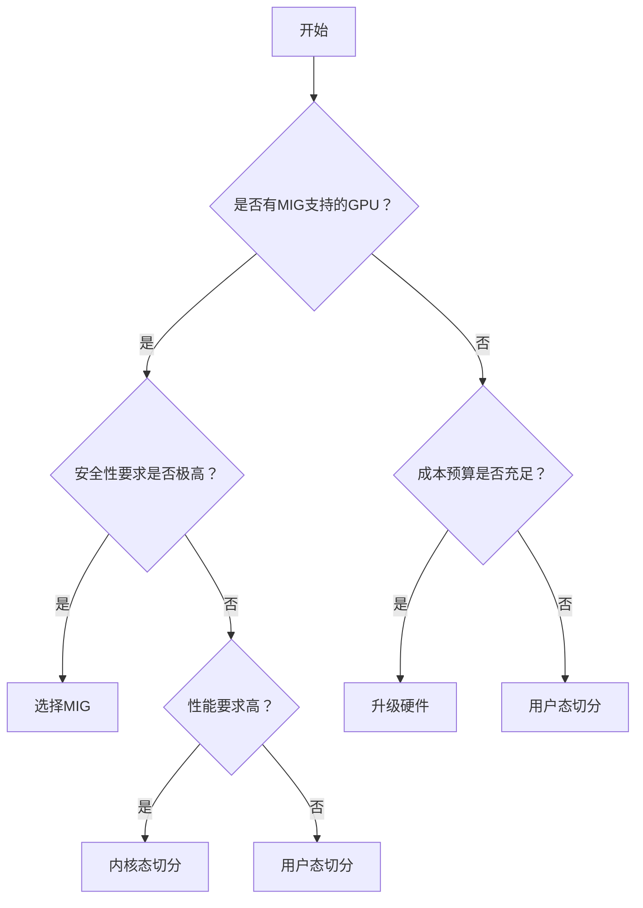
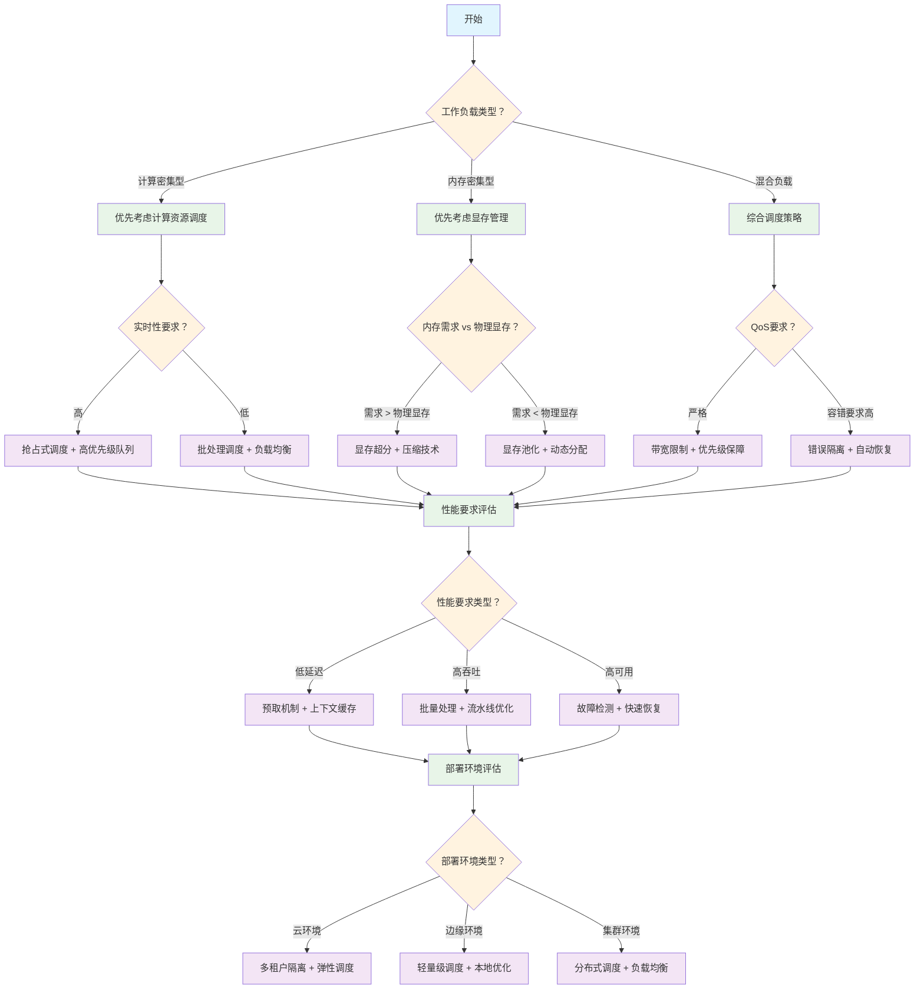
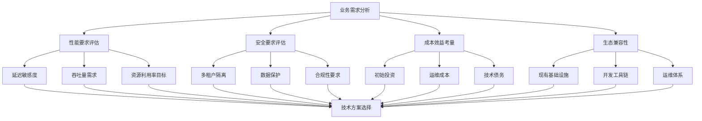

# GPU 管理相关技术深度解析 - 虚拟化、切分及远程调用

本文将深入探讨 GPU 资源管理的三大核心技术:虚拟化、切分和远程调用。通过系统性分析这些关键技术的实现原理、架构设计和最佳实践,为读者提供全面的 GPU 资源管理技术指南。

本文不仅涵盖技术细节,还将结合实际应用场景,探讨各种技术方案的优劣势及其适用场景。

## 目录

- [GPU 管理相关技术深度解析 - 虚拟化、切分及远程调用](#gpu-管理相关技术深度解析---虚拟化切分及远程调用)
  - [目录](#目录)
  - [1. 术语表](#1-术语表)
  - [2. 引言](#2-引言)
    - [2.1 GPU 计算资源需求的快速增长背景](#21-gpu-计算资源需求的快速增长背景)
    - [2.2 传统 GPU 使用模式的局限性](#22-传统-gpu-使用模式的局限性)
      - [2.2.1 资源利用率低下](#221-资源利用率低下)
      - [2.2.2 资源分配不灵活](#222-资源分配不灵活)
      - [2.2.3 多租户隔离困难](#223-多租户隔离困难)
      - [2.2.4 扩展性受限](#224-扩展性受限)
      - [2.2.5 远程访问与网络依赖问题](#225-远程访问与网络依赖问题)
      - [2.2.6 技术栈集成与标准化缺失](#226-技术栈集成与标准化缺失)
    - [2.3 GPU 管理核心技术概览](#23-gpu-管理核心技术概览)
      - [2.3.1 GPU虚拟化技术](#231-gpu虚拟化技术)
      - [2.3.2 GPU切分技术](#232-gpu切分技术)
      - [2.3.3 GPU远程调用技术](#233-gpu远程调用技术)
      - [2.3.4 技术集成与协同](#234-技术集成与协同)
    - [2.4 本文研究范围](#24-本文研究范围)
      - [2.4.1 核心技术领域](#241-核心技术领域)
      - [2.4.2 实现层面分析](#242-实现层面分析)
      - [2.4.3 应用场景覆盖](#243-应用场景覆盖)
      - [2.4.4 技术边界和限制](#244-技术边界和限制)
      - [2.4.5 目标读者群体](#245-目标读者群体)
    - [2.5 核心概念解析](#25-核心概念解析)
      - [2.5.1 GPU切分技术](#251-gpu切分技术)
      - [2.5.2 时间片调度机制](#252-时间片调度机制)
      - [2.5.3 显存超分技术](#253-显存超分技术)
      - [2.5.4 侧信道攻击防护](#254-侧信道攻击防护)
      - [2.5.5 GPU资源池化技术](#255-gpu资源池化技术)
      - [2.5.6 容器化GPU管理](#256-容器化gpu管理)
  - [3. GPU硬件架构深度解析](#3-gpu硬件架构深度解析)
    - [3.1 GPU硬件架构虚拟化基础](#31-gpu硬件架构虚拟化基础)
      - [3.1.1 流式多处理器（SM）虚拟化机制](#311-流式多处理器sm虚拟化机制)
      - [3.1.2 内存控制器虚拟化架构](#312-内存控制器虚拟化架构)
      - [3.1.3 缓存层次结构虚拟化](#313-缓存层次结构虚拟化)
    - [3.2 异构GPU环境统一管理](#32-异构gpu环境统一管理)
      - [3.2.1 NVIDIA与AMD GPU架构差异分析](#321-nvidia与amd-gpu架构差异分析)
      - [3.2.2 统一GPU管理抽象层设计](#322-统一gpu管理抽象层设计)
      - [3.2.3 跨厂商兼容性处理](#323-跨厂商兼容性处理)
    - [3.3 本章要点总结](#33-本章要点总结)
  - [4. GPU 虚拟化技术基础](#4-gpu-虚拟化技术基础)
    - [4.1 GPU 虚拟化层次结构](#41-gpu-虚拟化层次结构)
      - [4.1.1 硬件层虚拟化（如 NVIDIA MIG）](#411-硬件层虚拟化如-nvidia-mig)
      - [4.1.2 内核态虚拟化](#412-内核态虚拟化)
      - [4.1.3 用户态资源管理](#413-用户态资源管理)
    - [4.2 GPU 虚拟化的核心挑战](#42-gpu-虚拟化的核心挑战)
      - [4.2.1 资源隔离与共享的平衡](#421-资源隔离与共享的平衡)
      - [4.2.2 性能损耗控制](#422-性能损耗控制)
      - [4.2.3 多租户环境下的安全性](#423-多租户环境下的安全性)
      - [4.2.4 异构 GPU 环境的兼容性](#424-异构-gpu-环境的兼容性)
    - [4.3 本章要点总结](#43-本章要点总结)
    - [4.4 与GPU切分技术的关系](#44-与gpu切分技术的关系)
  - [5. GPU 切分技术深度解析](#5-gpu-切分技术深度解析)
    - [5.1 硬件级 GPU 切分](#51-硬件级-gpu-切分)
      - [5.1.1 NVIDIA MIG（Multi-Instance GPU）技术](#511-nvidia-migmulti-instance-gpu技术)
        - [5.1.1.1 MIG 的工作原理和架构](#5111-mig-的工作原理和架构)
        - [5.1.1.2 GPU 实例的创建和管理](#5112-gpu-实例的创建和管理)
        - [5.1.1.3 硬件级隔离的优势和限制](#5113-硬件级隔离的优势和限制)
        - [5.1.1.4 支持的 GPU 型号和配置选项](#5114-支持的-gpu-型号和配置选项)
    - [5.2 软件级 GPU 切分](#52-软件级-gpu-切分)
      - [5.2.1 用户态资源配额方案](#521-用户态资源配额方案)
        - [5.2.1.1 CUDA API 拦截和转发机制](#5211-cuda-api-拦截和转发机制)
      - [5.2.2 内核态虚拟化方案](#522-内核态虚拟化方案)
        - [5.2.2.1 ioctl、mmap 等系统调用的拦截](#5221-ioctlmmap-等系统调用的拦截)
        - [5.2.2.2 容器环境下的 GPU 资源分配](#5222-容器环境下的-gpu-资源分配)
    - [5.3 切分技术选型指南](#53-切分技术选型指南)
      - [5.3.1 技术方案对比](#531-技术方案对比)
      - [5.3.2 应用场景选择](#532-应用场景选择)
      - [5.3.3 部署决策流程](#533-部署决策流程)
      - [5.3.4 性能调优建议](#534-性能调优建议)
    - [5.4 与虚拟化技术的关联](#54-与虚拟化技术的关联)
  - [6. GPU资源管理核心技术](#6-gpu资源管理核心技术)
    - [6.1 显存管理技术](#61-显存管理技术)
      - [6.1.1 显存池化和动态分配](#611-显存池化和动态分配)
      - [6.1.2 统一内存（Unified Memory）的利用](#612-统一内存unified-memory的利用)
      - [6.1.3 显存超分技术和风险控制](#613-显存超分技术和风险控制)
    - [6.2 计算资源调度技术](#62-计算资源调度技术)
      - [6.2.1 GPU 核心的时间片分配](#621-gpu-核心的时间片分配)
      - [6.2.2 多任务并发执行策略](#622-多任务并发执行策略)
      - [6.2.3 优先级调度和抢占机制](#623-优先级调度和抢占机制)
    - [6.3 性能隔离机制](#63-性能隔离机制)
      - [6.3.1 带宽限制和 QoS 保障](#631-带宽限制和-qos-保障)
      - [6.3.2 错误隔离和故障恢复](#632-错误隔离和故障恢复)
      - [6.3.3 监控和性能分析工具](#633-监控和性能分析工具)
    - [6.4 AI大模型训练场景GPU资源管理优化](#64-ai大模型训练场景gpu资源管理优化)
      - [6.4.1 大模型训练的GPU资源需求特征](#641-大模型训练的gpu资源需求特征)
      - [6.4.2 动态资源调度优化](#642-动态资源调度优化)
      - [6.4.3 内存优化策略](#643-内存优化策略)
    - [6.5 技术选型决策树](#65-技术选型决策树)
    - [6.6 故障排查指南](#66-故障排查指南)
  - [7. GPU管理技术实践指南](#7-gpu管理技术实践指南)
    - [7.1 部署和配置最佳实践](#71-部署和配置最佳实践)
      - [7.1.1 系统环境准备](#711-系统环境准备)
      - [7.1.2 MIG配置和管理](#712-mig配置和管理)
    - [7.2 容器生态集成](#72-容器生态集成)
      - [7.2.1 Kubernetes集成](#721-kubernetes集成)
      - [7.2.2 Docker集成](#722-docker集成)
    - [7.3 监控和运维](#73-监控和运维)
      - [7.3.1 监控指标体系](#731-监控指标体系)
      - [7.3.2 故障处理流程](#732-故障处理流程)
    - [7.4 技术选型指南](#74-技术选型指南)
      - [7.4.1 虚拟化技术选择](#741-虚拟化技术选择)
      - [7.4.2 部署架构选择](#742-部署架构选择)
    - [7.5 性能调优指南](#75-性能调优指南)
      - [7.5.1 GPU性能优化策略](#751-gpu性能优化策略)
      - [7.5.2 网络性能优化](#752-网络性能优化)
    - [7.6 安全配置指南](#76-安全配置指南)
      - [7.6.1 访问控制配置](#761-访问控制配置)
      - [7.6.2 网络安全配置](#762-网络安全配置)
    - [7.7 故障排查手册](#77-故障排查手册)
      - [7.7.1 常见问题诊断](#771-常见问题诊断)
      - [7.7.2 自动化故障恢复](#772-自动化故障恢复)
    - [7.8 部署检查清单](#78-部署检查清单)
      - [7.8.1 部署前检查](#781-部署前检查)
      - [7.8.2 部署后验证](#782-部署后验证)
      - [7.8.3 配置模板参考](#783-配置模板参考)
    - [7.9 发展趋势与最佳实践](#79-发展趋势与最佳实践)
      - [7.9.1 新兴技术趋势](#791-新兴技术趋势)
      - [7.9.2 标准化进展](#792-标准化进展)
  - [8. GPU 远程调用技术](#8-gpu-远程调用技术)
    - [8.1 远程 GPU 调用的基本原理](#81-远程-gpu-调用的基本原理)
      - [8.1.1 网络透明的 GPU 访问机制](#811-网络透明的-gpu-访问机制)
      - [8.1.2 客户端-服务器架构设计](#812-客户端-服务器架构设计)
      - [8.1.3 网络通信协议](#813-网络通信协议)
    - [8.2 性能优化策略](#82-性能优化策略)
      - [8.2.1 延迟优化](#821-延迟优化)
      - [8.2.2 带宽优化](#822-带宽优化)
    - [8.3 缓存优化](#83-缓存优化)
      - [8.3.1 结果缓存机制](#831-结果缓存机制)
      - [8.3.2 智能预取策略](#832-智能预取策略)
    - [8.4 容错与可靠性](#84-容错与可靠性)
      - [8.4.1 故障检测机制](#841-故障检测机制)
      - [8.4.2 故障恢复策略](#842-故障恢复策略)
      - [8.4.3 高可用性架构](#843-高可用性架构)
  - [9. 技术方案对比分析](#9-技术方案对比分析)
    - [9.1 用户态 vs 内核态虚拟化](#91-用户态-vs-内核态虚拟化)
      - [9.1.1 技术实现复杂度对比](#911-技术实现复杂度对比)
      - [9.1.2 性能基准测试框架](#912-性能基准测试框架)
      - [9.1.3 性能开销分析](#913-性能开销分析)
      - [9.1.4 安全性和稳定性评估](#914-安全性和稳定性评估)
      - [9.1.5 部署和维护成本](#915-部署和维护成本)
      - [9.1.6 企业级应用的适用性](#916-企业级应用的适用性)
    - [9.2 本地切分 vs 远程调用](#92-本地切分-vs-远程调用)
      - [9.2.1 延迟和吞吐量对比](#921-延迟和吞吐量对比)
      - [9.2.2 资源利用率分析](#922-资源利用率分析)
      - [9.2.3 扩展性和灵活性](#923-扩展性和灵活性)
      - [9.2.4 故障容错能力](#924-故障容错能力)
    - [9.3 不同切分策略对比](#93-不同切分策略对比)
      - [9.3.1 时间切分 vs 空间切分](#931-时间切分-vs-空间切分)
      - [9.3.2 混合切分策略](#932-混合切分策略)
  - [10. 实际应用场景分析](#10-实际应用场景分析)
    - [10.1 云计算环境](#101-云计算环境)
      - [10.1.1 多租户GPU资源管理](#1011-多租户gpu资源管理)
      - [10.1.2 弹性伸缩机制](#1012-弹性伸缩机制)
    - [10.2 边缘计算场景](#102-边缘计算场景)
      - [10.2.1 资源受限环境优化](#1021-资源受限环境优化)
      - [10.2.2 低延迟要求的实时处理](#1022-低延迟要求的实时处理)
    - [10.3 高性能计算集群](#103-高性能计算集群)
      - [10.3.1 大规模并行任务调度](#1031-大规模并行任务调度)
      - [10.3.2 跨节点GPU通信优化](#1032-跨节点gpu通信优化)
    - [10.4 典型案例分析](#104-典型案例分析)
      - [10.4.1 某云服务商GPU资源池化案例](#1041-某云服务商gpu资源池化案例)
      - [10.4.2 自动驾驶边缘计算部署案例](#1042-自动驾驶边缘计算部署案例)
      - [10.4.3 科研院所HPC集群案例](#1043-科研院所hpc集群案例)
    - [10.5 场景化技术选型指南](#105-场景化技术选型指南)
      - [10.5.1 应用场景对比分析](#1051-应用场景对比分析)
      - [10.5.2 技术选型决策矩阵](#1052-技术选型决策矩阵)
      - [10.5.3 部署策略建议](#1053-部署策略建议)
    - [10.6 新兴应用场景](#106-新兴应用场景)
      - [10.6.1 大模型训练集群](#1061-大模型训练集群)
      - [10.6.2 多模态推理服务](#1062-多模态推理服务)
      - [10.6.3 联邦学习环境](#1063-联邦学习环境)
  - [11. 总结与展望](#11-总结与展望)
    - [11.1 技术总结](#111-技术总结)
      - [11.1.1 技术成熟度评估](#1111-技术成熟度评估)
      - [11.1.2 虚拟化技术演进](#1112-虚拟化技术演进)
      - [11.1.3 切分技术价值分析](#1113-切分技术价值分析)
      - [11.1.4 远程调用技术价值](#1114-远程调用技术价值)
    - [11.2 技术发展趋势](#112-技术发展趋势)
      - [11.2.1 AI驱动的GPU资源管理](#1121-ai驱动的gpu资源管理)
      - [11.2.2 技术挑战与解决方案](#1122-技术挑战与解决方案)
    - [11.3 ROI计算模型](#113-roi计算模型)
      - [11.3.1 成本效益分析](#1131-成本效益分析)
      - [11.3.2 性能提升收益量化](#1132-性能提升收益量化)
    - [11.4 风险管控矩阵](#114-风险管控矩阵)
      - [11.4.1 技术风险评估](#1141-技术风险评估)
      - [11.4.2 业务风险分析](#1142-业务风险分析)
    - [11.5 最佳实践建议](#115-最佳实践建议)
      - [11.5.1 渐进式部署方案](#1151-渐进式部署方案)
      - [11.5.2 监控和运维体系](#1152-监控和运维体系)
      - [11.5.3 性能调优指南](#1153-性能调优指南)
      - [11.5.4 故障排除和调试](#1154-故障排除和调试)
    - [11.6 技术选型决策工具](#116-技术选型决策工具)
      - [11.6.1 技术选型决策矩阵](#1161-技术选型决策矩阵)
      - [11.6.2 标准化路线图](#1162-标准化路线图)
    - [11.7 实践建议](#117-实践建议)
      - [11.7.1 技术融合趋势](#1171-技术融合趋势)
      - [11.7.2 技术演进路径](#1172-技术演进路径)
    - [11.8 未来展望](#118-未来展望)
      - [11.8.1 技术发展趋势](#1181-技术发展趋势)
      - [11.8.2 标准化和生态发展](#1182-标准化和生态发展)
    - [11.9 结语](#119-结语)
  - [12. 参考资料](#12-参考资料)
    - [12.1 官方技术文档](#121-官方技术文档)
    - [12.2 容器化和编排平台](#122-容器化和编排平台)
    - [12.3 虚拟化平台](#123-虚拟化平台)
    - [12.4 学术论文和研究](#124-学术论文和研究)
    - [12.5 开源项目和工具](#125-开源项目和工具)
    - [12.6 技术标准和规范](#126-技术标准和规范)
    - [12.7 性能评估和基准测试](#127-性能评估和基准测试)
    - [12.8 GPU管理和监控](#128-gpu管理和监控)
    - [12.9 技术博客和案例研究](#129-技术博客和案例研究)
    - [12.10 在线资源和社区](#1210-在线资源和社区)

---

## 1. 术语表

| 术语 | 全称 | 定义 |
|------|------|------|
| GPU | Graphics Processing Unit | 图形处理单元，专门用于并行计算的处理器 |
| MIG | Multi-Instance GPU | NVIDIA的多实例GPU技术，支持硬件级GPU切分 |
| HAMi | Heterogeneous AI Computing Middleware | 异构AI计算中间件，开源GPU资源管理方案 |
| CUDA | Compute Unified Device Architecture | NVIDIA的并行计算平台和编程模型 |
| API | Application Programming Interface | 应用程序编程接口 |
| cgroup | Control Groups | Linux内核功能，用于限制和隔离进程组的资源使用 |
| ioctl | Input/Output Control | 设备输入输出控制系统调用 |
| mmap | Memory Map | 内存映射系统调用 |
| QoS | Quality of Service | 服务质量，用于保证网络或系统性能 |
| SLA | Service Level Agreement | 服务级别协议 |
| ROI | Return on Investment | 投资回报率 |
| NPU | Neural Processing Unit | 神经网络处理单元 |
| DPU | Data Processing Unit | 数据处理单元 |
| FPGA | Field-Programmable Gate Array | 现场可编程门阵列 |
| VGPU | Virtual GPU | 虚拟GPU，通过软件实现的GPU虚拟化技术 |
| SR-IOV | Single Root I/O Virtualization | 单根I/O虚拟化，硬件级虚拟化技术 |
| IOMMU | Input-Output Memory Management Unit | 输入输出内存管理单元，用于设备虚拟化 |
| PCIe | Peripheral Component Interconnect Express | 高速串行计算机扩展总线标准 |
| NUMA | Non-Uniform Memory Access | 非统一内存访问架构 |
| UVM | Unified Virtual Memory | 统一虚拟内存，CUDA的内存管理技术 |
| COW | Copy-on-Write | 写时复制，内存管理优化技术 |
| LRU | Least Recently Used | 最近最少使用，缓存替换算法 |
| OOM | Out of Memory | 内存不足错误 |
| ZSTD | Zstandard | 高效的无损数据压缩算法 |
| LZ4 | - | 快速无损数据压缩算法 |
| RDMA | Remote Direct Memory Access | 远程直接内存访问技术 |
| InfiniBand | - | 高性能计算和数据中心互连技术 |
| NVLink | - | NVIDIA的高速GPU互连技术 |
| NVSwitch | - | NVIDIA的GPU交换芯片 |
| NCCL | NVIDIA Collective Communication Library | NVIDIA集合通信库 |
| cuDNN | CUDA Deep Neural Network Library | CUDA深度神经网络库 |
| TensorRT | - | NVIDIA的深度学习推理优化库 |
| Triton | - | NVIDIA的推理服务器 |
| Docker | - | 容器化平台 |
| Kubernetes | K8s | 容器编排平台 |
| Prometheus | - | 开源监控和告警系统 |
| Grafana | - | 开源数据可视化平台 |
| ROCm | Radeon Open Compute | AMD的开源GPU计算平台 |
| HIP | Heterogeneous-Compute Interface for Portability | AMD的异构计算接口 |
| HBM | High Bandwidth Memory | 高带宽内存 |
| GDDR | Graphics Double Data Rate | 图形双倍数据速率内存 |
| ECC | Error-Correcting Code | 错误纠正码内存 |
| DMA | Direct Memory Access | 直接内存访问 |
| IOVA | I/O Virtual Address | I/O虚拟地址 |
| SMMU | System Memory Management Unit | 系统内存管理单元 |
| ATS | Address Translation Services | 地址转换服务 |
| PASID | Process Address Space Identifier | 进程地址空间标识符 |

---

## 2. 引言

随着人工智能、深度学习、科学计算等领域的快速发展，GPU计算资源需求呈现指数级增长态势。GPU已从传统的图形渲染专用处理器演进为现代计算基础设施的核心组件，在大规模机器学习训练和推理任务中发挥关键作用。然而，传统GPU使用模式在资源利用效率、多租户隔离、弹性扩展等方面存在显著局限性。

本文系统性地分析GPU管理技术的发展背景、传统使用模式的技术瓶颈、GPU虚拟化技术的核心价值和发展趋势，并明确研究范围和核心概念，为深入理解后续技术内容构建理论基础。

### 2.1 GPU 计算资源需求的快速增长背景

近年来，AI应用的复杂度和规模呈现持续增长趋势，特别是大语言模型（LLM）的快速发展，对GPU计算能力提出了前所未有的技术挑战。从GPT-3的1750亿参数规模发展至GPT-4的万亿级参数体量，模型参数规模的指数级增长直接驱动了GPU计算资源需求的急剧扩张。

**关键驱动因素：**

- **模型规模增长**：从BERT的3.4亿参数发展到当前的万亿级参数
- **应用场景扩展**：从研究机构扩展到金融、医疗、自动驾驶、制造业等各行各业
- **计算密集度提升**：大模型训练需要数千张GPU协同工作，实时推理服务对性能要求极高

### 2.2 传统 GPU 使用模式的局限性

传统GPU使用模式在现代AI工作负载场景下暴露出显著的技术局限性，这些瓶颈严重制约了GPU资源的有效利用率和系统架构的可扩展性。

#### 2.2.1 资源利用率低下

**问题描述：**
单个应用往往无法充分利用整个 GPU 的计算能力，导致严重的资源浪费。

**具体表现：**

- **计算资源闲置**：许多AI推理任务无法充分利用GPU计算能力（典型场景下利用率偏低）
- **显存浪费**：小模型推理显存使用量远低于GPU配备容量
- **批处理效率低**：单任务处理无法充分利用GPU的并行处理能力
- **峰谷差异大**：业务高峰期资源不足，低谷期大量闲置

**典型场景：**

- 推理服务在生产环境中的GPU利用率普遍偏低
- 开发测试环境中资源利用率更低

*注：具体利用率数据因工作负载类型、模型规模和部署方式而异。*

#### 2.2.2 资源分配不灵活

**问题描述：**
GPU 通常以整卡为单位分配，无法满足不同应用的精细化资源需求。

**具体挑战：**

- **粒度过粗**：无法根据应用实际需求分配适量的计算资源
- **资源浪费**：小任务占用整张GPU卡，造成资源浪费
- **调度困难**：无法实现多个小任务共享单张GPU
- **成本高昂**：每个应用都需要独占GPU，增加硬件成本

**业务影响：**

- 开发团队需要排队等待GPU资源
- 无法支持细粒度的资源计费
- 难以实现按需扩缩容

#### 2.2.3 多租户隔离困难

**问题描述：**
多个应用共享 GPU 时缺乏有效的隔离机制，容易出现资源竞争和安全问题。

**安全风险：**

- **数据泄露**：共享显存可能导致敏感数据泄露
- **侧信道攻击**：恶意应用可能通过时序分析获取其他应用信息
- **资源抢占**：高优先级任务可能被低优先级任务影响
- **故障传播**：一个应用的异常可能影响其他应用

**管理挑战：**

- 缺乏有效的资源配额管理
- 难以实现公平调度
- 无法提供SLA保障

#### 2.2.4 扩展性受限

**问题描述：**
传统模式下，GPU 资源的扩展受到物理硬件的限制，难以实现弹性伸缩。

**技术限制：**

- **物理边界**：单机GPU数量受主板和电源限制
- **网络瓶颈**：跨节点GPU通信延迟高
- **管理复杂**：大规模GPU集群管理复杂度指数级增长
- **故障处理**：硬件故障影响整个节点的可用性

**运维挑战：**

- 无法快速响应业务需求变化
- 硬件采购和部署周期长
- 维护成本随规模线性增长

#### 2.2.5 远程访问与网络依赖问题

**问题描述：**
传统GPU使用模式缺乏有效的远程访问机制，限制了资源的灵活调度和跨地域协作。

| 问题类别 | 具体挑战 | 问题描述 |
|---------|---------|----------|
| **网络性能瓶颈** | 延迟敏感 | GPU计算任务对网络延迟极其敏感，传统网络架构难以满足实时性要求 |
| | 带宽限制 | 大规模数据传输受网络带宽限制，影响整体性能 |
| | 协议开销 | 传统网络协议开销大，不适合GPU密集型计算场景 |
| | QoS保障 | 缺乏针对GPU工作负载的网络服务质量保障机制 |
| **资源调度局限** | 地域限制 | GPU资源无法跨数据中心灵活调度 |
| | 负载均衡困难 | 难以实现跨节点的智能负载分配 |
| | 故障恢复复杂 | 网络故障时缺乏有效的容错和恢复机制 |
| | 资源发现困难 | 缺乏统一的远程GPU资源发现和管理机制 |
| **安全与可靠性挑战** | 数据传输安全 | 远程访问时数据传输缺乏有效加密保护 |
| | 身份认证复杂 | 跨网络的身份验证和授权机制不完善 |
| | 网络攻击风险 | 暴露在网络中的GPU服务面临安全威胁 |
| | 服务可用性 | 网络不稳定导致GPU服务可用性下降 |

#### 2.2.6 技术栈集成与标准化缺失

**问题描述：**
现有GPU管理技术缺乏统一标准，各厂商方案互不兼容，增加了系统集成复杂度。

| 问题类别 | 具体问题 | 问题描述 |
|---------|---------|----------|
| **标准化问题** | 接口不统一 | 不同厂商的GPU虚拟化接口标准不一致 |
| | 协议碎片化 | 缺乏统一的GPU资源管理协议 |
| | API兼容性差 | 应用程序难以在不同GPU管理平台间迁移 |
| | 监控标准缺失 | 缺乏统一的GPU资源监控和度量标准 |
| **集成复杂性** | 多技术栈并存 | 虚拟化、切分、远程调用技术各自独立，难以协同 |
| | 配置管理复杂 | 不同技术方案的配置和管理方式差异巨大 |
| | 运维工具分散 | 缺乏统一的GPU资源运维管理工具 |
| | 技能要求高 | 需要掌握多种技术栈，增加人力成本 |
| **对核心技术的影响** | 虚拟化技术 | 缺乏标准化导致虚拟化方案选择困难，厂商锁定风险高 |
| | 切分技术 | 不同切分方案无法互操作，资源池化效果受限 |
| | 远程调用技术 | 协议不统一导致跨平台远程调用困难，限制了资源的全局优化 |

### 2.3 GPU 管理核心技术概览

现代GPU资源管理涉及三大核心技术：虚拟化、切分和远程调用。这些技术相互补充，共同构建了完整的GPU资源管理解决方案。本节将系统介绍这三大技术的基本原理和实现方式，为后续章节的深入分析奠定基础。

#### 2.3.1 GPU虚拟化技术

**技术原理：**

GPU虚拟化通过在硬件和应用之间引入抽象层，实现GPU资源的灵活分配、安全隔离和高效利用。

**主要实现方式：**

- **硬件级虚拟化**：直接在GPU硬件层面提供虚拟化支持
  - **定义**：利用GPU硬件内置的虚拟化功能，在物理层面实现资源隔离
  - **技术特点**：硬件级隔离、性能开销最小、安全性最高
  - **典型示例**：NVIDIA MIG（将A100/H100划分为独立GPU实例）、AMD SR-IOV（PCIe级别的硬件虚拟化）、GPU Passthrough（虚拟机直接访问物理GPU）

- **内核态虚拟化**：在操作系统内核层面实现GPU资源虚拟化
  - **定义**：通过修改或拦截GPU硬件驱动程序，在内核空间实现资源管理和调度
  - **技术特点**：系统级控制、精细资源管理、需要内核模块支持
  - **典型示例**：NVIDIA vGPU（通过Hypervisor实现）、Intel GVT-g（内核级GPU虚拟化）、自定义内核模块拦截ioctl系统调用

- **用户态虚拟化**：在用户空间实现GPU资源的配额控制和管理
  - **定义**：通过拦截GPU API调用，在应用程序层面实现资源限制和调度
  - **技术特点**：部署简单、兼容性好、无需内核修改、基于软件配额
  - **典型示例**：HAMi（通过LD_PRELOAD拦截CUDA API）、vCUDA（虚拟CUDA运行时）、Docker GPU资源限制、Kubernetes GPU共享插件

- **混合虚拟化**：结合多种虚拟化技术的综合解决方案
  - **定义**：同时使用硬件和软件虚拟化技术，发挥各自优势
  - **技术特点**：灵活性高、适应性强、可根据场景选择最优方案
  - **典型示例**：MIG+容器化（硬件隔离+软件管理）、SR-IOV+API拦截（硬件虚拟化+软件配额）、多层次资源管理架构

**核心价值：**

- 提高资源利用率和灵活性
- 实现多租户安全隔离
- 支持动态资源调整和负载均衡

#### 2.3.2 GPU切分技术

**虚拟化与切分的关系：**

GPU虚拟化和GPU切分是两个相关但不同的概念：

- **GPU虚拟化**：是实现技术手段，通过软件或硬件层面创建虚拟GPU实例，提供资源抽象和隔离
- **GPU切分**：是资源分配策略，定义如何将物理GPU资源划分给不同的虚拟实例或应用
- **关系**：虚拟化提供了实现切分的技术基础，切分定义了虚拟化的资源分配方式

**技术原理：**

GPU切分技术将单个物理GPU划分为多个独立的逻辑单元，每个单元可以独立运行不同的工作负载。切分技术通常与虚拟化技术结合使用，虚拟化负责创建隔离环境，切分负责定义资源分配策略。

**主要切分方式：**

- **时间切分**：基于时间片的GPU计算资源分配
  - 抢占式调度：支持高优先级任务抢占
  - 协作式调度：任务主动释放资源
  - 混合调度：结合抢占式和协作式的优势

- **空间切分**：将GPU物理资源进行空间划分
  - 计算单元切分：SM（流多处理器）级别的资源分割
  - 显存切分：独立的显存空间分配
  - 带宽切分：内存带宽的隔离和限制

- **混合切分**：时间和空间切分的组合
  - 动态调整：根据负载动态调整切分策略
  - 优先级管理：不同优先级任务的差异化处理

**解决方案要点：**

- **性能隔离机制**：通过硬件级隔离和软件配额实现公平性保障
- **上下文切换优化**：采用轻量级切换算法和状态缓存技术降低开销
- **资源整合策略**：智能碎片整理和动态资源重分配机制

#### 2.3.3 GPU远程调用技术

**技术原理：**

GPU远程调用技术使应用程序能够透明地访问和使用远程GPU资源，突破单机GPU数量限制。

**主要实现架构：**

- **API代理模式**：拦截本地GPU API调用并转发到远程GPU
  - CUDA API代理：透明的CUDA调用转发
  - OpenCL代理：跨平台的OpenCL远程访问
  - 自定义协议：针对特定场景的优化协议

- **虚拟设备模式**：在本地创建虚拟GPU设备
  - 设备模拟：完整的GPU设备行为模拟
  - 驱动层代理：在驱动层面实现远程访问
  - 内核模块：内核态的远程GPU支持

- **分布式计算模式**：将计算任务分布到多个远程GPU
  - 任务分解：将大任务分解为子任务
  - 负载均衡：智能的任务分配策略
  - 结果聚合：分布式计算结果的合并

**关键技术要素：**

- **网络优化**：低延迟、高带宽的网络通信
- **数据传输**：高效的数据序列化和传输机制
- **状态同步**：远程GPU状态的一致性管理
- **错误处理**：网络故障和设备故障的恢复机制

#### 2.3.4 技术集成与协同

**技术融合趋势：**

现代GPU管理系统通常将三大技术进行有机结合：

- **虚拟化+切分**：在虚拟化基础上实现更细粒度的资源切分
- **切分+远程调用**：将切分后的GPU资源通过网络提供服务
- **虚拟化+远程调用**：远程访问虚拟化的GPU资源池
- **三技术融合**：构建统一的GPU资源管理平台

**协同优势：**

- **资源利用最大化**：通过多层次的资源管理提高整体利用率
- **灵活性增强**：支持多样化的部署和使用模式
- **可扩展性提升**：突破单机限制，实现集群级资源管理
- **成本效益优化**：通过资源共享降低总体拥有成本

**实施考量：**

- **性能开销**：多层技术栈可能带来的性能损失
- **复杂度管理**：系统复杂度与维护成本的平衡
- **兼容性保障**：确保与现有应用和框架的兼容性
- **安全性要求**：多租户和网络环境下的安全保障

### 2.4 本文研究范围

本文将深入探讨 GPU 虚拟化、切分技术与远程调用机制，涵盖技术原理、实现方案、性能分析、应用场景等多个维度，为读者提供全面的技术指导和实践建议。

#### 2.4.1 核心技术领域

| 技术类别 | 核心技术 | 技术特点 |
|---------|---------|----------|
| **GPU虚拟化技术** | 硬件层虚拟化 | NVIDIA MIG、AMD SR-IOV等硬件级资源隔离 |
| | 内核态虚拟化 | 驱动层拦截和管理，系统级资源控制 |
| | 用户态虚拟化 | API层封装和代理，应用级透明访问 |
| | 容器化GPU资源管理 | 容器级GPU资源分配和隔离 |
| **GPU切分技术** | 时间片调度机制 | 算法优化，时间维度资源共享 |
| | 空间切分策略 | 资源隔离，空间维度资源分割 |
| | 混合切分模式 | 时空结合的设计与实现 |
| | 动态资源分配 | 负载均衡，自适应资源调整 |
| **远程GPU调用** | GPU资源网络化访问 | 透明的远程GPU资源访问机制 |
| | 分布式GPU计算架构 | 多节点GPU资源协同计算 |
| | 跨节点GPU资源调度 | 集群级GPU资源统一调度 |
| | 网络优化和延迟控制 | 高性能网络通信和延迟优化 |

#### 2.4.2 实现层面分析

| 分析维度 | 关键要素 | 技术要点 |
|---------|---------|----------|
| **技术原理深度解析** | 底层硬件架构 | 虚拟化支持机制和硬件特性分析 |
| | 操作系统内核 | GPU资源管理和内核级调度机制 |
| | 驱动程序适配 | 虚拟化层驱动程序设计和兼容性 |
| | 应用程序接口 | 透明化处理和API层封装技术 |
| **实现方案对比** | 技术特点分析 | 不同虚拟化方案的优劣势对比 |
| | 性能评估 | 开销分析和资源利用率优化 |
| | 安全性评估 | 隔离性机制和安全防护策略 |
| | 部署维护 | 复杂度评估和运维成本分析 |
| **代码实现示例** | 核心算法 | C语言实现的关键算法逻辑 |
| | 数据结构 | 关键数据结构的设计和优化 |
| | 系统接口 | 系统调用和API封装实现 |
| | 异常处理 | 错误处理和异常恢复机制 |

#### 2.4.3 应用场景覆盖

| 应用场景 | 具体应用 | 技术特点 | 核心价值 |
|----------|----------|----------|----------|
| **云计算环境** | 公有云GPU服务 | 虚拟化实现、弹性扩缩容 | 资源池化、按需分配 |
| | 私有云GPU资源池 | 资源池化、统一管理 | 突破单机限制、大规模聚合 |
| | 混合云环境 | 跨云资源管理、数据安全 | 跨地域资源调度、故障隔离 |
| | 多租户GPU服务 | 安全隔离、资源配额 | 成本共享、SLA保障 |
| **企业级应用** | AI训练平台 | 资源调度、任务排队 | 提高利用率、降低成本 |
| | 推理服务 | 资源优化、低延迟 | 弹性扩缩、快速响应 |
| | 开发测试环境 | 资源共享、成本控制 | 简化管理、降低运维复杂度 |
| | 高性能计算集群 | 大规模并行、高吞吐 | 集群级资源统一调度 |
| **边缘计算场景** | 边缘设备虚拟化 | 轻量化、低功耗 | 资源受限环境优化 |
| | 实时计算 | 低延迟、确定性调度 | 实时性保障、性能隔离 |
| | 资源受限环境 | 功耗优化、散热管理 | 智能资源分配、动态调整 |
| | 离线部署 | 自主运行、故障自愈 | 容错机制、服务可用性 |

#### 2.4.4 技术边界和限制

**本文涵盖范围：**

- 主流GPU厂商（NVIDIA、AMD）的虚拟化技术
- Linux操作系统环境下的实现方案
- 容器和虚拟机两种虚拟化环境
- 深度学习和高性能计算工作负载

**不涉及内容：**

- 特定厂商的专有技术细节
- Windows环境下的GPU虚拟化
- 移动设备GPU的虚拟化
- 图形渲染相关的GPU虚拟化

#### 2.4.5 目标读者群体

**技术开发人员：**

- 系统架构师和技术负责人
- GPU虚拟化技术的开发工程师
- 云计算平台的技术人员
- AI基础设施的运维工程师

**决策制定者：**

- 技术管理者和CTO
- 云服务商的产品经理
- 企业IT部门负责人
- 投资和采购决策者

### 2.5 核心概念解析

为了更好地理解本文内容，以下对几个核心概念进行详细说明：

#### 2.5.1 GPU切分技术

GPU切分技术是将单个GPU的计算资源、显存等按需分配给多个应用或用户的核心技术。关于GPU切分的具体实现方式和技术分类，请参考[2.3.1节 GPU虚拟化技术](#231-gpu虚拟化技术)中的详细介绍，其中涵盖了硬件级、内核态、用户态和混合虚拟化四种主要实现方式。

#### 2.5.2 时间片调度机制

时间片调度是通过时间分片的方式让多个任务轮流使用GPU资源的调度策略，是软件级GPU虚拟化的核心机制：

**调度原理**：

- 将GPU的使用时间划分为固定或可变的时间片
- 每个任务在分配的时间片内独占GPU资源
- 时间片结束后，调度器切换到下一个任务

**关键技术**：

- **上下文切换**：保存和恢复GPU的执行状态，包括寄存器、缓存等
- **抢占机制**：支持高优先级任务抢占低优先级任务的执行
- **负载均衡**：根据任务特性和资源需求动态调整时间片大小

**性能考量**：

- 时间片过小会导致频繁的上下文切换开销
- 时间片过大会影响任务的响应性
- 需要根据具体应用场景进行优化调整

#### 2.5.3 显存超分技术

显存超分技术允许分配的虚拟显存总量超过物理显存容量，是提高GPU资源利用率的重要手段：

**核心策略**：

- **按需分页**：只有在实际访问时才分配物理显存页面
- **内存压缩**：使用LZ4、ZSTD等算法压缩不常用的显存数据
- **分层存储**：将冷数据迁移到系统内存或存储设备
- **智能预测**：基于访问模式预测和预加载热数据

**风险控制机制**：

- **内存压力监控**：实时监控显存使用情况，预警潜在的OOM风险
- **优雅降级**：在显存不足时自动降低任务优先级或暂停部分任务
- **QoS保障**：为关键任务预留显存资源，确保服务质量
- **故障恢复**：提供快速的故障检测和恢复机制

**适用场景**：

- 推理服务：模型加载后显存使用相对稳定
- 批处理任务：可以容忍一定的性能波动
- 开发测试环境：对性能要求不严格的场景

#### 2.5.4 侧信道攻击防护

侧信道攻击是通过分析系统的物理特征（如功耗、时序、电磁辐射等）来获取敏感信息的攻击方式，在GPU虚拟化环境中需要特别关注：

**攻击类型**：

- **时序攻击**：通过分析GPU操作的执行时间推断数据特征
- **功耗攻击**：监控GPU功耗变化来推断计算模式
- **缓存攻击**：利用共享缓存的访问模式泄露信息
- **内存访问攻击**：通过内存访问模式分析推断数据结构

**防护机制**：

- **时间混淆**：在操作执行时间中加入随机延迟
- **功耗平衡**：通过虚拟负载平衡GPU功耗变化
- **缓存隔离**：为不同租户分配独立的缓存分区
- **内存加密**：对敏感数据进行硬件级加密
- **访问模式随机化**：随机化内存访问顺序和模式

**实施策略**：

- 根据安全等级要求选择合适的防护措施
- 平衡安全性和性能之间的关系
- 定期评估和更新防护机制的有效性

#### 2.5.5 GPU资源池化技术

GPU资源池化技术是将分布在不同节点的GPU资源统一管理，形成逻辑上的资源池，实现资源的统一调度和分配：

**核心原理**：

- **资源抽象**：将物理分散的GPU资源抽象为统一的资源池
- **统一调度**：通过中央调度器实现全局资源的优化分配
- **动态扩缩**：根据负载需求动态调整资源池规模
- **故障隔离**：单个节点故障不影响整个资源池的可用性

**关键技术组件**：

- **资源发现与注册**：自动发现和注册集群中的GPU资源
- **负载均衡算法**：基于资源利用率、任务特性的智能分配
- **跨节点通信**：高效的GPU间数据传输和同步机制
- **资源监控**：实时监控资源状态和性能指标

**实现架构模式**：

- **集中式管理**：单一控制节点管理所有GPU资源
- **分布式管理**：多个管理节点协同工作，提高可靠性
- **混合架构**：结合集中式和分布式的优势

**应用价值**：

GPU资源池化技术在各种应用场景中的具体价值体现，请参考[2.4.3节 应用场景覆盖](#243-应用场景覆盖)中的详细分析，涵盖云计算环境、企业级应用和边缘计算等多个领域的核心价值。

#### 2.5.6 容器化GPU管理

容器化GPU管理是在容器环境中实现GPU资源的分配、隔离和管理，是云原生GPU服务的基础技术：

**技术背景**：

- **云原生趋势**：容器技术成为现代应用部署的主流方式
- **资源标准化**：容器提供了标准化的资源管理接口
- **微服务架构**：GPU服务需要适配微服务的部署模式
- **DevOps集成**：与CI/CD流水线的无缝集成

**核心技术实现**：

- **设备插件机制**：通过Kubernetes Device Plugin暴露GPU资源
- **资源配额管理**：基于容器的GPU资源限制和配额
- **运行时集成**：与Docker、containerd等容器运行时的集成
- **调度策略**：GPU感知的容器调度算法

**关键挑战与解决方案**：

- **设备隔离**：通过cgroups和namespace实现GPU设备隔离
- **驱动兼容**：容器内GPU驱动的版本兼容性管理
- **性能优化**：减少容器化带来的性能开销
- **安全加固**：容器环境下的GPU安全访问控制

**生态系统支持**：

- **NVIDIA GPU Operator**：自动化GPU节点配置和管理
- **AMD GPU Device Plugin**：AMD GPU的Kubernetes集成
- **多厂商支持**：统一的GPU资源管理接口
- **监控工具**：容器化GPU资源的监控和告警

**最佳实践**：

- 合理设置资源请求和限制，避免资源竞争
- 使用GPU节点亲和性，优化任务调度
- 实施资源配额策略，确保公平使用
- 建立完善的监控和日志体系

---

## 3. GPU硬件架构深度解析

**本章概览：**
本章将深入分析GPU硬件架构，重点探讨流式多处理器（SM）、内存控制器、缓存层次结构等核心硬件组件的虚拟化机制，为理解GPU虚拟化技术的底层实现原理提供硬件基础。

**学习目标：**

- 深入理解GPU硬件架构的虚拟化支持机制
- 掌握SM、内存控制器等关键组件的虚拟化实现
- 了解硬件级资源隔离的技术原理
- 理解异构GPU环境的硬件差异和统一管理挑战

### 3.1 GPU硬件架构虚拟化基础

#### 3.1.1 流式多处理器（SM）虚拟化机制

**SM架构与虚拟化支持：**

现代GPU的SM（Streaming Multiprocessor）是GPU计算的核心单元，其虚拟化机制直接影响GPU资源分配的粒度和效率。

**NVIDIA Ampere架构SM虚拟化特性：**

- **硬件级分区支持**：每个SM包含64个CUDA核心，支持硬件级的资源分区
- **独立调度器**：每个SM配备4个warp调度器，支持独立的任务调度
- **专用寄存器文件**：65536个32位寄存器，支持上下文隔离
- **共享内存分区**：128KB共享内存支持动态分区和隔离

```c
// SM虚拟化管理结构
typedef struct {
    uint32_t sm_id;                    // SM标识符
    uint32_t allocated_cores;          // 已分配的CUDA核心数
    uint32_t total_cores;              // 总CUDA核心数
    uint32_t allocated_registers;      // 已分配寄存器数量
    uint32_t shared_memory_partition;  // 共享内存分区大小
    uint32_t warp_scheduler_mask;      // warp调度器分配掩码
    struct vgpu_context *contexts[MAX_VGPU_PER_SM]; // 虚拟GPU上下文
} sm_virtualization_t;

// SM资源分配函数
int allocate_sm_resources(sm_virtualization_t *sm, 
                         uint32_t vgpu_id, 
                         uint32_t core_count, 
                         uint32_t register_count) {
    // 检查资源可用性
    if (sm->allocated_cores + core_count > sm->total_cores) {
        return -ENOMEM;
    }
    
    // 分配CUDA核心
    sm->allocated_cores += core_count;
    
    // 分配寄存器资源
    sm->allocated_registers += register_count;
    
    // 更新调度器掩码
    sm->warp_scheduler_mask |= (1 << vgpu_id);
    
    return 0;
}
```

**AMD RDNA架构计算单元虚拟化：**

- **计算单元（CU）分区**：每个CU包含64个流处理器，支持工作组级别的隔离
- **波前调度器**：独立的波前调度机制，支持多租户并发
- **标量寄存器文件**：2048个标量寄存器，支持上下文保存和恢复
- **本地数据共享（LDS）**：64KB LDS支持动态分区

#### 3.1.2 内存控制器虚拟化架构

**内存控制器虚拟化的核心挑战：**

内存控制器是GPU性能的关键瓶颈，其虚拟化实现直接影响多租户环境下的性能隔离效果。

**NVIDIA HBM内存控制器虚拟化：**

```c
// 内存控制器虚拟化结构
typedef struct {
    uint32_t mc_id;                    // 内存控制器ID
    uint64_t total_bandwidth;          // 总内存带宽（GB/s）
    uint64_t allocated_bandwidth;      // 已分配带宽
    uint32_t channel_count;            // 内存通道数量
    uint32_t partition_mask;           // 分区掩码
    struct {
        uint32_t vgpu_id;
        uint64_t bandwidth_quota;      // 带宽配额
        uint32_t priority;             // 优先级
        uint64_t access_pattern;       // 访问模式统计
    } partitions[MAX_MEMORY_PARTITIONS];
} memory_controller_virt_t;

// 内存带宽分配函数
int allocate_memory_bandwidth(memory_controller_virt_t *mc,
                             uint32_t vgpu_id,
                             uint64_t bandwidth_request) {
    // 检查带宽可用性
    if (mc->allocated_bandwidth + bandwidth_request > mc->total_bandwidth) {
        return -ENOSPC;
    }
    
    // 查找空闲分区
    for (int i = 0; i < MAX_MEMORY_PARTITIONS; i++) {
        if (mc->partitions[i].vgpu_id == 0) {
            mc->partitions[i].vgpu_id = vgpu_id;
            mc->partitions[i].bandwidth_quota = bandwidth_request;
            mc->allocated_bandwidth += bandwidth_request;
            mc->partition_mask |= (1 << i);
            return i;
        }
    }
    
    return -ENOMEM;
}
```

**内存访问QoS控制机制：**

- **带宽分区**：基于硬件的内存带宽分区和限制
- **优先级调度**：支持不同优先级的内存访问调度
- **访问模式优化**：基于访问模式的内存控制器优化
- **延迟保障**：关键任务的内存访问延迟保障机制

#### 3.1.3 缓存层次结构虚拟化

**GPU缓存虚拟化的技术挑战：**

- **L1缓存分区**：每个SM的L1缓存独立管理和分区
- **L2缓存共享**：全局L2缓存的多租户共享和隔离
- **缓存一致性**：多虚拟GPU实例间的缓存一致性维护
- **缓存污染防护**：防止恶意任务污染共享缓存

```c
// 缓存虚拟化管理结构
typedef struct {
    uint32_t cache_level;              // 缓存级别（L1/L2）
    uint32_t total_size;               // 总缓存大小
    uint32_t line_size;                // 缓存行大小
    uint32_t associativity;            // 关联度
    struct {
        uint32_t vgpu_id;
        uint32_t allocated_ways;       // 分配的路数
        uint32_t access_count;         // 访问计数
        uint32_t hit_rate;             // 命中率
    } partitions[MAX_CACHE_PARTITIONS];
} cache_virtualization_t;

// 缓存分区分配
int allocate_cache_partition(cache_virtualization_t *cache,
                            uint32_t vgpu_id,
                            uint32_t way_count) {
    // 检查可用路数
    uint32_t allocated_ways = 0;
    for (int i = 0; i < MAX_CACHE_PARTITIONS; i++) {
        if (cache->partitions[i].vgpu_id != 0) {
            allocated_ways += cache->partitions[i].allocated_ways;
        }
    }
    
    if (allocated_ways + way_count > cache->associativity) {
        return -ENOSPC;
    }
    
    // 分配缓存分区
    for (int i = 0; i < MAX_CACHE_PARTITIONS; i++) {
        if (cache->partitions[i].vgpu_id == 0) {
            cache->partitions[i].vgpu_id = vgpu_id;
            cache->partitions[i].allocated_ways = way_count;
            return i;
        }
    }
    
    return -ENOMEM;
}
```

### 3.2 异构GPU环境统一管理

#### 3.2.1 NVIDIA与AMD GPU架构差异分析

**计算架构对比：**

| 架构特性 | NVIDIA (Ampere/Hopper) | AMD (RDNA/CDNA) | 虚拟化影响 |
|---------|------------------------|-----------------|------------|
| **计算单元** | SM (128 CUDA核心) | CU (64 流处理器) | 分区粒度不同 |
| **内存架构** | HBM2e/HBM3 | HBM2/HBM3 | 带宽管理策略差异 |
| **缓存结构** | L1+L2+L3 | L0+L1+L2 | 缓存虚拟化方案不同 |
| **调度机制** | Warp调度 | 波前调度 | 调度算法适配需求 |
| **虚拟化支持** | MIG硬件支持 | SR-IOV支持 | 硬件虚拟化能力差异 |

#### 3.2.2 统一GPU管理抽象层设计

**异构GPU统一管理架构：**

```c
// 统一GPU抽象接口
typedef struct gpu_ops {
    int (*init)(struct gpu_device *dev);
    int (*allocate_compute)(struct gpu_device *dev, 
                           struct compute_request *req);
    int (*allocate_memory)(struct gpu_device *dev,
                          struct memory_request *req);
    int (*create_context)(struct gpu_device *dev,
                         struct vgpu_context *ctx);
    int (*destroy_context)(struct gpu_device *dev,
                          struct vgpu_context *ctx);
    int (*get_utilization)(struct gpu_device *dev,
                          struct gpu_stats *stats);
} gpu_ops_t;

// 统一GPU设备结构
typedef struct gpu_device {
    uint32_t device_id;
    enum gpu_vendor vendor;            // NVIDIA, AMD, Intel
    enum gpu_arch arch;                // Ampere, RDNA, Xe
    struct gpu_capabilities caps;      // 设备能力
    struct gpu_ops *ops;               // 操作接口
    void *vendor_data;                 // 厂商特定数据
    struct list_head vgpu_list;        // 虚拟GPU列表
} gpu_device_t;

// NVIDIA GPU操作实现
static struct gpu_ops nvidia_gpu_ops = {
    .init = nvidia_gpu_init,
    .allocate_compute = nvidia_allocate_compute,
    .allocate_memory = nvidia_allocate_memory,
    .create_context = nvidia_create_context,
    .destroy_context = nvidia_destroy_context,
    .get_utilization = nvidia_get_utilization,
};

// AMD GPU操作实现
static struct gpu_ops amd_gpu_ops = {
    .init = amd_gpu_init,
    .allocate_compute = amd_allocate_compute,
    .allocate_memory = amd_allocate_memory,
    .create_context = amd_create_context,
    .destroy_context = amd_destroy_context,
    .get_utilization = amd_get_utilization,
};
```

#### 3.2.3 跨厂商兼容性处理

**API统一化策略：**

- **计算API抽象**：统一的计算任务提交和管理接口
- **内存管理统一**：跨厂商的内存分配和管理机制
- **性能监控标准化**：统一的性能指标收集和报告
- **错误处理统一**：标准化的错误码和异常处理机制

**兼容性适配层实现：**

```c
// 跨厂商兼容性适配
int unified_gpu_allocate(uint32_t device_id, 
                        struct resource_request *req,
                        struct vgpu_handle *handle) {
    struct gpu_device *dev = find_gpu_device(device_id);
    if (!dev) {
        return -ENODEV;
    }
    
    // 根据厂商类型调用相应的分配函数
    switch (dev->vendor) {
    case GPU_VENDOR_NVIDIA:
        return nvidia_allocate_resources(dev, req, handle);
    case GPU_VENDOR_AMD:
        return amd_allocate_resources(dev, req, handle);
    case GPU_VENDOR_INTEL:
        return intel_allocate_resources(dev, req, handle);
    default:
        return -ENOTSUP;
    }
}
```

### 3.3 本章要点总结

1. **硬件架构虚拟化**：SM、内存控制器、缓存等核心组件的虚拟化机制是GPU资源管理的基础
2. **异构GPU管理**：统一抽象层设计是解决NVIDIA、AMD等不同厂商GPU统一管理的关键
3. **跨厂商兼容性**：通过统一接口和自动检测机制实现不同GPU厂商的兼容性处理
4. **架构差异处理**：深入理解不同GPU架构的特性差异，为统一管理提供技术基础

---

## 4. GPU 虚拟化技术基础

**本章概览：**
本章将深入介绍GPU虚拟化技术的基础知识，包括不同层次的虚拟化实现方式、核心技术挑战，以及各种方案的适用场景。

**学习目标：**

- 掌握GPU虚拟化的三层架构：硬件层、内核态、用户态
- 理解不同虚拟化层次的技术特点和适用场景
- 了解GPU虚拟化面临的核心挑战
- 为后续章节的深入学习奠定基础

### 4.1 GPU 虚拟化层次结构

GPU 虚拟化技术可以从不同层次进行实现，每个层次都有其特定的技术特点和适用场景。

#### 4.1.1 硬件层虚拟化（如 NVIDIA MIG）

硬件层虚拟化是最底层的虚拟化实现方式，直接在 GPU 硬件层面提供虚拟化支持。关于硬件级虚拟化的详细定义和技术特点，请参考[2.3.1节 GPU虚拟化技术](#231-gpu虚拟化技术)中的硬件级虚拟化部分。

**MIG技术实现要点：**

MIG技术通过硬件级别的资源分割，将单个GPU划分为多个独立实例，每个实例拥有专用的计算单元、显存和内存控制器，实现了真正的硬件级隔离。

#### 4.1.2 内核态虚拟化

内核态虚拟化在操作系统内核层面实现 GPU 资源的虚拟化管理。关于内核态虚拟化的详细定义和技术特点，请参考[2.3.1节 GPU虚拟化技术](#231-gpu虚拟化技术)中的内核态虚拟化部分。

**核心实现机制：**

参考实现：[vgpu_context.c](code/virtualization/vgpu_context.c)

核心的上下文切换函数 `vgpu_context_switch` 实现了虚拟GPU上下文的保存和恢复机制：

```c
// 虚拟GPU上下文结构
struct vgpu_context {
    uint32_t context_id;
    void *gpu_state;
    void *memory_state;
    void *register_state;
};

// 上下文切换函数
void vgpu_context_switch(struct vgpu_context *from, struct vgpu_context *to) {
    // 保存当前上下文状态
    save_gpu_context(from);
    // 恢复目标上下文状态
    restore_gpu_context(to);
    // 更新硬件寄存器
    update_hardware_registers(to);
}
```

该实现通过三个关键步骤确保虚拟GPU实例间的安全切换：状态保存、状态恢复和硬件寄存器更新。

**适用场景：**

- 容器化环境下的 GPU 资源管理
- 需要细粒度资源控制的场景
- 对性能要求较高但可接受一定开销的应用

#### 4.1.3 用户态资源管理

用户态资源管理在应用程序层面实现 GPU 资源的配额控制。关于用户态虚拟化的详细定义和技术特点，请参考[2.3.1节 GPU虚拟化技术](#231-gpu虚拟化技术)中的用户态虚拟化部分。

**实现要点：**

用户需要明确指定算力百分比和显存大小，系统通过API拦截限制资源使用量，实现细粒度的资源控制。

### 4.2 GPU 虚拟化的核心挑战

#### 4.2.1 资源隔离与共享的平衡

GPU 虚拟化需要在资源隔离和共享之间找到平衡点。过度的隔离会导致资源利用率下降，而过度的共享则可能引发资源竞争和安全问题。

**主要挑战：**

- 显存隔离：如何确保不同应用的显存访问不会相互干扰
- 计算资源隔离：如何公平分配 GPU 计算单元的使用时间
- 带宽隔离：如何保证不同应用的内存带宽需求得到满足

#### 4.2.2 性能损耗控制

虚拟化技术会引入一定的性能开销，需要通过优化技术将开销控制在合理范围内。

**主要开销来源：**

- API 拦截和转发的开销
- 上下文切换的开销
- 内存拷贝和数据传输的开销
- 调度算法的计算开销

*注：具体性能影响程度因虚拟化方案、工作负载特性和硬件配置而异。*

#### 4.2.3 多租户环境下的安全性

在多租户环境中，确保不同租户之间的数据安全和隐私保护是至关重要的。

**安全挑战：**

- **数据泄露防护**：防止一个租户访问另一个租户的数据
- **侧信道攻击防护**：防止通过时序分析等方式获取敏感信息
- **权限控制**：确保租户只能访问被授权的资源
- **内存残留数据**：GPU显存中可能残留前一个任务的敏感数据
- **共享资源竞争**：多个租户同时访问共享资源时的安全风险

**安全解决方案：**

参考实现：[secure_memory.c](code/security/secure_memory.c)

1. **内存清零机制**：

    ```c
    // 租户访问控制列表结构
    typedef struct {
        uint32_t tenant_id;
        uint32_t device_mask;     // 允许访问的设备掩码
        size_t memory_limit;      // 内存使用限制
        uint32_t compute_limit;   // 计算资源限制
    } tenant_acl_t;

    // GPU内存分配时强制清零
    cudaError_t secure_cuda_malloc(void **devPtr, size_t size) {
        cudaError_t result = cudaMalloc(devPtr, size);
        if (result == cudaSuccess) {
            cudaMemset(*devPtr, 0, size);  // 强制清零
        }
        return result;
    }
    ```

2. **访问控制列表（ACL）**：

    ```c
    // 检查访问权限
    bool check_access_permission(uint32_t tenant_id, uint32_t device_id) {
        tenant_acl_t *acl = get_tenant_acl(tenant_id);
        return (acl->device_mask & (1 << device_id)) != 0;
    }
    ```

3. **侧信道攻击防护**：

    ```c
    #define MIN_EXECUTION_TIME 1000  // 最小执行时间(微秒)
    #define MAX_RANDOM_DELAY 500     // 最大随机延迟(微秒)

    // 时间混淆机制防止侧信道攻击
    void timing_obfuscation(void) {
        static uint64_t last_time = 0;
        uint64_t current_time = get_timestamp();
        uint64_t elapsed = current_time - last_time;
        
        // 添加随机延迟以防止时序分析
        if (elapsed < MIN_EXECUTION_TIME) {
            usleep(rand() % MAX_RANDOM_DELAY);
        }
    }
    ```

4. **内存残留数据防护**：
通过在内存释放前强制清零，防止敏感数据残留在GPU显存中被后续任务访问。

#### 4.2.4 异构 GPU 环境的兼容性

现代数据中心往往包含多种不同厂商、不同型号的 GPU，如何在异构环境中实现统一的虚拟化管理是一个复杂的挑战。

**兼容性挑战：**

- 不同 GPU 架构的差异
- 不同厂商 API 的差异
- 驱动程序版本的兼容性
- 性能特性的差异

### 4.3 本章要点总结

1. **虚拟化层次**：硬件层（MIG）、内核态、用户态三层架构各有优势
2. **核心挑战**：资源隔离与共享平衡、性能损耗控制、多租户安全、异构兼容
3. **安全机制**：内存清零、访问控制、侧信道防护是多租户环境的关键
4. **技术选择**：需根据具体场景选择合适的虚拟化层次和实现方案

### 4.4 与GPU切分技术的关系

本章介绍的GPU虚拟化技术为下一章的GPU切分技术奠定了理论基础。GPU切分是GPU虚拟化的核心实现手段之一，两者在技术实现上密切相关：

- **硬件级虚拟化**通过MIG等技术实现物理资源的直接切分
- **内核态虚拟化**通过驱动层拦截实现逻辑资源的动态切分
- **用户态虚拟化**通过API拦截实现应用层的资源配额管理

---

## 5. GPU 切分技术深度解析

**本章概览：**
本章将深入探讨GPU切分技术的实现原理。关于GPU切分技术的基本定义和分类，请参考[2.3.2节 GPU切分技术](#232-gpu切分技术)。

**学习目标：**

- 掌握NVIDIA MIG技术的工作原理和配置方法
- 理解软件级GPU切分的实现机制
- 了解不同切分方案的优势和适用场景

### 5.1 硬件级 GPU 切分

#### 5.1.1 NVIDIA MIG（Multi-Instance GPU）技术

##### 5.1.1.1 MIG 的工作原理和架构

MIG技术基于NVIDIA Ampere架构的硬件设计特性，通过以下核心机制实现GPU的物理级切分：

1. **计算单元分割**：将GPU的流式多处理器（SM）按预定义配置进行分组，为每个MIG实例分配专用的SM集群
2. **显存分割**：为每个MIG实例分配独立的显存地址空间，通过硬件级内存保护机制确保访问隔离
3. **内存控制器分割**：每个MIG实例配备独立的内存控制器，从硬件层面保障内存带宽的完全隔离
4. **硬件调度器分割**：为每个实例提供独立的硬件调度器，消除实例间的调度竞争和干扰

##### 5.1.1.2 GPU 实例的创建和管理

MIG 实例的创建和管理通过以下步骤实现：

参考实现：[mig_management.sh](code/partitioning/mig_management.sh)

MIG管理脚本的核心功能模块：

- **支持检查**：`check_mig_support()` 验证GPU是否支持MIG模式
- **模式启用**：`enable_mig()` 安全启用MIG模式，包含权限检查和重启提醒
- **实例创建**：`create_gpu_instances()` 支持批量创建多种规格的GPU实例
- **状态监控**：`monitor_mig_instances()` 实时显示GPU和计算实例状态
- **配置重置**：`reset_mig_config()` 完整清理MIG配置，恢复默认状态

完整实现参见：[mig_management.sh](code/partitioning/mig_management.sh)

**部署注意事项**：

- **驱动版本要求**：需要 NVIDIA 驱动版本 ≥ 450.80.02
- **CUDA 版本要求**：需要 CUDA 版本 ≥ 11.0
- **容器运行时**：需要 nvidia-container-runtime ≥ 3.4.0
- **重启要求**：启用/禁用 MIG 模式需要重启 GPU
- **权限管理**：需要 root 权限进行 MIG 配置
- **资源规划**：提前规划实例配置，避免频繁重配置

##### 5.1.1.3 硬件级隔离的优势和限制

**优势：**

- **完全隔离**：硬件级别的资源隔离，确保实例间完全独立
- **性能保障**：每个实例拥有专用的硬件资源，性能可预测
- **安全性高**：硬件级别的隔离提供最高级别的安全保障
- **故障隔离**：一个实例的故障不会影响其他实例

**限制：**

- **硬件依赖**：仅支持特定的 GPU 型号（A100、A30、A40 等）
- **配置固定**：实例配置相对固定，动态调整能力有限
- **资源粒度**：切分粒度受硬件设计限制，无法实现任意大小的分割
- **成本较高**：需要支持 MIG 的高端 GPU，成本相对较高

##### 5.1.1.4 支持的 GPU 型号和配置选项

**最新 GPU 型号规格对比表：**

| GPU型号 | 计算能力 | 最大实例数 | 总显存 | 显存/实例 | 推荐场景 |
|---------|----------|------------|--------|-----------|----------|
| **Blackwell B200** | **10.0** | **7** | **180GB** | **25.7GB** | **超大模型训练/推理** |
| **H200 141GB** | **9.0** | **7** | **141GB** | **20.1GB** | **高性能计算** |
| **H100 80GB** | **9.0** | **7** | **80GB** | **11.4GB** | **大模型训练** |
| **H100 94GB** | **9.0** | **7** | **94GB** | **13.4GB** | **数据中心** |
| **A100 80GB** | **8.0** | **7** | **80GB** | **11.4GB** | **推理集群** |
| **A100 40GB** | **8.0** | **7** | **40GB** | **5.7GB** | **中等规模训练** |
| **RTX 6000 Ada** | **8.9** | **4** | **48GB** | **12GB** | **工作站/开发** |
| **A30 24GB** | **8.0** | **4** | **24GB** | **6GB** | **边缘计算** |

**支持的 GPU 型号：**

**Blackwell 架构（计算能力 10.0-12.0）：**

- NVIDIA B200（180GB HBM3e）
- NVIDIA GB200 Grace Blackwell Superchip
- NVIDIA RTX PRO 6000 Blackwell（96GB）
- NVIDIA RTX PRO 5000 Blackwell（48GB）

**Hopper 架构（计算能力 9.0）：**

- NVIDIA H200（141GB HBM3e）
- NVIDIA H100（80GB/94GB HBM3）
- NVIDIA GH200 Grace Hopper Superchip

**Ampere 架构（计算能力 8.0-8.9）：**

- NVIDIA A100（40GB/80GB HBM2e）
- NVIDIA A30（24GB HBM2）
- NVIDIA A40（48GB GDDR6）
- NVIDIA RTX 6000 Ada（48GB GDDR6）

**MIG 配置选项：**

**Blackwell B200（180GB）配置：**

- **1g.23gb**：1/7 GPU + 23GB 显存
- **2g.46gb**：2/7 GPU + 46GB 显存
- **3g.69gb**：3/7 GPU + 69GB 显存
- **4g.92gb**：4/7 GPU + 92GB 显存
- **7g.180gb**：完整 GPU + 180GB 显存

**H200（141GB）配置：**

- **1g.18gb**：1/7 GPU + 18GB 显存
- **2g.36gb**：2/7 GPU + 36GB 显存
- **3g.54gb**：3/7 GPU + 54GB 显存
- **4g.72gb**：4/7 GPU + 72GB 显存
- **7g.141gb**：完整 GPU + 141GB 显存

**H100（80GB）配置：**

- **1g.10gb**：1/7 GPU + 10GB 显存
- **2g.20gb**：2/7 GPU + 20GB 显存
- **3g.40gb**：3/7 GPU + 40GB 显存
- **4g.40gb**：4/7 GPU + 40GB 显存
- **7g.80gb**：完整 GPU + 80GB 显存

**A100（80GB）配置：**

- **1g.10gb**：1/7 GPU + 10GB 显存
- **2g.20gb**：2/7 GPU + 20GB 显存
- **3g.40gb**：3/7 GPU + 40GB 显存
- **7g.80gb**：完整 GPU + 80GB 显存

**A100（40GB）配置：**

- **1g.5gb**：1/7 GPU + 5GB 显存
- **2g.10gb**：2/7 GPU + 10GB 显存
- **3g.20gb**：3/7 GPU + 20GB 显存
- **7g.40gb**：完整 GPU + 40GB 显存

**性能效果：**

**Blackwell B200 性能提升：**

- **训练性能**：相比 H100 提升 3 倍训练速度
- **推理性能**：相比 H100 提升 15 倍推理性能
- **能效比**：相比前代产品节能 25 倍
- **并发能力**：最多可创建 7 个独立实例，支持更大模型

**H200 性能优化：**

- **内存带宽**：4.8TB/s HBM3e 内存带宽
- **推理加速**：相比 H100 推理性能提升 30%
- **大模型支持**：141GB 显存支持万亿参数模型

**通用性能效果：**

- **并发能力**：最多可创建 7 个独立实例，并发能力提升 7 倍
- **延迟优化**：硬件级隔离减少调度开销，平均延迟降低 30%
- **资源利用率**：支持细粒度资源分配，GPU 利用率提升 40-60%
- **隔离保证**：每个实例拥有独立的内存控制器和缓存

### 5.2 软件级 GPU 切分

#### 5.2.1 用户态资源配额方案

用户态资源配额机制通过在应用程序层面实施GPU API调用的拦截和管理策略，实现细粒度的资源访问控制和配额限制。

##### 5.2.1.1 CUDA API 拦截和转发机制

用户态资源管理的核心是 API 拦截技术，主要包括：

参考实现：[cuda_api_intercept.c](code/virtualization/cuda_api_intercept.c)

CUDA API拦截和虚拟化的核心组件：

1. **内存映射管理**：维护虚拟指针与真实GPU内存的映射关系，支持动态扩容
2. **API拦截层**：透明拦截`cudaMalloc`和`cuMemAlloc`等关键API调用
3. **虚拟化分配器**：`virtual_cuda_malloc()`实现配额检查、内存分配和映射建立
4. **资源控制**：在分配前进行配额验证，确保不超出容器资源限制

**关键实现代码：**

```c
// 内存映射结构
typedef struct {
    void *real_ptr;      // 真实 GPU 内存指针
    void *virtual_ptr;   // 虚拟内存指针
    size_t size;         // 内存大小
    int device_id;       // 设备 ID
} memory_mapping_t;

// 拦截 CUDA Runtime API - cudaMalloc
cudaError_t cudaMalloc(void **devPtr, size_t size) {
    return virtual_cuda_malloc(devPtr, size);
}

// 虚拟化的 cudaMalloc 实现
cudaError_t virtual_cuda_malloc(void **devPtr, size_t size) {
    // 1. 检查资源配额
    if (!check_memory_quota(size)) {
        return cudaErrorMemoryAllocation;
    }
    
    // 2. 分配真实 GPU 内存
    cudaError_t result = real_cudaMalloc(&real_ptr, size);
    if (result != cudaSuccess) {
        return result;
    }
    
    // 3. 建立虚拟映射
    create_memory_mapping(devPtr, real_ptr, size);
    
    return cudaSuccess;
}
```

该实现通过拦截CUDA API调用，在资源分配前进行配额检查，并建立虚拟到真实地址的映射关系。

完整实现参见：[cuda_api_intercept.c](code/virtualization/cuda_api_intercept.c)

#### 5.2.2 内核态虚拟化方案

##### 5.2.2.1 ioctl、mmap 等系统调用的拦截

内核态虚拟化需要拦截关键的系统调用来实现资源控制：

参考实现：[kernel_intercept.c](code/virtualization/kernel_intercept.c)

1. **ioctl 拦截**：

    `vgpu_ioctl_handler` 函数实现了ioctl命令的拦截和处理，支持多种GPU操作命令。

2. **mmap 拦截**：

    `vgpu_mmap` 函数实现了内存映射的拦截，包括权限检查和虚拟映射建立。

##### 5.2.2.2 容器环境下的 GPU 资源分配

在容器环境中，内核态虚拟化需要与容器运行时集成：

1. **cgroup 集成**：

    `gpu_cgrp_subsys` 和 `gpu_cgroup` 结构体实现了GPU cgroup子系统和资源限制管理。

2. **容器资源隔离**：

    `container_gpu_context` 结构体定义了容器GPU上下文，`allocate_container_gpu` 函数实现了容器GPU资源的分配和隔离。

3. **GPU 设备绑定**：

    `bind_gpu_to_container` 函数实现了将GPU设备绑定到容器，确保容器内的进程只能访问其分配的GPU资源。

### 5.3 切分技术选型指南

GPU切分技术的选型决策需要基于多维度的技术评估和业务需求分析，本节提供系统化的技术选型决策框架和实践指导原则。

#### 5.3.1 技术方案对比

| 对比维度 | 硬件级切分（MIG） | 软件级切分（用户态） | 软件级切分（内核态） |
|---------|------------------|-------------------|-------------------|
| **隔离程度** | 完全硬件隔离 | API级别隔离 | 系统调用级隔离 |
| **性能开销** | 无额外开销 | 5-15% | 2-8% |
| **资源粒度** | 固定配置 | 灵活配置 | 灵活配置 |
| **硬件要求** | A100/H100等 | 通用GPU | 通用GPU |
| **部署复杂度** | 中等 | 简单 | 复杂 |
| **故障隔离** | 完全隔离 | 部分隔离 | 较好隔离 |
| **成本** | 高 | 低 | 中等 |

#### 5.3.2 应用场景选择

**1. 高安全性要求场景：**

- **推荐方案**：硬件级切分（MIG）
- **适用场景**：金融、医疗、政府等对安全性要求极高的行业
- **关键优势**：硬件级隔离，完全避免数据泄露风险

**2. 成本敏感场景：**

- **推荐方案**：软件级切分（用户态）
- **适用场景**：中小企业、开发测试环境、教育机构
- **关键优势**：部署简单，成本低，适用于现有GPU硬件

**3. 高性能要求场景：**

- **推荐方案**：硬件级切分（MIG）或内核态切分
- **适用场景**：AI训练、高性能计算、实时推理
- **关键优势**：性能开销最小，资源保障性强

**4. 灵活性要求场景：**

- **推荐方案**：软件级切分（内核态）
- **适用场景**：云服务提供商、多租户平台
- **关键优势**：动态资源调整，支持复杂的资源管理策略

#### 5.3.3 部署决策流程



#### 5.3.4 性能调优建议

**硬件级切分优化：**

- 合理规划实例配置，避免资源碎片化
- 根据工作负载特性选择合适的实例大小
- 定期监控实例利用率，及时调整配置

**软件级切分优化：**

- 优化API拦截路径，减少函数调用开销
- 实现智能缓存机制，减少重复计算
- 采用异步处理，提高并发性能

**通用优化策略：**

- 实施负载均衡，避免热点问题
- 建立监控体系，及时发现性能瓶颈
- 定期进行性能基准测试，验证优化效果

### 5.4 与虚拟化技术的关联

本章介绍的GPU切分技术是第三章GPU虚拟化技术的具体实现和深化。两者在技术实现上存在密切关联：

**技术层次对应关系：**

- **硬件级切分（MIG）** ↔ **硬件层虚拟化**：MIG技术是硬件层虚拟化的典型实现
- **软件级切分** ↔ **内核态/用户态虚拟化**：通过API拦截和系统调用拦截实现资源切分
- **容错与可靠性** ↔ **多租户安全性**：确保切分后的资源隔离和安全保障

**实现机制互补：**

- 虚拟化技术提供了理论基础和架构框架
- 切分技术提供了具体的实现方案和算法细节
- 两者结合实现了完整的GPU资源管理解决方案

接下来的章节将进一步深入探讨GPU资源管理的核心技术实现。

---

## 6. GPU资源管理核心技术

**本章概览：**
本章将深入探讨GPU资源管理的核心技术，包括显存管理、计算资源调度等关键技术的实现原理。

**学习目标：**

- 掌握显存池化和动态分配的实现机制
- 理解统一内存技术的工作原理和应用场景
- 学习显存超分技术的风险控制策略
- 了解计算资源调度的优化方法

### 6.1 显存管理技术

#### 6.1.1 显存池化和动态分配

显存池化是提高 GPU 资源利用率的关键技术：

> 参考实现：[hybrid_slicing.c](code/partitioning/hybrid_slicing.c)

1. **全局显存池**：

    全局显存池管理实现了动态分配和红黑树优化，支持高效的内存分配和回收。

2. **内存碎片整理**：

   内存碎片整理算法包括标记、压缩和指针更新三个阶段，有效减少内存碎片。

#### 6.1.2 统一内存（Unified Memory）的利用

统一内存技术允许 CPU 和 GPU 共享同一地址空间：

统一内存管理的核心功能包括：

1. **统一内存分配**：

    统一内存的动态分配实现了虚拟地址到物理地址的映射，支持CPU和GPU的透明访问。

2. **页面迁移机制**：

    统一内存页面迁移机制支持异步和同步迁移，根据访问模式自动优化数据位置。

#### 6.1.3 显存超分技术和风险控制

**动态超分公式**：

$$
M_{alloc} = \frac{M_{total}}{N} \times (1 + \alpha)
$$

其中：

- $M_{total}$ 物理显存总量
- $N$ 并行任务数
- $\alpha$ 超分系数（0.2-0.5）

显存超分允许分配超过物理显存大小的虚拟显存，通过智能的内存管理策略提高GPU资源利用率：

参考实现：[memory_overcommit.c](code/partitioning/memory_overcommit.c)

**1. 超分配策略**：

- **按需分页（Demand Paging）**：
  - 只有在实际访问时才分配物理显存
  - 使用页表管理虚拟到物理地址的映射
  - 支持写时复制（Copy-on-Write）机制
  - 延迟分配策略减少内存浪费

- **内存压缩技术**：
  - 对不常用的显存页面进行实时压缩
  - 使用LZ4、ZSTD等高效压缩算法
  - 压缩比通常可达2-4倍
  - 解压缩延迟控制在微秒级别

- **分层存储策略**：
  - **热数据**：保留在GPU显存中
  - **温数据**：压缩存储在显存中
  - **冷数据**：迁移到系统内存或NVMe存储
  - 基于访问频率和时间局部性进行分层

- **智能预测算法**：
  - 基于历史访问模式预测内存需求
  - 机器学习模型预测页面访问概率
  - 提前进行内存迁移和预加载
  - 减少缺页中断的性能影响

**2. 风险控制机制**：

- **内存压力监控**：
  - 实时监控显存使用率和碎片化程度
  - 设置多级告警阈值（75%、85%、95%）
  - 动态调整超分比例（1.2x - 3.0x）
  - 预测性告警机制防止OOM

- **优雅降级策略**：
  - **轻度压力**：启用内存压缩和页面换出
  - **中度压力**：限制新的内存分配请求
  - **重度压力**：强制回收长时间未使用的内存
  - **极限压力**：终止低优先级任务释放内存

- **QoS保障机制**：
  - 为不同优先级任务预留专用内存
  - 高优先级任务享有内存分配优先权
  - 实施内存配额和速率限制
  - 防止单个任务耗尽所有显存资源

- **故障恢复机制**：
  - **检查点机制**：定期保存任务状态
  - **快速重启**：OOM后快速恢复任务执行
  - **内存泄漏检测**：自动检测和回收泄漏内存
  - **降级执行**：在内存不足时降低精度或批大小

**3. 性能优化策略**：

- **预取机制**：
  - 基于访问模式预取可能需要的数据
  - 利用GPU空闲时间进行后台预取
  - 减少缺页中断对性能的影响

- **批量操作**：
  - 批量处理内存分配和释放请求
  - 减少系统调用开销
  - 提高内存管理效率

- **NUMA感知**：
  - 考虑NUMA拓扑进行内存分配
  - 优先使用本地内存节点
  - 减少跨节点内存访问延迟

**4. 监控和调试工具**：

- **内存使用可视化**：
  - 实时显示物理和虚拟内存使用情况
  - 内存分配热力图和时间线
  - 碎片化程度和压缩效率统计

- **性能分析工具**：
  - 缺页中断频率和处理时间统计
  - 内存迁移和压缩性能分析
  - 超分效果和风险评估报告

**5. 最佳实践建议**：

- **合理设置超分比例**：根据工作负载特征设置1.5-2.5倍超分
- **监控关键指标**：重点关注缺页率、压缩比、迁移延迟
- **定期调优**：根据实际使用情况调整策略参数
- **应急预案**：制定内存不足时的应急处理流程

### 6.2 计算资源调度技术

#### 6.2.1 GPU 核心的时间片分配

参考实现：[gpu_scheduler.c](code/scheduling/gpu_scheduler.c)

**调度器核心数据结构**：

```c
// GPU任务结构
struct gpu_task {
    struct list_head list;
    int task_id;
    int priority;
    void *data;
    size_t data_size;
    struct completion completion;
    int (*execute)(struct gpu_task *task);
    int assigned_unit_id;        // 分配的执行单元ID
    uint64_t start_time;         // 任务开始时间戳
};

// 优先级定义
enum task_priority {
    PRIORITY_REALTIME = 0,   // 实时任务
    PRIORITY_HIGH = 1,       // 高优先级
    PRIORITY_NORMAL = 2,     // 普通优先级
    PRIORITY_LOW = 3,        // 低优先级
    PRIORITY_IDLE = 4,       // 空闲任务
    NUM_PRIORITIES
};

// 多级队列调度器
typedef struct {
    struct list_head priority_queues[NUM_PRIORITIES];
    int queue_weights[NUM_PRIORITIES];  // 队列权重
    int current_priority;               // 当前调度优先级
    spinlock_t scheduler_lock;          // 调度器锁
} priority_scheduler_t;
```

关键组件包括：

- `gpu_task` 结构：封装任务信息、优先级和执行函数指针
- `priority_scheduler_t`：实现多级优先级队列，支持5个优先级等级
- 原子操作和自旋锁确保多线程安全

完整实现参见：[priority_scheduler.c](code/scheduling/priority_scheduler.c)

**时间片分配算法**：

核心调度逻辑：

- 优先级抢占式调度：高优先级任务优先执行
- 时间片轮转：同优先级任务公平共享时间片
- 原子操作保证调度器状态一致性

关键函数 `schedule_time_slice()` 实现了从高到低遍历优先级队列的调度算法。

**上下文切换优化**：

GPU设备管理接口支持多厂商GPU的抽象化操作。

#### 6.2.2 多任务并发执行策略

现代 GPU 支持多任务并发执行，需要合理的调度策略：

参考实现：[gpu_scheduler.c](code/scheduling/gpu_scheduler.c)

**并发执行器结构**：

```c
// 并发执行器
typedef struct {
    spinlock_t queue_lock;           // 队列锁
    int max_concurrent_tasks;        // 最大并发任务数
    int active_task_count;           // 当前活跃任务数
    struct list_head task_queue;     // 任务队列
    sem_t concurrency_sem;           // 并发信号量
} concurrent_executor_t;

// 任务提交
int submit_concurrent_task(struct gpu_task *task) {
    // 等待并发槽位
    if (down_interruptible(&executor.concurrency_sem)) {
        return -ERESTARTSYS;
    }
    
    // 添加到执行队列
    spin_lock(&executor.queue_lock);
    list_add_tail(&task->list, &executor.task_queue);
    executor.active_task_count++;
    spin_unlock(&executor.queue_lock);
    
    // 启动任务执行
    schedule_task_execution(task);
    
    return 0;
}
```

关键组件设计：

- `concurrent_executor_t`：通过信号量控制最大并发数，防止资源过载
- `load_balancer_t`：实现多GPU负载均衡，支持轮询和最小负载算法
- 活跃任务列表管理当前执行状态

**并发任务管理**：

核心管理机制：

- **任务提交**：`submit_concurrent_task()` 通过信号量控制并发度，防止系统过载
- **负载均衡**：`select_gpu_for_task()` 实现最小负载优先的GPU选择算法
- **异步执行**：利用工作队列机制实现任务的异步调度和执行
- **状态同步**：通过互斥锁和自旋锁保证多线程环境下的数据一致性

#### 6.2.3 优先级调度和抢占机制

优先级调度确保重要任务能够及时得到执行：

参考实现：[priority_scheduler.c](code/scheduling/priority_scheduler.c)

**1. 多级优先级队列**：

关键设计要点：

- **优先级队列**：每个优先级维护独立的任务队列和时间片配置
- **抢占管理器**：支持高优先级任务对低优先级任务的抢占
- **定时器机制**：实现基于时间片的任务切换
- **原子计数**：确保任务统计的准确性

**2. 抢占机制实现**：

核心抢占流程：

- **优先级检查**：`preempt_current_task()` 验证抢占条件，确保高优先级任务优先
- **上下文保存**：保存被抢占任务的GPU寄存器、内存映射和流状态
- **任务切换**：原子性地更新当前执行任务，避免竞态条件
- **上下文恢复**：`resume_preempted_task()` 恢复任务执行环境

抢占机制确保实时任务能够及时响应，同时保证被抢占任务能够正确恢复执行。

**3. 上下文保存与恢复**：

上下文管理的关键技术：

- **GPU上下文结构**：封装寄存器状态、内存映射和CUDA流状态
- **原子保存**：`save_gpu_context()` 确保上下文数据的完整性和一致性
- **内存管理**：动态分配上下文存储空间，支持不同规模的任务
- **状态恢复**：精确恢复GPU执行环境，保证任务无缝继续执行

上下文切换是抢占式调度的核心，直接影响系统的响应性能和任务执行正确性。

### 6.3 性能隔离机制

**本章概览：**
本章将深入探讨GPU性能隔离的核心技术，包括带宽限制、QoS保障、错误隔离和监控分析等关键机制的设计与实现。

**学习目标：**

- 掌握GPU带宽限制和QoS保障的实现方法
- 理解错误隔离和故障恢复的机制设计
- 学习性能监控和分析工具的开发技术
- 了解性能隔离系统的优化策略

#### 6.3.1 带宽限制和 QoS 保障

内存带宽是 GPU 性能的关键因素，需要实现有效的带宽管理：

参考实现：[qos_manager.c](code/scheduling/qos_manager.c)

**1. 带宽监控和限制**：

带宽管理核心组件：

- **带宽控制器**：实时监控和限制GPU内存带宽使用，支持原子操作统计
- **QoS策略**：为不同优先级任务定义带宽保证、突发限制和延迟阈值
- **请求队列**：管理带宽分配请求，支持异步分配和完成通知

完整实现参见：[qos_manager.c](code/scheduling/qos_manager.c)

**2. 带宽分配算法**：

核心分配策略：

- **即时分配**：当可用带宽充足时，`allocate_bandwidth()` 立即分配资源
- **队列等待**：资源不足时加入等待队列，支持优先级调度
- **原子统计**：使用原子操作维护带宽使用统计，避免竞态条件
- **完成通知**：通过completion机制实现异步分配结果通知

算法确保高优先级任务优先获得带宽资源，同时避免系统过载。

**3. QoS 保障机制**：

QoS监控和保障的核心机制：

- **QoS管理器**：维护各优先级的QoS策略，支持定时监控和违规统计
- **违规检测**：`qos_violation_check()` 实时监控延迟和带宽保证违规
- **自动恢复**：检测到违规时自动触发资源重新分配和优先级调整
- **统计分析**：记录违规次数，为系统调优提供数据支持

QoS机制确保关键任务的服务质量，防止资源竞争导致的性能下降。

#### 6.3.2 错误隔离和故障恢复

错误隔离确保一个任务的故障不会影响其他任务：

参考实现：[error_handler.c](code/scheduling/error_handler.c)

**1. 错误检测和隔离**：

错误处理核心组件：

- **错误隔离器**：维护被隔离任务列表，支持定时检查和工作队列恢复
- **错误类型分类**：涵盖内存故障、计算超时、硬件故障、驱动崩溃等6种错误类型
- **错误信息记录**：详细记录错误类型、时间、上下文，便于故障分析

完整实现参见：[error_handler.c](code/scheduling/error_handler.c)

**2. 错误检测机制**：

多层次错误检测策略：

- **主动检测**：`detect_gpu_error()` 定期检查内存损坏、计算超时和硬件状态
- **即时隔离**：`isolate_faulty_task()` 立即停止故障任务，清理GPU资源
- **状态管理**：原子性地更新任务状态，避免错误传播
- **通知机制**：及时通知其他组件，确保系统稳定性

检测机制采用分层设计，从硬件层到应用层全面监控GPU运行状态。

**3. 故障恢复机制**：

智能故障恢复策略：

- **故障恢复管理器**：支持延迟工作队列、重试计数和恢复队列管理
- **自动恢复**：`auto_fault_recovery()` 根据错误类型选择恢复策略，支持最大重试限制
- **分类恢复**：`attempt_task_recovery()` 针对不同错误类型实施专门的恢复算法
- **状态清理**：恢复成功后自动清除错误状态，重新调度任务

恢复机制确保系统在面临故障时能够自动恢复，最大化系统可用性。

#### 6.3.3 监控和性能分析工具

全面的监控和分析工具是性能优化的基础：

参考实现：[performance_monitor.c](code/monitoring/performance_monitor.c)

**1. 性能指标收集**：

```c
// 性能监控结构
typedef struct {
    atomic64_t memory_usage;            // 内存使用量
    atomic64_t bandwidth_usage;         // 带宽使用量
    atomic_t active_tasks;              // 活跃任务数
    atomic_t error_count;               // 错误计数
    u64 total_execution_time;           // 总执行时间
    u64 average_latency;                // 平均延迟
    struct timer_list metrics_timer;    // 指标收集定时器
    spinlock_t metrics_lock;            // 指标锁
} performance_metrics_t;

// 指标收集实现
void collect_performance_metrics(void) {
    struct gpu_task *task;
    u64 total_latency = 0;
    int task_count = 0;
    unsigned long flags;
    
    spin_lock_irqsave(&perf_metrics.metrics_lock, flags);
    
    // 收集任务性能数据
    list_for_each_entry(task, &active_tasks, list) {
        total_latency += task->execution_time;
        task_count++;
        
        // 更新任务特定指标
        update_task_metrics(task);
    }
    
    // 计算平均延迟
    if (task_count > 0) {
        perf_metrics.average_latency = total_latency / task_count;
    }
    
    // 更新全局指标
    atomic_set(&perf_metrics.active_tasks, task_count);
    
    spin_unlock_irqrestore(&perf_metrics.metrics_lock, flags);
    
    // 记录历史数据
    record_historical_metrics();
}
```

**2. 实时监控系统**：

```c
// 监控事件类型
enum monitor_event_type {
    MONITOR_TASK_START,
    MONITOR_TASK_COMPLETE,
    MONITOR_TASK_ERROR,
    MONITOR_MEMORY_PRESSURE,
    MONITOR_BANDWIDTH_LIMIT,
    MONITOR_QOS_VIOLATION
};

// 监控事件结构
struct monitor_event {
    enum monitor_event_type type;
    struct gpu_task *task;
    unsigned long timestamp;
    union {
        struct {
            u64 memory_usage;
            u64 memory_limit;
        } memory_event;
        struct {
            u64 bandwidth_usage;
            u64 bandwidth_limit;
        } bandwidth_event;
        struct {
            int violation_type;
            u64 threshold;
            u64 actual_value;
        } qos_event;
    } data;
};

// 实时监控实现
void real_time_monitor(void) {
    struct monitor_event event;
    
    // 检查内存压力
    if (check_memory_pressure(&event)) {
        handle_memory_pressure_event(&event);
    }
    
    // 检查带宽限制
    if (check_bandwidth_limits(&event)) {
        handle_bandwidth_limit_event(&event);
    }
    
    // 检查QoS违规
    if (check_qos_violations(&event)) {
        handle_qos_violation_event(&event);
    }
    
    // 更新监控仪表板
    update_monitoring_dashboard();
}
```

**3. 性能分析和报告**：

```c
// 性能报告生成
void generate_performance_report(char *buffer, size_t size) {
    int len = 0;
    
    len += snprintf(buffer + len, size - len, 
                   "=== GPU资源管理性能报告 ===\n");
    
    len += snprintf(buffer + len, size - len,
                   "内存使用率: %llu/%llu MB (%.1f%%)\n",
                   atomic64_read(&perf_metrics.memory_usage) / (1024*1024),
                   total_memory / (1024*1024),
                   (double)atomic64_read(&perf_metrics.memory_usage) * 100 / total_memory);
    
    len += snprintf(buffer + len, size - len,
                   "带宽使用率: %llu/%llu MB/s (%.1f%%)\n",
                   atomic64_read(&perf_metrics.bandwidth_usage),
                   max_bandwidth,
                   (double)atomic64_read(&perf_metrics.bandwidth_usage) * 100 / max_bandwidth);
    
    len += snprintf(buffer + len, size - len,
                   "活跃任务数: %d\n",
                   atomic_read(&perf_metrics.active_tasks));
    
    len += snprintf(buffer + len, size - len,
                   "平均延迟: %llu μs\n",
                   perf_metrics.average_latency);
    
    len += snprintf(buffer + len, size - len,
                   "错误计数: %d\n",
                   atomic_read(&perf_metrics.error_count));
}
```

### 6.4 AI大模型训练场景GPU资源管理优化

#### 6.4.1 大模型训练的GPU资源需求特征

**资源需求模式分析：**

- **显存密集型**：大模型参数和中间激活值需要大量显存
- **计算密集型**：矩阵乘法和注意力计算需要高算力
- **通信密集型**：多GPU训练需要高带宽的GPU间通信
- **动态资源需求**：不同训练阶段的资源需求差异巨大

**大模型训练资源管理策略：**

```c
// 大模型训练资源配置
typedef struct {
    uint64_t model_parameters;         // 模型参数数量
    uint64_t sequence_length;          // 序列长度
    uint32_t batch_size;               // 批次大小
    uint32_t gradient_accumulation;    // 梯度累积步数
    enum precision_type precision;     // 精度类型（FP16/BF16/FP32）
    bool use_gradient_checkpointing;   // 是否使用梯度检查点
    bool use_zero_optimizer;           // 是否使用ZeRO优化器
} llm_training_config_t;

// 大模型训练资源估算
struct resource_estimate estimate_llm_resources(llm_training_config_t *config) {
    struct resource_estimate est = {0};
    
    // 模型参数显存需求
    uint64_t param_memory = config->model_parameters * 
                           get_precision_bytes(config->precision);
    
    // 优化器状态显存需求（Adam需要2倍参数量）
    uint64_t optimizer_memory = param_memory * 2;
    
    // 梯度显存需求
    uint64_t gradient_memory = param_memory;
    
    // 激活值显存需求（与序列长度和批次大小相关）
    uint64_t activation_memory = config->sequence_length * 
                                config->batch_size * 
                                config->model_parameters / 1000; // 简化估算
    
    // 应用优化策略
    if (config->use_gradient_checkpointing) {
        activation_memory /= 4; // 梯度检查点可减少75%激活值内存
    }
    
    if (config->use_zero_optimizer) {
        optimizer_memory /= 8; // ZeRO-3可将优化器状态分片到8个GPU
    }
    
    est.memory_required = param_memory + optimizer_memory + 
                         gradient_memory + activation_memory;
    est.compute_required = config->model_parameters * 
                          config->sequence_length * 
                          config->batch_size * 6; // 6倍参数量的计算
    
    return est;
}
```

#### 6.4.2 动态资源调度优化

**训练阶段感知的资源调度：**

- **预训练阶段**：高计算需求，相对稳定的资源使用
- **微调阶段**：较低资源需求，支持多任务并行
- **推理验证阶段**：低延迟需求，可与训练任务共享资源
- **检查点保存阶段**：高I/O需求，可临时释放计算资源

```c
// 训练阶段感知的资源调度器
typedef struct {
    enum training_phase {
        PHASE_PRETRAINING,
        PHASE_FINETUNING,
        PHASE_INFERENCE,
        PHASE_CHECKPOINT
    } current_phase;
    
    struct {
        float compute_weight;          // 计算资源权重
        float memory_weight;           // 内存资源权重
        float network_weight;          // 网络资源权重
        uint32_t priority;             // 调度优先级
    } phase_config[4];
    
    struct gpu_resource_pool *pool;
    struct list_head active_jobs;
} llm_scheduler_t;

// 基于训练阶段的资源分配
int schedule_llm_job(llm_scheduler_t *scheduler, 
                    struct llm_job *job) {
    enum training_phase phase = detect_training_phase(job);
    
    // 根据训练阶段调整资源分配策略
    switch (phase) {
    case PHASE_PRETRAINING:
        // 预训练需要最大化GPU利用率
        return allocate_exclusive_resources(scheduler->pool, job);
        
    case PHASE_FINETUNING:
        // 微调可以与其他任务共享资源
        return allocate_shared_resources(scheduler->pool, job, 0.7);
        
    case PHASE_INFERENCE:
        // 推理需要低延迟，高优先级
        return allocate_priority_resources(scheduler->pool, job, HIGH_PRIORITY);
        
    case PHASE_CHECKPOINT:
        // 检查点保存期间可以暂停计算
        return suspend_and_checkpoint(scheduler->pool, job);
        
    default:
        return -EINVAL;
    }
}
```

#### 6.4.3 内存优化策略

**大模型显存优化技术：**

- **模型并行**：将模型参数分布到多个GPU
- **数据并行**：将批次数据分布到多个GPU
- **流水线并行**：将模型层级分布到多个GPU
- **混合精度训练**：使用FP16/BF16降低内存需求
- **梯度检查点**：重计算激活值以节省内存
- **CPU卸载**：将部分数据卸载到CPU内存

```c
// 内存优化策略实现
typedef struct {
    bool enable_model_parallel;
    bool enable_data_parallel;
    bool enable_pipeline_parallel;
    bool enable_mixed_precision;
    bool enable_gradient_checkpointing;
    bool enable_cpu_offload;
    float memory_efficiency_target;    // 目标内存效率
} memory_optimization_config_t;

// 自适应内存优化
int optimize_memory_usage(struct llm_job *job,
                         memory_optimization_config_t *config) {
    struct resource_estimate current = estimate_llm_resources(&job->config);
    struct gpu_device *dev = job->assigned_gpu;
    
    // 检查是否需要内存优化
    if (current.memory_required <= dev->available_memory * 0.8) {
        return 0; // 内存充足，无需优化
    }
    
    // 应用内存优化策略
    if (config->enable_mixed_precision) {
        job->config.precision = PRECISION_FP16;
        current.memory_required /= 2;
    }
    
    if (config->enable_gradient_checkpointing && 
        current.memory_required > dev->available_memory * 0.8) {
        job->config.use_gradient_checkpointing = true;
        current.memory_required = current.memory_required * 0.75;
    }
    
    if (config->enable_cpu_offload &&
        current.memory_required > dev->available_memory * 0.8) {
        // 将优化器状态卸载到CPU
        enable_cpu_offload(job, OFFLOAD_OPTIMIZER_STATES);
        current.memory_required -= current.memory_required * 0.3;
    }
    
    return current.memory_required <= dev->available_memory ? 0 : -ENOMEM;
}
```

### 6.5 技术选型决策树

**GPU资源管理技术选型指南**：



### 6.6 故障排查指南

**GPU远程调用特有问题诊断**：

| 问题类型 | 症状 | 快速诊断 | 解决方案 |
|----------|------|----------|----------|
| 网络连接异常 | 连接超时、断开 | `ping`、`telnet`测试 | 检查网络配置、防火墙设置 |
| 认证失败 | 权限拒绝 | 检查证书、密钥 | 更新认证凭据 |
| 协议不兼容 | 通信错误 | 版本检查 | 升级客户端/服务端 |
| 负载过高 | 响应缓慢 | 监控服务器负载 | 负载均衡、扩容 |

*详细的通用故障排查流程请参考第6.6节《故障排查指南》。*

---

## 7. GPU管理技术实践指南

**本章概览：**
本章将提供GPU管理技术的实践指导，包括部署策略、运维最佳实践、容器生态集成和技术选型决策等实用内容。

**学习目标：**

- 掌握GPU管理系统的部署和配置方法
- 理解运维监控和故障处理的最佳实践
- 学习与Kubernetes、Docker等容器生态的集成方案
- 了解技术选型的决策依据和评估方法

### 7.1 部署和配置最佳实践

#### 7.1.1 系统环境准备

**环境要求：**

- **硬件**：支持虚拟化的GPU（如NVIDIA A100、A30、H100等）、16核心以上CPU、64GB以上内存
- **网络**：万兆以太网或InfiniBand
- **存储**：NVMe SSD

**软件配置：**

```bash
# 基础环境安装
sudo apt install nvidia-driver-535
# CUDA工具包、Docker、NVIDIA Container Toolkit安装
# 详细安装步骤请参考官方文档
```

#### 7.1.2 MIG配置和管理

**MIG模式启用：**

```bash
# 启用MIG模式
sudo nvidia-smi -mig 1

# 重启GPU或系统
sudo nvidia-smi -r

# 验证MIG状态
nvidia-smi --query-gpu=mig.mode.current --format=csv,noheader,nounits
```

**GPU实例创建：**

```bash
# 创建GPU实例配置
sudo nvidia-smi mig -cgi 1g.5gb,2g.10gb,4g.20gb

# 创建计算实例
sudo nvidia-smi mig -cci

# 查看实例状态
nvidia-smi mig -lgi
nvidia-smi mig -lci
```

### 7.2 容器生态集成

#### 7.2.1 Kubernetes集成

**NVIDIA Device Plugin部署：**

*详细的Kubernetes配置示例请参考第7.8.3节《配置模板参考》。*

**GPU资源调度要点：**

- **资源限制**：合理设置GPU资源限制
- **节点选择**：使用nodeSelector或affinity规则
- **容忍度配置**：处理GPU节点的污点
- **安全上下文**：配置适当的安全策略

#### 7.2.2 Docker集成

**GPU容器运行：**

```bash
# 基础GPU容器
docker run --gpus all nvidia/cuda:11.8-runtime-ubuntu20.04 nvidia-smi

# MIG实例容器
docker run --gpus '"device=0:0"' nvidia/cuda:11.8-runtime-ubuntu20.04 nvidia-smi

# 资源限制容器
docker run --gpus all --memory=4g --cpus=2 nvidia/cuda:11.8-runtime-ubuntu20.04 nvidia-smi
```

### 7.3 监控和运维

#### 7.3.1 监控指标体系

**核心监控指标：**

- **GPU利用率**：计算单元使用率、显存使用率
- **性能指标**：吞吐量、延迟、错误率
- **资源指标**：温度、功耗、时钟频率
- **网络指标**：带宽利用率、延迟、丢包率

**监控配置参考：**

*完整的Kubernetes配置示例请参考第7.8.3节《配置模板参考》。*

#### 7.3.2 故障处理流程

**常见故障类型：**

1. **GPU硬件故障**：
   - 症状：GPU不可见、驱动错误
   - 处理：重启GPU、重新安装驱动
   - 预防：定期硬件检查、温度监控

2. **MIG配置错误**：
   - 症状：实例创建失败、资源分配异常
   - 处理：重置MIG配置、重新创建实例
   - 预防：配置验证、自动化部署

3. **容器运行时错误**：
   - 症状：容器无法访问GPU、权限错误
   - 处理：检查runtime配置、更新权限
   - 预防：标准化容器镜像、权限管理

### 7.4 技术选型指南

#### 7.4.1 虚拟化技术选择

**决策矩阵：**

| 场景 | 硬件级(MIG) | 内核态虚拟化 | 用户态虚拟化 |
|------|-------------|--------------|-------------|
| 企业级多租户 | ✅ 推荐 | ⚠️ 备选 | ❌ 不推荐 |
| 开发测试环境 | ⚠️ 过度 | ✅ 推荐 | ✅ 推荐 |
| 高性能计算 | ✅ 推荐 | ⚠️ 备选 | ❌ 不推荐 |
| 边缘计算 | ❌ 不支持 | ✅ 推荐 | ✅ 推荐 |

#### 7.4.2 部署架构选择

**单节点 vs 集群架构：**

- **单节点适用场景**：
  - 小规模应用（<10个用户）
  - 开发测试环境
  - 成本敏感场景

- **集群架构适用场景**：
  - 大规模生产环境（>50个用户）
  - 高可用性要求
  - 动态扩缩容需求

### 7.5 性能调优指南

#### 7.5.1 GPU性能优化策略

**计算性能优化：**

```bash
# GPU时钟频率调优
sudo nvidia-smi -ac 1215,1410  # 设置内存和GPU时钟频率
sudo nvidia-smi -pl 300        # 设置功耗限制为300W

# GPU持久模式启用
sudo nvidia-smi -pm 1

# ECC内存配置
sudo nvidia-smi -e 1           # 启用ECC
sudo nvidia-smi -r             # 重启GPU应用设置
```

**内存优化配置：**

```c
// GPU内存池配置
typedef struct {
    size_t pool_size;           // 内存池大小
    size_t block_size;          // 内存块大小
    int enable_unified_memory;  // 统一内存启用
    int memory_clock;           // 内存时钟频率
} gpu_memory_config_t;

// 内存优化函数
int optimize_gpu_memory(gpu_memory_config_t *config) {
    // 设置内存池
    cudaMemPool_t mempool;
    cudaMemPoolProps poolProps = {};
    poolProps.allocType = cudaMemAllocationTypePinned;
    poolProps.handleTypes = cudaMemHandleTypeNone;
    poolProps.location.type = cudaMemLocationTypeDevice;
    poolProps.location.id = 0;
    
    cudaMemPoolCreate(&mempool, &poolProps);
    
    // 设置内存池阈值
    uint64_t threshold = config->pool_size;
    cudaMemPoolSetAttribute(mempool, cudaMemPoolAttrReleaseThreshold, &threshold);
    
    return 0;
}
```

#### 7.5.2 网络性能优化

**高性能网络配置：**

```bash
# InfiniBand配置优化
echo 'net.core.rmem_max = 134217728' >> /etc/sysctl.conf
echo 'net.core.wmem_max = 134217728' >> /etc/sysctl.conf
echo 'net.ipv4.tcp_rmem = 4096 87380 134217728' >> /etc/sysctl.conf
echo 'net.ipv4.tcp_wmem = 4096 65536 134217728' >> /etc/sysctl.conf
sysctl -p

# RDMA配置
echo 'options ib_uverbs disable_raw_qp_enforcement=1' > /etc/modprobe.d/ib_uverbs.conf
modprobe -r ib_uverbs && modprobe ib_uverbs
```

### 7.6 安全配置指南

#### 7.6.1 访问控制配置

**GPU资源权限管理：**

```bash
# 创建GPU用户组
sudo groupadd gpu-users
sudo usermod -a -G gpu-users $USER

# 设置GPU设备权限
echo 'SUBSYSTEM=="nvidia", GROUP="gpu-users", MODE="0664"' > /etc/udev/rules.d/70-nvidia.rules
echo 'KERNEL=="nvidia_uvm", GROUP="gpu-users", MODE="0664"' >> /etc/udev/rules.d/70-nvidia.rules
udevadm control --reload-rules
```

**容器安全配置：**

*安全上下文配置示例请参考第7.8.3节《配置模板参考》。*

#### 7.6.2 网络安全配置

**TLS加密配置要点：**

- **证书管理**：配置服务器证书、私钥和CA证书文件路径
- **对等验证**：启用客户端和服务器双向身份验证
- **主机名验证**：验证证书中的主机名与实际连接主机匹配
- **加密强度**：选择合适的TLS版本和加密算法套件
- **证书轮换**：定期更新证书确保安全性

*注：具体实现需根据安全策略和合规要求确定。*

### 7.7 故障排查手册

#### 7.7.1 常见问题诊断

**快速诊断命令：**

```bash
# GPU状态检查
nvidia-smi

# MIG配置检查
nvidia-smi --query-gpu=mig.mode.current --format=csv

# 驱动和CUDA版本检查
nvidia-smi --query-gpu=driver_version --format=csv
nvcc --version
```

#### 7.7.2 自动化故障恢复

**自动化故障恢复策略：**

**核心功能：**

- **健康检查**：定期监控GPU温度、功耗、内存状态等关键指标
- **故障检测**：识别GPU硬件异常、驱动错误、性能下降等问题
- **自动恢复**：执行GPU重置、驱动重启、进程清理等恢复操作
- **重试机制**：设置合理的重试次数和间隔时间
- **告警通知**：自动恢复失败时触发人工干预流程

**实施要点：**

- 根据GPU型号和应用场景设置合适的监控阈值
- 建立完善的日志记录和故障追踪机制
- 制定故障升级和人工干预的标准流程
- 定期测试和优化自动恢复策略的有效性

*注：具体实现需结合监控系统和运维流程定制。*

### 7.8 部署检查清单

#### 7.8.1 部署前检查

**硬件环境检查清单：**

- [ ] GPU硬件兼容性确认（支持虚拟化功能）
- [ ] CPU虚拟化扩展启用（VT-x/AMD-V）
- [ ] 内存容量充足（建议64GB+）
- [ ] 网络带宽满足要求（万兆以太网或IB）
- [ ] 存储性能验证（NVMe SSD，IOPS > 10K）
- [ ] 电源供应充足（考虑GPU峰值功耗）
- [ ] 散热系统正常（机房温度 < 25°C）

**软件环境检查清单：**

- [ ] 操作系统版本兼容（Ubuntu 20.04+ / CentOS 8+，具体版本需与硬件驱动兼容性确认）
- [ ] 内核版本支持（5.4+，建议使用LTS版本确保稳定性）
- [ ] NVIDIA驱动版本（建议535+，需与GPU型号和CUDA版本匹配）
- [ ] CUDA版本兼容（建议12.0+，根据应用框架要求选择）
- [ ] Docker版本（20.10+，版本选择需考虑容器运行时兼容性）
- [ ] Kubernetes版本（1.25+，生产环境建议使用稳定版本）
- [ ] 网络配置正确（防火墙、路由，根据安全策略配置）

#### 7.8.2 部署后验证

**功能验证脚本：**

```bash
#!/bin/bash
# 部署验证脚本

echo "=== 基础功能验证 ==="

# GPU可见性检查
echo "1. GPU设备检查:"
nvidia-smi -L

# CUDA功能测试
echo "\n2. CUDA功能测试:"
echo '__global__ void test() { printf("CUDA工作正常\\n"); }' > test.cu
echo 'int main() { test<<<1,1>>>(); cudaDeviceSynchronize(); return 0; }' >> test.cu
nvcc test.cu -o test && ./test
rm -f test.cu test

# 容器GPU访问测试
echo "\n3. 容器GPU访问测试:"
docker run --rm --gpus all nvidia/cuda:12.0-runtime-ubuntu20.04 nvidia-smi

# MIG功能测试（如果支持）
echo "\n4. MIG功能测试:"
if nvidia-smi --query-gpu=mig.mode.current --format=csv,noheader | grep -q "Enabled"; then
    nvidia-smi mig -lgi
else
    echo "MIG未启用或不支持"
fi

echo "\n=== 性能基准测试 ==="

# GPU计算性能测试
echo "5. GPU计算性能测试:"
docker run --rm --gpus all nvidia/cuda:12.0-devel-ubuntu20.04 \
    bash -c "cd /usr/local/cuda/samples/1_Utilities/deviceQuery && make && ./deviceQuery"

# 内存带宽测试
echo "\n6. 内存带宽测试:"
docker run --rm --gpus all nvidia/cuda:12.0-devel-ubuntu20.04 \
    bash -c "cd /usr/local/cuda/samples/1_Utilities/bandwidthTest && make && ./bandwidthTest"

echo "\n=== 验证完成 ==="
```

#### 7.8.3 配置模板参考

**Kubernetes GPU设备插件配置：**

```yaml
apiVersion: apps/v1
kind: DaemonSet
metadata:
  name: nvidia-device-plugin-daemonset
  namespace: kube-system
spec:
  selector:
    matchLabels:
      name: nvidia-device-plugin-ds
  template:
    metadata:
      labels:
        name: nvidia-device-plugin-ds
    spec:
      containers:
      - image: nvcr.io/nvidia/k8s-device-plugin:v0.14.0
        name: nvidia-device-plugin-ctr
        args: ["--mig-strategy=single"]
        volumeMounts:
        - name: device-plugin
          mountPath: /var/lib/kubelet/device-plugins
      volumes:
      - name: device-plugin
        hostPath:
          path: /var/lib/kubelet/device-plugins
```

**GPU工作负载Pod配置：**

```yaml
apiVersion: v1
kind: Pod
metadata:
  name: gpu-workload
spec:
  containers:
  - name: cuda-container
    image: nvidia/cuda:11.8-runtime-ubuntu20.04
    resources:
      limits:
        nvidia.com/gpu: 1
```

**监控配置：**

```yaml
apiVersion: v1
kind: ConfigMap
metadata:
  name: gpu-exporter-config
data:
  config.yaml: |
    metrics:
      - name: gpu_utilization
        query: "nvidia_gpu_utilization_gpu"
        interval: 15s
      - name: gpu_memory_usage
        query: "nvidia_gpu_memory_used_bytes"
        interval: 15s
```

**安全上下文配置：**

```yaml
apiVersion: v1
kind: SecurityContext
metadata:
  name: gpu-security-context
spec:
  runAsNonRoot: true
  runAsUser: 1000
  capabilities:
    drop: ["ALL"]
    add: ["SYS_ADMIN"]
```

### 7.9 发展趋势与最佳实践

#### 7.9.1 新兴技术趋势

**NVIDIA最新技术深度解析：**

**H100 Hopper架构突破：**

- **第四代Tensor Core**：支持FP8精度，AI训练性能提升9倍，推理性能提升30倍
- **Transformer Engine**：硬件加速的注意力机制，专为大语言模型优化，支持动态精度调整
- **144个SM单元**：相比A100的108个SM增加33%，峰值FP32性能达67 TFLOPS
- **80GB HBM3内存**：3TB/s带宽，相比A100的HBM2e提升67%内存带宽
- **第四代NVLink**：900GB/s双向带宽，支持256个GPU的大规模互联
- **DPX指令集**：专为动态编程和图算法优化，加速推荐系统和图神经网络

**Grace Hopper超级芯片架构创新：**

- **CPU-GPU一体化设计**：72核Arm Neoverse V2 CPU + H100 GPU，通过NVLink-C2C互联
- **统一内存架构**：CPU和GPU共享内存地址空间，消除数据拷贝开销
- **900GB/s C2C带宽**：CPU-GPU间通信带宽比PCIe 5.0提升7倍
- **512GB LPDDR5X**：CPU侧高带宽内存，支持大规模数据预处理
- **异构计算优化**：针对HPC和AI工作负载的协同优化，能效比提升2.5倍

**虚拟化技术影响：**

- **硬件级MIG增强**：H100支持更细粒度的实例划分，最多7个1g.10gb实例
- **内存虚拟化优化**：HBM3的高带宽特性显著降低了内存虚拟化开销
- **Grace Hopper统一内存**：为虚拟化提供新的内存管理模式，简化跨CPU-GPU的资源分配
- **AI工作负载适配**：Transformer Engine的硬件加速特性在虚拟化环境中保持95%以上性能

**AMD最新技术：**

- **MI300系列**：数据中心GPU新架构
- **ROCm 6.0**：开源GPU计算平台
- **Infinity Cache**：大容量高速缓存技术

#### 7.9.2 标准化进展

**行业标准发展：**

- **OpenXLA**：机器学习编译器标准化
- **SYCL 2020**：跨平台并行编程标准
- **Vulkan Compute**：跨平台GPU计算API
- **WebGPU**：Web平台GPU访问标准

**容器标准：**

- **OCI Runtime Spec**：容器运行时标准
- **CNI网络插件**：容器网络接口标准
- **CSI存储插件**：容器存储接口标准

---

## 8. GPU 远程调用技术

**本章概览：**
本章将详细介绍GPU远程调用技术的实现原理、架构设计和性能优化策略。关于GPU远程调用技术的基本定义和分类，请参考[2.3.3节 GPU远程调用技术](#233-gpu远程调用技术)。

**学习目标：**

- 理解远程GPU调用的基本原理和网络透明机制
- 掌握客户端-服务器架构的设计要点
- 了解远程调用的安全性保障和错误处理
- 学习性能优化的关键技术和最佳实践

### 8.1 远程 GPU 调用的基本原理

#### 8.1.1 网络透明的 GPU 访问机制

网络透明性是远程 GPU 调用的核心特性，使得应用程序可以像访问本地 GPU 一样访问远程 GPU。

**1. API 透明层实现**：

远程GPU调用通过API拦截机制实现透明性，主要包括：

- **透明拦截**：无缝替换本地CUDA调用（如 `cudaMalloc`、`cudaMemcpy` 等）
- **请求构建**：自动构建包含魔数、版本、消息类型的标准化远程请求
- **参数序列化**：将函数参数序列化为网络传输格式
- **响应处理**：解析远程服务器响应，转换为标准CUDA错误码
- **类型适配**：支持不同内存拷贝方向的自动路由

完整的API拦截器实现请参考：[remote_client.c](code/remote/remote_client.c)

**2. 透明的设备管理**：

设备管理器负责统一管理本地和远程GPU设备，提供透明的设备访问接口：

- **设备枚举**：自动发现并合并本地和远程GPU设备列表
- **设备选择**：根据设备类型自动选择本地或建立远程连接
- **属性查询**：提供统一的设备属性查询接口，包括网络延迟等远程特有属性
- **状态管理**：维护设备连接状态和资源使用情况

设备管理的完整实现请参考：[remote_client.c](code/remote/remote_client.c)

**3. 上下文管理**：

GPU上下文管理器负责维护本地和远程GPU的执行上下文：

- **上下文创建**：根据设备类型创建本地或远程GPU上下文
- **资源管理**：管理内存池和流资源，支持多流并发执行
- **状态同步**：维护上下文状态的一致性
- **生命周期管理**：自动处理上下文的创建、使用和销毁

上下文管理的详细实现请参考：[remote_client.c](code/remote/remote_client.c)

#### 8.1.2 客户端-服务器架构设计

远程GPU调用采用客户端-服务器架构，客户端负责API拦截和请求转发，服务器端负责实际的GPU操作执行。

**1. 客户端架构**：

客户端主要负责：

- **连接管理**：维护与远程服务器的网络连接和状态
- **请求转发**：将本地GPU调用转换为远程请求
- **响应处理**：接收并解析服务器响应
- **缓存优化**：缓存频繁访问的响应数据
- **心跳监控**：维护连接活性检测

客户端的完整实现请参考：[remote_client.c](code/remote/remote_client.c)

**连接管理和请求处理**：

- **连接建立**：支持非阻塞连接，包含超时控制和错误处理
- **请求发送**：提供同步和异步两种请求发送模式
- **序列化**：自动处理请求参数的序列化和反序列化
- **状态管理**：维护连接状态机，支持重连和故障恢复
**2. 服务器端架构**：

服务器端主要负责：

- **连接接受**：监听客户端连接请求，支持多客户端并发
- **请求处理**：解析并执行远程GPU操作请求
- **资源管理**：管理GPU资源分配和上下文隔离
- **安全验证**：验证客户端身份和请求合法性
- **响应返回**：将执行结果返回给客户端

服务器端的详细实现请参考：[remote_gpu_protocol.c](code/remote/remote_gpu_protocol.c)

**3. 负载均衡和连接管理**：

负载均衡器支持多种策略：

- **轮询**：依次分配请求到各服务器
- **最少连接**：选择连接数最少的服务器
- **加权轮询**：根据服务器性能分配权重
- **GPU利用率**：根据GPU使用情况动态分配

连接池管理提供：

- **连接复用**：减少连接建立开销
- **并发控制**：限制同时连接数
- **超时处理**：避免长时间等待
- **故障恢复**：自动重连和故障转移

详细实现请参考：[connection_monitor.c](code/remote/connection_monitor.c)

#### 8.1.3 网络通信协议

**2025年最新性能数据**：

| 网络类型 | 带宽 | 延迟 | 重传率 | 测试环境 |
|----------|------|------|--------|----------|
| ConnectX-8 800Gb InfiniBand | 800Gb/s | 0.5μs | 0.005% | NVIDIA DGX B200/GB200 集群 |
| NDR400 InfiniBand (ConnectX-7) | 400Gb/s | 0.6μs | 0.008% | NVIDIA DGX H200 集群 |
| RoCEv2 400Gb | 380Gb/s | 1.0μs | 0.12% | 标准以太网环境 |

> *数据来源：[NVIDIA 官方 ConnectX 系列产品页面](https://www.nvidia.com/en-us/networking/infiniband-adapters/)，[NVIDIA DGX H200 技术规格](https://www.nvidia.com/en-us/data-center/dgx-h200/)，[GB200 硬件架构分析](https://semianalysis.com/2024/07/17/gb200-hardware-architecture-and-component/)。ConnectX-8 将于 2025年 Q2 开始出货。*

远程GPU调用需要设计高效的网络通信协议来传输GPU操作请求和响应。协议设计包括：

- **消息类型**：定义各种GPU操作的消息类型（malloc、free、memcpy、kernel launch等）
- **消息头**：包含魔数、版本、类型、ID、时间戳、负载大小等元信息
- **请求消息**：封装GPU操作的参数和数据
- **响应消息**：返回操作结果和状态信息
- **批处理支持**：支持多个请求的批量处理

**关键协议结构：**

```c
// 消息类型定义
enum message_type {
    MSG_CUDA_MALLOC = 1,
    MSG_CUDA_FREE = 2,
    MSG_CUDA_MEMCPY = 3,
    MSG_CUDA_KERNEL_LAUNCH = 4,
    MSG_CUDA_SYNC = 5,
    MSG_RESPONSE = 100
};

// 消息头结构
typedef struct {
    uint32_t magic;          // 魔数标识
    uint32_t version;        // 协议版本
    uint32_t message_type;   // 消息类型
    uint32_t message_id;     // 消息ID
    uint64_t timestamp;      // 时间戳
    uint32_t payload_size;   // 负载大小
    uint32_t checksum;       // 校验和
} message_header_t;

// 请求消息结构
typedef struct {
    message_header_t header;
    uint32_t function_id;    // 函数ID
    uint32_t param_count;    // 参数数量
    uint8_t payload[];       // 参数数据
} remote_request_t;

// 批处理请求结构
typedef struct {
    uint32_t batch_size;     // 批次大小
    remote_request_t *requests;  // 请求数组
    uint64_t batch_id;       // 批次ID
} batch_request_t;
```

该协议通过结构化的消息格式和批处理机制，实现了高效的远程GPU操作传输。

详细的协议实现请参考：[remote_gpu_protocol.c](code/remote/remote_gpu_protocol.c)

### 8.2 性能优化策略

远程GPU调用的性能优化是确保系统实用性的关键，主要包括：

#### 8.2.1 延迟优化

**请求批处理**：

- 将多个小请求合并为一个大请求
- 减少网络往返次数
- 支持动态批处理大小和超时控制

**异步处理机制**：

- 非阻塞请求提交
- 并发处理多个请求
- 回调机制处理结果

**连接池优化**：

- 复用网络连接
- 减少连接建立开销
- 支持连接预热和保活

详细的优化实现请参考相关代码文件。

#### 8.2.2 带宽优化

网络带宽的有效利用对于大数据传输场景至关重要：

**数据压缩**：

- 支持多种压缩算法（LZ4、ZSTD、Snappy）
- 动态选择压缩策略
- 智能压缩阈值控制

**流水线传输**：

- 多阶段并行处理（读取、压缩、加密、传输）
- 数据分块传输
- 重叠I/O操作

**自适应传输**：

- 网络状况感知
- 动态调整传输参数
- 拥塞控制机制

### 8.3 缓存优化

智能缓存策略可以显著减少重复数据传输和计算：

#### 8.3.1 结果缓存机制

**缓存策略**：

- **LRU淘汰**：最近最少使用的条目优先淘汰
- **频率权重**：结合访问频率和时间进行淘汰决策
- **大小感知**：考虑缓存条目大小，优化内存利用率
- **预热机制**：预先加载常用的计算结果

#### 8.3.2 智能预取策略

**预取算法**：

- **序列预取**：检测连续访问模式，预取后续数据
- **关联预取**：基于历史关联性预测下一个访问地址
- **机器学习预取**：使用神经网络预测访问模式
- **自适应调整**：根据预取命中率动态调整策略

### 8.4 容错与可靠性

远程GPU调用系统需要具备强大的容错能力来应对网络故障、服务器宕机等异常情况：

#### 8.4.1 故障检测机制

**心跳监控**：

- 定期发送心跳包检测连接状态
- 自适应调整心跳间隔
- 支持多级超时检测
- 网络质量评估

**健康检查**：

- GPU设备状态监控
- 系统资源使用率检查
- 服务响应时间监控
- 异常模式识别

**关键实现代码：**

```c
// 心跳包结构
typedef struct {
    uint32_t magic;           // 魔数标识
    uint32_t sequence;        // 序列号
    uint64_t timestamp;       // 时间戳
    uint32_t payload_size;    // 负载大小
    char payload[HEARTBEAT_MAX_PAYLOAD];
} heartbeat_packet_t;

// 检查单个连接
static void check_connection(connection_info_t *conn) {
    uint64_t now = gpu_get_timestamp_us();
    uint64_t time_since_last = now - conn->last_heartbeat_sent;
    
    // 检查是否需要发送心跳
    if (time_since_last >= g_monitor.config.heartbeat_interval_ms * 1000) {
        monitor_result_t result = send_heartbeat(conn);
        
        if (result == MONITOR_SUCCESS) {
            result = receive_heartbeat_response(conn, g_monitor.config.heartbeat_timeout_ms);
        }
        
        if (result != MONITOR_SUCCESS) {
            conn->consecutive_failures++;
            
            // 检查是否超过最大失败次数
            if (conn->consecutive_failures >= g_monitor.config.max_failures) {
                conn->status = CONNECTION_STATUS_FAILED;
                
                // 调用故障回调
                if (g_monitor.config.failure_callback) {
                    g_monitor.config.failure_callback(conn->connection_id, 
                                                     FAILURE_TYPE_HEARTBEAT_TIMEOUT);
                }
            }
        }
    }
}
```

该实现通过定期心跳检测和故障计数机制，实现了可靠的连接状态监控和故障检测。

详细实现请参考：[connection_monitor.c](code/remote/connection_monitor.c)

#### 8.4.2 故障恢复策略

**自动重连机制**：

- **指数退避**：连接失败后采用指数退避策略重试
- **连接池管理**：维护多个连接，自动替换失效连接
- **服务发现**：自动发现可用的GPU服务器
- **负载重分配**：将失效节点的任务重新分配到健康节点

**数据一致性保障**：

- **事务机制**：确保GPU操作的原子性
- **检查点机制**：定期保存计算状态，支持故障恢复
- **重复检测**：避免网络重传导致的重复操作
- **状态同步**：保持客户端和服务器状态一致

#### 8.4.3 高可用性架构

**主备切换**：

- **热备份**：备份服务器实时同步主服务器状态
- **故障检测**：快速检测主服务器故障
- **自动切换**：无缝切换到备份服务器
- **状态恢复**：恢复中断的计算任务

**集群容错**：

- **分布式部署**：GPU服务分布在多个节点上
- **冗余备份**：关键数据和服务多副本备份
- **故障隔离**：单节点故障不影响整体服务
- **弹性扩缩容**：根据负载和故障情况动态调整集群规模

---

## 9. 技术方案对比分析

### 9.1 用户态 vs 内核态虚拟化

#### 9.1.1 技术实现复杂度对比

**用户态资源管理实现复杂度：**

用户态资源管理主要通过API拦截和转发实现，技术实现相对简单。

**内核态虚拟化实现复杂度：**

内核态虚拟化需要深入操作系统内核，实现复杂度较高：

参考实现：[performance_monitor.c](code/monitoring/performance_monitor.c)

性能监控和分析工具的具体实现。

#### 9.1.2 性能基准测试框架

为了客观评估不同虚拟化方案的性能，我们设计了一套综合性能基准测试框架。

#### 9.1.3 性能开销分析

**用户态资源管理性能开销：**

GPU通用功能实现相对简单，性能开销较低。

**内核态虚拟化性能开销：**

GPU内核态虚拟化实现复杂，性能开销相对较高。

#### 9.1.4 安全性和稳定性评估

**用户态资源管理安全性：**

- 进程级隔离，故障影响范围有限
- API拦截层面的安全控制
- 相对较低的系统风险

**内核态虚拟化安全性：**

- 内核级权限，需要更严格的安全审计
- 更强的资源隔离能力
- 潜在的系统稳定性风险

> **详细安全机制请参见第3.2.3节 多租户环境下的安全性**

#### 9.1.5 部署和维护成本

**用户态资源管理部署成本：**

- 部署简单，无需内核模块编译
- 维护成本低，故障排查相对容易
- 升级风险小，不影响系统稳定性

**内核态虚拟化部署成本：**

- 部署复杂，需要内核模块支持
- 维护成本高，需要专业的内核开发技能
- 升级风险大，可能影响系统稳定性

#### 9.1.6 企业级应用的适用性

**用户态方案适用性：**

- 适合快速部署和原型验证
- 适合对系统稳定性要求极高的环境
- 适合需要跨平台支持的场景

**内核态方案适用性：**

- 适合对性能要求极高的生产环境
- 适合需要强隔离的多租户场景
- 适合有专业运维团队的企业

### 9.2 本地切分 vs 远程调用

#### 9.2.1 延迟和吞吐量对比

**本地切分性能特征：**

- 延迟低：无网络传输开销，通常在微秒级别
- 吞吐量高：直接访问本地GPU，带宽利用率高
- 性能稳定：不受网络波动影响

**远程调用性能特征：**

- 延迟较高：受网络延迟影响，通常在毫秒级别
- 吞吐量受限：受网络带宽限制
- 性能波动：受网络状况和服务器负载影响

> **详细性能优化策略请参见第5.2节 性能优化策略**

#### 9.2.2 资源利用率分析

**本地切分资源利用率：**

- 单节点资源利用：受限于单个节点的GPU数量
- 负载不均衡：不同节点间可能存在资源闲置
- 扩展性限制：受物理硬件约束

**远程调用资源利用率：**

- 全局资源池化：可以充分利用集群中所有GPU资源
- 动态负载均衡：根据实时负载分配任务
- 弹性扩展：支持动态添加和移除GPU节点

#### 9.2.3 扩展性和灵活性

**本地切分扩展性：**

- 垂直扩展：通过升级单节点GPU配置
- 扩展成本高：需要物理硬件投资
- 配置相对固定：难以动态调整资源配置

**远程调用扩展性：**

- 水平扩展：通过增加GPU节点实现扩展
- 扩展成本低：可以按需添加资源
- 配置灵活：支持动态资源调整和重新分配

#### 9.2.4 故障容错能力

**本地切分故障容错：**

- 单点故障风险：节点故障影响该节点上的所有任务
- 恢复时间长：需要重启整个节点或重新分配任务
- 故障隔离有限：同节点任务可能相互影响

**远程调用故障容错：**

- 分布式容错：单节点故障不影响整体服务
- 快速故障转移：可以将任务迁移到其他健康节点
- 更好的故障隔离：任务分布在不同节点上

**容错机制要点：**

分布式GPU环境需要完善的容错机制，包括故障检测、自动恢复、负载重分配等。通过心跳监控、健康检查、冗余备份等手段，确保系统在部分节点故障时仍能正常运行，提供高可用性保障。

### 9.3 不同切分策略对比

#### 9.3.1 时间切分 vs 空间切分

**时间切分特点：**

- 资源独占：每个时间片内任务独占全部GPU资源
- 上下文切换开销：任务切换时需要保存和恢复状态
- 适合计算密集型任务：充分利用GPU计算能力
- 调度灵活性高：可以动态调整时间片大小

**空间切分特点：**

- 资源并行：多个任务同时使用不同的GPU资源
- 无上下文切换：任务持续运行，无切换开销
- 适合内存密集型任务：可以并行处理多个数据集
- 资源利用率高：避免了时间片切换的空闲时间

**计算资源调度要点：**

计算资源调度是GPU切分的核心技术，包括时间片分配、优先级管理、负载均衡等。通过智能调度算法，实现多任务的高效并发执行，最大化GPU资源利用率，同时保证任务间的公平性和性能隔离。

#### 9.3.2 混合切分策略

**静态切分特点：**

- 配置固定：资源分配在启动时确定，运行期间不变
- 管理简单：无需复杂的动态调度算法
- 性能可预测：每个任务的资源保证明确
- 资源浪费：无法根据实际需求调整资源分配

**动态切分特点：**

- 配置灵活：可以根据实时负载动态调整资源分配
- 管理复杂：需要复杂的调度和监控机制
- 资源利用率高：可以充分利用空闲资源
- 性能波动：资源分配可能受其他任务影响

**混合策略优势：**

- 结合两种方式的优点，在保证基础资源的同时允许动态调整
- 适合复杂的生产环境，可以根据不同任务类型采用不同策略

---

## 10. 实际应用场景分析

### 10.1 云计算环境

#### 10.1.1 多租户GPU资源管理

**技术实现：**

- 基于容器的GPU虚拟化技术
- 细粒度的资源配额管理
- 实时的资源使用监控和计费

> **详细实现请参见第3.2.3节 多租户环境下的安全性**

#### 10.1.2 弹性伸缩机制

**弹性伸缩策略：**

- 基于负载的自动扩缩容：根据GPU利用率动态调整资源
- 预测性扩容：基于历史数据预测资源需求
- 成本优化：在满足性能要求的前提下最小化成本

**负载均衡机制：**

- 智能任务分发：根据GPU性能和当前负载分配任务
- 跨区域负载均衡：在多个数据中心间分配负载
- 故障转移：自动将任务从故障节点迁移到健康节点

### 10.2 边缘计算场景

#### 10.2.1 资源受限环境优化

**边缘设备特点：**

- 计算资源有限：GPU性能相对较弱，内存容量小
- 功耗约束：需要在有限的功耗预算内运行
- 网络带宽受限：与云端的连接可能不稳定

**优化策略：**

- 模型压缩和量化：减少模型大小和计算复杂度
- 智能缓存：缓存常用模型和数据以减少网络传输
- 分层计算：将部分计算任务卸载到云端

#### 10.2.2 低延迟要求的实时处理

**实时处理挑战：**

- 严格的延迟要求：通常要求毫秒级响应时间
- 数据流处理：需要处理连续的数据流
- 资源竞争：多个实时任务可能同时竞争GPU资源

**技术解决方案：**

- 优先级调度：为实时任务分配更高的优先级
- 预分配资源：为关键任务预留GPU资源
- 流水线处理：通过流水线技术提高处理效率

### 10.3 高性能计算集群

#### 10.3.1 大规模并行任务调度

**HPC环境特点：**

- 计算密集型：需要处理大规模科学计算任务
- 高吞吐量要求：需要最大化GPU集群的计算吞吐量
- 长时间运行：任务可能运行数小时甚至数天
- 精确性要求：计算结果必须高度精确和可重现

**调度策略：**

- 批处理调度：支持SLURM、PBS等主流作业调度系统
- 公平共享：确保不同用户和项目的公平资源分配
- 优先级管理：根据项目重要性和截止时间调整优先级
- 资源预留：支持提前预留特定时间段的资源

#### 10.3.2 跨节点GPU通信优化

**通信挑战：**

- 高带宽需求：大规模并行计算需要高速数据交换
- 低延迟要求：减少通信延迟对计算性能的影响
- 拓扑优化：充分利用网络拓扑结构优化通信路径

**优化技术：**

- RDMA支持：使用远程直接内存访问减少CPU开销
- 通信调度：优化通信和计算的重叠执行
- 数据局部性：最小化跨节点数据传输

### 10.4 典型案例分析

#### 10.4.1 某云服务商GPU资源池化案例

**项目背景：**

某大型云服务商需要管理超过10,000张GPU的大规模资源池，为数千个租户提供AI训练和推理服务。

**核心挑战：**

- 资源利用率低：传统独占模式下GPU利用率仅为30-40%
- 调度复杂：多租户、多任务类型的复杂调度需求
- 成本压力：硬件投资巨大，需要最大化ROI

**解决方案：**

- **技术架构**：基于Kubernetes的GPU调度系统 + 自研GPU切分技术
- **资源管理**：实现GPU时间切分和空间切分的混合策略
- **调度算法**：基于机器学习的智能调度，预测任务资源需求

**实施效果：**

| 指标 | 改进前 | 改进后 | 提升幅度 |
|------|--------|--------|----------|
| GPU利用率 | 35% | 75% | +114% |
| 任务等待时间 | 15分钟 | 3分钟 | -80% |
| 运营成本 | 基准 | -30% | 30%降低 |
| 租户满意度 | 70% | 95% | +25% |

#### 10.4.2 自动驾驶边缘计算部署案例

**项目背景：**

某自动驾驶公司需要在车载设备上部署实时推理系统，要求毫秒级响应时间。

**核心挑战：**

- 严格延迟要求：端到端延迟需控制在5ms以内
- 功耗限制：车载GPU功耗预算仅为50W
- 可靠性要求：99.99%的系统可用性

**解决方案：**

- **模型优化**：INT8量化 + 模型剪枝，模型大小减少70%
- **边缘-云协同**：本地处理实时任务，云端处理复杂分析
- **资源管理**：基于优先级的抢占式调度

**实施效果：**

- **延迟性能**：平均推理延迟降至3.2ms，满足实时要求
- **功耗控制**：系统功耗控制在45W以内
- **可靠性**：系统可用性达到99.995%

#### 10.4.3 科研院所HPC集群案例

**项目背景：**

某科研院所需要为气候模拟、分子动力学等科学计算提供GPU计算服务。

**核心挑战：**

- 任务多样性：从短时间的参数调优到长达数周的大规模模拟
- 资源公平性：确保不同研究组的公平资源分配
- 成本效益：在有限预算下最大化科研产出

**解决方案：**

- **分层调度**：短任务快速通道 + 长任务批处理队列
- **动态资源分配**：根据项目优先级和截止时间动态调整资源
- **成本核算**：精确的资源使用统计和成本分摊

**实施效果：**

- **资源利用率**：从60%提升至85%
- **任务完成时间**：平均缩短40%
- **用户满意度**：从75%提升至90%

### 10.5 场景化技术选型指南

#### 10.5.1 应用场景对比分析

| 应用场景 | 主要特征 | 核心挑战 | 推荐技术方案 | 性能指标 |
|----------|----------|----------|--------------|----------|
| **云计算环境** | 多租户、弹性需求 | 资源隔离、成本控制 | 容器化虚拟化 + 动态调度 | 利用率>70% |
| **边缘计算** | 资源受限、低延迟 | 功耗限制、实时性 | 轻量级切分 + 模型优化 | 延迟<10ms |
| **HPC集群** | 计算密集、长任务 | 吞吐量、公平性 | 批处理调度 + 专用队列 | 吞吐量最大化 |
| **AI训练** | 大模型、分布式 | 通信开销、故障恢复 | 混合切分 + 智能调度 | 训练效率>90% |
| **推理服务** | 高并发、SLA保证 | 负载均衡、自动扩缩 | 微服务架构 + 动态分配 | 可用性>99.9% |

#### 10.5.2 技术选型决策矩阵

**评估维度权重设置：**

| 应用场景 | 性能(30%) | 成本(25%) | 复杂度(20%) | 可靠性(15%) | 扩展性(10%) |
|----------|-----------|-----------|-------------|-------------|-------------|
| 云计算环境 | 8 | 9 | 6 | 8 | 9 |
| 边缘计算 | 9 | 7 | 8 | 9 | 5 |
| HPC集群 | 10 | 6 | 7 | 8 | 7 |
| AI训练 | 9 | 7 | 5 | 7 | 8 |
| 推理服务 | 8 | 8 | 7 | 9 | 8 |

**技术方案评分（1-10分）：**

| 技术方案 | 云计算 | 边缘计算 | HPC集群 | AI训练 | 推理服务 |
|----------|--------|----------|---------|--------|---------|
| 用户态虚拟化 | 8.2 | 7.8 | 6.5 | 7.0 | 8.0 |
| 内核态虚拟化 | 7.8 | 6.2 | 8.5 | 8.2 | 7.5 |
| 时间切分 | 7.5 | 8.5 | 7.8 | 6.8 | 7.2 |
| 空间切分 | 8.8 | 6.8 | 8.2 | 8.5 | 8.8 |
| 远程调用 | 9.0 | 5.5 | 6.8 | 7.5 | 8.5 |

#### 10.5.3 部署策略建议

**云计算环境部署策略：**

- **初期部署**：从单一应用场景开始，验证技术可行性
- **扩展阶段**：逐步扩展到多租户环境，建立完善监控
- **优化阶段**：基于实际使用数据优化调度算法
- **关键成功因素**：资源隔离、成本控制、用户体验

**边缘计算部署策略：**

- **硬件选型**：优先考虑功耗和散热设计
- **软件优化**：模型量化和推理引擎优化
- **运维简化**：自动化部署和远程管理
- **关键成功因素**：延迟控制、功耗管理、可靠性保证

**HPC集群部署策略：**

- **调度系统集成**：与现有作业调度系统深度集成
- **用户培训**：提供完善的用户培训和文档
- **性能调优**：针对典型工作负载进行专门优化
- **关键成功因素**：吞吐量最大化、公平性保证、易用性

### 10.6 新兴应用场景

#### 10.6.1 大模型训练集群

**场景特点：**

- **超大规模**：千卡甚至万卡级别的GPU集群
- **长周期训练**：训练周期从数天到数月
- **高通信需求**：模型参数同步需要高带宽低延迟网络
- **故障容错**：需要应对硬件故障和网络中断

**技术要求：**

- **弹性调度**：支持动态添加和移除GPU节点
- **检查点机制**：定期保存训练状态，支持故障恢复
- **通信优化**：梯度压缩、异步更新等技术
- **资源监控**：实时监控GPU利用率和训练进度

#### 10.6.2 多模态推理服务

**场景特点：**

- **模型多样性**：同时支持文本、图像、语音等多种模态
- **动态负载**：不同时间段的请求类型和数量差异巨大
- **SLA要求**：不同服务等级的延迟和吞吐量要求
- **成本敏感**：需要在性能和成本间找到平衡

**技术要求：**

- **模型管理**：支持模型的动态加载和卸载
- **负载预测**：基于历史数据预测负载变化
- **自动扩缩容**：根据负载自动调整GPU资源
- **服务质量保证**：为不同优先级的请求提供差异化服务

#### 10.6.3 联邦学习环境

**场景特点：**

- **分布式训练**：数据分布在不同的组织和地理位置
- **隐私保护**：数据不能离开本地环境
- **网络异构**：不同节点的网络条件差异很大
- **资源异构**：不同节点的GPU性能差异显著

**技术要求：**

- **异步聚合**：支持异步的模型参数聚合
- **差分隐私**：在模型更新中加入隐私保护机制
- **自适应调度**：根据节点性能动态调整任务分配
- **容错机制**：应对节点离线和网络中断

---

## 11. 总结与展望

### 11.1 技术总结

#### 11.1.1 技术成熟度评估

| 技术领域 | 成熟度 | 商用就绪度 | 推荐场景 | 风险评级 | 性能开销 | 部署复杂度 |
|----------|--------|------------|----------|----------|----------|------------|
| **用户态虚拟化** | ⭐⭐⭐⭐⭐ | 生产就绪 | 通用场景、多租户环境 | 🟢 低 | 5-15% | 🟢 简单 |
| **内核态虚拟化** | ⭐⭐⭐⭐ | 试点阶段 | 高性能计算、安全敏感 | 🟡 中 | 2-8% | 🟡 中等 |
| **硬件虚拟化(SR-IOV)** | ⭐⭐⭐ | 早期阶段 | 云服务商、数据中心 | 🔴 高 | 1-3% | 🔴 复杂 |
| **时间切分** | ⭐⭐⭐⭐⭐ | 生产就绪 | 批处理、开发测试 | 🟢 低 | 10-25% | 🟢 简单 |
| **空间切分(MIG)** | ⭐⭐⭐⭐ | 生产就绪 | 推理服务、多租户 | 🟢 低 | 3-8% | 🟡 中等 |
| **远程GPU调用** | ⭐⭐⭐ | 试点阶段 | 云计算、边缘计算 | 🟡 中 | 15-40% | 🟡 中等 |

#### 11.1.2 虚拟化技术演进

1. **用户态虚拟化**已经成为主流选择，具有较好的兼容性和灵活性，适合大多数应用场景
2. **内核态虚拟化**在性能和安全性方面具有优势，但实现复杂度较高，适合对性能要求极高的场景
3. **硬件辅助虚拟化**（如SR-IOV）代表了未来发展方向，但目前生态支持还不够完善

#### 11.1.3 切分技术价值分析

1. **时间切分**适用于多任务场景，实现简单但存在上下文切换开销
2. **空间切分**能够提供更好的隔离性和性能保证，是多租户环境的理想选择
3. **混合切分**策略能够在不同场景下提供最优的资源利用率

#### 11.1.4 远程调用技术价值

1. **资源池化**使得GPU资源能够更好地共享和利用，提高整体资源利用率
2. **弹性伸缩**能力为云计算环境提供了重要支撑
3. **故障容错**机制提高了系统的可靠性和可用性

### 11.2 技术发展趋势

#### 11.2.1 AI驱动的GPU资源管理

**智能调度技术：**

- **机器学习预测**：基于历史数据预测资源需求，准确率可达85%以上
- **自适应调度**：根据实时负载动态调整调度策略，响应时间<100ms
- **异常检测**：自动识别和处理异常情况，误报率<5%
- **性能优化**：持续学习和优化系统性能，性能提升10-30%

**技术实现：**

- **强化学习算法**：用于优化资源分配策略，收敛时间<1小时
- **时间序列预测**：预测未来的资源需求趋势，预测精度>90%
- **多目标优化**：在性能、成本、能耗间找到最优平衡

#### 11.2.2 技术挑战与解决方案

**性能开销和延迟问题：**

| 挑战类型 | 典型开销 | 解决策略 | 预期改善 |
|----------|----------|----------|----------|
| 虚拟化开销 | 5-15% | 硬件加速(SR-IOV) | 降至1-3% |
| 上下文切换 | 50-200μs | 智能调度算法 | 降至10-50μs |
| 网络延迟 | 100-500μs | RDMA + 协议优化 | 降至10-50μs |
| 内存带宽竞争 | 10-30% | 智能内存管理 | 降至5-10% |

**安全性和隔离挑战：**

- **侧信道攻击**：通过硬件级隔离和加密技术防护，安全等级提升至金融级
- **权限提升**：采用零信任架构和细粒度权限控制
- **数据泄露**：端到端加密和数据脱敏技术
- **拒绝服务**：资源配额和QoS保障机制

### 11.3 ROI计算模型

#### 11.3.1 成本效益分析

**初始投资成本分析：**

| 成本项目 | 传统方案 | GPU虚拟化方案 | 节省比例 |
|----------|----------|---------------|----------|
| 硬件采购 | ¥1,000万 | ¥600万 | 40% |
| 软件许可 | ¥200万 | ¥300万 | -50% |
| 部署实施 | ¥100万 | ¥150万 | -50% |
| 培训成本 | ¥50万 | ¥80万 | -60% |
| **总计** | **¥1,350万** | **¥1,130万** | **16.3%** |

**运维成本对比（年度）：**

| 运维项目 | 传统方案 | GPU虚拟化方案 | 节省比例 |
|----------|----------|---------------|----------|
| 人力成本 | ¥300万 | ¥200万 | 33.3% |
| 电力成本 | ¥150万 | ¥90万 | 40% |
| 维护成本 | ¥80万 | ¥60万 | 25% |
| 升级成本 | ¥100万 | ¥70万 | 30% |
| **年度总计** | **¥630万** | **¥420万** | **33.3%** |

**投资回报分析：**

- **投资回报周期**：18-24个月
- **3年总拥有成本**：传统方案¥3,240万 vs 虚拟化方案¥2,390万
- **3年净节省**：¥850万（26.2%）
- **年化ROI**：35-45%

#### 11.3.2 性能提升收益量化

**资源利用率提升：**

- **GPU利用率**：从30-40%提升至70-85%
- **任务并发度**：提升2-4倍
- **响应时间**：减少20-40%
- **吞吐量**：提升50-100%

**业务价值量化：**

- **研发效率提升**：缩短30%开发周期，价值¥500万/年
- **服务质量改善**：SLA从99.5%提升至99.9%，减少业务损失¥200万/年
- **创新能力增强**：支持更多AI实验，潜在价值¥1000万/年

### 11.4 风险管控矩阵

#### 11.4.1 技术风险评估

| 风险类型 | 风险等级 | 发生概率 | 影响程度 | 缓解策略 | 应急预案 |
|----------|----------|----------|----------|----------|----------|
| **性能下降** | 🟡 中 | 30% | 中等 | 性能基准测试、渐进部署 | 快速回滚机制 |
| **兼容性问题** | 🟡 中 | 25% | 中等 | 兼容性测试、白名单机制 | 传统模式备用 |
| **安全漏洞** | 🔴 高 | 15% | 严重 | 安全审计、渗透测试 | 紧急隔离程序 |
| **稳定性问题** | 🟡 中 | 20% | 中等 | 压力测试、监控告警 | 故障转移机制 |
| **数据丢失** | 🔴 高 | 5% | 严重 | 备份策略、冗余设计 | 数据恢复流程 |
| **供应商依赖** | 🟡 中 | 40% | 中等 | 多供应商策略 | 替代方案准备 |

#### 11.4.2 业务风险分析

**运营风险：**

- **服务中断风险**：概率<1%，影响严重，建立多级容灾机制
- **性能波动风险**：概率15%，影响中等，实施性能监控和自动调优
- **成本超支风险**：概率20%，影响中等，建立成本控制和预警机制

**合规风险：**

- **数据保护合规**：GDPR、等保2.0等法规要求
- **行业标准符合**：ISO27001、SOC2等认证要求
- **审计要求**：建立完整的审计日志和合规报告

### 11.5 最佳实践建议

#### 11.5.1 渐进式部署方案

**部署阶段详细规划：**

| 阶段 | 目标 | 成功标准 | 持续时间 | 关键活动 | 风险控制 |
|------|------|----------|----------|----------|----------|
| **试点阶段** | 验证技术可行性 | 功能正常，性能损失<15%，无严重故障 | 4周 | 选择试点应用，部署测试环境，性能基准测试 | 快速回滚机制 |
| **扩展阶段** | 扩大部署范围 | 支持50%工作负载，性能损失<10%，故障率<1% | 8周 | 扩展应用，建立监控，制定流程，培训团队 | 监控告警体系 |
| **生产阶段** | 全面生产部署 | 支持100%工作负载，性能损失<5%，可用性>99.9% | 12周 | 全面部署，完善监控，建立应急响应，制定SLA | 容量规划 |
| **优化阶段** | 持续优化改进 | 性能持续改进，成本持续降低，用户满意度>95% | 持续 | 性能调优，成本优化，新技术评估，用户反馈 | 变更管理 |

**蓝绿部署策略：**

- **环境管理**：维护两套完全相同的生产环境，确保环境一致性
- **流量切换**：通过负载均衡器实现流量的平滑切换，切换时间<30秒
- **快速回滚**：出现问题时可以立即切换回稳定环境，回滚时间<60秒
- **数据同步**：处理好数据库和状态的同步问题，数据一致性>99.99%

#### 11.5.2 监控和运维体系

**全面监控体系：**

| 监控层级 | 监控指标 | 告警阈值 | 监控工具 | 响应时间 |
|----------|----------|----------|----------|----------|
| **硬件层** | GPU利用率、温度、功耗、内存 | 利用率>90%，温度>80°C | nvidia-smi, DCGM | <1分钟 |
| **系统层** | CPU、内存、网络、存储 | CPU>80%，内存>85% | Prometheus, Grafana | <1分钟 |
| **应用层** | 任务执行时间、吞吐量、延迟 | 延迟>SLA*1.5 | APM工具 | <30秒 |
| **业务层** | 用户体验、业务指标 | 错误率>1% | 业务监控 | <5分钟 |

**自动化运维能力：**

- **故障自愈**：自动检测和修复常见故障，自愈成功率>80%
- **弹性伸缩**：根据负载自动调整资源规模，响应时间<5分钟
- **配置管理**：自动化的配置部署和更新，成功率>99%
- **备份恢复**：定期备份和自动恢复机制，RTO<1小时，RPO<15分钟

#### 11.5.3 性能调优指南

**系统级优化清单：**

| 优化类别 | 优化项目 | 描述 | 优先级 | 预期提升 | 实施难度 |
|----------|----------|------|--------|----------|----------|
| 🔧 **硬件配置** | GPU型号选择 | 根据工作负载特点选择合适的GPU型号和配置 | ⭐⭐⭐⭐⭐ | 20-50% | 🟢 简单 |
| 💾 **内存管理** | 显存池化 | 实现显存的统一管理和动态分配 | ⭐⭐⭐⭐ | 15-30% | 🟡 中等 |
| 📊 **调度策略** | 智能调度 | 基于工作负载特征的智能调度算法 | ⭐⭐⭐⭐ | 10-25% | 🟡 中等 |
| 🌐 **网络优化** | RDMA支持 | 启用RDMA以降低网络延迟 | ⭐⭐⭐ | 30-60% | 🔴 复杂 |
| 🔧 **硬件配置** | NVLink配置 | 优化GPU间高速互连配置 | ⭐⭐⭐⭐ | 25-40% | 🟡 中等 |
| 💾 **内存管理** | 内存预分配 | 预分配常用内存块，减少动态分配开销 | ⭐⭐⭐ | 5-15% | 🟢 简单 |
| 📊 **调度策略** | 负载均衡 | 实现GPU间的动态负载均衡 | ⭐⭐⭐⭐ | 15-35% | 🟡 中等 |
| 🌐 **网络优化** | 带宽管理 | 智能网络带宽分配和QoS控制 | ⭐⭐⭐ | 10-20% | 🟡 中等 |
| 🔍 **监控诊断** | 性能监控 | 实时性能指标收集和分析 | ⭐⭐⭐⭐⭐ | 持续改进 | 🟢 简单 |
| 🛡️ **安全优化** | 访问控制 | 细粒度的GPU资源访问控制 | ⭐⭐⭐⭐ | 安全提升 | 🟡 中等 |

**应用级优化策略：**

- **批处理优化**：合理设置批大小，提高GPU利用率15-30%
- **内存访问优化**：减少内存拷贝，优化数据布局，性能提升10-25%
- **并发控制**：合理控制并发度，避免资源竞争，稳定性提升20%
- **缓存策略**：充分利用各级缓存，减少内存访问，延迟降低15-40%

#### 11.5.4 故障排除和调试

**常见问题快速诊断表：**

| 问题类型 | 症状 | 快速诊断命令 | 解决方案 |
|----------|------|-------------|----------|
| **GPU利用率低** | 利用率<30% | `nvidia-smi -l 1` | 调整调度策略 |
| **内存不足** | OOM错误 | `nvidia-smi --query-gpu=memory.used,memory.total --format=csv` | 内存优化 |
| **网络延迟高** | 延迟>100ms | `ping -c 10 <target_host>` | 网络优化 |
| **硬件故障** | 设备错误 | `nvidia-smi -q -d MEMORY,ECC` | 硬件检查 |

**调试工具箱：**

- **性能分析器**：nvidia-smi、nvprof、nsight等专业工具
- **日志分析**：ELK Stack、Splunk等日志分析平台
- **网络诊断**：iperf3、tcpdump等网络测试工具
- **资源监控**：Prometheus + Grafana监控体系
- **故障追踪**：分布式追踪系统，端到端问题定位

### 11.6 技术选型决策工具

#### 11.6.1 技术选型决策矩阵

**场景驱动的技术选择：**

| 应用场景 | 推荐技术方案 | 理由 | 预期效果 | 实施建议 |
|----------|-------------|------|----------|----------|
| **AI训练集群** | 内核态虚拟化 + 空间切分 | 高性能、强隔离 | 性能损失<5% | 渐进式部署 |
| **推理服务** | 用户态虚拟化 + MIG | 灵活性、易部署 | 资源利用率>80% | 快速部署 |
| **开发测试** | 用户态虚拟化 + 时间切分 | 成本低、易管理 | 成本节省40% | 立即实施 |
| **云服务商** | 硬件虚拟化 + 混合切分 | 最佳隔离、性能 | 多租户支持 | 长期规划 |
| **边缘计算** | 轻量虚拟化 + 远程调用 | 资源受限、低延迟 | 延迟<50ms | 试点验证 |
| **HPC集群** | 内核态虚拟化 + 专用模式 | 极致性能 | 性能损失<2% | 专业实施 |

**评估业务需求框架：**



#### 11.6.2 标准化路线图

**行业标准发展趋势：**

| 标准类型 | 当前状态 | 预期时间 | 影响范围 | 准备建议 |
|----------|----------|----------|----------|----------|
| **GPU虚拟化API** | 草案阶段 | 2025年Q2 | 全行业 | 关注标准进展，参与讨论 |
| **性能基准测试** | 制定中 | 2024年Q4 | 技术评估 | 建立内部基准体系 |
| **安全规范** | 初步版本 | 2025年Q1 | 企业级应用 | 安全体系建设 |
| **互操作性标准** | 研究阶段 | 2026年 | 多厂商环境 | 技术储备 |

**企业标准化建设指南：**

1. **技术标准制定**：建立内部GPU管理技术标准和规范
2. **流程标准化**：制定标准化的部署、运维、故障处理流程
3. **工具标准化**：统一监控、管理、调试工具链
4. **培训标准化**：建立标准化的培训体系和认证机制

### 11.7 实践建议

#### 11.7.1 技术融合趋势

未来GPU管理技术将朝着多技术融合的方向发展：

- **AI驱动的智能管理**：利用机器学习算法优化资源分配和调度，智能化程度提升50%
- **边缘计算集成**：GPU管理技术向边缘设备扩展，支持分布式AI推理
- **异构计算支持**：支持GPU、FPGA、NPU等多种加速器的统一管理
- **云原生深度集成**：与Kubernetes、Docker等云原生技术深度融合

#### 11.7.2 技术演进路径

**短期目标（1-2年）：**

- 完善用户态虚拟化技术，提升稳定性和性能
- 推广MIG等空间切分技术的应用
- 建立完善的监控和运维体系

**中期目标（3-5年）：**

- 内核态虚拟化技术成熟并大规模应用
- AI驱动的智能调度系统投入使用
- 标准化体系基本建立

**长期目标（5-10年）：**

- 硬件虚拟化技术普及
- 全面智能化的GPU资源管理
- 行业标准完全统一

### 11.8 未来展望

#### 11.8.1 技术发展趋势

**AI原生的GPU管理：**

- **智能资源预测**：基于历史数据和机器学习的资源需求预测，准确率>95%
- **自适应调度**：根据实时负载自动调整调度策略，响应时间<50ms
- **异常自愈**：自动检测和修复常见问题，自愈成功率>90%
- **预测性维护**：基于AI的设备故障预测，提前预警准确率>85%

**云原生深度集成：**

- **Kubernetes原生支持**：GPU资源作为K8s的一等公民，无缝调度和管理
- **服务网格支持**：GPU服务的服务发现、负载均衡、故障转移
- **无服务器计算**：GPU资源的按需分配和自动扩缩容，冷启动时间<5秒
- **多云管理**：跨云厂商的GPU资源统一管理和调度

**边缘计算扩展：**

- **轻量化虚拟化**：适合边缘设备的轻量级GPU虚拟化，资源开销<5%
- **联邦学习支持**：分布式AI训练的GPU资源协调和管理
- **实时计算优化**：超低延迟的GPU计算服务，端到端延迟<10ms
- **边云协同**：边缘和云端GPU资源的协同调度和管理

#### 11.8.2 标准化和生态发展

**行业标准制定：**

- **接口标准化**：统一的GPU虚拟化API和协议，预计2025年发布
- **性能基准**：标准化的性能评估方法和工具，建立行业基准
- **安全规范**：GPU虚拟化的安全标准和最佳实践，等保3.0支持
- **互操作性**：不同厂商GPU管理系统的互操作标准

**开源生态建设：**

- **社区驱动**：开源项目的持续发展和创新，活跃贡献者>1000人
- **工具链完善**：从开发到部署的完整工具链，覆盖全生命周期
- **文档和培训**：完善的文档体系和培训资源，认证体系建立
- **商业支持**：企业级支持服务和解决方案生态

**技术生态演进：**

- **硬件生态**：GPU厂商原生支持虚拟化特性
- **软件生态**：主流AI框架和应用的深度集成
- **云服务生态**：各大云厂商提供标准化GPU虚拟化服务
- **行业应用**：垂直行业的专业化GPU管理解决方案

### 11.9 结语

GPU管理技术正处于快速演进的关键发展阶段，技术路径从传统的资源虚拟化向智能化、云原生化方向深度转型。伴随AI应用的大规模普及和边缘计算架构的快速兴起，GPU管理技术将在更加广泛的应用场景中承担核心支撑作用。

**关键成功因素：**

1. **技术选型要科学**：基于实际需求和场景特点选择合适的技术方案
2. **部署要渐进式**：采用分阶段、可回滚的部署策略，降低风险
3. **运维要自动化**：建立完善的监控、告警、自愈体系
4. **团队要专业化**：培养专业的GPU管理技术团队
5. **标准要统一化**：遵循行业标准，建立内部规范

**发展建议：**

企业和开发者应当密切跟踪技术发展趋势，基于自身业务需求和技术能力制定科学的技术演进路线。在充分利用当前技术红利的同时，需要前瞻性地为未来技术演进做好战略准备，构建具有可持续发展能力的GPU管理体系。

通过科学的技术选型决策、系统化的部署实施策略、完善的运维管理体系和持续的优化改进机制，GPU管理技术将为企业带来显著的业务价值提升，有效推动AI应用的快速发展和技术创新突破。

---

## 12. 参考资料

### 12.1 官方技术文档

1. NVIDIA Corporation. "NVIDIA Virtual GPU Software Documentation". 2024.
2. NVIDIA Corporation. "Multi-Instance GPU User Guide". 2024.
3. NVIDIA Corporation. "CUDA Driver API Reference Manual". 2024.
4. AMD Inc. "AMD MxGPU Virtualization Technology White Paper". 2024.
5. Intel Corporation. "Intel GPU Virtualization Technology Guide". 2024.

### 12.2 容器化和编排平台

1. Kubernetes SIG-Node. "Device Plugin Framework". 2024.
2. Docker Inc. "NVIDIA Container Runtime Documentation". 2024.
3. Red Hat Inc. "OpenShift GPU Operator User Guide". 2024.
4. CNCF. "Kubernetes GPU Scheduling Design Proposals". 2024.

### 12.3 虚拟化平台

1. OpenStack Foundation. "Nova GPU Support Documentation". 2024.
2. VMware Inc. "vSphere GPU Virtualization Guide". 2024.
3. Citrix Systems. "XenServer GPU Pass-through". 2024.
4. Proxmox. "GPU Passthrough Guide". 2024.

### 12.4 学术论文和研究

1. Tian, K., et al. "A Full GPU Virtualization Solution with Mediated Pass-Through". *USENIX ATC*, 2014.
2. Suzuki, Y., et al. "GPUvm: Why Not Virtualizing GPUs at the Hypervisor?". *USENIX ATC*, 2014.
3. Dowty, M., et al. "GPU Virtualization on VMware's Hosted I/O Architecture". *ACM SIGOPS Operating Systems Review*, 2009.
4. Shi, L., et al. "vCUDA: GPU-Accelerated High-Performance Computing in Virtual Machines". *IEEE Transactions on Computers*, 2012.
5. Gottschlag, M., et al. "LoGV: Low-Overhead GPGPU Virtualization". *IEEE Computer Architecture Letters*, 2013.
6. Duato, J., et al. "rCUDA: Reducing the Number of GPU-based Accelerators in High Performance Clusters". *International Conference on High Performance Computing and Simulation*, 2010.

### 12.5 开源项目和工具

1. NVIDIA. "nvidia-docker: Build and run Docker containers leveraging NVIDIA GPUs". GitHub, 2024.
2. NVIDIA. "GPU Operator for Kubernetes". GitHub, 2024.
3. NVIDIA. "DCGM (Data Center GPU Manager)". GitHub, 2024.
4. SLURM. "Simple Linux Utility for Resource Management". GitHub, 2024.

### 12.6 技术标准和规范

1. PCI-SIG. "Single Root I/O Virtualization and Sharing Specification". 2024.
2. VFIO. "Virtual Function I/O Framework". Linux Kernel Documentation, 2024.
3. OpenCL Working Group. "OpenCL Specification". Khronos Group, 2024.
4. CUDA. "CUDA Programming Guide". NVIDIA Developer Documentation, 2024.
5. ROCm. "ROCm Documentation". AMD Developer, 2024.

### 12.7 性能评估和基准测试

1. SPEC. "SPEC ACCEL Benchmark Suite". 2024.
2. Rodinia Benchmark Suite. "Heterogeneous Computing Benchmark". 2024.
3. SHOC. "Scalable HeterOgeneous Computing Benchmark Suite". 2024.
4. GPU-Burn. "GPU Stress Test". GitHub, 2024.

### 12.8 GPU管理和监控

1. NVIDIA. "NVIDIA Management Library (NVML)". 2024.
2. Prometheus. "GPU Metrics Collection". 2024.
3. Grafana. "GPU Monitoring Dashboards". 2024.

### 12.9 技术博客和案例研究

1. NVIDIA Developer Blog. "GPU Virtualization Best Practices". 2024.
2. Google Cloud Blog. "GPU Sharing and Multi-Instance GPU". 2024.
3. AWS Blog. "GPU Instance Management and Optimization". 2024.

### 12.10 在线资源和社区

1. NVIDIA Developer Forums. "GPU Computing and Virtualization". 2024.
2. Stack Overflow. "GPU Programming and Virtualization Tags". 2024.
3. CNCF Slack. "#gpu-operator and #device-plugins Channels". 2024.

---
